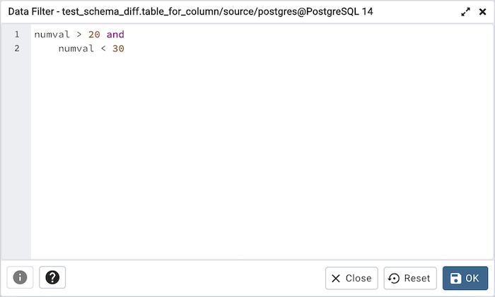

# View/Edit Data Filter

You can access *Data Filter dialog* by clicking on *Filtered Rows* toolbar button visible on the Browser panel or by selecting *View/Edit Data -> Filtered Rows* context menu option.

This allows you to specify an SQL Filter to limit the data displayed in the edit grid window:

