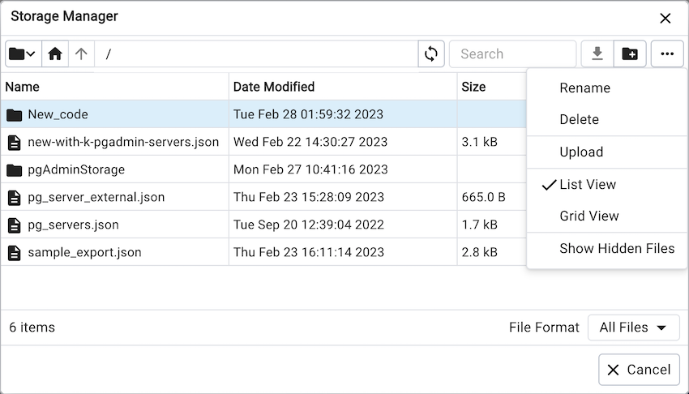
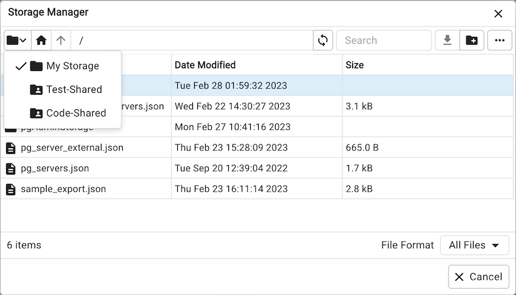
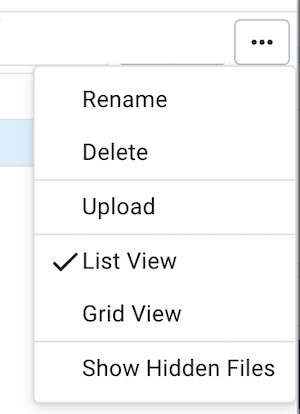
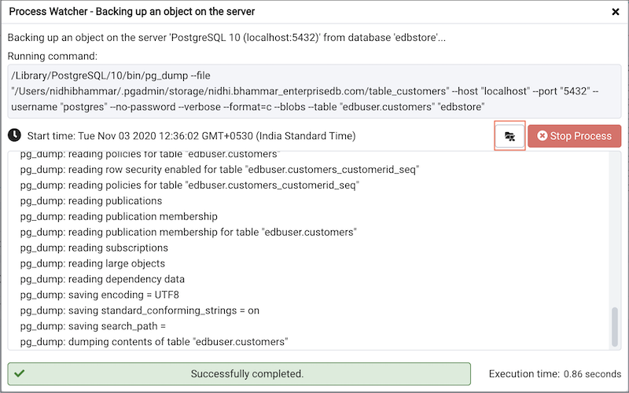

# Storage Manager

*Storage Manager* is a feature that helps you manage your systems storage device. You can use *Storage Manager* to:

- Download, upload, or manage operating system files. To use this feature, *pgAdmin* must be running in *Server Mode* on your client machine.

- The shared storage option allows users to access the shared storages that are shared by admin users.

- Download *backup* or *export* files (custom, tar and plain text format) on a client machine.

- Download *export* dump files of tables.

You can access *Storage Manager* from the *Tools* Menu.

Use icons on the top of the *Storage Manager* window to manage storage:

Use the `Folder` icon  to access shared storage. In order to enable shared storage, admins need to add the SHARED_STORAGE variable to the config file. Users can access the shared storage with this and share files with one another.

Use the `Home` icon  to return to the home directory.

Use the `Up Arrow` icon  to return to the previous directory.

Use the `Refresh` icon  to display the most-recent files available.

Select the `Download` icon  to download the selected file.

Use the `New Folder` icon  to add a new folder.

Use the *Format* drop down list to select the format of the files to be displayed; choose from *sql*, *csv*, or *All Files*.

# Shared Storage

In the storage manager, `My Storage` is the pgAdmin user’s storage directory, and other listed directories are shared storages set by the pgAdmin server administrator. Using these, pgAdmin users can have common storages to share files. pgAdmin server administrator can configure the shared storages using the [config file](../getting-started/deployment/config_py.md#config_py). Storages can be marked as restricted to give read-only access to non-admin pgAdmin users.

!!! note

    You must ensure the directories specified are writeable by the user that the web server processes will be running as, e.g. apache or www-data.*

# Other Options

| Menu | Behavior |
|---|---|
| *Rename* | Click the *Rename* option to rename a file/folder. |
| *Delete* | Click the *Delete* option to rename a file/folder. |
| *Upload* | Click the *Upload* option to upload multiple files to the current folder. |
| *List View* | Click the *List View* option to to display all the files and folders in a list view. |
| *Grid View* | Click the *Grid View* option to to display all the files and folders in a grid view. |
| *Show Hidden Files* | Click the *Show Hidden Files* option to view hidden files and folders. |

You can also download backup files through *Storage Manager* at the successful completion of the backups taken through [Backup Dialog](../backup-and-restore/backup_dialog.md#backup_dialog), [Backup Global Dialog](../backup-and-restore/backup_globals_dialog.md#backup_globals_dialog), or [Backup Server Dialog](../backup-and-restore/backup_server_dialog.md#backup_server_dialog).

At the successful completion of a backup, click on the icon to open the current backup file in *Storage Manager* on the *process watcher* window.

