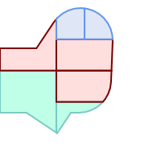
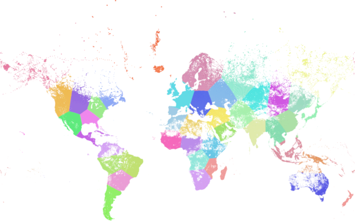

<a id="Clustering_Functions"></a>

## Clustering Functions
  <a id="ST_ClusterDBSCAN"></a>

# ST_ClusterDBSCAN

Window function that returns a cluster id for each input geometry using the DBSCAN algorithm.

## Synopsis


```sql
integer ST_ClusterDBSCAN(geometry winset
			geom, float8
			eps, integer
			minpoints)
```


## Description


 A window function that returns a cluster number for each input geometry, using the 2D [Density-based spatial clustering of applications with noise (DBSCAN)](https://en.wikipedia.org/wiki/DBSCAN) algorithm. Unlike [ST_ClusterKMeans](#ST_ClusterKMeans), it does not require the number of clusters to be specified, but instead uses the desired [distance](measurement-functions.md#ST_Distance) (`eps`) and density (`minpoints`) parameters to determine each cluster.


 An input geometry is added to a cluster if it is either:

-  A "core" geometry, that is within `eps` [distance](measurement-functions.md#ST_Distance) of at least `minpoints` input geometries (including itself); or
-  A "border" geometry, that is within `eps` [distance](measurement-functions.md#ST_Distance) of a core geometry.


 Note that border geometries may be within `eps` distance of core geometries in more than one cluster. Either assignment would be correct, so the border geometry will be arbitrarily assigned to one of the available clusters. In this situation it is possible for a correct cluster to be generated with fewer than `minpoints` geometries. To ensure deterministic assignment of border geometries (so that repeated calls to ST_ClusterDBSCAN will produce identical results) use an <code>ORDER BY</code> clause in the window definition. Ambiguous cluster assignments may differ from other DBSCAN implementations.


!!! note

    Geometries that do not meet the criteria to join any cluster are assigned a cluster number of NULL.


Availability: 2.3.0


## Examples


 Clustering polygon within 50 meters of each other, and requiring at least 2 polygons per cluster.


<table>
<tbody>
<tr>
<td><p></p>
<p>Clusters within 50 meters with at least 2 items per cluster. Singletons have NULL for cid</p>
<pre><code class="language-sql">
SELECT name, ST_ClusterDBSCAN(geom, eps =&gt; 50, minpoints =&gt; 2) over () AS cid
FROM boston_polys
WHERE name &gt; '' AND building &gt; ''
	AND ST_DWithin(geom,
        ST_Transform(
            ST_GeomFromText('POINT(-71.04054 42.35141)', 4326), 26986),
           500);</code></pre></td>
<td><pre><code>
                name                 | bucket
-------------------------------------+--------
 Manulife Tower                      |      0
 Park Lane Seaport I                 |      0
 Park Lane Seaport II                |      0
 Renaissance Boston Waterfront Hotel |      0
 Seaport Boston Hotel                |      0
 Seaport Hotel &amp; World Trade Center  |      0
 Waterside Place                     |      0
 World Trade Center East             |      0
 100 Northern Avenue                 |      1
 100 Pier 4                          |      1
 The Institute of Contemporary Art   |      1
 101 Seaport                         |      2
 District Hall                       |      2
 One Marina Park Drive               |      2
 Twenty Two Liberty                  |      2
 Vertex                              |      2
 Vertex                              |      2
 Watermark Seaport                   |      2
 Blue Hills Bank Pavilion            |   NULL
 World Trade Center West             |   NULL
(20 rows)</code></pre></td>
</tr>
</tbody>
</table>


 A example showing combining parcels with the same cluster number into geometry collections.


```sql

SELECT cid, ST_Collect(geom) AS cluster_geom, array_agg(parcel_id) AS ids_in_cluster FROM (
    SELECT parcel_id, ST_ClusterDBSCAN(geom, eps => 0.5, minpoints => 5) over () AS cid, geom
    FROM parcels) sq
GROUP BY cid;

```


## See Also


[ST_DWithin](spatial-relationships.md#ST_DWithin), [ST_ClusterKMeans](#ST_ClusterKMeans), [ST_ClusterIntersecting](#ST_ClusterIntersecting), [ST_ClusterIntersectingWin](#ST_ClusterIntersectingWin), [ST_ClusterWithin](#ST_ClusterWithin), [ST_ClusterWithinWin](#ST_ClusterWithinWin)
  <a id="ST_ClusterIntersecting"></a>

# ST_ClusterIntersecting

Aggregate function that clusters input geometries into connected sets.

## Synopsis


```sql
geometry[] ST_ClusterIntersecting(geometry set g)
```


## Description


An aggregate function that returns an array of GeometryCollections partitioning the input geometries into connected clusters that are disjoint. Each geometry in a cluster intersects at least one other geometry in the cluster, and does not intersect any geometry in other clusters.


Availability: 2.2.0


## Examples


```sql

WITH testdata AS
  (SELECT unnest(ARRAY['LINESTRING (0 0, 1 1)'::geometry,
           'LINESTRING (5 5, 4 4)'::geometry,
           'LINESTRING (6 6, 7 7)'::geometry,
           'LINESTRING (0 0, -1 -1)'::geometry,
           'POLYGON ((0 0, 4 0, 4 4, 0 4, 0 0))'::geometry]) AS geom)

SELECT ST_AsText(unnest(ST_ClusterIntersecting(geom))) FROM testdata;

--result

st_astext
---------
GEOMETRYCOLLECTION(LINESTRING(0 0,1 1),LINESTRING(5 5,4 4),LINESTRING(0 0,-1 -1),POLYGON((0 0,4 0,4 4,0 4,0 0)))
GEOMETRYCOLLECTION(LINESTRING(6 6,7 7))

```


## See Also


 [ST_ClusterIntersectingWin](#ST_ClusterIntersectingWin), [ST_ClusterWithin](#ST_ClusterWithin), [ST_ClusterWithinWin](#ST_ClusterWithinWin)
  <a id="ST_ClusterIntersectingWin"></a>

# ST_ClusterIntersectingWin

Window function that returns a cluster id for each input geometry, clustering input geometries into connected sets.

## Synopsis


```sql
integer ST_ClusterIntersectingWin(geometry winset  geom)
```


## Description


A window function that builds connected clusters of geometries that intersect. It is possible to traverse all geometries in a cluster without leaving the cluster. The return value is the cluster number that the geometry argument participates in, or null for null inputs.


Availability: 3.4.0


## Examples


```sql

WITH testdata AS (
  SELECT id, geom::geometry FROM (
  VALUES  (1, 'LINESTRING (0 0, 1 1)'),
          (2, 'LINESTRING (5 5, 4 4)'),
          (3, 'LINESTRING (6 6, 7 7)'),
          (4, 'LINESTRING (0 0, -1 -1)'),
          (5, 'POLYGON ((0 0, 4 0, 4 4, 0 4, 0 0))')) AS t(id, geom)
)
SELECT id,
  ST_AsText(geom),
  ST_ClusterIntersectingWin(geom) OVER () AS cluster
FROM testdata;

 id |           st_astext            | cluster
----+--------------------------------+---------
  1 | LINESTRING(0 0,1 1)            |       0
  2 | LINESTRING(5 5,4 4)            |       0
  3 | LINESTRING(6 6,7 7)            |       1
  4 | LINESTRING(0 0,-1 -1)          |       0
  5 | POLYGON((0 0,4 0,4 4,0 4,0 0)) |       0


```


## See Also


 [ST_ClusterIntersecting](#ST_ClusterIntersecting), [ST_ClusterWithin](#ST_ClusterWithin), [ST_ClusterWithinWin](#ST_ClusterWithinWin)
  <a id="ST_ClusterKMeans"></a>

# ST_ClusterKMeans

Window function that returns a cluster id for each input geometry using the K-means algorithm.

## Synopsis


```sql
integer ST_ClusterKMeans(geometry winset
              geom, integer
              k, float8
              max_radius)
```


## Description


Returns [K-means](https://en.wikipedia.org/wiki/K-means_clustering) cluster number for each input geometry. The distance used for clustering is the distance between the centroids for 2D geometries, and distance between bounding box centers for 3D geometries. For POINT inputs, M coordinate will be treated as weight of input and has to be larger than 0.


`max_radius`, if set, will cause ST_ClusterKMeans to generate more clusters than `k` ensuring that no cluster in output has radius larger than `max_radius`. This is useful in reachability analysis.


Enhanced: 3.2.0 Support for `max_radius`


Enhanced: 3.1.0 Support for 3D geometries and weights


Availability: 2.3.0


## Examples


Generate dummy set of parcels for examples:


```sql
CREATE TABLE parcels AS
SELECT lpad((row_number() over())::text,3,'0') As parcel_id, geom,
('{residential, commercial}'::text[])[1 + mod(row_number()OVER(),2)] As type
FROM
    ST_Subdivide(ST_Buffer('SRID=3857;LINESTRING(40 100, 98 100, 100 150, 60 90)'::geometry,
    40, 'endcap=square'),12) As geom;
```





Parcels color-coded by cluster number (cid)


```sql

SELECT ST_ClusterKMeans(geom, 3) OVER() AS cid, parcel_id, geom
    FROM parcels;
```


```
 cid | parcel_id |   geom
-----+-----------+---------------
   0 | 001       | 0103000000...
   0 | 002       | 0103000000...
   1 | 003       | 0103000000...
   0 | 004       | 0103000000...
   1 | 005       | 0103000000...
   2 | 006       | 0103000000...
   2 | 007       | 0103000000...
```


Partitioning parcel clusters by type:


```sql

SELECT ST_ClusterKMeans(geom, 3) over (PARTITION BY type) AS cid, parcel_id, type
    FROM parcels;
```


```
 cid | parcel_id |    type
-----+-----------+-------------
   1 | 005       | commercial
   1 | 003       | commercial
   2 | 007       | commercial
   0 | 001       | commercial
   1 | 004       | residential
   0 | 002       | residential
   2 | 006       | residential
```


Example: Clustering a preaggregated planetary-scale data population dataset using 3D clusering and weighting. Identify at least 20 regions based on [Kontur Population Data](https://data.humdata.org/dataset/kontur-population-dataset) that do not span more than 3000 km from their center:


```
create table kontur_population_3000km_clusters as
select
    geom,
    ST_ClusterKMeans(
        ST_Force4D(
            ST_Transform(ST_Force3D(geom), 4978), -- cluster in 3D XYZ CRS
            mvalue => population -- set clustering to be weighed by population
        ),
        20,                      -- aim to generate at least 20 clusters
        max_radius => 3000000    -- but generate more to make each under 3000 km radius
    ) over () as cid
from
    kontur_population;

```





World population clustered to above specs produces 46 clusters. Clusters are centered at well-populated regions (New York, Moscow). Greenland is one cluster. There are island clusters that span across the antimeridian. Cluster edges follow Earth's curvature.


## See Also


 [ST_ClusterDBSCAN](#ST_ClusterDBSCAN), [ST_ClusterIntersectingWin](#ST_ClusterIntersectingWin), [ST_ClusterWithinWin](#ST_ClusterWithinWin), [ST_ClusterIntersecting](#ST_ClusterIntersecting), [ST_ClusterWithin](#ST_ClusterWithin), [ST_Subdivide](overlay-functions.md#ST_Subdivide), [ST_Force_3D](geometry-editors.md#ST_Force_3D), [ST_Force_4D](geometry-editors.md#ST_Force_4D),
  <a id="ST_ClusterWithin"></a>

# ST_ClusterWithin

Aggregate function that clusters geometries by separation distance.

## Synopsis


```sql
geometry[] ST_ClusterWithin(geometry set  g, float8  distance)
```


## Description


An aggregate function that returns an array of GeometryCollections, where each collection is a cluster containing some input geometries. Clustering partitions the input geometries into sets in which each geometry is within the specified `distance` of at least one other geometry in the same cluster. Distances are Cartesian distances in the units of the SRID.


ST_ClusterWithin is equivalent to running [ST_ClusterDBSCAN](#ST_ClusterDBSCAN) with <code>minpoints => 0</code>.


Availability: 2.2.0


## Examples


```sql

WITH testdata AS
  (SELECT unnest(ARRAY['LINESTRING (0 0, 1 1)'::geometry,
		       'LINESTRING (5 5, 4 4)'::geometry,
		       'LINESTRING (6 6, 7 7)'::geometry,
		       'LINESTRING (0 0, -1 -1)'::geometry,
		       'POLYGON ((0 0, 4 0, 4 4, 0 4, 0 0))'::geometry]) AS geom)

SELECT ST_AsText(unnest(ST_ClusterWithin(geom, 1.4))) FROM testdata;

--result

st_astext
---------
GEOMETRYCOLLECTION(LINESTRING(0 0,1 1),LINESTRING(5 5,4 4),LINESTRING(0 0,-1 -1),POLYGON((0 0,4 0,4 4,0 4,0 0)))
GEOMETRYCOLLECTION(LINESTRING(6 6,7 7))

```


## See Also


 [ST_ClusterWithinWin](#ST_ClusterWithinWin), [ST_ClusterDBSCAN](#ST_ClusterDBSCAN), [ST_ClusterIntersecting](#ST_ClusterIntersecting), [ST_ClusterIntersectingWin](#ST_ClusterIntersectingWin)
  <a id="ST_ClusterWithinWin"></a>

# ST_ClusterWithinWin

Window function that returns a cluster id for each input geometry, clustering using separation distance.

## Synopsis


```sql
integer ST_ClusterWithinWin(geometry winset  geom, float8  distance)
```


## Description


A window function that returns a cluster number for each input geometry. Clustering partitions the geometries into sets in which each geometry is within the specified `distance` of at least one other geometry in the same cluster. Distances are Cartesian distances in the units of the SRID.


ST_ClusterWithinWin is equivalent to running [ST_ClusterDBSCAN](#ST_ClusterDBSCAN) with <code>minpoints => 0</code>.


Availability: 3.4.0


## Examples


```sql

WITH testdata AS (
  SELECT id, geom::geometry FROM (
  VALUES  (1, 'LINESTRING (0 0, 1 1)'),
          (2, 'LINESTRING (5 5, 4 4)'),
          (3, 'LINESTRING (6 6, 7 7)'),
          (4, 'LINESTRING (0 0, -1 -1)'),
          (5, 'POLYGON ((0 0, 4 0, 4 4, 0 4, 0 0))')) AS t(id, geom)
)
SELECT id,
  ST_AsText(geom),
  ST_ClusterWithinWin(geom, 1.4) OVER () AS cluster
FROM testdata;


 id |           st_astext            | cluster
----+--------------------------------+---------
  1 | LINESTRING(0 0,1 1)            |       0
  2 | LINESTRING(5 5,4 4)            |       0
  3 | LINESTRING(6 6,7 7)            |       1
  4 | LINESTRING(0 0,-1 -1)          |       0
  5 | POLYGON((0 0,4 0,4 4,0 4,0 0)) |       0


```


## See Also


 [ST_ClusterWithin](#ST_ClusterWithin), [ST_ClusterDBSCAN](#ST_ClusterDBSCAN), [ST_ClusterIntersecting](#ST_ClusterIntersecting), [ST_ClusterIntersectingWin](#ST_ClusterIntersectingWin),
