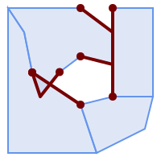

<a id="Coverage"></a>

## Coverages
  <a id="ST_CoverageInvalidEdges"></a>

# ST_CoverageInvalidEdges

Window function that finds locations where polygons fail to form a valid coverage.

## Synopsis


```sql
geometry ST_CoverageInvalidEdges(geometry winset
            geom, float8
            tolerance = 0)
```


## Description


A window function which checks if the polygons in the window partition form a valid polygonal coverage. It returns linear indicators showing the location of invalid edges (if any) in each polygon.


A set of valid polygons is a valid coverage if the following conditions hold:


-  **Non-overlapping** - polygons do not overlap (their interiors do not intersect)
-  **Edge-Matched** - vertices along shared edges are identical


As a window function a value is returned for every input polygon. For polygons which violate one or more of the validity conditions the return value is a MULTILINESTRING containing the problematic edges. Coverage-valid polygons return the value NULL. Non-polygonal or empty geometries also produce NULL values.


The conditions allow a valid coverage to contain holes (gaps between polygons), as long as the surrounding polygons are edge-matched. However, very narrow gaps are often undesirable. If the `tolerance` parameter is specified with a non-zero distance, edges forming narrower gaps will also be returned as invalid.


The polygons being checked for coverage validity must also be valid geometries. This can be checked with [ST_IsValid](geometry-validation.md#ST_IsValid).


Availability: 3.4.0


Requires GEOS >= 3.12.0


## Examples





Invalid edges caused by overlap and non-matching vertices


```sql
WITH coverage(id, geom) AS (VALUES
  (1, 'POLYGON ((10 190, 30 160, 40 110, 100 70, 120 10, 10 10, 10 190))'::geometry),
  (2, 'POLYGON ((100 190, 10 190, 30 160, 40 110, 50 80, 74 110.5, 100 130, 140 120, 140 160, 100 190))'::geometry),
  (3, 'POLYGON ((140 190, 190 190, 190 80, 140 80, 140 190))'::geometry),
  (4, 'POLYGON ((180 40, 120 10, 100 70, 140 80, 190 80, 180 40))'::geometry)
)
SELECT id, ST_AsText(ST_CoverageInvalidEdges(geom) OVER ())
  FROM coverage;

 id |               st_astext
----+---------------------------------------
  1 | LINESTRING (40 110, 100 70)
  2 | MULTILINESTRING ((100 130, 140 120, 140 160, 100 190), (40 110, 50 80, 74 110.5))
  3 | LINESTRING (140 80, 140 190)
  4 | null

```


```
-- Test entire table for coverage validity
SELECT true = ALL (
    SELECT ST_CoverageInvalidEdges(geom) OVER () IS NULL
    FROM coverage
    );

```


## See Also


 [ST_IsValid](geometry-validation.md#ST_IsValid), [ST_CoverageUnion](#ST_CoverageUnion), [ST_CoverageClean](#ST_CoverageClean), [ST_CoverageSimplify](#ST_CoverageSimplify)
  <a id="ST_CoverageSimplify"></a>

# ST_CoverageSimplify

Window function that simplifies the edges of a polygonal coverage.

## Synopsis


```sql
geometry ST_CoverageSimplify(geometry winset
            geom, float8
            tolerance, boolean
            simplifyBoundary = true)
```


## Description


A window function which simplifies the edges of polygons in a polygonal coverage. The simplification preserves the coverage topology. This means the simplified output polygons are consistent along shared edges, and still form a valid coverage.


The simplification uses a variant of the [Visvalingam–Whyatt algorithm](https://en.wikipedia.org/wiki/Visvalingam%E2%80%93Whyatt_algorithm). The `tolerance` parameter has units of distance, and is roughly equal to the square root of triangular areas to be simplified.


To simplify only the "internal" edges of the coverage (those that are shared by two polygons) set the `simplifyBoundary` parameter to false.


!!! note

    If the input is not a valid coverage there may be unexpected artifacts in the output (such as boundary intersections, or separated boundaries which appeared to be shared). Use [ST_CoverageInvalidEdges](#ST_CoverageInvalidEdges) to determine if a coverage is valid.


Availability: 3.4.0


Requires GEOS >= 3.12.0


## Examples


<table>
<tbody>
<tr>
<td><p></p>
<p>Input coverage</p></td>
<td><p></p>
<p>Simplified coverage</p></td>
</tr>
</tbody>
</table>


```sql
WITH coverage(id, geom) AS (VALUES
  (1, 'POLYGON ((160 150, 110 130, 90 100, 90 70, 60 60, 50 10, 30 30, 40 50, 25 40, 10 60, 30 100, 30 120, 20 170, 60 180, 90 190, 130 180, 130 160, 160 150), (40 160, 50 140, 66 125, 60 100, 80 140, 90 170, 60 160, 40 160))'::geometry),
  (2, 'POLYGON ((40 160, 60 160, 90 170, 80 140, 60 100, 66 125, 50 140, 40 160))'::geometry),
  (3, 'POLYGON ((110 130, 160 50, 140 50, 120 33, 90 30, 50 10, 60 60, 90 70, 90 100, 110 130))'::geometry),
  (4, 'POLYGON ((160 150, 150 120, 160 90, 160 50, 110 130, 160 150))'::geometry)
)
SELECT id, ST_AsText(ST_CoverageSimplify(geom, 30) OVER ())
  FROM coverage;

 id |               st_astext
----+---------------------------------------
  1 | POLYGON ((160 150, 110 130, 50 10, 10 60, 20 170, 90 190, 160 150), (40 160, 66 125, 90 170, 40 160))
  2 | POLYGON ((40 160, 66 125, 90 170, 40 160))
  3 | POLYGON ((110 130, 160 50, 50 10, 110 130))
  4 | POLYGON ((160 150, 160 50, 110 130, 160 150))

```


## See Also


 [ST_CoverageInvalidEdges](#ST_CoverageInvalidEdges), [ST_CoverageUnion](#ST_CoverageUnion), [ST_CoverageClean](#ST_CoverageClean)
  <a id="ST_CoverageUnion"></a>

# ST_CoverageUnion

Computes the union of a set of polygons forming a coverage by removing shared edges.

## Synopsis


```sql
geometry ST_CoverageUnion(geometry set
            geom)
```


## Description


An aggregate function which unions a set of polygons forming a polygonal coverage. The result is a polygonal geometry covering the same area as the coverage. This function produces the same result as [ST_Union](overlay-functions.md#ST_Union), but uses the coverage structure to compute the union much faster.


!!! note

    If the input is not a valid coverage there may be unexpected artifacts in the output (such as unmerged or overlapping polygons). Use [ST_CoverageInvalidEdges](#ST_CoverageInvalidEdges) to determine if a coverage is valid.


Availability: 3.4.0 - requires GEOS >= 3.8.0


## Examples


<table>
<tbody>
<tr>
<td><p></p>
<p>Input coverage</p></td>
<td><p></p>
<p>Union result</p></td>
</tr>
</tbody>
</table>


```sql
WITH coverage(id, geom) AS (VALUES
  (1, 'POLYGON ((10 10, 10 150, 80 190, 110 150, 90 110, 40 110, 50 60, 10 10))'::geometry),
  (2, 'POLYGON ((120 10, 10 10, 50 60, 100 70, 120 10))'::geometry),
  (3, 'POLYGON ((140 80, 120 10, 100 70, 40 110, 90 110, 110 150, 140 80))'::geometry),
  (4, 'POLYGON ((140 190, 120 170, 140 130, 160 150, 140 190))'::geometry),
  (5, 'POLYGON ((180 160, 170 140, 140 130, 160 150, 140 190, 180 160))'::geometry)
)
SELECT ST_AsText(ST_CoverageUnion(geom))
  FROM coverage;

--------------------------------------
MULTIPOLYGON (((10 150, 80 190, 110 150, 140 80, 120 10, 10 10, 10 150), (50 60, 100 70, 40 110, 50 60)), ((120 170, 140 190, 180 160, 170 140, 140 130, 120 170)))

```


## See Also


 [ST_CoverageInvalidEdges](#ST_CoverageInvalidEdges), [ST_CoverageSimplify](#ST_CoverageSimplify), [ST_CoverageClean](#ST_CoverageClean), [ST_Union](overlay-functions.md#ST_Union)
  <a id="ST_CoverageClean"></a>

# ST_CoverageClean

Computes a clean (edge matched, non-overlapping, gap-cleared) polygonal coverage, given a non-clean input.

## Synopsis


```sql
geometry ST_CoverageClean(geometry winset
            geom, float8
            gapMaximumWidth = 0, float8
            snappingDistance = -1, text
            overlapMergeStrategy = 'MERGE_LONGEST_BORDER')
```


## Description


A window function which alters the edges of a polygonal coverage to ensure that none of the polygons overlap, that small gaps are snapped away, and that all shared edges are exactly identical. The result is a clean coverage that will pass validation tests like [ST_CoverageInvalidEdges](#ST_CoverageInvalidEdges)


The `gapMaximumWidth` controls the cleaning of gaps between polygons. Gaps smaller than this tolerance will be closed.


The `snappingDistance` controls the node snapping step, when nearby vertices are snapped together. The default setting (-1) applies an automatic snapping distance based on an analysis of the input. Set to 0.0 to turn off all snapping.


The `overlapMergeStrategy` controls the algorithm used to determine which neighboring polygons to merge overlapping areas into.


<code>MERGE_LONGEST_BORDER</code> chooses polygon with longest common border


<code>MERGE_MAX_AREA</code> chooses polygon with maximum area


<code>MERGE_MIN_AREA</code> chooses polygon with minimum area


<code>MERGE_MIN_INDEX</code> chooses polygon with smallest input index


Availability: 3.6.0 - requires GEOS >= 3.14.0


## Examples


```
-- Populate demo table
CREATE TABLE example AS SELECT * FROM (VALUES
  (1, 'POLYGON ((10 190, 30 160, 40 110, 100 70, 120 10, 10 10, 10 190))'::geometry),
  (2, 'POLYGON ((100 190, 10 190, 30 160, 40 110, 50 80, 74 110.5, 100 130, 140 120, 140 160, 100 190))'::geometry),
  (3, 'POLYGON ((140 190, 190 190, 190 80, 140 80, 140 190))'::geometry),
  (4, 'POLYGON ((180 40, 120 10, 100 70, 140 80, 190 80, 180 40))'::geometry)
) AS v(id, geom);

-- Prove it is a dirty coverage
SELECT ST_AsText(ST_CoverageInvalidEdges(geom) OVER ())
  FROM example;

-- Clean the coverage
CREATE TABLE example_clean AS
  SELECT id, ST_CoverageClean(geom) OVER () AS GEOM
  FROM example;

-- Prove it is a clean coverage
SELECT ST_AsText(ST_CoverageInvalidEdges(geom) OVER ())
  FROM example_clean;

```


## See Also


 [ST_CoverageInvalidEdges](#ST_CoverageInvalidEdges), [ST_Union](overlay-functions.md#ST_Union) [ST_CoverageSimplify](#ST_CoverageSimplify)
