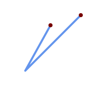
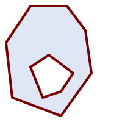
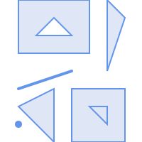
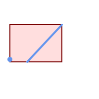

<a id="Geometry_Accessors"></a>

## Geometry Accessors
  <a id="GeometryType"></a>

# GeometryType

Returns the type of a geometry as text.

## Synopsis


```sql
text GeometryType(geometry  geomA)
```


## Description


Returns the type of the geometry as a string. Eg: 'LINESTRING', 'POLYGON', 'MULTIPOINT', etc.


OGC SPEC s2.1.1.1 - Returns the name of the instantiable subtype of Geometry of which this Geometry instance is a member. The name of the instantiable subtype of Geometry is returned as a string.


!!! note

    This function also indicates if the geometry is measured, by returning a string of the form 'POINTM'.


Enhanced: 2.0.0 support for Polyhedral surfaces, Triangles and TIN was introduced.


## Examples


```sql
SELECT GeometryType(ST_GeomFromText('LINESTRING(77.29 29.07,77.42 29.26,77.27 29.31,77.29 29.07)'));
 geometrytype
--------------
 LINESTRING
```


```sql
SELECT ST_GeometryType(ST_GeomFromEWKT('POLYHEDRALSURFACE( ((0 0 0, 0 0 1, 0 1 1, 0 1 0, 0 0 0)),
		((0 0 0, 0 1 0, 1 1 0, 1 0 0, 0 0 0)), ((0 0 0, 1 0 0, 1 0 1, 0 0 1, 0 0 0)),
		((1 1 0, 1 1 1, 1 0 1, 1 0 0, 1 1 0)),
		((0 1 0, 0 1 1, 1 1 1, 1 1 0, 0 1 0)), ((0 0 1, 1 0 1, 1 1 1, 0 1 1, 0 0 1)) )'));
			--result
			POLYHEDRALSURFACE

```


```sql
SELECT GeometryType(geom) as result
  FROM
    (SELECT
       ST_GeomFromEWKT('TIN (((
                0 0 0,
                0 0 1,
                0 1 0,
                0 0 0
            )), ((
                0 0 0,
                0 1 0,
                1 1 0,
                0 0 0
            ))
            )')  AS geom
    ) AS g;
 result
--------
 TIN
```


## See Also


[ST_GeometryType](#ST_GeometryType)
  <a id="ST_Boundary"></a>

# ST_Boundary

Returns the boundary of a geometry.

## Synopsis


```sql
geometry ST_Boundary(geometry  geomA)
```


## Description


Returns the closure of the combinatorial boundary of this Geometry. The combinatorial boundary is defined as described in section 3.12.3.2 of the OGC SPEC. Because the result of this function is a closure, and hence topologically closed, the resulting boundary can be represented using representational geometry primitives as discussed in the OGC SPEC, section 3.12.2.


Performed by the GEOS module


!!! note

    Prior to 2.0.0, this function throws an exception if used with `GEOMETRYCOLLECTION`. From 2.0.0 up it will return NULL instead (unsupported input).


 OGC SPEC s2.1.1.1


 SQL-MM IEC 13249-3: 5.1.17


Enhanced: 2.1.0 support for Triangle was introduced


Changed: 3.2.0 support for TIN, does not use geos, does not linearize curves


## Examples


<table>
<tbody>
<tr>
<td><p></p>
<p>Linestring with boundary points overlaid</p>
<pre><code class="language-sql">SELECT ST_Boundary(geom)
FROM (SELECT 'LINESTRING(100 150,50 60, 70 80, 160 170)'::geometry As geom) As f;
				</code></pre>
<pre><code>

ST_AsText output

MULTIPOINT((100 150),(160 170))</code></pre></td>
<td><p></p>
<p>polygon holes with boundary multilinestring</p>
<pre><code class="language-sql">SELECT ST_Boundary(geom)
FROM (SELECT
'POLYGON (( 10 130, 50 190, 110 190, 140 150, 150 80, 100 10, 20 40, 10 130 ),
	( 70 40, 100 50, 120 80, 80 110, 50 90, 70 40 ))'::geometry As geom) As f;
				</code></pre>
<pre><code>

ST_AsText output

MULTILINESTRING((10 130,50 190,110 190,140 150,150 80,100 10,20 40,10 130),
	(70 40,100 50,120 80,80 110,50 90,70 40))</code></pre></td>
</tr>
</tbody>
</table>


```sql
SELECT ST_AsText(ST_Boundary(ST_GeomFromText('LINESTRING(1 1,0 0, -1 1)')));
st_astext
-----------
MULTIPOINT((1 1),(-1 1))

SELECT ST_AsText(ST_Boundary(ST_GeomFromText('POLYGON((1 1,0 0, -1 1, 1 1))')));
st_astext
----------
LINESTRING(1 1,0 0,-1 1,1 1)

--Using a 3d polygon
SELECT ST_AsEWKT(ST_Boundary(ST_GeomFromEWKT('POLYGON((1 1 1,0 0 1, -1 1 1, 1 1 1))')));

st_asewkt
-----------------------------------
LINESTRING(1 1 1,0 0 1,-1 1 1,1 1 1)

--Using a 3d multilinestring
SELECT ST_AsEWKT(ST_Boundary(ST_GeomFromEWKT('MULTILINESTRING((1 1 1,0 0 0.5, -1 1 1),(1 1 0.5,0 0 0.5, -1 1 0.5, 1 1 0.5) )')));

st_asewkt
----------
MULTIPOINT((-1 1 1),(1 1 0.75))
```


## See Also


[ST_AsText](geometry-output.md#ST_AsText), [ST_ExteriorRing](#ST_ExteriorRing), [ST_MakePolygon](geometry-constructors.md#ST_MakePolygon)
  <a id="ST_BoundingDiagonal"></a>

# ST_BoundingDiagonal

Returns the diagonal of a geometry's bounding box.

## Synopsis


```sql
geometry ST_BoundingDiagonal(geometry  geom, boolean  fits=false)
```


## Description


 Returns the diagonal of the supplied geometry's bounding box as a LineString. The diagonal is a 2-point LineString with the minimum values of each dimension in its start point and the maximum values in its end point. If the input geometry is empty, the diagonal line is a LINESTRING EMPTY.


 The optional `fits` parameter specifies if the best fit is needed. If false, the diagonal of a somewhat larger bounding box can be accepted (which is faster to compute for geometries with many vertices). In either case, the bounding box of the returned diagonal line always covers the input geometry.


 The returned geometry retains the SRID and dimensionality (Z and M presence) of the input geometry.


!!! note

    In degenerate cases (i.e. a single vertex in input) the returned linestring will be formally invalid (no interior). The result is still topologically valid.


Availability: 2.2.0


## Examples


```

-- Get the minimum X in a buffer around a point
SELECT ST_X(ST_StartPoint(ST_BoundingDiagonal(
  ST_Buffer(ST_Point(0,0),10)
)));
 st_x
------
  -10

```


## See Also


 [ST_StartPoint](#ST_StartPoint), [ST_EndPoint](#ST_EndPoint), [ST_X](#ST_X), [ST_Y](#ST_Y), [ST_Z](#ST_Z), [ST_M](#ST_M), [ST_Envelope](#ST_Envelope)
  <a id="ST_CoordDim"></a>

# ST_CoordDim

Return the coordinate dimension of a geometry.

## Synopsis


```sql
integer ST_CoordDim(geometry  geomA)
```


## Description


Return the coordinate dimension of the ST_Geometry value.


This is the MM compliant alias name for [ST_NDims](#ST_NDims)


 SQL-MM 3: 5.1.3


## Examples


```sql
SELECT ST_CoordDim('CIRCULARSTRING(1 2 3, 1 3 4, 5 6 7, 8 9 10, 11 12 13)');
			---result--
				3

				SELECT ST_CoordDim(ST_Point(1,2));
			--result--
				2


```


## See Also


[ST_NDims](#ST_NDims)
  <a id="ST_Dimension"></a>

# ST_Dimension

Returns the topological dimension of a geometry.

## Synopsis


```sql
integer ST_Dimension(geometry  g)
```


## Description


Return the topological dimension of this Geometry object, which must be less than or equal to the coordinate dimension. OGC SPEC s2.1.1.1 - returns 0 for `POINT`, 1 for `LINESTRING`, 2 for `POLYGON`, and the largest dimension of the components of a `GEOMETRYCOLLECTION`. If the dimension is unknown (e.g. for an empty `GEOMETRYCOLLECTION`) 0 is returned.


 SQL-MM 3: 5.1.2


Enhanced: 2.0.0 support for Polyhedral surfaces and TINs was introduced. No longer throws an exception if given empty geometry.


!!! note

    Prior to 2.0.0, this function throws an exception if used with empty geometry.


## Examples


```sql
SELECT ST_Dimension('GEOMETRYCOLLECTION(LINESTRING(1 1,0 0),POINT(0 0))');
ST_Dimension
-----------
1
```


## See Also


[ST_NDims](#ST_NDims)
  <a id="ST_Dump"></a>

# ST_Dump

Returns a set of `geometry_dump` rows for the components of a geometry.

## Synopsis


```sql
geometry_dump[] ST_Dump(geometry  g1)
```


## Description


A set-returning function (SRF) that extracts the components of a geometry. It returns a set of [geometry_dump](postgis-geometry-geography-box-data-types.md#geometry_dump) rows, each containing a geometry (`geom` field) and an array of integers (`path` field).


For an atomic geometry type (POINT,LINESTRING,POLYGON) a single record is returned with an empty `path` array and the input geometry as `geom`. For a collection or multi-geometry a record is returned for each of the collection components, and the `path` denotes the position of the component inside the collection.


ST_Dump is useful for expanding geometries. It is the inverse of a [ST_Collect](geometry-constructors.md#ST_Collect) / GROUP BY, in that it creates new rows. For example it can be use to expand MULTIPOLYGONS into POLYGONS.


Enhanced: 2.0.0 support for Polyhedral surfaces, Triangles and TIN was introduced.


Availability: PostGIS 1.0.0RC1. Requires PostgreSQL 7.3 or higher.


!!! note

    Prior to 1.3.4, this function crashes if used with geometries that contain CURVES. This is fixed in 1.3.4+


## Standard Examples


```sql
SELECT sometable.field1, sometable.field1,
      (ST_Dump(sometable.geom)).geom AS geom
FROM sometable;

-- Break a compound curve into its constituent linestrings and circularstrings
SELECT ST_AsEWKT(a.geom), ST_HasArc(a.geom)
  FROM ( SELECT (ST_Dump(p_geom)).geom AS geom
         FROM (SELECT ST_GeomFromEWKT('COMPOUNDCURVE(CIRCULARSTRING(0 0, 1 1, 1 0),(1 0, 0 1))') AS p_geom) AS b
        ) AS a;
          st_asewkt          | st_hasarc
-----------------------------+----------
 CIRCULARSTRING(0 0,1 1,1 0) | t
 LINESTRING(1 0,0 1)         | f
(2 rows)
```


## Polyhedral Surfaces, TIN and Triangle Examples


```
-- Polyhedral surface example
-- Break a Polyhedral surface into its faces
SELECT (a.p_geom).path[1] As path, ST_AsEWKT((a.p_geom).geom) As geom_ewkt
  FROM (SELECT ST_Dump(ST_GeomFromEWKT('POLYHEDRALSURFACE(
((0 0 0, 0 0 1, 0 1 1, 0 1 0, 0 0 0)),
((0 0 0, 0 1 0, 1 1 0, 1 0 0, 0 0 0)), ((0 0 0, 1 0 0, 1 0 1, 0 0 1, 0 0 0)),  ((1 1 0, 1 1 1, 1 0 1, 1 0 0, 1 1 0)),
((0 1 0, 0 1 1, 1 1 1, 1 1 0, 0 1 0)),  ((0 0 1, 1 0 1, 1 1 1, 0 1 1, 0 0 1))
)') ) AS p_geom )  AS a;

 path |                geom_ewkt
------+------------------------------------------
    1 | POLYGON((0 0 0,0 0 1,0 1 1,0 1 0,0 0 0))
    2 | POLYGON((0 0 0,0 1 0,1 1 0,1 0 0,0 0 0))
    3 | POLYGON((0 0 0,1 0 0,1 0 1,0 0 1,0 0 0))
    4 | POLYGON((1 1 0,1 1 1,1 0 1,1 0 0,1 1 0))
    5 | POLYGON((0 1 0,0 1 1,1 1 1,1 1 0,0 1 0))
    6 | POLYGON((0 0 1,1 0 1,1 1 1,0 1 1,0 0 1))
```


```
-- TIN --
SELECT (g.gdump).path, ST_AsEWKT((g.gdump).geom) as wkt
  FROM
    (SELECT
       ST_Dump( ST_GeomFromEWKT('TIN (((
                0 0 0,
                0 0 1,
                0 1 0,
                0 0 0
            )), ((
                0 0 0,
                0 1 0,
                1 1 0,
                0 0 0
            ))
            )') ) AS gdump
    ) AS g;
-- result --
 path |                 wkt
------+-------------------------------------
 {1}  | TRIANGLE((0 0 0,0 0 1,0 1 0,0 0 0))
 {2}  | TRIANGLE((0 0 0,0 1 0,1 1 0,0 0 0))
```


## See Also


[geometry_dump](postgis-geometry-geography-box-data-types.md#geometry_dump), [PostGIS Geometry / Geography / Raster Dump Functions](../postgis-special-functions-index/postgis-geometry-geography-raster-dump-functions.md#PostGIS_Geometry_DumpFunctions), [ST_Collect](geometry-constructors.md#ST_Collect), [ST_GeometryN](#ST_GeometryN)
  <a id="ST_DumpPoints"></a>

# ST_DumpPoints

Returns a set of `geometry_dump` rows for the coordinates in a geometry.

## Synopsis


```sql
geometry_dump[] ST_DumpPoints(geometry  geom)
```


## Description


A set-returning function (SRF) that extracts the coordinates (vertices) of a geometry. It returns a set of [geometry_dump](postgis-geometry-geography-box-data-types.md#geometry_dump) rows, each containing a geometry (`geom` field) and an array of integers (`path` field).


- the `geom` field `POINT`s represent the coordinates of the supplied geometry.
- the `path` field (an `integer[]`) is an index enumerating the coordinate positions in the elements of the supplied geometry. The indices are 1-based. For example, for a `LINESTRING` the paths are `{i}` where `i` is the `nth` coordinate in the `LINESTRING`. For a `POLYGON` the paths are `{i,j}` where `i` is the ring number (1 is outer; inner rings follow) and `j` is the coordinate position in the ring.


 To obtain a single geometry containing the coordinates use [ST_Points](#ST_Points).


Enhanced: 2.1.0 Faster speed. Reimplemented as native-C.


Enhanced: 2.0.0 support for Polyhedral surfaces, Triangles and TIN was introduced.


Availability: 1.5.0


## Classic Explode a Table of LineStrings into nodes


```sql
SELECT edge_id, (dp).path[1] As index, ST_AsText((dp).geom) As wktnode
FROM (SELECT 1 As edge_id
	, ST_DumpPoints(ST_GeomFromText('LINESTRING(1 2, 3 4, 10 10)')) AS dp
     UNION ALL
     SELECT 2 As edge_id
	, ST_DumpPoints(ST_GeomFromText('LINESTRING(3 5, 5 6, 9 10)')) AS dp
   ) As foo;
 edge_id | index |    wktnode
---------+-------+--------------
       1 |     1 | POINT(1 2)
       1 |     2 | POINT(3 4)
       1 |     3 | POINT(10 10)
       2 |     1 | POINT(3 5)
       2 |     2 | POINT(5 6)
       2 |     3 | POINT(9 10)
```


## Standard Geometry Examples





```sql
SELECT path, ST_AsText(geom)
FROM (
  SELECT (ST_DumpPoints(g.geom)).*
  FROM
    (SELECT
       'GEOMETRYCOLLECTION(
          POINT ( 0 1 ),
          LINESTRING ( 0 3, 3 4 ),
          POLYGON (( 2 0, 2 3, 0 2, 2 0 )),
          POLYGON (( 3 0, 3 3, 6 3, 6 0, 3 0 ),
                   ( 5 1, 4 2, 5 2, 5 1 )),
          MULTIPOLYGON (
                  (( 0 5, 0 8, 4 8, 4 5, 0 5 ),
                   ( 1 6, 3 6, 2 7, 1 6 )),
                  (( 5 4, 5 8, 6 7, 5 4 ))
          )
        )'::geometry AS geom
    ) AS g
  ) j;

   path    | st_astext
-----------+------------
 {1,1}     | POINT(0 1)
 {2,1}     | POINT(0 3)
 {2,2}     | POINT(3 4)
 {3,1,1}   | POINT(2 0)
 {3,1,2}   | POINT(2 3)
 {3,1,3}   | POINT(0 2)
 {3,1,4}   | POINT(2 0)
 {4,1,1}   | POINT(3 0)
 {4,1,2}   | POINT(3 3)
 {4,1,3}   | POINT(6 3)
 {4,1,4}   | POINT(6 0)
 {4,1,5}   | POINT(3 0)
 {4,2,1}   | POINT(5 1)
 {4,2,2}   | POINT(4 2)
 {4,2,3}   | POINT(5 2)
 {4,2,4}   | POINT(5 1)
 {5,1,1,1} | POINT(0 5)
 {5,1,1,2} | POINT(0 8)
 {5,1,1,3} | POINT(4 8)
 {5,1,1,4} | POINT(4 5)
 {5,1,1,5} | POINT(0 5)
 {5,1,2,1} | POINT(1 6)
 {5,1,2,2} | POINT(3 6)
 {5,1,2,3} | POINT(2 7)
 {5,1,2,4} | POINT(1 6)
 {5,2,1,1} | POINT(5 4)
 {5,2,1,2} | POINT(5 8)
 {5,2,1,3} | POINT(6 7)
 {5,2,1,4} | POINT(5 4)
(29 rows)
```


## Polyhedral Surfaces, TIN and Triangle Examples


```
-- Polyhedral surface cube --
SELECT (g.gdump).path, ST_AsEWKT((g.gdump).geom) as wkt
  FROM
    (SELECT
       ST_DumpPoints(ST_GeomFromEWKT('POLYHEDRALSURFACE( ((0 0 0, 0 0 1, 0 1 1, 0 1 0, 0 0 0)),
((0 0 0, 0 1 0, 1 1 0, 1 0 0, 0 0 0)), ((0 0 0, 1 0 0, 1 0 1, 0 0 1, 0 0 0)),
((1 1 0, 1 1 1, 1 0 1, 1 0 0, 1 1 0)),
((0 1 0, 0 1 1, 1 1 1, 1 1 0, 0 1 0)), ((0 0 1, 1 0 1, 1 1 1, 0 1 1, 0 0 1)) )') ) AS gdump
    ) AS g;
-- result --
  path   |     wkt
---------+--------------
 {1,1,1} | POINT(0 0 0)
 {1,1,2} | POINT(0 0 1)
 {1,1,3} | POINT(0 1 1)
 {1,1,4} | POINT(0 1 0)
 {1,1,5} | POINT(0 0 0)
 {2,1,1} | POINT(0 0 0)
 {2,1,2} | POINT(0 1 0)
 {2,1,3} | POINT(1 1 0)
 {2,1,4} | POINT(1 0 0)
 {2,1,5} | POINT(0 0 0)
 {3,1,1} | POINT(0 0 0)
 {3,1,2} | POINT(1 0 0)
 {3,1,3} | POINT(1 0 1)
 {3,1,4} | POINT(0 0 1)
 {3,1,5} | POINT(0 0 0)
 {4,1,1} | POINT(1 1 0)
 {4,1,2} | POINT(1 1 1)
 {4,1,3} | POINT(1 0 1)
 {4,1,4} | POINT(1 0 0)
 {4,1,5} | POINT(1 1 0)
 {5,1,1} | POINT(0 1 0)
 {5,1,2} | POINT(0 1 1)
 {5,1,3} | POINT(1 1 1)
 {5,1,4} | POINT(1 1 0)
 {5,1,5} | POINT(0 1 0)
 {6,1,1} | POINT(0 0 1)
 {6,1,2} | POINT(1 0 1)
 {6,1,3} | POINT(1 1 1)
 {6,1,4} | POINT(0 1 1)
 {6,1,5} | POINT(0 0 1)
(30 rows)
```


```
-- Triangle --
SELECT (g.gdump).path, ST_AsText((g.gdump).geom) as wkt
  FROM
    (SELECT
       ST_DumpPoints( ST_GeomFromEWKT('TRIANGLE ((
                0 0,
                0 9,
                9 0,
                0 0
            ))') ) AS gdump
    ) AS g;
-- result --
 path |    wkt
------+------------
 {1}  | POINT(0 0)
 {2}  | POINT(0 9)
 {3}  | POINT(9 0)
 {4}  | POINT(0 0)
```


```
-- TIN --
SELECT (g.gdump).path, ST_AsEWKT((g.gdump).geom) as wkt
  FROM
    (SELECT
       ST_DumpPoints( ST_GeomFromEWKT('TIN (((
                0 0 0,
                0 0 1,
                0 1 0,
                0 0 0
            )), ((
                0 0 0,
                0 1 0,
                1 1 0,
                0 0 0
            ))
            )') ) AS gdump
    ) AS g;
-- result --
  path   |     wkt
---------+--------------
 {1,1,1} | POINT(0 0 0)
 {1,1,2} | POINT(0 0 1)
 {1,1,3} | POINT(0 1 0)
 {1,1,4} | POINT(0 0 0)
 {2,1,1} | POINT(0 0 0)
 {2,1,2} | POINT(0 1 0)
 {2,1,3} | POINT(1 1 0)
 {2,1,4} | POINT(0 0 0)
(8 rows)
```


## See Also


[geometry_dump](postgis-geometry-geography-box-data-types.md#geometry_dump), [PostGIS Geometry / Geography / Raster Dump Functions](../postgis-special-functions-index/postgis-geometry-geography-raster-dump-functions.md#PostGIS_Geometry_DumpFunctions), [ST_Dump](#ST_Dump), [ST_DumpRings](#ST_DumpRings), [ST_Points](#ST_Points)
  <a id="ST_DumpSegments"></a>

# ST_DumpSegments

Returns a set of `geometry_dump` rows for the segments in a geometry.

## Synopsis


```sql
geometry_dump[] ST_DumpSegments(geometry  geom)
```


## Description


A set-returning function (SRF) that extracts the segments of a geometry. It returns a set of [geometry_dump](postgis-geometry-geography-box-data-types.md#geometry_dump) rows, each containing a geometry (`geom` field) and an array of integers (`path` field).


- the `geom` field `LINESTRING`s represent the linear segments of the supplied geometry, while the `CIRCULARSTRING`s represent the arc segments.
- the `path` field (an `integer[]`) is an index enumerating the segment start point positions in the elements of the supplied geometry. The indices are 1-based. For example, for a `LINESTRING` the paths are `{i}` where `i` is the `nth` segment start point in the `LINESTRING`. For a `POLYGON` the paths are `{i,j}` where `i` is the ring number (1 is outer; inner rings follow) and `j` is the segment start point position in the ring.


Availability: 3.2.0


## Standard Geometry Examples


```sql
SELECT path, ST_AsText(geom)
FROM (
    SELECT (ST_DumpSegments(g.geom)).*
    FROM (SELECT 'GEOMETRYCOLLECTION(
    LINESTRING(1 1, 3 3, 4 4),
    POLYGON((5 5, 6 6, 7 7, 5 5))
)'::geometry AS geom
        ) AS g
) j;

  path   │      st_astext
---------------------------------
 {1,1}   │ LINESTRING(1 1,3 3)
 {1,2}   │ LINESTRING(3 3,4 4)
 {2,1,1} │ LINESTRING(5 5,6 6)
 {2,1,2} │ LINESTRING(6 6,7 7)
 {2,1,3} │ LINESTRING(7 7,5 5)
(5 rows)
```


## TIN and Triangle Examples


```
-- Triangle --
SELECT path, ST_AsText(geom)
FROM (
    SELECT (ST_DumpSegments(g.geom)).*
    FROM (SELECT 'TRIANGLE((
        0 0,
        0 9,
        9 0,
        0 0
    ))'::geometry AS geom
        ) AS g
) j;

 path  │      st_astext
 ---------------------------------
 {1,1} │ LINESTRING(0 0,0 9)
 {1,2} │ LINESTRING(0 9,9 0)
 {1,3} │ LINESTRING(9 0,0 0)
(3 rows)
```


```
-- TIN --
SELECT path, ST_AsEWKT(geom)
FROM (
    SELECT (ST_DumpSegments(g.geom)).*
    FROM (SELECT 'TIN(((
        0 0 0,
        0 0 1,
        0 1 0,
        0 0 0
    )), ((
        0 0 0,
        0 1 0,
        1 1 0,
        0 0 0
    ))
    )'::geometry AS geom
        ) AS g
) j;

  path   │        st_asewkt
  ---------------------------------
 {1,1,1} │ LINESTRING(0 0 0,0 0 1)
 {1,1,2} │ LINESTRING(0 0 1,0 1 0)
 {1,1,3} │ LINESTRING(0 1 0,0 0 0)
 {2,1,1} │ LINESTRING(0 0 0,0 1 0)
 {2,1,2} │ LINESTRING(0 1 0,1 1 0)
 {2,1,3} │ LINESTRING(1 1 0,0 0 0)
(6 rows)
```


## See Also


[geometry_dump](postgis-geometry-geography-box-data-types.md#geometry_dump), [PostGIS Geometry / Geography / Raster Dump Functions](../postgis-special-functions-index/postgis-geometry-geography-raster-dump-functions.md#PostGIS_Geometry_DumpFunctions), [ST_Dump](#ST_Dump), [ST_DumpRings](#ST_DumpRings)
  <a id="ST_DumpRings"></a>

# ST_DumpRings

Returns a set of `geometry_dump` rows for the exterior and interior rings of a Polygon.

## Synopsis


```sql
geometry_dump[] ST_DumpRings(geometry  a_polygon)
```


## Description


A set-returning function (SRF) that extracts the rings of a polygon. It returns a set of [geometry_dump](postgis-geometry-geography-box-data-types.md#geometry_dump) rows, each containing a geometry (`geom` field) and an array of integers (`path` field).


 The `geom` field contains each ring as a POLYGON. The `path` field is an integer array of length 1 containing the polygon ring index. The exterior ring (shell) has index 0. The interior rings (holes) have indices of 1 and higher.


!!! note

    This only works for POLYGON geometries. It does not work for MULTIPOLYGONS


Availability: PostGIS 1.1.3. Requires PostgreSQL 7.3 or higher.


## Examples


General form of query.


```sql
SELECT polyTable.field1, polyTable.field1,
	  (ST_DumpRings(polyTable.geom)).geom As geom
FROM polyTable;
```


A polygon with a single hole.


```sql
SELECT path, ST_AsEWKT(geom) As geom
	FROM ST_DumpRings(
		ST_GeomFromEWKT('POLYGON((-8149064 5133092 1,-8149064 5132986 1,-8148996 5132839 1,-8148972 5132767 1,-8148958 5132508 1,-8148941 5132466 1,-8148924 5132394 1,
		-8148903 5132210 1,-8148930 5131967 1,-8148992 5131978 1,-8149237 5132093 1,-8149404 5132211 1,-8149647 5132310 1,-8149757 5132394 1,
		-8150305 5132788 1,-8149064 5133092 1),
		(-8149362 5132394 1,-8149446 5132501 1,-8149548 5132597 1,-8149695 5132675 1,-8149362 5132394 1))')
		)  as foo;
 path |                                            geom
----------------------------------------------------------------------------------------------------------------
  {0} | POLYGON((-8149064 5133092 1,-8149064 5132986 1,-8148996 5132839 1,-8148972 5132767 1,-8148958 5132508 1,
	  |          -8148941 5132466 1,-8148924 5132394 1,
	  |          -8148903 5132210 1,-8148930 5131967 1,
	  |          -8148992 5131978 1,-8149237 5132093 1,
	  |          -8149404 5132211 1,-8149647 5132310 1,-8149757 5132394 1,-8150305 5132788 1,-8149064 5133092 1))
  {1} | POLYGON((-8149362 5132394 1,-8149446 5132501 1,
	  |          -8149548 5132597 1,-8149695 5132675 1,-8149362 5132394 1))
```


## See Also


[geometry_dump](postgis-geometry-geography-box-data-types.md#geometry_dump), [PostGIS Geometry / Geography / Raster Dump Functions](../postgis-special-functions-index/postgis-geometry-geography-raster-dump-functions.md#PostGIS_Geometry_DumpFunctions), [ST_Dump](#ST_Dump), [ST_ExteriorRing](#ST_ExteriorRing), [ST_InteriorRingN](#ST_InteriorRingN)
  <a id="ST_EndPoint"></a>

# ST_EndPoint

Returns the last point of a LineString or CircularLineString.

## Synopsis


```sql
geometry ST_EndPoint(geometry  g)
```


## Description


Returns the last point of a `LINESTRING` or `CIRCULARLINESTRING` geometry as a `POINT`. Returns `NULL` if the input is not a `LINESTRING` or `CIRCULARLINESTRING`.


 SQL-MM 3: 7.1.4


!!! note

    Changed: 2.0.0 no longer works with single geometry MultiLineStrings. In older versions of PostGIS a single-line MultiLineString would work with this function and return the end point. In 2.0.0 it returns NULL like any other MultiLineString. The old behavior was an undocumented feature, but people who assumed they had their data stored as LINESTRING may experience these returning NULL in 2.0.0.


## Examples


End point of a LineString


```
postgis=# SELECT ST_AsText(ST_EndPoint('LINESTRING(1 1, 2 2, 3 3)'::geometry));
 st_astext
------------
 POINT(3 3)
```


End point of a non-LineString is NULL


```sql

SELECT ST_EndPoint('POINT(1 1)'::geometry) IS NULL AS is_null;
  is_null
----------
 t
```


End point of a 3D LineString


```

--3d endpoint
SELECT ST_AsEWKT(ST_EndPoint('LINESTRING(1 1 2, 1 2 3, 0 0 5)'));
  st_asewkt
--------------
 POINT(0 0 5)
```


End point of a CircularString


```sql

SELECT ST_AsText(ST_EndPoint('CIRCULARSTRING(5 2,-3 1.999999, -2 1, -4 2, 6 3)'::geometry));
 st_astext
------------
 POINT(6 3)
```


## See Also


[ST_PointN](#ST_PointN), [ST_StartPoint](#ST_StartPoint)
  <a id="ST_Envelope"></a>

# ST_Envelope

Returns a geometry representing the bounding box of a geometry.

## Synopsis


```sql
geometry ST_Envelope(geometry  g1)
```


## Description


Returns the double-precision (float8) minimum bounding box for the supplied geometry, as a geometry. The polygon is defined by the corner points of the bounding box ((`MINX`, `MINY`), (`MINX`, `MAXY`), (`MAXX`, `MAXY`), (`MAXX`, `MINY`), (`MINX`, `MINY`)). (PostGIS will add a `ZMIN`/`ZMAX` coordinate as well).


Degenerate cases (vertical lines, points) will return a geometry of lower dimension than `POLYGON`, ie. `POINT` or `LINESTRING`.


Availability: 1.5.0 behavior changed to output double precision instead of float4


 s2.1.1.1


 SQL-MM 3: 5.1.19


## Examples


```sql

SELECT ST_AsText(ST_Envelope('POINT(1 3)'::geometry));
 st_astext
------------
 POINT(1 3)
(1 row)


SELECT ST_AsText(ST_Envelope('LINESTRING(0 0, 1 3)'::geometry));
		   st_astext
--------------------------------
 POLYGON((0 0,0 3,1 3,1 0,0 0))
(1 row)


SELECT ST_AsText(ST_Envelope('POLYGON((0 0, 0 1, 1.0000001 1, 1.0000001 0, 0 0))'::geometry));
						  st_astext
--------------------------------------------------------------
 POLYGON((0 0,0 1,1.00000011920929 1,1.00000011920929 0,0 0))
(1 row)
SELECT ST_AsText(ST_Envelope('POLYGON((0 0, 0 1, 1.0000000001 1, 1.0000000001 0, 0 0))'::geometry));
						  st_astext
--------------------------------------------------------------
 POLYGON((0 0,0 1,1.00000011920929 1,1.00000011920929 0,0 0))
(1 row)

SELECT Box3D(geom), Box2D(geom), ST_AsText(ST_Envelope(geom)) As envelopewkt
	FROM (SELECT 'POLYGON((0 0, 0 1000012333334.34545678, 1.0000001 1, 1.0000001 0, 0 0))'::geometry As geom) As foo;


```





Envelope of a point and linestring.


```sql

SELECT ST_AsText(ST_Envelope(
		ST_Collect(
			ST_GeomFromText('LINESTRING(55 75,125 150)'),
				ST_Point(20, 80))
				)) As wktenv;
wktenv
-----------
POLYGON((20 75,20 150,125 150,125 75,20 75))
```


## See Also


[Box2D](bounding-box-functions.md#Box2D), [Box3D](bounding-box-functions.md#Box3D), [ST_OrientedEnvelope](geometry-processing.md#ST_OrientedEnvelope)
  <a id="ST_ExteriorRing"></a>

# ST_ExteriorRing

Returns a LineString representing the exterior ring of a Polygon.

## Synopsis


```sql
geometry ST_ExteriorRing(geometry  a_polygon)
```


## Description


Returns a LINESTRING representing the exterior ring (shell) of a POLYGON. Returns NULL if the geometry is not a polygon.


!!! note

    This function does not support MULTIPOLYGONs. For MULTIPOLYGONs use in conjunction with [ST_GeometryN](#ST_GeometryN) or [ST_Dump](#ST_Dump)


 2.1.5.1


 SQL-MM 3: 8.2.3, 8.3.3


## Examples


```

--If you have a table of polygons
SELECT gid, ST_ExteriorRing(geom) AS ering
FROM sometable;

--If you have a table of MULTIPOLYGONs
--and want to return a MULTILINESTRING composed of the exterior rings of each polygon
SELECT gid, ST_Collect(ST_ExteriorRing(geom)) AS erings
	FROM (SELECT gid, (ST_Dump(geom)).geom As geom
			FROM sometable) As foo
GROUP BY gid;

--3d Example
SELECT ST_AsEWKT(
	ST_ExteriorRing(
	ST_GeomFromEWKT('POLYGON((0 0 1, 1 1 1, 1 2 1, 1 1 1, 0 0 1))')
	)
);

st_asewkt
---------
LINESTRING(0 0 1,1 1 1,1 2 1,1 1 1,0 0 1)
```


## See Also


 [ST_InteriorRingN](#ST_InteriorRingN), [ST_Boundary](#ST_Boundary), [ST_NumInteriorRings](#ST_NumInteriorRings)
  <a id="ST_GeometryN"></a>

# ST_GeometryN

Return an element of a geometry collection.

## Synopsis


```sql
geometry ST_GeometryN(geometry  geomA, integer  n)
```


## Description


Return the 1-based Nth element geometry of an input geometry which is a GEOMETRYCOLLECTION, MULTIPOINT, MULTILINESTRING, MULTICURVE, MULTI)POLYGON, or POLYHEDRALSURFACE. Otherwise, returns NULL.


!!! note

    Index is 1-based as for OGC specs since version 0.8.0. Previous versions implemented this as 0-based instead.


!!! note

    To extract all elements of a geometry, [ST_Dump](#ST_Dump) is more efficient and works for atomic geometries.


Enhanced: 2.0.0 support for Polyhedral surfaces, Triangles and TIN was introduced.


Changed: 2.0.0 Prior versions would return NULL for singular geometries. This was changed to return the geometry for ST_GeometryN(..,1) case.


 SQL-MM 3: 9.1.5


## Standard Examples


```

--Extracting a subset of points from a 3d multipoint
SELECT n, ST_AsEWKT(ST_GeometryN(geom, n)) As geomewkt
FROM (
VALUES (ST_GeomFromEWKT('MULTIPOINT((1 2 7), (3 4 7), (5 6 7), (8 9 10))') ),
( ST_GeomFromEWKT('MULTICURVE(CIRCULARSTRING(2.5 2.5,4.5 2.5, 3.5 3.5), (10 11, 12 11))') )
	)As foo(geom)
	CROSS JOIN generate_series(1,100) n
WHERE n <= ST_NumGeometries(geom);

 n |               geomewkt
---+-----------------------------------------
 1 | POINT(1 2 7)
 2 | POINT(3 4 7)
 3 | POINT(5 6 7)
 4 | POINT(8 9 10)
 1 | CIRCULARSTRING(2.5 2.5,4.5 2.5,3.5 3.5)
 2 | LINESTRING(10 11,12 11)


--Extracting all geometries (useful when you want to assign an id)
SELECT gid, n, ST_GeometryN(geom, n)
FROM sometable CROSS JOIN generate_series(1,100) n
WHERE n <= ST_NumGeometries(geom);
```


## Polyhedral Surfaces, TIN and Triangle Examples


```
-- Polyhedral surface example
-- Break a Polyhedral surface into its faces
SELECT ST_AsEWKT(ST_GeometryN(p_geom,3)) As geom_ewkt
  FROM (SELECT ST_GeomFromEWKT('POLYHEDRALSURFACE(
((0 0 0, 0 0 1, 0 1 1, 0 1 0, 0 0 0)),
((0 0 0, 0 1 0, 1 1 0, 1 0 0, 0 0 0)),
((0 0 0, 1 0 0, 1 0 1, 0 0 1, 0 0 0)),
((1 1 0, 1 1 1, 1 0 1, 1 0 0, 1 1 0)),
((0 1 0, 0 1 1, 1 1 1, 1 1 0, 0 1 0)),
((0 0 1, 1 0 1, 1 1 1, 0 1 1, 0 0 1))
)')  AS p_geom )  AS a;

                geom_ewkt
------------------------------------------
 POLYGON((0 0 0,1 0 0,1 0 1,0 0 1,0 0 0))
```


```
-- TIN --
SELECT ST_AsEWKT(ST_GeometryN(geom,2)) as wkt
  FROM
    (SELECT
       ST_GeomFromEWKT('TIN (((
                0 0 0,
                0 0 1,
                0 1 0,
                0 0 0
            )), ((
                0 0 0,
                0 1 0,
                1 1 0,
                0 0 0
            ))
            )')  AS geom
    ) AS g;
-- result --
                 wkt
-------------------------------------
 TRIANGLE((0 0 0,0 1 0,1 1 0,0 0 0))
```


## See Also


[ST_Dump](#ST_Dump), [ST_NumGeometries](#ST_NumGeometries)
  <a id="ST_GeometryType"></a>

# ST_GeometryType

Returns the SQL-MM type of a geometry as text.

## Synopsis


```sql
text ST_GeometryType(geometry  g1)
```


## Description


Returns the type of the geometry as a string. EG: 'ST_LineString', 'ST_Polygon','ST_MultiPolygon' etc. This function differs from GeometryType(geometry) in the case of the string and ST in front that is returned, as well as the fact that it will not indicate whether the geometry is measured.


Enhanced: 2.0.0 support for Polyhedral surfaces was introduced.


 SQL-MM 3: 5.1.4


## Examples


```sql
SELECT ST_GeometryType(ST_GeomFromText('LINESTRING(77.29 29.07,77.42 29.26,77.27 29.31,77.29 29.07)'));
			--result
			ST_LineString
```


```sql
SELECT ST_GeometryType(ST_GeomFromEWKT('POLYHEDRALSURFACE( ((0 0 0, 0 0 1, 0 1 1, 0 1 0, 0 0 0)),
		((0 0 0, 0 1 0, 1 1 0, 1 0 0, 0 0 0)), ((0 0 0, 1 0 0, 1 0 1, 0 0 1, 0 0 0)),
		((1 1 0, 1 1 1, 1 0 1, 1 0 0, 1 1 0)),
		((0 1 0, 0 1 1, 1 1 1, 1 1 0, 0 1 0)), ((0 0 1, 1 0 1, 1 1 1, 0 1 1, 0 0 1)) )'));
			--result
			ST_PolyhedralSurface
```


```sql
SELECT ST_GeometryType(ST_GeomFromEWKT('POLYHEDRALSURFACE( ((0 0 0, 0 0 1, 0 1 1, 0 1 0, 0 0 0)),
		((0 0 0, 0 1 0, 1 1 0, 1 0 0, 0 0 0)), ((0 0 0, 1 0 0, 1 0 1, 0 0 1, 0 0 0)),
		((1 1 0, 1 1 1, 1 0 1, 1 0 0, 1 1 0)),
		((0 1 0, 0 1 1, 1 1 1, 1 1 0, 0 1 0)), ((0 0 1, 1 0 1, 1 1 1, 0 1 1, 0 0 1)) )'));
			--result
			ST_PolyhedralSurface
```


```sql
SELECT ST_GeometryType(geom) as result
  FROM
    (SELECT
       ST_GeomFromEWKT('TIN (((
                0 0 0,
                0 0 1,
                0 1 0,
                0 0 0
            )), ((
                0 0 0,
                0 1 0,
                1 1 0,
                0 0 0
            ))
            )')  AS geom
    ) AS g;
 result
--------
 ST_Tin
```


## See Also


[GeometryType](#GeometryType)
  <a id="ST_HasArc"></a>

# ST_HasArc

Tests if a geometry contains a circular arc

## Synopsis


```sql
boolean ST_HasArc(geometry  geomA)
```


## Description


Returns true if a geometry or geometry collection contains a circular string


Availability: 1.2.3?


## Examples


```sql
SELECT ST_HasArc(ST_Collect('LINESTRING(1 2, 3 4, 5 6)', 'CIRCULARSTRING(1 1, 2 3, 4 5, 6 7, 5 6)'));
		st_hasarc
		--------
		t

```


## See Also


[ST_CurveToLine](geometry-editors.md#ST_CurveToLine), [ST_LineToCurve](geometry-editors.md#ST_LineToCurve)
  <a id="ST_InteriorRingN"></a>

# ST_InteriorRingN

Returns the Nth interior ring (hole) of a Polygon.

## Synopsis


```sql
geometry ST_InteriorRingN(geometry  a_polygon, integer  n)
```


## Description


Returns the Nth interior ring (hole) of a POLYGON geometry as a LINESTRING. The index starts at 1. Returns NULL if the geometry is not a polygon or the index is out of range.


!!! note

    This function does not support MULTIPOLYGONs. For MULTIPOLYGONs use in conjunction with [ST_GeometryN](#ST_GeometryN) or [ST_Dump](#ST_Dump)


 SQL-MM 3: 8.2.6, 8.3.5


## Examples


```sql

SELECT ST_AsText(ST_InteriorRingN(geom, 1)) As geom
FROM (SELECT ST_BuildArea(
		ST_Collect(ST_Buffer(ST_Point(1,2), 20,3),
			ST_Buffer(ST_Point(1, 2), 10,3))) As geom
		)  as foo;

```


## See Also


 [ST_ExteriorRing](#ST_ExteriorRing), [ST_BuildArea](geometry-processing.md#ST_BuildArea), [ST_Collect](geometry-constructors.md#ST_Collect), [ST_Dump](#ST_Dump), [ST_NumInteriorRing](#ST_NumInteriorRing), [ST_NumInteriorRings](#ST_NumInteriorRings)
  <a id="ST_NumCurves"></a>

# ST_NumCurves

Return the number of component curves in a CompoundCurve.

## Synopsis


```sql
integer ST_NumCurves(geometry  a_compoundcurve)
```


## Description


Return the number of component curves in a CompoundCurve, zero for an empty CompoundCurve, or NULL for a non-CompoundCurve input.


 SQL-MM 3: 8.2.6, 8.3.5


## Examples


```

-- Returns 3
SELECT ST_NumCurves('COMPOUNDCURVE(
    (2 2, 2.5 2.5),
    CIRCULARSTRING(2.5 2.5, 4.5 2.5, 3.5 3.5),
    (3.5 3.5, 2.5 4.5, 3 5, 2 2)
  )');

-- Returns 0
SELECT ST_NumCurves('COMPOUNDCURVE EMPTY');

```


## See Also


 [ST_CurveN](#ST_CurveN), [ST_Dump](#ST_Dump), [ST_ExteriorRing](#ST_ExteriorRing), [ST_NumInteriorRings](#ST_NumInteriorRings), [ST_NumGeometries](#ST_NumGeometries)
  <a id="ST_CurveN"></a>

# ST_CurveN

Returns the Nth component curve geometry of a CompoundCurve.

## Synopsis


```sql
geometry ST_CurveN(geometry  a_compoundcurve, integer  index)
```


## Description


Returns the Nth component curve geometry of a CompoundCurve. The index starts at 1. Returns NULL if the geometry is not a CompoundCurve or the index is out of range.


 SQL-MM 3: 8.2.6, 8.3.5


## Examples


```sql

SELECT ST_AsText(ST_CurveN('COMPOUNDCURVE(
    (2 2, 2.5 2.5),
    CIRCULARSTRING(2.5 2.5, 4.5 2.5, 3.5 3.5),
    (3.5 3.5, 2.5 4.5, 3 5, 2 2)
  )', 1));

```


## See Also


 [ST_NumCurves](#ST_NumCurves), [ST_Dump](#ST_Dump), [ST_ExteriorRing](#ST_ExteriorRing), [ST_NumInteriorRings](#ST_NumInteriorRings), [ST_NumGeometries](#ST_NumGeometries)
  <a id="ST_IsClosed"></a>

# ST_IsClosed

Tests if a LineStrings's start and end points are coincident. For a PolyhedralSurface tests if it is closed (volumetric).

## Synopsis


```sql
boolean ST_IsClosed(geometry  g)
```


## Description


Returns `TRUE` if the `LINESTRING`'s start and end points are coincident. For Polyhedral Surfaces, reports if the surface is areal (open) or volumetric (closed).


 SQL-MM 3: 7.1.5, 9.3.3


!!! note

    SQL-MM defines the result of <code>ST_IsClosed(NULL)</code> to be 0, while PostGIS returns `NULL`.


Enhanced: 2.0.0 support for Polyhedral surfaces was introduced.


## Line String and Point Examples


```
postgis=# SELECT ST_IsClosed('LINESTRING(0 0, 1 1)'::geometry);
 st_isclosed
-------------
 f
(1 row)

postgis=# SELECT ST_IsClosed('LINESTRING(0 0, 0 1, 1 1, 0 0)'::geometry);
 st_isclosed
-------------
 t
(1 row)

postgis=# SELECT ST_IsClosed('MULTILINESTRING((0 0, 0 1, 1 1, 0 0),(0 0, 1 1))'::geometry);
 st_isclosed
-------------
 f
(1 row)

postgis=# SELECT ST_IsClosed('POINT(0 0)'::geometry);
 st_isclosed
-------------
 t
(1 row)

postgis=# SELECT ST_IsClosed('MULTIPOINT((0 0), (1 1))'::geometry);
 st_isclosed
-------------
 t
(1 row)
```


## Polyhedral Surface Examples


```

		-- A cube --
		SELECT ST_IsClosed(ST_GeomFromEWKT('POLYHEDRALSURFACE( ((0 0 0, 0 0 1, 0 1 1, 0 1 0, 0 0 0)),
		((0 0 0, 0 1 0, 1 1 0, 1 0 0, 0 0 0)), ((0 0 0, 1 0 0, 1 0 1, 0 0 1, 0 0 0)),
		((1 1 0, 1 1 1, 1 0 1, 1 0 0, 1 1 0)),
		((0 1 0, 0 1 1, 1 1 1, 1 1 0, 0 1 0)), ((0 0 1, 1 0 1, 1 1 1, 0 1 1, 0 0 1)) )'));

 st_isclosed
-------------
 t


 -- Same as cube but missing a side --
 SELECT ST_IsClosed(ST_GeomFromEWKT('POLYHEDRALSURFACE( ((0 0 0, 0 0 1, 0 1 1, 0 1 0, 0 0 0)),
		((0 0 0, 0 1 0, 1 1 0, 1 0 0, 0 0 0)), ((0 0 0, 1 0 0, 1 0 1, 0 0 1, 0 0 0)),
		((1 1 0, 1 1 1, 1 0 1, 1 0 0, 1 1 0)),
		((0 1 0, 0 1 1, 1 1 1, 1 1 0, 0 1 0)) )'));

 st_isclosed
-------------
 f
```


## See Also


[ST_IsRing](#ST_IsRing)
  <a id="ST_IsCollection"></a>

# ST_IsCollection

Tests if a geometry is a geometry collection type.

## Synopsis


```sql
boolean ST_IsCollection(geometry  g)
```


## Description


Returns `TRUE` if the geometry type of the argument a geometry collection type. Collection types are the following:

- GEOMETRYCOLLECTION
- MULTI{POINT,POLYGON,LINESTRING,CURVE,SURFACE}
- COMPOUNDCURVE


!!! note

    This function analyzes the type of the geometry. This means that it will return `TRUE` on collections that are empty or that contain a single element.


## Examples


```
postgis=# SELECT ST_IsCollection('LINESTRING(0 0, 1 1)'::geometry);
 st_iscollection
-------------
 f
(1 row)

postgis=# SELECT ST_IsCollection('MULTIPOINT EMPTY'::geometry);
 st_iscollection
-------------
 t
(1 row)

postgis=# SELECT ST_IsCollection('MULTIPOINT((0 0))'::geometry);
 st_iscollection
-------------
 t
(1 row)

postgis=# SELECT ST_IsCollection('MULTIPOINT((0 0), (42 42))'::geometry);
 st_iscollection
-------------
 t
(1 row)

postgis=# SELECT ST_IsCollection('GEOMETRYCOLLECTION(POINT(0 0))'::geometry);
 st_iscollection
-------------
 t
(1 row)
```


## See Also


[ST_NumGeometries](#ST_NumGeometries)
  <a id="ST_IsEmpty"></a>

# ST_IsEmpty

Tests if a geometry is empty.

## Synopsis


```sql
boolean ST_IsEmpty(geometry  geomA)
```


## Description


Returns true if this Geometry is an empty geometry. If true, then this Geometry represents an empty geometry collection, polygon, point etc.


!!! note

    SQL-MM defines the result of ST_IsEmpty(NULL) to be 0, while PostGIS returns NULL.


 s2.1.1.1


 SQL-MM 3: 5.1.7


!!! warning

    Changed: 2.0.0 In prior versions of PostGIS ST_GeomFromText('GEOMETRYCOLLECTION(EMPTY)') was allowed. This is now illegal in PostGIS 2.0.0 to better conform with SQL/MM standards


## Examples


```sql

SELECT ST_IsEmpty(ST_GeomFromText('GEOMETRYCOLLECTION EMPTY'));
 st_isempty
------------
 t
(1 row)

 SELECT ST_IsEmpty(ST_GeomFromText('POLYGON EMPTY'));
 st_isempty
------------
 t
(1 row)

SELECT ST_IsEmpty(ST_GeomFromText('POLYGON((1 2, 3 4, 5 6, 1 2))'));

 st_isempty
------------
 f
(1 row)

 SELECT ST_IsEmpty(ST_GeomFromText('POLYGON((1 2, 3 4, 5 6, 1 2))')) = false;
 ?column?
----------
 t
(1 row)

 SELECT ST_IsEmpty(ST_GeomFromText('CIRCULARSTRING EMPTY'));
  st_isempty
------------
 t
(1 row)


```
  <a id="ST_IsPolygonCCW"></a>

#
				ST_IsPolygonCCW


Tests if Polygons have exterior rings oriented counter-clockwise and interior rings oriented clockwise.

## Synopsis


```sql
boolean
						ST_IsPolygonCCW(geometry
						geom)
```


## Description


 Returns true if all polygonal components of the input geometry use a counter-clockwise orientation for their exterior ring, and a clockwise direction for all interior rings.


 Returns true if the geometry has no polygonal components.


!!! note

    Closed linestrings are not considered polygonal components, so you would still get a true return by passing a single closed linestring no matter its orientation.


!!! note

    If a polygonal geometry does not use reversed orientation for interior rings (i.e., if one or more interior rings are oriented in the same direction as an exterior ring) then both ST_IsPolygonCW and ST_IsPolygonCCW will return false.


Availability: 2.4.0


## See Also


 [ST_ForcePolygonCW](geometry-editors.md#ST_ForcePolygonCW), [ST_ForcePolygonCCW](geometry-editors.md#ST_ForcePolygonCCW), [ST_IsPolygonCW](#ST_IsPolygonCW)
  <a id="ST_IsPolygonCW"></a>

#
				ST_IsPolygonCW


Tests if Polygons have exterior rings oriented clockwise and interior rings oriented counter-clockwise.

## Synopsis


```sql
boolean
						ST_IsPolygonCW(geometry
						geom)
```


## Description


 Returns true if all polygonal components of the input geometry use a clockwise orientation for their exterior ring, and a counter-clockwise direction for all interior rings.


 Returns true if the geometry has no polygonal components.


!!! note

    Closed linestrings are not considered polygonal components, so you would still get a true return by passing a single closed linestring no matter its orientation.


!!! note

    If a polygonal geometry does not use reversed orientation for interior rings (i.e., if one or more interior rings are oriented in the same direction as an exterior ring) then both ST_IsPolygonCW and ST_IsPolygonCCW will return false.


Availability: 2.4.0


## See Also


 [ST_ForcePolygonCW](geometry-editors.md#ST_ForcePolygonCW), [ST_ForcePolygonCCW](geometry-editors.md#ST_ForcePolygonCCW), [ST_IsPolygonCW](#ST_IsPolygonCW)
  <a id="ST_IsRing"></a>

# ST_IsRing

Tests if a LineString is closed and simple.

## Synopsis


```sql
boolean ST_IsRing(geometry  g)
```


## Description


Returns `TRUE` if this `LINESTRING` is both [ST_IsClosed](#ST_IsClosed) (<code>ST_StartPoint(g) ~= ST_Endpoint(g)</code>) and [ST_IsSimple](#ST_IsSimple) (does not self intersect).


 2.1.5.1


 SQL-MM 3: 7.1.6


!!! note

    SQL-MM defines the result of <code>ST_IsRing(NULL)</code> to be 0, while PostGIS returns `NULL`.


## Examples


```sql
SELECT ST_IsRing(geom), ST_IsClosed(geom), ST_IsSimple(geom)
FROM (SELECT 'LINESTRING(0 0, 0 1, 1 1, 1 0, 0 0)'::geometry AS geom) AS foo;
 st_isring | st_isclosed | st_issimple
-----------+-------------+-------------
 t         | t           | t
(1 row)

SELECT ST_IsRing(geom), ST_IsClosed(geom), ST_IsSimple(geom)
FROM (SELECT 'LINESTRING(0 0, 0 1, 1 0, 1 1, 0 0)'::geometry AS geom) AS foo;
 st_isring | st_isclosed | st_issimple
-----------+-------------+-------------
 f         | t           | f
(1 row)
```


## See Also


[ST_IsClosed](#ST_IsClosed), [ST_IsSimple](#ST_IsSimple), [ST_StartPoint](#ST_StartPoint), [ST_EndPoint](#ST_EndPoint)
  <a id="ST_IsSimple"></a>

# ST_IsSimple

Tests if a geometry has no points of self-intersection or self-tangency.

## Synopsis


```sql
boolean ST_IsSimple(geometry  geomA)
```


## Description


Returns true if this Geometry has no anomalous geometric points, such as self-intersection or self-tangency. For more information on the OGC's definition of geometry simplicity and validity, refer to ["Ensuring OpenGIS compliance of geometries"](../data-management/geometry-validation.md#OGC_Validity)


!!! note

    SQL-MM defines the result of ST_IsSimple(NULL) to be 0, while PostGIS returns NULL.


 s2.1.1.1


 SQL-MM 3: 5.1.8


## Examples


```sql
 SELECT ST_IsSimple(ST_GeomFromText('POLYGON((1 2, 3 4, 5 6, 1 2))'));
 st_issimple
-------------
 f
(1 row)

 SELECT ST_IsSimple(ST_GeomFromText('LINESTRING(1 1,2 2,2 3.5,1 3,1 2,2 1)'));
 st_issimple
-------------
 f
(1 row)
```


## See Also


[ST_IsValid](geometry-validation.md#ST_IsValid)
  <a id="ST_M"></a>

# ST_M

Returns the M coordinate of a Point.

## Synopsis


```sql
float ST_M(geometry  a_point)
```


## Description


Return the M coordinate of a Point, or NULL if not available. Input must be a Point.


!!! note

    This is not (yet) part of the OGC spec, but is listed here to complete the point coordinate extractor function list.


## Examples


```sql
SELECT ST_M(ST_GeomFromEWKT('POINT(1 2 3 4)'));
 st_m
------
	4
(1 row)


```


## See Also


[ST_GeomFromEWKT](geometry-input.md#ST_GeomFromEWKT), [ST_X](#ST_X), [ST_Y](#ST_Y), [ST_Z](#ST_Z)
  <a id="ST_MemSize"></a>

# ST_MemSize

Returns the amount of memory space a geometry takes.

## Synopsis


```sql
integer ST_MemSize(geometry  geomA)
```


## Description


Returns the amount of memory space (in bytes) the geometry takes.


This complements the PostgreSQL built-in [database object functions](https://www.postgresql.org/docs/current/functions-admin.html#FUNCTIONS-ADMIN-DBOBJECT) pg_column_size, pg_size_pretty, pg_relation_size, pg_total_relation_size.


!!! note

    pg_relation_size which gives the byte size of a table may return byte size lower than ST_MemSize. This is because pg_relation_size does not add toasted table contribution and large geometries are stored in TOAST tables.


    pg_total_relation_size - includes, the table, the toasted tables, and the indexes.


    pg_column_size returns how much space a geometry would take in a column considering compression, so may be lower than ST_MemSize


Changed: 2.2.0 name changed to ST_MemSize to follow naming convention.


## Examples


```

--Return how much byte space Boston takes up  in our Mass data set
SELECT pg_size_pretty(SUM(ST_MemSize(geom))) as totgeomsum,
pg_size_pretty(SUM(CASE WHEN town = 'BOSTON' THEN ST_MemSize(geom) ELSE 0 END)) As bossum,
CAST(SUM(CASE WHEN town = 'BOSTON' THEN ST_MemSize(geom) ELSE 0 END)*1.00 /
		SUM(ST_MemSize(geom))*100 As numeric(10,2)) As perbos
FROM towns;

totgeomsum	bossum	perbos
----------	------	------
1522 kB		30 kB	1.99


SELECT ST_MemSize(ST_GeomFromText('CIRCULARSTRING(220268 150415,220227 150505,220227 150406)'));

---
73

--What percentage of our table is taken up by just the geometry
SELECT pg_total_relation_size('public.neighborhoods') As fulltable_size, sum(ST_MemSize(geom)) As geomsize,
sum(ST_MemSize(geom))*1.00/pg_total_relation_size('public.neighborhoods')*100 As pergeom
FROM neighborhoods;
fulltable_size geomsize  pergeom
------------------------------------------------
262144         96238	 36.71188354492187500000

```
  <a id="ST_NDims"></a>

# ST_NDims

Returns the coordinate dimension of a geometry.

## Synopsis


```sql
integer ST_NDims(geometry  g1)
```


## Description


Returns the coordinate dimension of the geometry. PostGIS supports 2 - (x,y) , 3 - (x,y,z) or 2D with measure - x,y,m, and 4 - 3D with measure space x,y,z,m


## Examples


```sql
SELECT ST_NDims(ST_GeomFromText('POINT(1 1)')) As d2point,
	ST_NDims(ST_GeomFromEWKT('POINT(1 1 2)')) As d3point,
	ST_NDims(ST_GeomFromEWKT('POINTM(1 1 0.5)')) As d2pointm;

	 d2point | d3point | d2pointm
---------+---------+----------
	   2 |       3 |        3

```


## See Also


[ST_CoordDim](#ST_CoordDim), [ST_Dimension](#ST_Dimension), [ST_GeomFromEWKT](geometry-input.md#ST_GeomFromEWKT)
  <a id="ST_NPoints"></a>

# ST_NPoints

Returns the number of points (vertices) in a geometry.

## Synopsis


```sql
integer ST_NPoints(geometry  g1)
```


## Description


Return the number of points in a geometry. Works for all geometries.


Enhanced: 2.0.0 support for Polyhedral surfaces was introduced.


!!! note

    Prior to 1.3.4, this function crashes if used with geometries that contain CURVES. This is fixed in 1.3.4+


## Examples


```sql
SELECT ST_NPoints(ST_GeomFromText('LINESTRING(77.29 29.07,77.42 29.26,77.27 29.31,77.29 29.07)'));
--result
4

--Polygon in 3D space
SELECT ST_NPoints(ST_GeomFromEWKT('LINESTRING(77.29 29.07 1,77.42 29.26 0,77.27 29.31 -1,77.29 29.07 3)'))
--result
4
```


## See Also


[ST_NumPoints](#ST_NumPoints)
  <a id="ST_NRings"></a>

# ST_NRings

Returns the number of rings in a polygonal geometry.

## Synopsis


```sql
integer ST_NRings(geometry  geomA)
```


## Description


If the geometry is a polygon or multi-polygon returns the number of rings. Unlike NumInteriorRings, it counts the outer rings as well.


## Examples


```sql
SELECT ST_NRings(geom) As Nrings, ST_NumInteriorRings(geom) As ninterrings
					FROM (SELECT ST_GeomFromText('POLYGON((1 2, 3 4, 5 6, 1 2))') As geom) As foo;
	 nrings | ninterrings
--------+-------------
	  1 |           0
(1 row)
```


## See Also


[ST_NumInteriorRings](#ST_NumInteriorRings)
  <a id="ST_NumGeometries"></a>

# ST_NumGeometries

Returns the number of elements in a geometry collection.

## Synopsis


```sql
integer ST_NumGeometries(geometry  geom)
```


## Description


Returns the number of elements in a geometry collection (GEOMETRYCOLLECTION or MULTI*). For non-empty atomic geometries returns 1. For empty geometries returns 0.


Enhanced: 2.0.0 support for Polyhedral surfaces, Triangles and TIN was introduced.


Changed: 2.0.0 In prior versions this would return NULL if the geometry was not a collection/MULTI type. 2.0.0+ now returns 1 for single geometries e.g POLYGON, LINESTRING, POINT.


 SQL-MM 3: 9.1.4


## Examples


```

--Prior versions would have returned NULL for this -- in 2.0.0 this returns 1
SELECT ST_NumGeometries(ST_GeomFromText('LINESTRING(77.29 29.07,77.42 29.26,77.27 29.31,77.29 29.07)'));
--result
1

--Geometry Collection Example - multis count as one geom in a collection
SELECT ST_NumGeometries(ST_GeomFromEWKT('GEOMETRYCOLLECTION(MULTIPOINT((-2 3),(-2 2)),
LINESTRING(5 5 ,10 10),
POLYGON((-7 4.2,-7.1 5,-7.1 4.3,-7 4.2)))'));
--result
3
```


## See Also


[ST_GeometryN](#ST_GeometryN), [ST_Multi](geometry-editors.md#ST_Multi)
  <a id="ST_NumInteriorRings"></a>

# ST_NumInteriorRings

Returns the number of interior rings (holes) of a Polygon.

## Synopsis


```sql
integer ST_NumInteriorRings(geometry  a_polygon)
```


## Description


 Return the number of interior rings of a polygon geometry. Return NULL if the geometry is not a polygon.


 SQL-MM 3: 8.2.5


Changed: 2.0.0 - in prior versions it would allow passing a MULTIPOLYGON, returning the number of interior rings of first POLYGON.


## Examples


```

--If you have a regular polygon
SELECT gid, field1, field2, ST_NumInteriorRings(geom) AS numholes
FROM sometable;

--If you have multipolygons
--And you want to know the total number of interior rings in the MULTIPOLYGON
SELECT gid, field1, field2, SUM(ST_NumInteriorRings(geom)) AS numholes
FROM (SELECT gid, field1, field2, (ST_Dump(geom)).geom As geom
	FROM sometable) As foo
GROUP BY gid, field1,field2;

```


## See Also


[ST_NumInteriorRing](#ST_NumInteriorRing), [ST_InteriorRingN](#ST_InteriorRingN)
  <a id="ST_NumInteriorRing"></a>

# ST_NumInteriorRing

Returns the number of interior rings (holes) of a Polygon. Aias for ST_NumInteriorRings

## Synopsis


```sql
integer ST_NumInteriorRing(geometry  a_polygon)
```


## See Also


[ST_NumInteriorRings](#ST_NumInteriorRings), [ST_InteriorRingN](#ST_InteriorRingN)
  <a id="ST_NumPatches"></a>

# ST_NumPatches

Return the number of faces on a Polyhedral Surface. Will return null for non-polyhedral geometries.

## Synopsis


```sql
integer ST_NumPatches(geometry  g1)
```


## Description


Return the number of faces on a Polyhedral Surface. Will return null for non-polyhedral geometries. This is an alias for ST_NumGeometries to support MM naming. Faster to use ST_NumGeometries if you don't care about MM convention.


Availability: 2.0.0


 SQL-MM ISO/IEC 13249-3: 8.5


## Examples


```sql
SELECT ST_NumPatches(ST_GeomFromEWKT('POLYHEDRALSURFACE( ((0 0 0, 0 0 1, 0 1 1, 0 1 0, 0 0 0)),
		((0 0 0, 0 1 0, 1 1 0, 1 0 0, 0 0 0)), ((0 0 0, 1 0 0, 1 0 1, 0 0 1, 0 0 0)),
		((1 1 0, 1 1 1, 1 0 1, 1 0 0, 1 1 0)),
		((0 1 0, 0 1 1, 1 1 1, 1 1 0, 0 1 0)), ((0 0 1, 1 0 1, 1 1 1, 0 1 1, 0 0 1)) )'));
		--result
		6

```


## See Also


[ST_GeomFromEWKT](geometry-input.md#ST_GeomFromEWKT), [ST_NumGeometries](#ST_NumGeometries)
  <a id="ST_NumPoints"></a>

# ST_NumPoints

Returns the number of points in a LineString or CircularString.

## Synopsis


```sql
integer ST_NumPoints(geometry  g1)
```


## Description


Return the number of points in an ST_LineString or ST_CircularString value. Prior to 1.4 only works with linestrings as the specs state. From 1.4 forward this is an alias for ST_NPoints which returns number of vertices for not just linestrings. Consider using ST_NPoints instead which is multi-purpose and works with many geometry types.


 SQL-MM 3: 7.2.4


## Examples


```sql
SELECT ST_NumPoints(ST_GeomFromText('LINESTRING(77.29 29.07,77.42 29.26,77.27 29.31,77.29 29.07)'));
		--result
		4

```


## See Also


[ST_NPoints](#ST_NPoints)
  <a id="ST_PatchN"></a>

# ST_PatchN

Returns the Nth geometry (face) of a PolyhedralSurface.

## Synopsis


```sql
geometry ST_PatchN(geometry  geomA, integer  n)
```


## Description


Returns the 1-based Nth geometry (face) if the geometry is a POLYHEDRALSURFACE or POLYHEDRALSURFACEM. Otherwise, returns NULL. This returns the same answer as ST_GeometryN for PolyhedralSurfaces. Using ST_GeometryN is faster.


!!! note

    Index is 1-based.


!!! note

    If you want to extract all elements of a geometry [ST_Dump](#ST_Dump) is more efficient.


Availability: 2.0.0


 SQL-MM ISO/IEC 13249-3: 8.5


## Examples


```

--Extract the 2nd face of the polyhedral surface
SELECT ST_AsEWKT(ST_PatchN(geom, 2)) As geomewkt
FROM (
VALUES (ST_GeomFromEWKT('POLYHEDRALSURFACE( ((0 0 0, 0 0 1, 0 1 1, 0 1 0, 0 0 0)),
	((0 0 0, 0 1 0, 1 1 0, 1 0 0, 0 0 0)), ((0 0 0, 1 0 0, 1 0 1, 0 0 1, 0 0 0)),
	((1 1 0, 1 1 1, 1 0 1, 1 0 0, 1 1 0)),
	((0 1 0, 0 1 1, 1 1 1, 1 1 0, 0 1 0)), ((0 0 1, 1 0 1, 1 1 1, 0 1 1, 0 0 1)) )')) ) As foo(geom);

              geomewkt
---+-----------------------------------------
 POLYGON((0 0 0,0 1 0,1 1 0,1 0 0,0 0 0))
```


## See Also


[ST_AsEWKT](geometry-output.md#ST_AsEWKT), [ST_GeomFromEWKT](geometry-input.md#ST_GeomFromEWKT), [ST_Dump](#ST_Dump), [ST_GeometryN](#ST_GeometryN), [ST_NumGeometries](#ST_NumGeometries)
  <a id="ST_PointN"></a>

# ST_PointN

Returns the Nth point in the first LineString or circular LineString in a geometry.

## Synopsis


```sql
geometry ST_PointN(geometry  a_linestring, integer  n)
```


## Description


Return the Nth point in a single linestring or circular linestring in the geometry. Negative values are counted backwards from the end of the LineString, so that -1 is the last point. Returns NULL if there is no linestring in the geometry.


!!! note

    Index is 1-based as for OGC specs since version 0.8.0. Backward indexing (negative index) is not in OGC Previous versions implemented this as 0-based instead.


!!! note

    If you want to get the Nth point of each LineString in a MultiLineString, use in conjunction with ST_Dump


 SQL-MM 3: 7.2.5, 7.3.5


!!! note

    Changed: 2.0.0 no longer works with single geometry multilinestrings. In older versions of PostGIS -- a single line multilinestring would work happily with this function and return the start point. In 2.0.0 it just returns NULL like any other multilinestring.


     Changed: 2.3.0 : negative indexing available (-1 is last point)


## Examples


```
-- Extract all POINTs from a LINESTRING
SELECT ST_AsText(
   ST_PointN(
	  column1,
	  generate_series(1, ST_NPoints(column1))
   ))
FROM ( VALUES ('LINESTRING(0 0, 1 1, 2 2)'::geometry) ) AS foo;

 st_astext
------------
 POINT(0 0)
 POINT(1 1)
 POINT(2 2)
(3 rows)

--Example circular string
SELECT ST_AsText(ST_PointN(ST_GeomFromText('CIRCULARSTRING(1 2, 3 2, 1 2)'), 2));

 st_astext
------------
 POINT(3 2)
(1 row)

SELECT ST_AsText(f)
FROM ST_GeomFromText('LINESTRING(0 0 0, 1 1 1, 2 2 2)') AS g
  ,ST_PointN(g, -2) AS f; -- 1 based index

    st_astext
-----------------
 POINT Z (1 1 1)
(1 row)
```


## See Also


[ST_NPoints](#ST_NPoints)
  <a id="ST_Points"></a>

# ST_Points

Returns a MultiPoint containing the coordinates of a geometry.

## Synopsis


```sql
geometry ST_Points(geometry
						geom)
```


## Description


 Returns a MultiPoint containing all the coordinates of a geometry. Duplicate points are preserved, including the start and end points of ring geometries. (If desired, duplicate points can be removed by calling [ST_RemoveRepeatedPoints](geometry-editors.md#ST_RemoveRepeatedPoints) on the result).


 To obtain information about the position of each coordinate in the parent geometry use [ST_DumpPoints](#ST_DumpPoints).


 M and Z coordinates are preserved if present.


Availability: 2.3.0


## Examples


```sql
SELECT ST_AsText(ST_Points('POLYGON Z ((30 10 4,10 30 5,40 40 6, 30 10))'));

--result
MULTIPOINT Z ((30 10 4),(10 30 5),(40 40 6),(30 10 4))

```


## See Also


[ST_RemoveRepeatedPoints](geometry-editors.md#ST_RemoveRepeatedPoints), [ST_DumpPoints](#ST_DumpPoints)
  <a id="ST_StartPoint"></a>

# ST_StartPoint

Returns the first point of a LineString.

## Synopsis


```sql
geometry ST_StartPoint(geometry  geomA)
```


## Description


Returns the first point of a `LINESTRING` or `CIRCULARLINESTRING` geometry as a `POINT`. Returns `NULL` if the input is not a `LINESTRING` or `CIRCULARLINESTRING`.


 SQL-MM 3: 7.1.3


!!! note

    Enhanced: 3.2.0 returns a point for all geometries. Prior behavior returns NULLs if input was not a LineString.


    Changed: 2.0.0 no longer works with single geometry MultiLineStrings. In older versions of PostGIS a single-line MultiLineString would work happily with this function and return the start point. In 2.0.0 it just returns NULL like any other MultiLineString. The old behavior was an undocumented feature, but people who assumed they had their data stored as LINESTRING may experience these returning NULL in 2.0.0.


## Examples


Start point of a LineString


```sql
SELECT ST_AsText(ST_StartPoint('LINESTRING(0 1, 0 2)'::geometry));
 st_astext
------------
 POINT(0 1)
```


Start point of a non-LineString is NULL


```sql

SELECT ST_StartPoint('POINT(0 1)'::geometry) IS NULL AS is_null;
  is_null
----------
 t
```


Start point of a 3D LineString


```sql

SELECT ST_AsEWKT(ST_StartPoint('LINESTRING(0 1 1, 0 2 2)'::geometry));
 st_asewkt
------------
 POINT(0 1 1)
```


Start point of a CircularString


```sql

SELECT ST_AsText(ST_StartPoint('CIRCULARSTRING(5 2,-3 1.999999, -2 1, -4 2, 6 3)'::geometry));
 st_astext
------------
 POINT(5 2)
```


## See Also


[ST_EndPoint](#ST_EndPoint), [ST_PointN](#ST_PointN)
  <a id="ST_Summary"></a>

# ST_Summary

Returns a text summary of the contents of a geometry.

## Synopsis


```sql
text ST_Summary(geometry  g)
text ST_Summary(geography  g)
```


## Description


Returns a text summary of the contents of the geometry.


 Flags shown square brackets after the geometry type have the following meaning:

- M: has M coordinate
- Z: has Z coordinate
- B: has a cached bounding box
- G: is geodetic (geography)
- S: has spatial reference system


Availability: 1.2.2


Enhanced: 2.0.0 added support for geography


Enhanced: 2.1.0 S flag to denote if has a known spatial reference system


Enhanced: 2.2.0 Added support for TIN and Curves


## Examples


```

=# SELECT ST_Summary(ST_GeomFromText('LINESTRING(0 0, 1 1)')) as geom,
        ST_Summary(ST_GeogFromText('POLYGON((0 0, 1 1, 1 2, 1 1, 0 0))')) geog;
            geom             |          geog
-----------------------------+--------------------------
 LineString[B] with 2 points | Polygon[BGS] with 1 rings
                             | ring 0 has 5 points
                             :
(1 row)


=# SELECT ST_Summary(ST_GeogFromText('LINESTRING(0 0 1, 1 1 1)')) As geog_line,
        ST_Summary(ST_GeomFromText('SRID=4326;POLYGON((0 0 1, 1 1 2, 1 2 3, 1 1 1, 0 0 1))')) As geom_poly;
;
           geog_line             |        geom_poly
-------------------------------- +--------------------------
 LineString[ZBGS] with 2 points | Polygon[ZBS] with 1 rings
                                :    ring 0 has 5 points
                                :
(1 row)
```


## See Also


 [PostGIS_DropBBox](troubleshooting-functions.md#PostGIS_DropBBox), [PostGIS_AddBBox](troubleshooting-functions.md#PostGIS_AddBBox), [ST_Force_3DM](geometry-editors.md#ST_Force_3DM), [ST_Force_3DZ](geometry-editors.md#ST_Force_3DZ), [ST_Force2D](geometry-editors.md#ST_Force2D), [geography](postgis-geometry-geography-box-data-types.md#geography)


 [ST_IsValid](geometry-validation.md#ST_IsValid), [ST_IsValid](geometry-validation.md#ST_IsValid), [ST_IsValidReason](geometry-validation.md#ST_IsValidReason), [ST_IsValidDetail](geometry-validation.md#ST_IsValidDetail)
  <a id="ST_X"></a>

# ST_X

Returns the X coordinate of a Point.

## Synopsis


```sql
float ST_X(geometry  a_point)
```


## Description


Return the X coordinate of the point, or NULL if not available. Input must be a point.


!!! note

    To get the minimum and maximum X value of geometry coordinates use the functions [ST_XMin](bounding-box-functions.md#ST_XMin) and [ST_XMax](bounding-box-functions.md#ST_XMax).


 SQL-MM 3: 6.1.3


## Examples


```sql
SELECT ST_X(ST_GeomFromEWKT('POINT(1 2 3 4)'));
 st_x
------
	1
(1 row)

SELECT ST_Y(ST_Centroid(ST_GeomFromEWKT('LINESTRING(1 2 3 4, 1 1 1 1)')));
 st_y
------
  1.5
(1 row)


```


## See Also


[ST_Centroid](geometry-processing.md#ST_Centroid), [ST_GeomFromEWKT](geometry-input.md#ST_GeomFromEWKT), [ST_M](#ST_M), [ST_XMax](bounding-box-functions.md#ST_XMax), [ST_XMin](bounding-box-functions.md#ST_XMin), [ST_Y](#ST_Y), [ST_Z](#ST_Z)
  <a id="ST_Y"></a>

# ST_Y

Returns the Y coordinate of a Point.

## Synopsis


```sql
float ST_Y(geometry  a_point)
```


## Description


Return the Y coordinate of the point, or NULL if not available. Input must be a point.


!!! note

    To get the minimum and maximum Y value of geometry coordinates use the functions [ST_YMin](bounding-box-functions.md#ST_YMin) and [ST_YMax](bounding-box-functions.md#ST_YMax).


 SQL-MM 3: 6.1.4


## Examples


```sql
SELECT ST_Y(ST_GeomFromEWKT('POINT(1 2 3 4)'));
 st_y
------
	2
(1 row)

SELECT ST_Y(ST_Centroid(ST_GeomFromEWKT('LINESTRING(1 2 3 4, 1 1 1 1)')));
 st_y
------
  1.5
(1 row)


```


## See Also


[ST_Centroid](geometry-processing.md#ST_Centroid), [ST_GeomFromEWKT](geometry-input.md#ST_GeomFromEWKT), [ST_M](#ST_M), [ST_X](#ST_X), [ST_YMax](bounding-box-functions.md#ST_YMax), [ST_YMin](bounding-box-functions.md#ST_YMin), [ST_Z](#ST_Z)
  <a id="ST_Z"></a>

# ST_Z

Returns the Z coordinate of a Point.

## Synopsis


```sql
float ST_Z(geometry  a_point)
```


## Description


Return the Z coordinate of the point, or NULL if not available. Input must be a point.


!!! note

    To get the minimum and maximum Z value of geometry coordinates use the functions [ST_ZMin](bounding-box-functions.md#ST_ZMin) and [ST_ZMax](bounding-box-functions.md#ST_ZMax).


## Examples


```sql
SELECT ST_Z(ST_GeomFromEWKT('POINT(1 2 3 4)'));
 st_z
------
	3
(1 row)


```


## See Also


[ST_GeomFromEWKT](geometry-input.md#ST_GeomFromEWKT), [ST_M](#ST_M), [ST_X](#ST_X), [ST_Y](#ST_Y), [ST_ZMax](bounding-box-functions.md#ST_ZMax), [ST_ZMin](bounding-box-functions.md#ST_ZMin)
  <a id="ST_Zmflag"></a>

# ST_Zmflag

Returns a code indicating the ZM coordinate dimension of a geometry.

## Synopsis


```sql
smallint ST_Zmflag(geometry  geomA)
```


## Description


Returns a code indicating the ZM coordinate dimension of a geometry.


Values are: 0 = 2D, 1 = 3D-M, 2 = 3D-Z, 3 = 4D.


## Examples


```sql
SELECT ST_Zmflag(ST_GeomFromEWKT('LINESTRING(1 2, 3 4)'));
 st_zmflag
-----------
		 0

SELECT ST_Zmflag(ST_GeomFromEWKT('LINESTRINGM(1 2 3, 3 4 3)'));
 st_zmflag
-----------
		 1

SELECT ST_Zmflag(ST_GeomFromEWKT('CIRCULARSTRING(1 2 3, 3 4 3, 5 6 3)'));
 st_zmflag
-----------
		 2
SELECT ST_Zmflag(ST_GeomFromEWKT('POINT(1 2 3 4)'));
 st_zmflag
-----------
		 3
```


## See Also


[ST_CoordDim](#ST_CoordDim), [ST_NDims](#ST_NDims), [ST_Dimension](#ST_Dimension)
  <a id="ST_HasZ"></a>

# ST_HasZ

Checks if a geometry has a Z dimension.

## Synopsis


```sql
boolean ST_HasZ(geometry geom)
```


## Description


Checks if the input geometry has a Z dimension and returns a boolean value. If the geometry has a Z dimension, it returns true; otherwise, it returns false.


Geometry objects with a Z dimension typically represent three-dimensional (3D) geometries, while those without it are two-dimensional (2D) geometries.


This function is useful for determining if a geometry has elevation or height information.


Availability: 3.5.0


## Examples


```sql
SELECT ST_HasZ(ST_GeomFromText('POINT(1 2 3)'));
 --result
 true
```


```sql
SELECT ST_HasZ(ST_GeomFromText('LINESTRING(0 0, 1 1)'));
 --result
 false
```


## See Also


[ST_Zmflag](#ST_Zmflag)


[ST_HasM](#ST_HasM)
  <a id="ST_HasM"></a>

# ST_HasM

Checks if a geometry has an M (measure) dimension.

## Synopsis


```sql
boolean ST_HasM(geometry geom)
```


## Description


Checks if the input geometry has an M (measure) dimension and returns a boolean value. If the geometry has an M dimension, it returns true; otherwise, it returns false.


Geometry objects with an M dimension typically represent measurements or additional data associated with spatial features.


This function is useful for determining if a geometry includes measure information.


Availability: 3.5.0


## Examples


```sql
SELECT ST_HasM(ST_GeomFromText('POINTM(1 2 3)'));
 --result
 true
```


```sql
SELECT ST_HasM(ST_GeomFromText('LINESTRING(0 0, 1 1)'));
 --result
 false
```


## See Also


[ST_Zmflag](#ST_Zmflag)


[ST_HasZ](#ST_HasZ)
