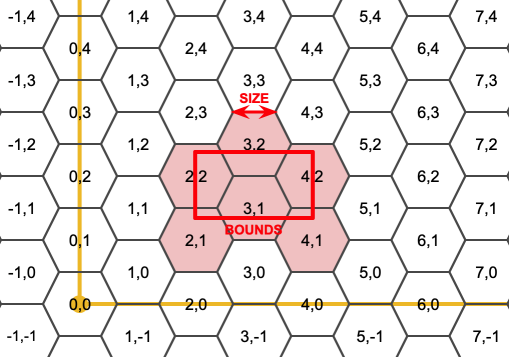
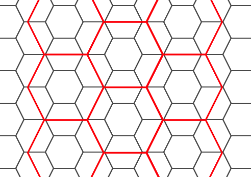
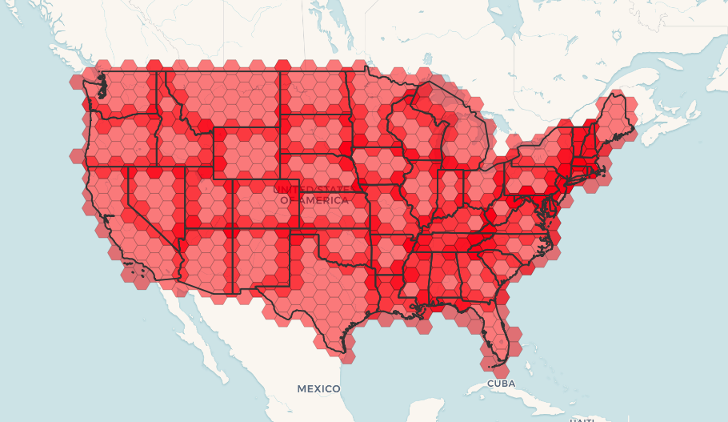

<a id="Geometry_Constructors"></a>

## Geometry Constructors
  <a id="ST_Collect"></a>

# ST_Collect

Creates a GeometryCollection or Multi* geometry from a set of geometries.

## Synopsis


```sql
geometry ST_Collect(geometry g1, geometry g2)
geometry ST_Collect(geometry[] g1_array)
geometry ST_Collect(geometry set g1field)
```


## Description


 Collects geometries into a geometry collection. The result is either a Multi* or a GeometryCollection, depending on whether the input geometries have the same or different types (homogeneous or heterogeneous). The input geometries are left unchanged within the collection.


**Variant 1:** accepts two input geometries


**Variant 2:** accepts an array of geometries


**Variant 3:** aggregate function accepting a rowset of geometries.


!!! note

    If any of the input geometries are collections (Multi* or GeometryCollection) ST_Collect returns a GeometryCollection (since that is the only type which can contain nested collections). To prevent this, use [ST_Dump](geometry-accessors.md#ST_Dump) in a subquery to expand the input collections to their atomic elements (see example below).


!!! note

    ST_Collect and [ST_Union](overlay-functions.md#ST_Union) appear similar, but in fact operate quite differently. ST_Collect aggregates geometries into a collection without changing them in any way. ST_Union geometrically merges geometries where they overlap, and splits linestrings at intersections. It may return single geometries when it dissolves boundaries.


Availability: 1.4.0 - ST_Collect(geomarray) was introduced. ST_Collect was enhanced to handle more geometries faster.


## Examples - Two-input variant


Collect 2D points.


```sql

SELECT ST_AsText( ST_Collect( ST_GeomFromText('POINT(1 2)'),
	ST_GeomFromText('POINT(-2 3)') ));

st_astext
----------
MULTIPOINT((1 2),(-2 3))
```


Collect 3D points.


```sql

SELECT ST_AsEWKT( ST_Collect( ST_GeomFromEWKT('POINT(1 2 3)'),
		ST_GeomFromEWKT('POINT(1 2 4)') ) );

		st_asewkt
-------------------------
 MULTIPOINT(1 2 3,1 2 4)

```


Collect curves.


```sql

SELECT ST_AsText( ST_Collect( 'CIRCULARSTRING(220268 150415,220227 150505,220227 150406)',
		'CIRCULARSTRING(220227 150406,2220227 150407,220227 150406)'));

		st_astext
------------------------------------------------------------------------------------
MULTICURVE(CIRCULARSTRING(220268 150415,220227 150505,220227 150406),
 CIRCULARSTRING(220227 150406,2220227 150407,220227 150406))
```


## Examples - Array variant


Using an array constructor for a subquery.


```sql

SELECT ST_Collect( ARRAY( SELECT geom FROM sometable ) );
```


Using an array constructor for values.


```sql

SELECT ST_AsText(  ST_Collect(
		ARRAY[ ST_GeomFromText('LINESTRING(1 2, 3 4)'),
			ST_GeomFromText('LINESTRING(3 4, 4 5)') ] )) As wktcollect;

--wkt collect --
MULTILINESTRING((1 2,3 4),(3 4,4 5))
```


## Examples - Aggregate variant


Creating multiple collections by grouping geometries in a table.


```sql

SELECT stusps, ST_Collect(f.geom) as geom
	 FROM (SELECT stusps, (ST_Dump(geom)).geom As geom
				FROM
				somestatetable ) As f
	GROUP BY stusps
```


## See Also


[ST_Dump](geometry-accessors.md#ST_Dump), [ST_Union](overlay-functions.md#ST_Union)
  <a id="ST_LineFromMultiPoint"></a>

# ST_LineFromMultiPoint

Creates a LineString from a MultiPoint geometry.

## Synopsis


```sql
geometry ST_LineFromMultiPoint(geometry  aMultiPoint)
```


## Description


Creates a LineString from a MultiPoint geometry.


Use [ST_MakeLine](#ST_MakeLine) to create lines from Point or LineString inputs.


## Examples


Create a 3D line string from a 3D MultiPoint


```sql

SELECT ST_AsEWKT(  ST_LineFromMultiPoint('MULTIPOINT(1 2 3, 4 5 6, 7 8 9)')  );

--result--
LINESTRING(1 2 3,4 5 6,7 8 9)
```


## See Also


[ST_AsEWKT](geometry-output.md#ST_AsEWKT), [ST_MakeLine](#ST_MakeLine)
  <a id="ST_MakeEnvelope"></a>

# ST_MakeEnvelope

Creates a rectangular Polygon from minimum and maximum coordinates.

## Synopsis


```sql
geometry ST_MakeEnvelope(float xmin, float ymin, float xmax, float ymax, integer srid=unknown)
```


## Description


Creates a rectangular Polygon from the minimum and maximum values for X and Y. Input values must be in the spatial reference system specified by the SRID. If no SRID is specified the unknown spatial reference system (SRID 0) is used.


Availability: 1.5


Enhanced: 2.0: Ability to specify an envelope without specifying an SRID was introduced.


## Example: Building a bounding box polygon


```sql

SELECT ST_AsText( ST_MakeEnvelope(10, 10, 11, 11, 4326) );

st_asewkt
-----------
POLYGON((10 10, 10 11, 11 11, 11 10, 10 10))
```


## See Also


[ST_MakePoint](#ST_MakePoint), [ST_MakeLine](#ST_MakeLine), [ST_MakePolygon](#ST_MakePolygon), [ST_TileEnvelope](#ST_TileEnvelope)
  <a id="ST_MakeLine"></a>

# ST_MakeLine

Creates a LineString from Point, MultiPoint, or LineString geometries.

## Synopsis


```sql
geometry ST_MakeLine(geometry geom1, geometry geom2)
geometry ST_MakeLine(geometry[] geoms_array)
geometry ST_MakeLine(geometry set geoms)
```


## Description


Creates a LineString containing the points of Point, MultiPoint, or LineString geometries. Other geometry types cause an error.


**Variant 1:** accepts two input geometries


**Variant 2:** accepts an array of geometries


**Variant 3:** aggregate function accepting a rowset of geometries. To ensure the order of the input geometries use `ORDER BY` in the function call, or a subquery with an `ORDER BY` clause.


 Repeated nodes at the beginning of input LineStrings are collapsed to a single point. Repeated points in Point and MultiPoint inputs are not collapsed. [ST_RemoveRepeatedPoints](geometry-editors.md#ST_RemoveRepeatedPoints) can be used to collapse repeated points from the output LineString.


Availability: 2.3.0 - Support for MultiPoint input elements was introduced


Availability: 2.0.0 - Support for LineString input elements was introduced


Availability: 1.4.0 - ST_MakeLine(geomarray) was introduced. ST_MakeLine aggregate functions was enhanced to handle more points faster.


## Examples: Two-input variant


Create a line composed of two points.


```sql

SELECT ST_AsText( ST_MakeLine(ST_Point(1,2), ST_Point(3,4)) );

	  st_astext
---------------------
 LINESTRING(1 2,3 4)
```


Create a 3D line from two 3D points.


```sql

SELECT ST_AsEWKT( ST_MakeLine(ST_MakePoint(1,2,3), ST_MakePoint(3,4,5) ));

		st_asewkt
-------------------------
 LINESTRING(1 2 3,3 4 5)
```


Create a line from two disjoint LineStrings.


```

 select ST_AsText( ST_MakeLine( 'LINESTRING(0 0, 1 1)', 'LINESTRING(2 2, 3 3)' ) );

          st_astext
-----------------------------
 LINESTRING(0 0,1 1,2 2,3 3)
```


## Examples: Array variant


Create a line from an array formed by a subquery with ordering.


```sql

SELECT ST_MakeLine( ARRAY( SELECT ST_Centroid(geom) FROM visit_locations ORDER BY visit_time) );
```


Create a 3D line from an array of 3D points


```sql

SELECT ST_AsEWKT( ST_MakeLine(
          ARRAY[ ST_MakePoint(1,2,3), ST_MakePoint(3,4,5), ST_MakePoint(6,6,6) ]  ));

		st_asewkt
-------------------------
LINESTRING(1 2 3,3 4 5,6 6 6)
```


## Examples: Aggregate variant


This example queries time-based sequences of GPS points from a set of tracks and creates one record for each track. The result geometries are LineStrings composed of the GPS track points in the order of travel.


Using aggregate `ORDER BY` provides a correctly-ordered LineString.


```sql

SELECT gps.track_id, ST_MakeLine(gps.geom ORDER BY gps_time) As geom
	FROM gps_points As gps
	GROUP BY track_id;
```


Prior to PostgreSQL 9, ordering in a subquery can be used. However, sometimes the query plan may not respect the order of the subquery.


```sql

SELECT gps.track_id, ST_MakeLine(gps.geom) As geom
	FROM ( SELECT track_id, gps_time, geom
			FROM gps_points ORDER BY track_id, gps_time ) As gps
	GROUP BY track_id;
```


## See Also


[ST_RemoveRepeatedPoints](geometry-editors.md#ST_RemoveRepeatedPoints), [ST_AsEWKT](geometry-output.md#ST_AsEWKT), [ST_AsText](geometry-output.md#ST_AsText), [ST_GeomFromText](geometry-input.md#ST_GeomFromText), [ST_MakePoint](#ST_MakePoint), [ST_Point](#ST_Point)
  <a id="ST_MakePoint"></a>

# ST_MakePoint

Creates a 2D, 3DZ or 4D Point.

## Synopsis


```sql
geometry ST_MakePoint(float x, float y)
```


```sql
geometry ST_MakePoint(float x, float y, float z)
```


```sql
geometry ST_MakePoint(float x, float y, float z, float m)
```


## Description


Creates a 2D XY, 3D XYZ or 4D XYZM Point geometry. Use [ST_MakePointM](#ST_MakePointM) to make points with XYM coordinates.


Use [ST_SetSRID](spatial-reference-system-functions.md#ST_SetSRID) to specify a SRID for the created point.


 While not OGC-compliant, `ST_MakePoint` is faster than [ST_GeomFromText](geometry-input.md#ST_GeomFromText) and [ST_PointFromText](geometry-input.md#ST_PointFromText). It is also easier to use for numeric coordinate values.


!!! note

    For geodetic coordinates, `X` is longitude and `Y` is latitude


!!! note

    The functions [ST_Point](#ST_Point), [ST_PointZ](#ST_PointZ), [ST_PointM](#ST_PointM), and [ST_PointZM](#ST_PointZM) can be used to create points with a given SRID.


## Examples


```
-- Create a point with unknown SRID
SELECT ST_MakePoint(-71.1043443253471, 42.3150676015829);

-- Create a point in the WGS 84 geodetic CRS
SELECT ST_SetSRID(ST_MakePoint(-71.1043443253471, 42.3150676015829),4326);

-- Create a 3D point (e.g. has altitude)
SELECT ST_MakePoint(1, 2,1.5);

-- Get z of point
SELECT ST_Z(ST_MakePoint(1, 2,1.5));
result
-------
1.5
```


## See Also


 [ST_GeomFromText](geometry-input.md#ST_GeomFromText), [ST_PointFromText](geometry-input.md#ST_PointFromText), [ST_SetSRID](spatial-reference-system-functions.md#ST_SetSRID), [ST_MakePointM](#ST_MakePointM), [ST_Point](#ST_Point), [ST_PointZ](#ST_PointZ), [ST_PointM](#ST_PointM), [ST_PointZM](#ST_PointZM)
  <a id="ST_MakePointM"></a>

# ST_MakePointM

Creates a Point from X, Y and M values.

## Synopsis


```sql
geometry ST_MakePointM(float x, float y, float m)
```


## Description


Creates a point with X, Y and M (measure) ordinates. Use [ST_MakePoint](#ST_MakePoint) to make points with XY, XYZ, or XYZM coordinates.


Use [ST_SetSRID](spatial-reference-system-functions.md#ST_SetSRID) to specify a SRID for the created point.


!!! note

    For geodetic coordinates, `X` is longitude and `Y` is latitude


!!! note

    The functions [ST_PointM](#ST_PointM), and [ST_PointZM](#ST_PointZM) can be used to create points with an M value and a given SRID.


## Examples


!!! note

    [ST_AsEWKT](geometry-output.md#ST_AsEWKT) is used for text output because [ST_AsText](geometry-output.md#ST_AsText) does not support M values.


Create point with unknown SRID.


```sql

SELECT ST_AsEWKT(  ST_MakePointM(-71.1043443253471, 42.3150676015829, 10)  );

				   st_asewkt
-----------------------------------------------
 POINTM(-71.1043443253471 42.3150676015829 10)
```


Create point with a measure in the WGS 84 geodetic coordinate system.


```sql

SELECT ST_AsEWKT( ST_SetSRID(  ST_MakePointM(-71.104, 42.315, 10),  4326));

						st_asewkt
---------------------------------------------------------
SRID=4326;POINTM(-71.104 42.315 10)
```


Get measure of created point.


```sql

SELECT ST_M(  ST_MakePointM(-71.104, 42.315, 10)  );

result
-------
10
```


## See Also


[ST_MakePoint](#ST_MakePoint), [ST_SetSRID](spatial-reference-system-functions.md#ST_SetSRID), [ST_PointM](#ST_PointM), [ST_PointZM](#ST_PointZM)
  <a id="ST_MakePolygon"></a>

# ST_MakePolygon

Creates a Polygon from a shell and optional list of holes.

## Synopsis


```sql
geometry ST_MakePolygon(geometry linestring)
```


```sql
geometry ST_MakePolygon(geometry outerlinestring, geometry[] interiorlinestrings)
```


## Description


Creates a Polygon formed by the given shell and optional array of holes. Input geometries must be closed LineStrings (rings).


**Variant 1:** Accepts one shell LineString.


**Variant 2:** Accepts a shell LineString and an array of inner (hole) LineStrings. A geometry array can be constructed using the PostgreSQL array_agg(), ARRAY[] or ARRAY() constructs.


!!! note

    This function does not accept MultiLineStrings. Use [ST_LineMerge](geometry-processing.md#ST_LineMerge) to generate a LineString, or [ST_Dump](geometry-accessors.md#ST_Dump) to extract LineStrings.


## Examples: Single input variant


Create a Polygon from a 2D LineString.


```sql

SELECT ST_MakePolygon( ST_GeomFromText('LINESTRING(75 29,77 29,77 29, 75 29)'));
```


Create a Polygon from an open LineString, using [ST_StartPoint](geometry-accessors.md#ST_StartPoint) and [ST_AddPoint](geometry-editors.md#ST_AddPoint) to close it.


```sql

SELECT ST_MakePolygon( ST_AddPoint(foo.open_line, ST_StartPoint(foo.open_line)) )
FROM (
  SELECT ST_GeomFromText('LINESTRING(75 29,77 29,77 29, 75 29)') As open_line) As foo;
```


Create a Polygon from a 3D LineString


```sql

SELECT ST_AsEWKT( ST_MakePolygon( 'LINESTRING(75.15 29.53 1,77 29 1,77.6 29.5 1, 75.15 29.53 1)'));

st_asewkt
-----------
POLYGON((75.15 29.53 1,77 29 1,77.6 29.5 1,75.15 29.53 1))
```


Create a Polygon from a LineString with measures


```sql

SELECT ST_AsEWKT( ST_MakePolygon( 'LINESTRINGM(75.15 29.53 1,77 29 1,77.6 29.5 2, 75.15 29.53 2)' ));

st_asewkt
----------
POLYGONM((75.15 29.53 1,77 29 1,77.6 29.5 2,75.15 29.53 2))
```


## Examples: Outer shell with inner holes variant


Create a donut Polygon with an extra hole


```sql

SELECT ST_MakePolygon( ST_ExteriorRing( ST_Buffer(ring.line,10)),
	ARRAY[  ST_Translate(ring.line, 1, 1),
		ST_ExteriorRing(ST_Buffer(ST_Point(20,20),1)) ]
	)
FROM (SELECT ST_ExteriorRing(
	ST_Buffer(ST_Point(10,10),10,10)) AS line ) AS ring;
```


Create a set of province boundaries with holes representing lakes. The input is a table of province Polygons/MultiPolygons and a table of water linestrings. Lines forming lakes are determined by using [ST_IsClosed](geometry-accessors.md#ST_IsClosed). The province linework is extracted by using [ST_Boundary](geometry-accessors.md#ST_Boundary). As required by <code>ST_MakePolygon</code>, the boundary is forced to be a single LineString by using [ST_LineMerge](geometry-processing.md#ST_LineMerge). (However, note that if a province has more than one region or has islands this will produce an invalid polygon.) Using a LEFT JOIN ensures all provinces are included even if they have no lakes.


!!! note

    The CASE construct is used because passing a null array into ST_MakePolygon results in a NULL return value.


```sql

SELECT p.gid, p.province_name,
	CASE WHEN array_agg(w.geom) IS NULL
	THEN p.geom
	ELSE  ST_MakePolygon( ST_LineMerge(ST_Boundary(p.geom)),
                        array_agg(w.geom)) END
FROM
	provinces p LEFT JOIN waterlines w
		ON (ST_Within(w.geom, p.geom) AND ST_IsClosed(w.geom))
GROUP BY p.gid, p.province_name, p.geom;
```


Another technique is to utilize a correlated subquery and the ARRAY() constructor that converts a row set to an array.


```sql

SELECT p.gid,  p.province_name,
    CASE WHEN EXISTS( SELECT w.geom
        FROM waterlines w
        WHERE ST_Within(w.geom, p.geom)
        AND ST_IsClosed(w.geom))
    THEN ST_MakePolygon(
        ST_LineMerge(ST_Boundary(p.geom)),
        ARRAY( SELECT w.geom
            FROM waterlines w
            WHERE ST_Within(w.geom, p.geom)
            AND ST_IsClosed(w.geom)))
    ELSE p.geom
    END AS geom
FROM provinces p;
```


## See Also


 [ST_BuildArea](geometry-processing.md#ST_BuildArea) [ST_Polygon](#ST_Polygon)
  <a id="ST_Point"></a>

# ST_Point

Creates a Point with X, Y and SRID values.

## Synopsis


```sql
geometry ST_Point(float x, float y)
```


```sql
geometry ST_Point(float x, float y, integer srid=unknown)
```


## Description


Returns a Point with the given X and Y coordinate values. This is the SQL-MM equivalent for [ST_MakePoint](#ST_MakePoint) that takes just X and Y.


!!! note

    For geodetic coordinates, `X` is longitude and `Y` is latitude


Enhanced: 3.2.0 srid as an extra optional argument was added. Older installs require combining with ST_SetSRID to mark the srid on the geometry.


 SQL-MM 3: 6.1.2


## Examples: Geometry


```sql
SELECT ST_Point( -71.104, 42.315);
```


Creating a point with SRID specified:


```sql
SELECT ST_Point( -71.104, 42.315, 4326);
```


Alternative way of specifying SRID:


```sql
SELECT ST_SetSRID( ST_Point( -71.104, 42.315), 4326);
```


## Examples: Geography


Create [geography](../data-management/geography-data-type.md#PostGIS_Geography) points using the `::` cast syntax:


```sql
SELECT ST_Point( -71.104, 42.315, 4326)::geography;
```


Pre-PostGIS 3.2 code, using `CAST`:


```sql
SELECT CAST( ST_SetSRID(ST_Point( -71.104, 42.315), 4326) AS geography);
```


If the point coordinates are not in a geodetic coordinate system (such as WGS84), then they must be reprojected before casting to a geography. In this example a point in Pennsylvania State Plane feet (SRID 2273) is projected to WGS84 (SRID 4326).


```sql

SELECT ST_Transform( ST_Point( 3637510, 3014852, 2273), 4326)::geography;
```


## See Also


[ST_MakePoint](#ST_MakePoint), [ST_PointZ](#ST_PointZ), [ST_PointM](#ST_PointM), [ST_PointZM](#ST_PointZM), [ST_SetSRID](spatial-reference-system-functions.md#ST_SetSRID), [ST_Transform](spatial-reference-system-functions.md#ST_Transform)
  <a id="ST_PointZ"></a>

# ST_PointZ

Creates a Point with X, Y, Z and SRID values.

## Synopsis


```sql
geometry ST_PointZ(float x, float y, float z, integer srid=unknown)
```


## Description


Returns an Point with the given X, Y and Z coordinate values, and optionally an SRID number.


Enhanced: 3.2.0 srid as an extra optional argument was added. Older installs require combining with ST_SetSRID to mark the srid on the geometry.


## Examples


```sql
SELECT ST_PointZ(-71.104, 42.315, 3.4, 4326)
```


```sql
SELECT ST_PointZ(-71.104, 42.315, 3.4, srid => 4326)
```


```sql
SELECT ST_PointZ(-71.104, 42.315, 3.4)
```


## See Also


[ST_MakePoint](#ST_MakePoint), [ST_Point](#ST_Point), [ST_PointM](#ST_PointM), [ST_PointZM](#ST_PointZM)
  <a id="ST_PointM"></a>

# ST_PointM

Creates a Point with X, Y, M and SRID values.

## Synopsis


```sql
geometry ST_PointM(float x, float y, float m, integer srid=unknown)
```


## Description


Returns an Point with the given X, Y and M coordinate values, and optionally an SRID number.


Enhanced: 3.2.0 srid as an extra optional argument was added. Older installs require combining with ST_SetSRID to mark the srid on the geometry.


## Examples


```sql
SELECT ST_PointM(-71.104, 42.315, 3.4, 4326)
```


```sql
SELECT ST_PointM(-71.104, 42.315, 3.4, srid => 4326)
```


```sql
SELECT ST_PointM(-71.104, 42.315, 3.4)
```


## See Also


[ST_MakePoint](#ST_MakePoint), [ST_Point](#ST_Point), [ST_PointZ](#ST_PointZ), [ST_PointZM](#ST_PointZM)
  <a id="ST_PointZM"></a>

# ST_PointZM

Creates a Point with X, Y, Z, M and SRID values.

## Synopsis


```sql
geometry ST_PointZM(float x, float y, float z, float m, integer srid=unknown)
```


## Description


Returns an Point with the given X, Y, Z and M coordinate values, and optionally an SRID number.


Enhanced: 3.2.0 srid as an extra optional argument was added. Older installs require combining with ST_SetSRID to mark the srid on the geometry.


## Examples


```sql
SELECT ST_PointZM(-71.104, 42.315, 3.4, 4.5, 4326)
```


```sql
SELECT ST_PointZM(-71.104, 42.315, 3.4, 4.5, srid => 4326)
```


```sql
SELECT ST_PointZM(-71.104, 42.315, 3.4, 4.5)
```


## See Also


[ST_MakePoint](#ST_MakePoint), [ST_Point](#ST_Point), [ST_PointM](#ST_PointM), [ST_PointZ](#ST_PointZ), [ST_SetSRID](spatial-reference-system-functions.md#ST_SetSRID)
  <a id="ST_Polygon"></a>

# ST_Polygon

Creates a Polygon from a LineString with a specified SRID.

## Synopsis


```sql
geometry ST_Polygon(geometry  lineString, integer  srid)
```


## Description


Returns a polygon built from the given LineString and sets the spatial reference system from the `srid`.


ST_Polygon is similar to [ST_MakePolygon](#ST_MakePolygon) Variant 1 with the addition of setting the SRID.


To create polygons with holes use [ST_MakePolygon](#ST_MakePolygon) Variant 2 and then [ST_SetSRID](spatial-reference-system-functions.md#ST_SetSRID).


!!! note

    This function does not accept MultiLineStrings. Use [ST_LineMerge](geometry-processing.md#ST_LineMerge) to generate a LineString, or [ST_Dump](geometry-accessors.md#ST_Dump) to extract LineStrings.


 SQL-MM 3: 8.3.2


## Examples


Create a 2D polygon.


```sql

SELECT ST_AsText( ST_Polygon('LINESTRING(75 29, 77 29, 77 29, 75 29)'::geometry, 4326) );

-- result --
POLYGON((75 29, 77 29, 77 29, 75 29))
```


Create a 3D polygon.


```sql

SELECT ST_AsEWKT( ST_Polygon( ST_GeomFromEWKT('LINESTRING(75 29 1, 77 29 2, 77 29 3, 75 29 1)'), 4326) );

-- result --
SRID=4326;POLYGON((75 29 1, 77 29 2, 77 29 3, 75 29 1))
```


## See Also


 [ST_AsEWKT](geometry-output.md#ST_AsEWKT), [ST_AsText](geometry-output.md#ST_AsText), [ST_GeomFromEWKT](geometry-input.md#ST_GeomFromEWKT), [ST_GeomFromText](geometry-input.md#ST_GeomFromText), [ST_LineMerge](geometry-processing.md#ST_LineMerge), [ST_MakePolygon](#ST_MakePolygon)
  <a id="ST_TileEnvelope"></a>

# ST_TileEnvelope

Creates a rectangular Polygon in [Web Mercator](https://en.wikipedia.org/wiki/Web_Mercator_projection) (SRID:3857) using the [XYZ tile system](https://en.wikipedia.org/wiki/Tiled_web_map).

## Synopsis


```sql
geometry ST_TileEnvelope(integer tileZoom, integer tileX, integer tileY, geometry bounds=SRID=3857;LINESTRING(-20037508.342789 -20037508.342789,20037508.342789 20037508.342789), float margin=0.0)
```


## Description


Creates a rectangular Polygon giving the extent of a tile in the [XYZ tile system](https://en.wikipedia.org/wiki/Tiled_web_map). The tile is specified by the zoom level Z and the XY index of the tile in the grid at that level. Can be used to define the tile bounds required by [ST_AsMVTGeom](geometry-output.md#ST_AsMVTGeom) to convert geometry into the MVT tile coordinate space.


By default, the tile envelope is in the [Web Mercator](https://en.wikipedia.org/wiki/Web_Mercator_projection) coordinate system (SRID:3857) using the standard range of the Web Mercator system (-20037508.342789, 20037508.342789). This is the most common coordinate system used for MVT tiles. The optional `bounds` parameter can be used to generate tiles in any coordinate system. It is a geometry that has the SRID and extent of the "Zoom Level zero" square within which the XYZ tile system is inscribed.


The optional `margin` parameter can be used to expand a tile by the given percentage. E.g. `margin=0.125` expands the tile by 12.5%, which is equivalent to buffer=512 when the tile extent size is 4096, as used in [ST_AsMVTGeom](geometry-output.md#ST_AsMVTGeom). This is useful to create a tile buffer to include data lying outside of the tile's visible area, but whose existence affects the tile rendering. For example, a city name (a point) could be near an edge of a tile, so its label should be rendered on two tiles, even though the point is located in the visible area of just one tile. Using expanded tiles in a query will include the city point in both tiles. Use a negative value to shrink the tile instead. Values less than -0.5 are prohibited because that would eliminate the tile completely. Do not specify a margin when using with `ST_AsMVTGeom`. See the example for [ST_AsMVT](geometry-output.md#ST_AsMVT).


Enhanced: 3.1.0 Added margin parameter.


Availability: 3.0.0


## Example: Building a tile envelope


```sql
SELECT ST_AsText( ST_TileEnvelope(2, 1, 1) );

 st_astext
------------------------------
 POLYGON((-10018754.1713945 0,-10018754.1713945 10018754.1713945,0 10018754.1713945,0 0,-10018754.1713945 0))

SELECT ST_AsText( ST_TileEnvelope(3, 1, 1, ST_MakeEnvelope(-180, -90, 180, 90, 4326) ) );

                      st_astext
------------------------------------------------------
 POLYGON((-135 45,-135 67.5,-90 67.5,-90 45,-135 45))
```


## See Also


[ST_MakeEnvelope](#ST_MakeEnvelope)
  <a id="ST_HexagonGrid"></a>

# ST_HexagonGrid

Returns a set of hexagons and cell indices that completely cover the bounds of the geometry argument.

## Synopsis


```sql
setof record ST_HexagonGrid(float8 size, geometry bounds)
```


## Description


Starts with the concept of a hexagon tiling of the plane. (Not a hexagon tiling of the globe, this is not the [H3](https://github.com/uber/h3) tiling scheme.) For a given planar SRS, and a given edge size, starting at the origin of the SRS, there is one unique hexagonal tiling of the plane, Tiling(SRS, Size). This function answers the question: what hexagons in a given Tiling(SRS, Size) overlap with a given bounds.





The SRS for the output hexagons is the SRS provided by the bounds geometry.


Doubling or tripling the edge size of the hexagon generates a new parent tiling that fits with the origin tiling. Unfortunately, it is not possible to generate parent hexagon tilings that the child tiles perfectly fit inside.





Availability: 3.1.0


## Example: Counting points in hexagons


To do a point summary against a hexagonal tiling, generate a hexagon grid using the extent of the points as the bounds, then spatially join to that grid.


```sql
SELECT COUNT(*), hexes.geom
FROM
    ST_HexagonGrid(
        10000,
        ST_SetSRID(ST_EstimatedExtent('pointtable', 'geom'), 3857)
    ) AS hexes
    INNER JOIN
    pointtable AS pts
    ON ST_Intersects(pts.geom, hexes.geom)
GROUP BY hexes.geom;
```


## Example: Generating hex coverage of polygons


If we generate a set of hexagons for each polygon boundary and filter out those that do not intersect their hexagons, we end up with a tiling for each polygon.





Tiling states results in a hexagon coverage of each state, and multiple hexagons overlapping at the borders between states.


!!! note

    The LATERAL keyword is implied for set-returning functions when referring to a prior table in the FROM list. So CROSS JOIN LATERAL, CROSS JOIN, or just plain , are equivalent constructs for this example.


```sql
SELECT admin1.gid, hex.geom
FROM
    admin1
    CROSS JOIN
    ST_HexagonGrid(100000, admin1.geom) AS hex
WHERE
    adm0_a3 = 'USA'
    AND
    ST_Intersects(admin1.geom, hex.geom)
```


## See Also


[ST_EstimatedExtent](bounding-box-functions.md#ST_EstimatedExtent), [ST_SetSRID](spatial-reference-system-functions.md#ST_SetSRID), [ST_SquareGrid](#ST_SquareGrid), [ST_TileEnvelope](#ST_TileEnvelope)
  <a id="ST_Hexagon"></a>

# ST_Hexagon

Returns a single hexagon, using the provided edge size and cell coordinate within the hexagon grid space.

## Synopsis


```sql
geometry ST_Hexagon(float8 size, integer cell_i, integer cell_j, geometry origin)
```


## Description


Uses the same hexagon tiling concept as [ST_HexagonGrid](#ST_HexagonGrid), but generates just one hexagon at the desired cell coordinate. Optionally, can adjust origin coordinate of the tiling, the default origin is at 0,0.


Hexagons are generated with no SRID set, so use [ST_SetSRID](spatial-reference-system-functions.md#ST_SetSRID) to set the SRID to the one you expect.


Availability: 3.1.0


## Example: Creating a hexagon at the origin


```sql
SELECT ST_AsText(ST_SetSRID(ST_Hexagon(1.0, 0, 0), 3857));

POLYGON((-1 0,-0.5
         -0.866025403784439,0.5
         -0.866025403784439,1
         0,0.5
         0.866025403784439,-0.5
         0.866025403784439,-1 0))
```


## See Also


[ST_TileEnvelope](#ST_TileEnvelope), [ST_HexagonGrid](#ST_HexagonGrid), [ST_Square](#ST_Square)
  <a id="ST_SquareGrid"></a>

# ST_SquareGrid

Returns a set of grid squares and cell indices that completely cover the bounds of the geometry argument.

## Synopsis


```sql
setof record ST_SquareGrid(float8 size, geometry bounds)
```


## Description


Starts with the concept of a square tiling of the plane. For a given planar SRS, and a given edge size, starting at the origin of the SRS, there is one unique square tiling of the plane, Tiling(SRS, Size). This function answers the question: what grids in a given Tiling(SRS, Size) overlap with a given bounds.


The SRS for the output squares is the SRS provided by the bounds geometry.


Doubling or edge size of the square generates a new parent tiling that perfectly fits with the original tiling. Standard web map tilings in mercator are just powers-of-two square grids in the mercator plane.


Availability: 3.1.0


## Example: Generating a 1 degree grid for a country


The grid will fill the whole bounds of the country, so if you want just squares that touch the country you will have to filter afterwards with ST_Intersects.


```sql
WITH grid AS (
SELECT (ST_SquareGrid(1, ST_Transform(geom,4326))).*
FROM admin0 WHERE name = 'Canada'
)
  SELEcT ST_AsText(geom)
  FROM grid
```


## Example: Counting points in squares (using single chopped grid)


To do a point summary against a square tiling, generate a square grid using the extent of the points as the bounds, then spatially join to that grid. Note the estimated extent might be off from actual extent, so be cautious and at very least make sure you've analyzed your table.


```sql
SELECT COUNT(*), squares.geom
    FROM
    pointtable AS pts
    INNER JOIN
    ST_SquareGrid(
        1000,
        ST_SetSRID(ST_EstimatedExtent('pointtable', 'geom'), 3857)
    ) AS squares
    ON ST_Intersects(pts.geom, squares.geom)
    GROUP BY squares.geom
```


## Example: Counting points in squares using set of grid per point


This yields the same result as the first example but will be slower for a large number of points


```sql
SELECT COUNT(*), squares.geom
    FROM
    pointtable AS pts
    INNER JOIN
    ST_SquareGrid(
        1000,
       pts.geom
    ) AS squares
    ON ST_Intersects(pts.geom, squares.geom)
    GROUP BY squares.geom
```


## See Also


[ST_TileEnvelope](#ST_TileEnvelope), [ST_HexagonGrid](#ST_HexagonGrid) , [ST_EstimatedExtent](bounding-box-functions.md#ST_EstimatedExtent) , [ST_SetSRID](spatial-reference-system-functions.md#ST_SetSRID)
  <a id="ST_Square"></a>

# ST_Square

Returns a single square, using the provided edge size and cell coordinate within the square grid space.

## Synopsis


```sql
geometry ST_Square(float8 size, integer cell_i, integer cell_j, geometry origin='POINT(0 0)')
```


## Description


Uses the same square tiling concept as [ST_SquareGrid](#ST_SquareGrid), but generates just one square at the desired cell coordinate. Optionally, can adjust origin coordinate of the tiling, the default origin is at 0,0.


 Squares are generated with the SRID of the given origin. Use [ST_SetSRID](spatial-reference-system-functions.md#ST_SetSRID) to set the SRID if the given origin has an unknown SRID (as is the case by default).


Availability: 3.1.0


## Example: Creating a square at the origin


```sql
SELECT ST_AsText(ST_SetSRID(ST_Square(1.0, 0, 0), 3857));

 POLYGON((0 0,0 1,1 1,1 0,0 0))
```


## See Also


[ST_TileEnvelope](#ST_TileEnvelope), [ST_SquareGrid](#ST_SquareGrid), [ST_Hexagon](#ST_Hexagon)
  <a id="ST_Letters"></a>

# ST_Letters

Returns the input letters rendered as geometry with a default start position at the origin and default text height of 100.

## Synopsis


```sql
geometry ST_Letters(text  letters, json  font)
```


## Description


Uses a built-in font to render out a string as a multipolygon geometry. The default text height is 100.0, the distance from the bottom of a descender to the top of a capital. The default start position places the start of the baseline at the origin. Over-riding the font involves passing in a json map, with a character as the key, and base64 encoded TWKB for the font shape, with the fonts having a height of 1000 units from the bottom of the descenders to the tops of the capitals.


The text is generated at the origin by default, so to reposition and resize the text, first apply the <code>ST_Scale</code> function and then apply the <code>ST_Translate</code> function.


Availability: 3.3.0


## Example: Generating the word 'Yo'


```sql
SELECT ST_AsText(ST_Letters('Yo'), 1);
```


Letters generated by ST_Letters


## Example: Scaling and moving words


```sql
SELECT ST_Translate(ST_Scale(ST_Letters('Yo'), 10, 10), 100,100);
```


## See Also


[ST_AsTWKB](geometry-output.md#ST_AsTWKB), [ST_Scale](affine-transformations.md#ST_Scale), [ST_Translate](affine-transformations.md#ST_Translate)
