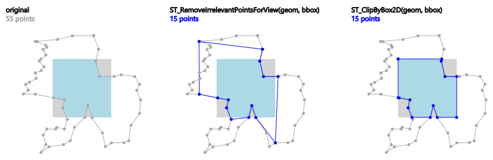
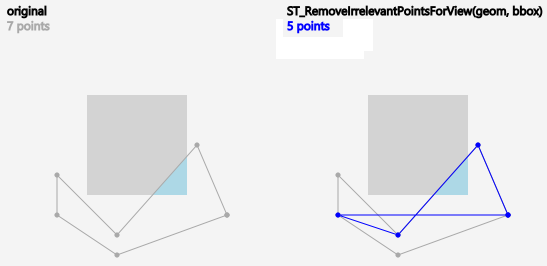
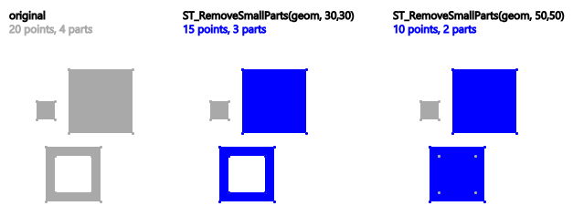
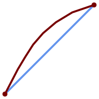

<a id="Geometry_Editors"></a>

## Geometry Editors
  <a id="ST_AddPoint"></a>

# ST_AddPoint

Add a point to a LineString.

## Synopsis


```sql
geometry ST_AddPoint(geometry linestring, geometry point)
```


```sql
geometry ST_AddPoint(geometry linestring, geometry point, integer position = -1)
```


## Description


Adds a point to a LineString before the index `position` (using a 0-based index). If the `position` parameter is omitted or is -1 the point is appended to the end of the LineString.


Availability: 1.1.0


## Examples


Add a point to the end of a 3D line


```sql

SELECT ST_AsEWKT(ST_AddPoint('LINESTRING(0 0 1, 1 1 1)', ST_MakePoint(1, 2, 3)));

    st_asewkt
    ----------
    LINESTRING(0 0 1,1 1 1,1 2 3)
```


Guarantee all lines in a table are closed by adding the start point of each line to the end of the line only for those that are not closed.


```sql

UPDATE sometable
SET geom = ST_AddPoint(geom, ST_StartPoint(geom))
FROM sometable
WHERE ST_IsClosed(geom) = false;
```


## See Also


[ST_RemovePoint](#ST_RemovePoint), [ST_SetPoint](#ST_SetPoint)
  <a id="ST_CollectionExtract"></a>

# ST_CollectionExtract

Given a geometry collection, returns a multi-geometry containing only elements of a specified type.

## Synopsis


```sql
geometry ST_CollectionExtract(geometry  collection)
```


```sql
geometry ST_CollectionExtract(geometry  collection, integer  type)
```


## Description


Given a geometry collection, returns a homogeneous multi-geometry.


If the `type` is not specified, returns a multi-geometry containing only geometries of the highest dimension. So polygons are preferred over lines, which are preferred over points.


If the `type` is specified, returns a multi-geometry containing only that type. If there are no sub-geometries of the right type, an EMPTY geometry is returned. Only points, lines and polygons are supported. The type numbers are:


- 1 == POINT
- 2 == LINESTRING
- 3 == POLYGON


For atomic geometry inputs, the geometry is returned unchanged if the input type matches the requested type. Otherwise, the result is an EMPTY geometry of the specified type. If required, these can be converted to multi-geometries using [ST_Multi](#ST_Multi).


!!! warning

    MultiPolygon results are not checked for validity. If the polygon components are adjacent or overlapping the result will be invalid. (For example, this can occur when applying this function to an [ST_Split](overlay-functions.md#ST_Split) result.) This situation can be checked with [ST_IsValid](geometry-validation.md#ST_IsValid) and repaired with [ST_MakeValid](geometry-validation.md#ST_MakeValid).


Availability: 1.5.0


!!! note

    Prior to 1.5.3 this function returned atomic inputs unchanged, no matter type. In 1.5.3 non-matching single geometries returned a NULL result. In 2.0.0 non-matching single geometries return an EMPTY result of the requested type.


## Examples


Extract highest-dimension type:


```sql

SELECT ST_AsText(ST_CollectionExtract(
        'GEOMETRYCOLLECTION( POINT(0 0), LINESTRING(1 1, 2 2) )'));
    st_astext
    ---------------
    MULTILINESTRING((1 1, 2 2))
```


Extract points (type 1 == POINT):


```sql

SELECT ST_AsText(ST_CollectionExtract(
        'GEOMETRYCOLLECTION(GEOMETRYCOLLECTION(POINT(0 0)))',
        1 ));
    st_astext
    ---------------
    MULTIPOINT((0 0))
```


Extract lines (type 2 == LINESTRING):


```sql

SELECT ST_AsText(ST_CollectionExtract(
        'GEOMETRYCOLLECTION(GEOMETRYCOLLECTION(LINESTRING(0 0, 1 1)),LINESTRING(2 2, 3 3))',
        2 ));
    st_astext
    ---------------
    MULTILINESTRING((0 0, 1 1), (2 2, 3 3))
```


## See Also


[ST_CollectionHomogenize](#ST_CollectionHomogenize), [ST_Multi](#ST_Multi), [ST_IsValid](geometry-validation.md#ST_IsValid), [ST_MakeValid](geometry-validation.md#ST_MakeValid)
  <a id="ST_CollectionHomogenize"></a>

# ST_CollectionHomogenize

Returns the simplest representation of a geometry collection.

## Synopsis


```sql
geometry ST_CollectionHomogenize(geometry  collection)
```


## Description


 Given a geometry collection, returns the "simplest" representation of the contents.


- Homogeneous (uniform) collections are returned as the appropriate multi-geometry.
- Heterogeneous (mixed) collections are flattened into a single GeometryCollection.
- Collections containing a single atomic element are returned as that element.
- Atomic geometries are returned unchanged. If required, these can be converted to a multi-geometry using [ST_Multi](#ST_Multi).


!!! warning

    This function does not ensure that the result is valid. In particular, a collection containing adjacent or overlapping Polygons will create an invalid MultiPolygon. This situation can be checked with [ST_IsValid](geometry-validation.md#ST_IsValid) and repaired with [ST_MakeValid](geometry-validation.md#ST_MakeValid).


Availability: 2.0.0


## Examples


Single-element collection converted to an atomic geometry


```sql

  SELECT ST_AsText(ST_CollectionHomogenize('GEOMETRYCOLLECTION(POINT(0 0))'));

	st_astext
	------------
	POINT(0 0)
```


Nested single-element collection converted to an atomic geometry:


```sql

SELECT ST_AsText(ST_CollectionHomogenize('GEOMETRYCOLLECTION(MULTIPOINT((0 0)))'));

	st_astext
	------------
	POINT(0 0)
```


Collection converted to a multi-geometry:


```sql

SELECT ST_AsText(ST_CollectionHomogenize('GEOMETRYCOLLECTION(POINT(0 0),POINT(1 1))'));

	st_astext
	---------------------
	MULTIPOINT((0 0),(1 1))
```


Nested heterogeneous collection flattened to a GeometryCollection:


```sql

SELECT ST_AsText(ST_CollectionHomogenize('GEOMETRYCOLLECTION(POINT(0 0), GEOMETRYCOLLECTION( LINESTRING(1 1, 2 2)))'));

	st_astext
	---------------------
	GEOMETRYCOLLECTION(POINT(0 0),LINESTRING(1 1,2 2))
```


Collection of Polygons converted to an (invalid) MultiPolygon:


```sql

SELECT ST_AsText(ST_CollectionHomogenize('GEOMETRYCOLLECTION (POLYGON ((10 50, 50 50, 50 10, 10 10, 10 50)), POLYGON ((90 50, 90 10, 50 10, 50 50, 90 50)))'));

	st_astext
	---------------------
	MULTIPOLYGON(((10 50,50 50,50 10,10 10,10 50)),((90 50,90 10,50 10,50 50,90 50)))
```


## See Also


[ST_CollectionExtract](#ST_CollectionExtract), [ST_Multi](#ST_Multi), [ST_IsValid](geometry-validation.md#ST_IsValid), [ST_MakeValid](geometry-validation.md#ST_MakeValid)
  <a id="ST_CurveToLine"></a>

# ST_CurveToLine

Converts a geometry containing curves to a linear geometry.

## Synopsis


```sql
geometry ST_CurveToLine(geometry curveGeom, float tolerance, integer tolerance_type, integer flags)
```


## Description


Converts a CIRCULAR STRING to regular LINESTRING or CURVEPOLYGON to POLYGON or MULTISURFACE to MULTIPOLYGON. Useful for outputting to devices that can't support CIRCULARSTRING geometry types


Converts a given geometry to a linear geometry. Each curved geometry or segment is converted into a linear approximation using the given `tolerance` and options (32 segments per quadrant and no options by default).


 The 'tolerance_type' argument determines interpretation of the `tolerance` argument. It can take the following values:

- 0 (default): Tolerance is max segments per quadrant.
- 1: Tolerance is max-deviation of line from curve, in source units.
- 2: Tolerance is max-angle, in radians, between generating radii.


 The 'flags' argument is a bitfield. 0 by default. Supported bits are:

- 1: Symmetric (orientation independent) output.
- 2: Retain angle, avoids reducing angles (segment lengths) when producing symmetric output. Has no effect when Symmetric flag is off.


Availability: 1.3.0


Enhanced: 2.4.0 added support for max-deviation and max-angle tolerance, and for symmetric output.


Enhanced: 3.0.0 implemented a minimum number of segments per linearized arc to prevent topological collapse.


 SQL-MM 3: 7.1.7


## Examples


```sql
SELECT ST_AsText(ST_CurveToLine(ST_GeomFromText('CIRCULARSTRING(220268 150415,220227 150505,220227 150406)')));

--Result --
 LINESTRING(220268 150415,220269.95064912 150416.539364228,220271.823415575 150418.17258804,220273.613787707 150419.895736857,
 220275.317452352 150421.704659462,220276.930305234 150423.594998003,220278.448460847 150425.562198489,
 220279.868261823 150427.60152176,220281.186287736 150429.708054909,220282.399363347 150431.876723113,
 220283.50456625 150434.10230186,220284.499233914 150436.379429536,220285.380970099 150438.702620341,220286.147650624 150441.066277505,
 220286.797428488 150443.464706771,220287.328738321 150445.892130112,220287.740300149 150448.342699654,
 220288.031122486 150450.810511759,220288.200504713 150453.289621251,220288.248038775 150455.77405574,
 220288.173610157 150458.257830005,220287.977398166 150460.734960415,220287.659875492 150463.199479347,
 220287.221807076 150465.64544956,220286.664248262 150468.066978495,220285.988542259 150470.458232479,220285.196316903 150472.81345077,
 220284.289480732 150475.126959442,220283.270218395 150477.39318505,220282.140985384 150479.606668057,
 220280.90450212 150481.762075989,220279.5637474 150483.85421628,220278.12195122 150485.87804878,
 220276.582586992 150487.828697901,220274.949363179 150489.701464356,220273.226214362 150491.491836488,
 220271.417291757 150493.195501133,220269.526953216 150494.808354014,220267.559752731 150496.326509628,
 220265.520429459 150497.746310603,220263.41389631 150499.064336517,220261.245228106 150500.277412127,
 220259.019649359 150501.38261503,220256.742521683 150502.377282695,220254.419330878 150503.259018879,
 220252.055673714 150504.025699404,220249.657244448 150504.675477269,220247.229821107 150505.206787101,
 220244.779251566 150505.61834893,220242.311439461 150505.909171266,220239.832329968 150506.078553494,
 220237.347895479 150506.126087555,220234.864121215 150506.051658938,220232.386990804 150505.855446946,
 220229.922471872 150505.537924272,220227.47650166 150505.099855856,220225.054972724 150504.542297043,
 220222.663718741 150503.86659104,220220.308500449 150503.074365683,
 220217.994991777 150502.167529512,220215.72876617 150501.148267175,
 220213.515283163 150500.019034164,220211.35987523 150498.7825509,
 220209.267734939 150497.441796181,220207.243902439 150496,
 220205.293253319 150494.460635772,220203.420486864 150492.82741196,220201.630114732 150491.104263143,
 220199.926450087 150489.295340538,220198.313597205 150487.405001997,220196.795441592 150485.437801511,
 220195.375640616 150483.39847824,220194.057614703 150481.291945091,220192.844539092 150479.123276887,220191.739336189 150476.89769814,
 220190.744668525 150474.620570464,220189.86293234 150472.297379659,220189.096251815 150469.933722495,
 220188.446473951 150467.535293229,220187.915164118 150465.107869888,220187.50360229 150462.657300346,
 220187.212779953 150460.189488241,220187.043397726 150457.710378749,220186.995863664 150455.22594426,
 220187.070292282 150452.742169995,220187.266504273 150450.265039585,220187.584026947 150447.800520653,
 220188.022095363 150445.35455044,220188.579654177 150442.933021505,220189.25536018 150440.541767521,
 220190.047585536 150438.18654923,220190.954421707 150435.873040558,220191.973684044 150433.60681495,
 220193.102917055 150431.393331943,220194.339400319 150429.237924011,220195.680155039 150427.14578372,220197.12195122 150425.12195122,
 220198.661315447 150423.171302099,220200.29453926 150421.298535644,220202.017688077 150419.508163512,220203.826610682 150417.804498867,
 220205.716949223 150416.191645986,220207.684149708 150414.673490372,220209.72347298 150413.253689397,220211.830006129 150411.935663483,
 220213.998674333 150410.722587873,220216.22425308 150409.61738497,220218.501380756 150408.622717305,220220.824571561 150407.740981121,
 220223.188228725 150406.974300596,220225.586657991 150406.324522731,220227 150406)

--3d example
SELECT ST_AsEWKT(ST_CurveToLine(ST_GeomFromEWKT('CIRCULARSTRING(220268 150415 1,220227 150505 2,220227 150406 3)')));
Output
------
 LINESTRING(220268 150415 1,220269.95064912 150416.539364228 1.0181172856673,
 220271.823415575 150418.17258804 1.03623457133459,220273.613787707 150419.895736857 1.05435185700189,....AD INFINITUM ....
    220225.586657991 150406.324522731 1.32611114201132,220227 150406 3)

--use only 2 segments to approximate quarter circle
SELECT ST_AsText(ST_CurveToLine(ST_GeomFromText('CIRCULARSTRING(220268 150415,220227 150505,220227 150406)'),2));
st_astext
------------------------------
 LINESTRING(220268 150415,220287.740300149 150448.342699654,220278.12195122 150485.87804878,
 220244.779251566 150505.61834893,220207.243902439 150496,220187.50360229 150462.657300346,
 220197.12195122 150425.12195122,220227 150406)

-- Ensure approximated line is no further than 20 units away from
-- original curve, and make the result direction-neutral
SELECT ST_AsText(ST_CurveToLine(
 'CIRCULARSTRING(0 0,100 -100,200 0)'::geometry,
    20, -- Tolerance
    1, -- Above is max distance between curve and line
    1  -- Symmetric flag
));
st_astext
-------------------------------------------------------------------------------------------
 LINESTRING(0 0,50 -86.6025403784438,150 -86.6025403784439,200 -1.1331077795296e-13,200 0)


```


## See Also


[ST_LineToCurve](#ST_LineToCurve)
  <a id="ST_Scroll"></a>

# ST_Scroll

Change start point of a closed LineString.

## Synopsis


```sql
geometry ST_Scroll(geometry linestring, geometry point)
```


## Description


 Changes the start/end point of a closed LineString to the given vertex `point`.


Availability: 3.2.0


## Examples


Make e closed line start at its 3rd vertex


```sql

SELECT ST_AsEWKT(ST_Scroll('SRID=4326;LINESTRING(0 0 0 1, 10 0 2 0, 5 5 4 2,0 0 0 1)', 'POINT(5 5 4 2)'));

st_asewkt
----------
SRID=4326;LINESTRING(5 5 4 2,0 0 0 1,10 0 2 0,5 5 4 2)
```


## See Also


[ST_Normalize](#ST_Normalize)
  <a id="ST_FlipCoordinates"></a>

# ST_FlipCoordinates

Returns a version of a geometry with X and Y axis flipped.

## Synopsis


```sql
geometry ST_FlipCoordinates(geometry geom)
```


## Description


Returns a version of the given geometry with X and Y axis flipped. Useful for fixing geometries which contain coordinates expressed as latitude/longitude (Y,X).


Availability: 2.0.0


## Example


```sql

SELECT ST_AsEWKT(ST_FlipCoordinates(GeomFromEWKT('POINT(1 2)')));
 st_asewkt
------------
POINT(2 1)

```


## See Also


 [ST_SwapOrdinates](#ST_SwapOrdinates)
  <a id="ST_Force2D"></a>

# ST_Force2D

Force the geometries into a "2-dimensional mode".

## Synopsis


```sql
geometry ST_Force2D(geometry  geomA)
```


## Description


Forces the geometries into a "2-dimensional mode" so that all output representations will only have the X and Y coordinates. This is useful for force OGC-compliant output (since OGC only specifies 2-D geometries).


Enhanced: 2.0.0 support for Polyhedral surfaces was introduced.


Changed: 2.1.0. Up to 2.0.x this was called ST_Force_2D.


## Examples


```sql
SELECT ST_AsEWKT(ST_Force2D(ST_GeomFromEWKT('CIRCULARSTRING(1 1 2, 2 3 2, 4 5 2, 6 7 2, 5 6 2)')));
		st_asewkt
-------------------------------------
CIRCULARSTRING(1 1,2 3,4 5,6 7,5 6)

SELECT  ST_AsEWKT(ST_Force2D('POLYGON((0 0 2,0 5 2,5 0 2,0 0 2),(1 1 2,3 1 2,1 3 2,1 1 2))'));

				  st_asewkt
----------------------------------------------
 POLYGON((0 0,0 5,5 0,0 0),(1 1,3 1,1 3,1 1))


```


## See Also


[ST_Force_3D](#ST_Force_3D)
  <a id="ST_Force_3D"></a>

# ST_Force3D

Force the geometries into XYZ mode. This is an alias for ST_Force3DZ.

## Synopsis


```sql
geometry ST_Force3D(geometry  geomA, float  Zvalue = 0.0)
```


## Description


Forces the geometries into XYZ mode. This is an alias for ST_Force3DZ. If a geometry has no Z component, then a `Zvalue` Z coordinate is tacked on.


Enhanced: 2.0.0 support for Polyhedral surfaces was introduced.


Changed: 2.1.0. Up to 2.0.x this was called ST_Force_3D.


Changed: 3.1.0. Added support for supplying a non-zero Z value.


## Examples


```

		--Nothing happens to an already 3D geometry
		SELECT ST_AsEWKT(ST_Force3D(ST_GeomFromEWKT('CIRCULARSTRING(1 1 2, 2 3 2, 4 5 2, 6 7 2, 5 6 2)')));
				   st_asewkt
-----------------------------------------------
 CIRCULARSTRING(1 1 2,2 3 2,4 5 2,6 7 2,5 6 2)


SELECT  ST_AsEWKT(ST_Force3D('POLYGON((0 0,0 5,5 0,0 0),(1 1,3 1,1 3,1 1))'));

						 st_asewkt
--------------------------------------------------------------
 POLYGON((0 0 0,0 5 0,5 0 0,0 0 0),(1 1 0,3 1 0,1 3 0,1 1 0))

```


## See Also


[ST_AsEWKT](geometry-output.md#ST_AsEWKT), [ST_Force2D](#ST_Force2D), [ST_Force_3DM](#ST_Force_3DM), [ST_Force_3DZ](#ST_Force_3DZ)
  <a id="ST_Force_3DZ"></a>

# ST_Force3DZ

Force the geometries into XYZ mode.

## Synopsis


```sql
geometry ST_Force3DZ(geometry  geomA, float  Zvalue = 0.0)
```


## Description


Forces the geometries into XYZ mode. If a geometry has no Z component, then a `Zvalue` Z coordinate is tacked on.


Enhanced: 2.0.0 support for Polyhedral surfaces was introduced.


Changed: 2.1.0. Up to 2.0.x this was called ST_Force_3DZ.


Changed: 3.1.0. Added support for supplying a non-zero Z value.


## Examples


```

--Nothing happens to an already 3D geometry
SELECT ST_AsEWKT(ST_Force3DZ(ST_GeomFromEWKT('CIRCULARSTRING(1 1 2, 2 3 2, 4 5 2, 6 7 2, 5 6 2)')));
				   st_asewkt
-----------------------------------------------
 CIRCULARSTRING(1 1 2,2 3 2,4 5 2,6 7 2,5 6 2)


SELECT  ST_AsEWKT(ST_Force3DZ('POLYGON((0 0,0 5,5 0,0 0),(1 1,3 1,1 3,1 1))'));

						 st_asewkt
--------------------------------------------------------------
 POLYGON((0 0 0,0 5 0,5 0 0,0 0 0),(1 1 0,3 1 0,1 3 0,1 1 0))

```


## See Also


[ST_AsEWKT](geometry-output.md#ST_AsEWKT), [ST_Force2D](#ST_Force2D), [ST_Force_3DM](#ST_Force_3DM), [ST_Force_3D](#ST_Force_3D)
  <a id="ST_Force_3DM"></a>

# ST_Force3DM

Force the geometries into XYM mode.

## Synopsis


```sql
geometry ST_Force3DM(geometry  geomA, float  Mvalue = 0.0)
```


## Description


Forces the geometries into XYM mode. If a geometry has no M component, then a `Mvalue` M coordinate is tacked on. If it has a Z component, then Z is removed


Changed: 2.1.0. Up to 2.0.x this was called ST_Force_3DM.


Changed: 3.1.0. Added support for supplying a non-zero M value.


## Examples


```

--Nothing happens to an already 3D geometry
SELECT ST_AsEWKT(ST_Force3DM(ST_GeomFromEWKT('CIRCULARSTRING(1 1 2, 2 3 2, 4 5 2, 6 7 2, 5 6 2)')));
				   st_asewkt
------------------------------------------------
 CIRCULARSTRINGM(1 1 0,2 3 0,4 5 0,6 7 0,5 6 0)


SELECT  ST_AsEWKT(ST_Force3DM('POLYGON((0 0 1,0 5 1,5 0 1,0 0 1),(1 1 1,3 1 1,1 3 1,1 1 1))'));

						  st_asewkt
---------------------------------------------------------------
 POLYGONM((0 0 0,0 5 0,5 0 0,0 0 0),(1 1 0,3 1 0,1 3 0,1 1 0))


```


## See Also


[ST_AsEWKT](geometry-output.md#ST_AsEWKT), [ST_Force2D](#ST_Force2D), [ST_Force_3DM](#ST_Force_3DM), [ST_Force_3D](#ST_Force_3D), [ST_GeomFromEWKT](geometry-input.md#ST_GeomFromEWKT)
  <a id="ST_Force_4D"></a>

# ST_Force4D

Force the geometries into XYZM mode.

## Synopsis


```sql
geometry ST_Force4D(geometry  geomA, float  Zvalue = 0.0, float  Mvalue = 0.0)
```


## Description


Forces the geometries into XYZM mode. `Zvalue` and `Mvalue` is tacked on for missing Z and M dimensions, respectively.


Changed: 2.1.0. Up to 2.0.x this was called ST_Force_4D.


Changed: 3.1.0. Added support for supplying non-zero Z and M values.


## Examples


```

--Nothing happens to an already 3D geometry
SELECT ST_AsEWKT(ST_Force4D(ST_GeomFromEWKT('CIRCULARSTRING(1 1 2, 2 3 2, 4 5 2, 6 7 2, 5 6 2)')));
						st_asewkt
---------------------------------------------------------
 CIRCULARSTRING(1 1 2 0,2 3 2 0,4 5 2 0,6 7 2 0,5 6 2 0)


SELECT  ST_AsEWKT(ST_Force4D('MULTILINESTRINGM((0 0 1,0 5 2,5 0 3,0 0 4),(1 1 1,3 1 1,1 3 1,1 1 1))'));

									  st_asewkt
--------------------------------------------------------------------------------------
 MULTILINESTRING((0 0 0 1,0 5 0 2,5 0 0 3,0 0 0 4),(1 1 0 1,3 1 0 1,1 3 0 1,1 1 0 1))


```


## See Also


[ST_AsEWKT](geometry-output.md#ST_AsEWKT), [ST_Force2D](#ST_Force2D), [ST_Force_3DM](#ST_Force_3DM), [ST_Force_3D](#ST_Force_3D)
  <a id="ST_Force_Collection"></a>

# ST_ForceCollection

Convert the geometry into a GEOMETRYCOLLECTION.

## Synopsis


```sql
geometry ST_ForceCollection(geometry  geomA)
```


## Description


Converts the geometry into a GEOMETRYCOLLECTION. This is useful for simplifying the WKB representation.


Enhanced: 2.0.0 support for Polyhedral surfaces was introduced.


Availability: 1.2.2, prior to 1.3.4 this function will crash with Curves. This is fixed in 1.3.4+


Changed: 2.1.0. Up to 2.0.x this was called ST_Force_Collection.


## Examples


```sql


SELECT  ST_AsEWKT(ST_ForceCollection('POLYGON((0 0 1,0 5 1,5 0 1,0 0 1),(1 1 1,3 1 1,1 3 1,1 1 1))'));

								   st_asewkt
----------------------------------------------------------------------------------
 GEOMETRYCOLLECTION(POLYGON((0 0 1,0 5 1,5 0 1,0 0 1),(1 1 1,3 1 1,1 3 1,1 1 1)))


  SELECT ST_AsText(ST_ForceCollection('CIRCULARSTRING(220227 150406,2220227 150407,220227 150406)'));
								   st_astext
--------------------------------------------------------------------------------
 GEOMETRYCOLLECTION(CIRCULARSTRING(220227 150406,2220227 150407,220227 150406))
(1 row)


```


```

-- POLYHEDRAL example --
SELECT ST_AsEWKT(ST_ForceCollection('POLYHEDRALSURFACE(((0 0 0,0 0 1,0 1 1,0 1 0,0 0 0)),
 ((0 0 0,0 1 0,1 1 0,1 0 0,0 0 0)),
 ((0 0 0,1 0 0,1 0 1,0 0 1,0 0 0)),
 ((1 1 0,1 1 1,1 0 1,1 0 0,1 1 0)),
 ((0 1 0,0 1 1,1 1 1,1 1 0,0 1 0)),
 ((0 0 1,1 0 1,1 1 1,0 1 1,0 0 1)))'))

								   st_asewkt
----------------------------------------------------------------------------------
GEOMETRYCOLLECTION(
  POLYGON((0 0 0,0 0 1,0 1 1,0 1 0,0 0 0)),
  POLYGON((0 0 0,0 1 0,1 1 0,1 0 0,0 0 0)),
  POLYGON((0 0 0,1 0 0,1 0 1,0 0 1,0 0 0)),
  POLYGON((1 1 0,1 1 1,1 0 1,1 0 0,1 1 0)),
  POLYGON((0 1 0,0 1 1,1 1 1,1 1 0,0 1 0)),
  POLYGON((0 0 1,1 0 1,1 1 1,0 1 1,0 0 1))
)

```


## See Also


[ST_AsEWKT](geometry-output.md#ST_AsEWKT), [ST_Force2D](#ST_Force2D), [ST_Force_3DM](#ST_Force_3DM), [ST_Force_3D](#ST_Force_3D), [ST_GeomFromEWKT](geometry-input.md#ST_GeomFromEWKT)
  <a id="ST_ForceCurve"></a>

# ST_ForceCurve

Upcast a geometry into its curved type, if applicable.

## Synopsis


```sql
geometry
						ST_ForceCurve(geometry g)
```


## Description


 Turns a geometry into its curved representation, if applicable: lines become compoundcurves, multilines become multicurves polygons become curvepolygons multipolygons become multisurfaces. If the geometry input is already a curved representation returns back same as input.


Availability: 2.2.0


## Examples


```sql
SELECT ST_AsText(
  ST_ForceCurve(
	'POLYGON((0 0 2, 5 0 2, 0 5 2, 0 0 2),(1 1 2, 1 3 2, 3 1 2, 1 1 2))'::geometry
  )
);
                              st_astext
----------------------------------------------------------------------
 CURVEPOLYGON Z ((0 0 2,5 0 2,0 5 2,0 0 2),(1 1 2,1 3 2,3 1 2,1 1 2))
(1 row)
```


## See Also


[ST_LineToCurve](#ST_LineToCurve)
  <a id="ST_ForcePolygonCCW"></a>

#
				ST_ForcePolygonCCW


Orients all exterior rings counter-clockwise and all interior rings clockwise.

## Synopsis


```sql
geometry
						ST_ForcePolygonCCW(geometry
						geom)
```


## Description


 Forces (Multi)Polygons to use a counter-clockwise orientation for their exterior ring, and a clockwise orientation for their interior rings. Non-polygonal geometries are returned unchanged.


Availability: 2.4.0


## See Also


 [ST_ForcePolygonCW](#ST_ForcePolygonCW), [ST_IsPolygonCCW](geometry-accessors.md#ST_IsPolygonCCW), [ST_IsPolygonCW](geometry-accessors.md#ST_IsPolygonCW)
  <a id="ST_ForcePolygonCW"></a>

#
				ST_ForcePolygonCW


Orients all exterior rings clockwise and all interior rings counter-clockwise.

## Synopsis


```sql
geometry
						ST_ForcePolygonCW(geometry
						geom)
```


## Description


 Forces (Multi)Polygons to use a clockwise orientation for their exterior ring, and a counter-clockwise orientation for their interior rings. Non-polygonal geometries are returned unchanged.


Availability: 2.4.0


## See Also


 [ST_ForcePolygonCCW](#ST_ForcePolygonCCW), [ST_IsPolygonCCW](geometry-accessors.md#ST_IsPolygonCCW), [ST_IsPolygonCW](geometry-accessors.md#ST_IsPolygonCW)
  <a id="ST_ForceSFS"></a>

# ST_ForceSFS

Force the geometries to use SFS 1.1 geometry types only.

## Synopsis


```sql
geometry ST_ForceSFS(geometry  geomA)
geometry ST_ForceSFS(geometry  geomA, text  version)
```


## Description


  <a id="ST_ForceRHR"></a>

# ST_ForceRHR

Force the orientation of the vertices in a polygon to follow the Right-Hand-Rule.

## Synopsis


```sql
geometry
						ST_ForceRHR(geometry g)
```


## Description


Forces the orientation of the vertices in a polygon to follow a Right-Hand-Rule, in which the area that is bounded by the polygon is to the right of the boundary. In particular, the exterior ring is orientated in a clockwise direction and the interior rings in a counter-clockwise direction. This function is a synonym for [ST_ForcePolygonCW](#ST_ForcePolygonCW)


!!! note

    The above definition of the Right-Hand-Rule conflicts with definitions used in other contexts. To avoid confusion, it is recommended to use ST_ForcePolygonCW.


Enhanced: 2.0.0 support for Polyhedral surfaces was introduced.


## Examples


```sql
SELECT ST_AsEWKT(
  ST_ForceRHR(
	'POLYGON((0 0 2, 5 0 2, 0 5 2, 0 0 2),(1 1 2, 1 3 2, 3 1 2, 1 1 2))'
  )
);
						  st_asewkt
--------------------------------------------------------------
 POLYGON((0 0 2,0 5 2,5 0 2,0 0 2),(1 1 2,3 1 2,1 3 2,1 1 2))
(1 row)
```


## See Also


 [ST_ForcePolygonCCW](#ST_ForcePolygonCCW), [ST_ForcePolygonCW](#ST_ForcePolygonCW), [ST_IsPolygonCCW](geometry-accessors.md#ST_IsPolygonCCW), [ST_IsPolygonCW](geometry-accessors.md#ST_IsPolygonCW), [ST_BuildArea](geometry-processing.md#ST_BuildArea), [ST_Polygonize](geometry-processing.md#ST_Polygonize), [ST_Reverse](#ST_Reverse)
  <a id="ST_LineExtend"></a>

# ST_LineExtend

Returns a line extended forwards and backwards by specified distances.

## Synopsis


```sql
geometry ST_LineExtend(geometry
                line, float
                distance_forward, float distance_backward=0.0)
```


## Description


Returns a line extended forwards and backwards by adding new start (and end) points at the given distance(s). A distance of zero does not add a point. Only non-negative distances are allowed. The direction(s) of the added point(s) is determined by the first (and last) two distinct points of the line. Duplicate points are ignored.


Availability: 3.4.0


## Example: Extends a line 5 units forward and 6 units backward


```sql

SELECT ST_AsText(ST_LineExtend('LINESTRING(0 0, 0 10)'::geometry, 5, 6));
--------------------------------------------
LINESTRING(0 -6,0 0,0 10,0 15)
```


## See Also


[ST_LineSubstring](linear-referencing.md#ST_LineSubstring), [ST_LocateAlong](linear-referencing.md#ST_LocateAlong), [ST_Project](#ST_Project)
  <a id="ST_LineToCurve"></a>

# ST_LineToCurve

Converts a linear geometry to a curved geometry.

## Synopsis


```sql
geometry ST_LineToCurve(geometry  geomANoncircular)
```


## Description


Converts plain LINESTRING/POLYGON to CIRCULAR STRINGs and Curved Polygons. Note much fewer points are needed to describe the curved equivalent.


!!! note

    If the input LINESTRING/POLYGON is not curved enough to clearly represent a curve, the function will return the same input geometry.


Availability: 1.3.0


## Examples


```
 -- 2D Example
SELECT ST_AsText(ST_LineToCurve(foo.geom)) As curvedastext,ST_AsText(foo.geom) As non_curvedastext
    FROM (SELECT ST_Buffer('POINT(1 3)'::geometry, 3) As geom) As foo;

curvedatext                                                            non_curvedastext
--------------------------------------------------------------------|-----------------------------------------------------------------
CURVEPOLYGON(CIRCULARSTRING(4 3,3.12132034355964 0.878679656440359, | POLYGON((4 3,3.94235584120969 2.41472903395162,3.77163859753386 1.85194970290473,
1 0,-1.12132034355965 5.12132034355963,4 3))                        |  3.49440883690764 1.33328930094119,3.12132034355964 0.878679656440359,
                                                                    |  2.66671069905881 0.505591163092366,2.14805029709527 0.228361402466141,
                                                                    |  1.58527096604839 0.0576441587903094,1 0,
                                                                    |  0.414729033951621 0.0576441587903077,-0.148050297095264 0.228361402466137,
                                                                    |  -0.666710699058802 0.505591163092361,-1.12132034355964 0.878679656440353,
                                                                    |  -1.49440883690763 1.33328930094119,-1.77163859753386 1.85194970290472
                                                                    |  --ETC-- ,3.94235584120969 3.58527096604839,4 3))

--3D example
SELECT ST_AsText(ST_LineToCurve(geom)) As curved, ST_AsText(geom) AS not_curved
FROM (SELECT ST_Translate(ST_Force3D(ST_Boundary(ST_Buffer(ST_Point(1,3), 2,2))),0,0,3) AS geom) AS foo;

                        curved                        |               not_curved
------------------------------------------------------+---------------------------------------------------------------------
 CIRCULARSTRING Z (3 3 3,-1 2.99999999999999 3,3 3 3) | LINESTRING Z (3 3 3,2.4142135623731 1.58578643762691 3,1 1 3,
                                                      | -0.414213562373092 1.5857864376269 3,-1 2.99999999999999 3,
                                                      | -0.414213562373101 4.41421356237309 3,
                                                      | 0.999999999999991 5 3,2.41421356237309 4.4142135623731 3,3 3 3)
(1 row)
```


## See Also


[ST_CurveToLine](#ST_CurveToLine)
  <a id="ST_Multi"></a>

# ST_Multi

Return the geometry as a MULTI* geometry.

## Synopsis


```sql
geometry ST_Multi(geometry  geom)
```


## Description


Returns the geometry as a MULTI* geometry collection. If the geometry is already a collection, it is returned unchanged.


## Examples


```sql

SELECT ST_AsText(ST_Multi('POLYGON ((10 30, 30 30, 30 10, 10 10, 10 30))'));
                    st_astext
    -------------------------------------------------
    MULTIPOLYGON(((10 30,30 30,30 10,10 10,10 30)))
```


## See Also


[ST_AsText](geometry-output.md#ST_AsText)
  <a id="ST_Normalize"></a>

# ST_Normalize

Return the geometry in its canonical form.

## Synopsis


```sql
geometry ST_Normalize(geometry  geom)
```


## Description


 Returns the geometry in its normalized/canonical form. May reorder vertices in polygon rings, rings in a polygon, elements in a multi-geometry complex.


 Mostly only useful for testing purposes (comparing expected and obtained results).


Availability: 2.3.0


## Examples


```sql

SELECT ST_AsText(ST_Normalize(ST_GeomFromText(
  'GEOMETRYCOLLECTION(
    POINT(2 3),
    MULTILINESTRING((0 0, 1 1),(2 2, 3 3)),
    POLYGON(
      (0 10,0 0,10 0,10 10,0 10),
      (4 2,2 2,2 4,4 4,4 2),
      (6 8,8 8,8 6,6 6,6 8)
    )
  )'
)));
                                                                     st_astext
----------------------------------------------------------------------------------------------------------------------------------------------------
 GEOMETRYCOLLECTION(POLYGON((0 0,0 10,10 10,10 0,0 0),(6 6,8 6,8 8,6 8,6 6),(2 2,4 2,4 4,2 4,2 2)),MULTILINESTRING((2 2,3 3),(0 0,1 1)),POINT(2 3))
(1 row)

```


## See Also


 [ST_Equals](spatial-relationships.md#ST_Equals),
  <a id="ST_Project"></a>

# ST_Project

Returns a point projected from a start point by a distance and bearing (azimuth).

## Synopsis


```sql
geometry ST_Project(geometry
                g1, float
                distance, float
                azimuth)
geometry ST_Project(geometry
                g1, geometry
                g2, float
                distance)
geography ST_Project(geography
                g1, float
                distance, float
                azimuth)
geography ST_Project(geography
                g1, geography
                g2, float
                distance)
```


## Description


Returns a point projected from a point along a geodesic using a given distance and azimuth (bearing). This is known as the direct geodesic problem.


The two-point version uses the path from the first to the second point to implicitly define the azimuth and uses the distance as before.


The distance is given in meters. Negative values are supported.


The azimuth (also known as heading or bearing) is given in radians. It is measured clockwise from true north.


- North is azimuth zero (0 degrees)
- East is azimuth π/2 (90 degrees)
- South is azimuth π (180 degrees)
- West is azimuth 3π/2 (270 degrees)


Negative azimuth values and values greater than 2π (360 degrees) are supported.


Availability: 2.0.0


Enhanced: 2.4.0 Allow negative distance and non-normalized azimuth.


Enhanced: 3.4.0 Allow geometry arguments and two-point form omitting azimuth.


## Example: Projected point at 100,000 meters and bearing 45 degrees


```sql

SELECT ST_AsText(ST_Project('POINT(0 0)'::geography, 100000, radians(45.0)));
--------------------------------------------
 POINT(0.635231029125537 0.639472334729198)
```


## See Also


[ST_Azimuth](measurement-functions.md#ST_Azimuth), [ST_Distance](measurement-functions.md#ST_Distance), [PostgreSQL function radians()](http://www.postgresql.org/docs/current/interactive/functions-math.html)
  <a id="ST_QuantizeCoordinates"></a>

#
				ST_QuantizeCoordinates


Sets least significant bits of coordinates to zero

## Synopsis


```sql
geometry
						ST_QuantizeCoordinates(geometry
						g, int
						prec_x, int
						prec_y, int
						prec_z, int
						prec_m)
```


## Description


 <code>ST_QuantizeCoordinates</code> determines the number of bits (<code>N</code>) required to represent a coordinate value with a specified number of digits after the decimal point, and then sets all but the <code>N</code> most significant bits to zero. The resulting coordinate value will still round to the original value, but will have improved compressiblity. This can result in a significant disk usage reduction provided that the geometry column is using a [compressible storage type](https://www.postgresql.org/docs/current/static/storage-toast.html#STORAGE-TOAST-ONDISK). The function allows specification of a different number of digits after the decimal point in each dimension; unspecified dimensions are assumed to have the precision of the <code>x</code> dimension. Negative digits are interpreted to refer digits to the left of the decimal point, (i.e., <code>prec_x=-2</code> will preserve coordinate values to the nearest 100.


 The coordinates produced by <code>ST_QuantizeCoordinates</code> are independent of the geometry that contains those coordinates and the relative position of those coordinates within the geometry. As a result, existing topological relationships between geometries are unaffected by use of this function. The function may produce invalid geometry when it is called with a number of digits lower than the intrinsic precision of the geometry.


Availability: 2.5.0


## Technical Background


 PostGIS stores all coordinate values as double-precision floating point integers, which can reliably represent 15 significant digits. However, PostGIS may be used to manage data that intrinsically has fewer than 15 significant digits. An example is TIGER data, which is provided as geographic coordinates with six digits of precision after the decimal point (thus requiring only nine significant digits of longitude and eight significant digits of latitude.)


 When 15 significant digits are available, there are many possible representations of a number with 9 significant digits. A double precision floating point number uses 52 explicit bits to represent the significand (mantissa) of the coordinate. Only 30 bits are needed to represent a mantissa with 9 significant digits, leaving 22 insignificant bits; we can set their value to anything we like and still end up with a number that rounds to our input value. For example, the value 100.123456 can be represented by the floating point numbers closest to 100.123456000000, 100.123456000001, and 100.123456432199. All are equally valid, in that <code>ST_AsText(geom, 6)</code> will return the same result with any of these inputs. As we can set these bits to any value, <code>ST_QuantizeCoordinates</code> sets the 22 insignificant bits to zero. For a long coordinate sequence this creates a pattern of blocks of consecutive zeros that is compressed by PostgreSQL more efficiently.


!!! note

    Only the on-disk size of the geometry is potentially affected by <code>ST_QuantizeCoordinates</code>. [ST_MemSize](geometry-accessors.md#ST_MemSize), which reports the in-memory usage of the geometry, will return the the same value regardless of the disk space used by a geometry.


## Examples


```sql
SELECT ST_AsText(ST_QuantizeCoordinates('POINT (100.123456 0)'::geometry, 4));
st_astext
-------------------------
POINT(100.123455047607 0)

```


```sql
WITH test AS (SELECT 'POINT (123.456789123456 123.456789123456)'::geometry AS geom)
SELECT
  digits,
  encode(ST_QuantizeCoordinates(geom, digits), 'hex'),
  ST_AsText(ST_QuantizeCoordinates(geom, digits))
FROM test, generate_series(15, -15, -1) AS digits;

digits  |                   encode                   |                st_astext
--------+--------------------------------------------+------------------------------------------
15      | 01010000005f9a72083cdd5e405f9a72083cdd5e40 | POINT(123.456789123456 123.456789123456)
14      | 01010000005f9a72083cdd5e405f9a72083cdd5e40 | POINT(123.456789123456 123.456789123456)
13      | 01010000005f9a72083cdd5e405f9a72083cdd5e40 | POINT(123.456789123456 123.456789123456)
12      | 01010000005c9a72083cdd5e405c9a72083cdd5e40 | POINT(123.456789123456 123.456789123456)
11      | 0101000000409a72083cdd5e40409a72083cdd5e40 | POINT(123.456789123456 123.456789123456)
10      | 0101000000009a72083cdd5e40009a72083cdd5e40 | POINT(123.456789123455 123.456789123455)
9       | 0101000000009072083cdd5e40009072083cdd5e40 | POINT(123.456789123418 123.456789123418)
8       | 0101000000008072083cdd5e40008072083cdd5e40 | POINT(123.45678912336 123.45678912336)
7       | 0101000000000070083cdd5e40000070083cdd5e40 | POINT(123.456789121032 123.456789121032)
6       | 0101000000000040083cdd5e40000040083cdd5e40 | POINT(123.456789076328 123.456789076328)
5       | 0101000000000000083cdd5e40000000083cdd5e40 | POINT(123.456789016724 123.456789016724)
4       | 0101000000000000003cdd5e40000000003cdd5e40 | POINT(123.456787109375 123.456787109375)
3       | 0101000000000000003cdd5e40000000003cdd5e40 | POINT(123.456787109375 123.456787109375)
2       | 01010000000000000038dd5e400000000038dd5e40 | POINT(123.45654296875 123.45654296875)
1       | 01010000000000000000dd5e400000000000dd5e40 | POINT(123.453125 123.453125)
0       | 01010000000000000000dc5e400000000000dc5e40 | POINT(123.4375 123.4375)
-1      | 01010000000000000000c05e400000000000c05e40 | POINT(123 123)
-2      | 01010000000000000000005e400000000000005e40 | POINT(120 120)
-3      | 010100000000000000000058400000000000005840 | POINT(96 96)
-4      | 010100000000000000000058400000000000005840 | POINT(96 96)
-5      | 010100000000000000000058400000000000005840 | POINT(96 96)
-6      | 010100000000000000000058400000000000005840 | POINT(96 96)
-7      | 010100000000000000000058400000000000005840 | POINT(96 96)
-8      | 010100000000000000000058400000000000005840 | POINT(96 96)
-9      | 010100000000000000000058400000000000005840 | POINT(96 96)
-10     | 010100000000000000000058400000000000005840 | POINT(96 96)
-11     | 010100000000000000000058400000000000005840 | POINT(96 96)
-12     | 010100000000000000000058400000000000005840 | POINT(96 96)
-13     | 010100000000000000000058400000000000005840 | POINT(96 96)
-14     | 010100000000000000000058400000000000005840 | POINT(96 96)
-15     | 010100000000000000000058400000000000005840 | POINT(96 96)
```


## See Also


[ST_SnapToGrid](#ST_SnapToGrid)
  <a id="ST_RemovePoint"></a>

# ST_RemovePoint

Remove a point from a linestring.

## Synopsis


```sql
geometry ST_RemovePoint(geometry linestring, integer offset)
```


## Description


Removes a point from a LineString, given its index (0-based). Useful for turning a closed line (ring) into an open linestring.


Enhanced: 3.2.0


Availability: 1.1.0


## Examples


Guarantees no lines are closed by removing the end point of closed lines (rings). Assumes geom is of type LINESTRING


```sql

UPDATE sometable
	SET geom = ST_RemovePoint(geom, ST_NPoints(geom) - 1)
	FROM sometable
	WHERE ST_IsClosed(geom);
```


## See Also


[ST_AddPoint](#ST_AddPoint), [ST_NPoints](geometry-accessors.md#ST_NPoints), [ST_NumPoints](geometry-accessors.md#ST_NumPoints)
  <a id="ST_RemoveRepeatedPoints"></a>

# ST_RemoveRepeatedPoints

Returns a version of a geometry with duplicate points removed.

## Synopsis


```sql
geometry ST_RemoveRepeatedPoints(geometry geom, float8 tolerance = 0.0)
```


## Description


Returns a version of the given geometry with duplicate consecutive points removed. The function processes only (Multi)LineStrings, (Multi)Polygons and MultiPoints but it can be called with any kind of geometry. Elements of GeometryCollections are processed individually. The endpoints of LineStrings are preserved.


If a non-zero `tolerance` parameter is provided, vertices within the tolerance distance of one another are considered to be duplicates. The distance is computed in 2D (XY plane).


Enhanced: 3.2.0


Availability: 2.2.0


## Examples


```sql

SELECT ST_AsText( ST_RemoveRepeatedPoints( 'MULTIPOINT ((1 1), (2 2), (3 3), (2 2))'));
-------------------------
 MULTIPOINT(1 1,2 2,3 3)
```


```sql

SELECT ST_AsText( ST_RemoveRepeatedPoints( 'LINESTRING (0 0, 0 0, 1 1, 0 0, 1 1, 2 2)'));
---------------------------------
 LINESTRING(0 0,1 1,0 0,1 1,2 2)
```


**Example:** Collection elements are processed individually.


```sql

SELECT ST_AsText( ST_RemoveRepeatedPoints( 'GEOMETRYCOLLECTION (LINESTRING (1 1, 2 2, 2 2, 3 3), POINT (4 4), POINT (4 4), POINT (5 5))'));
------------------------------------------------------------------------------
 GEOMETRYCOLLECTION(LINESTRING(1 1,2 2,3 3),POINT(4 4),POINT(4 4),POINT(5 5))
```


**Example:** Repeated point removal with a distance tolerance.


```sql

SELECT ST_AsText( ST_RemoveRepeatedPoints( 'LINESTRING (0 0, 0 0, 1 1, 5 5, 1 1, 2 2)', 2));
-------------------------
 LINESTRING(0 0,5 5,2 2)
```


## See Also


[ST_Simplify](geometry-processing.md#ST_Simplify)
  <a id="ST_RemoveIrrelevantPointsForView"></a>

# ST_RemoveIrrelevantPointsForView

Removes points that are irrelevant for rendering a specific rectangular view of a geometry.

## Synopsis


```sql
geometry ST_RemoveIrrelevantPointsForView(geometry  geom, box2d  bounds, boolean cartesian_hint = false)
```


## Description


Returns a [geometry](postgis-geometry-geography-box-data-types.md#geometry) without points being irrelevant for rendering the geometry within a given rectangular view.


This function can be used to quickly preprocess geometries that should be rendered only within certain bounds.


Only geometries of type (MULTI)POLYGON and (MULTI)LINESTRING are evaluated. Other geometries keep unchanged.


In contrast to <code>ST_ClipByBox2D()</code> this function

- sorts out points without computing new intersection points which avoids rounding errors and usually increases performance,
- returns a geometry with equal or similar point number,
- leads to the same rendering result within the specified view, and
- may introduce self-intersections which would make the resulting geometry invalid (see example below).


If <code>cartesian_hint</code> is set to <code>true</code>, the algorithm applies additional optimizations involving cartesian math to further reduce the resulting point number. Please note that using this option might introduce rendering artifacts if the resulting coordinates are projected into another (non-cartesian) coordinate system before rendering.


!!! warning

    For polygons, this function does currently not ensure that the result is valid. This situation can be checked with [ST_IsValid](geometry-validation.md#ST_IsValid) and repaired with [ST_MakeValid](geometry-validation.md#ST_MakeValid).





Example: ST_RemoveIrrelevantPointsForView() applied to a polygon. Blue points remain, the rendering result (light-blue area) within the grey view box remains as well.





Example: Due to the fact that points are just sorted out and no new points are computed, the result of ST_RemoveIrrelevantPointsForView() may contain self-intersections.


Availability: 3.5.0


## Examples


```sql

			SELECT ST_AsText(
			ST_RemoveIrrelevantPointsForView(
			ST_GeomFromText('MULTIPOLYGON(((10 10, 20 10, 30 10, 40 10, 20 20, 10 20, 10 10)),((10 10, 20 10, 20 20, 10 20, 10 10)))'),
			ST_MakeEnvelope(12,12,18,18), true));

		st_astext
		---------
		    MULTIPOLYGON(((10 10,40 10,20 20,10 20,10 10)),((10 10,20 10,20 20,10 20,10 10)))

```


```sql

			SELECT ST_AsText(
			ST_RemoveIrrelevantPointsForView(
			ST_GeomFromText('MULTILINESTRING((0 0, 10 0,20 0,30 0), (0 15, 5 15, 10 15, 15 15, 20 15, 25 15, 30 15, 40 15), (13 13,15 15,17 17))'),
			ST_MakeEnvelope(12,12,18,18), true));

		st_astext
		---------
			MULTILINESTRING((10 15,15 15,20 15),(13 13,15 15,17 17))

```


```sql

			SELECT ST_AsText(
			ST_RemoveIrrelevantPointsForView(
			ST_GeomFromText('LINESTRING(0 0, 10 0,20 0,30 0)'),
			ST_MakeEnvelope(12,12,18,18), true));

		st_astext
		---------
		    LINESTRING EMPTY

```


```sql

			SELECT ST_AsText(
			ST_RemoveIrrelevantPointsForView(
			ST_GeomFromText('POLYGON((0 30, 15 30, 30 30, 30 0, 0 0, 0 30))'),
			ST_MakeEnvelope(12,12,18,18), true));

		st_astext
		---------
		    POLYGON((15 30,30 0,0 0,15 30))

```


```sql

			SELECT ST_AsText(
			ST_RemoveIrrelevantPointsForView(
			ST_GeomFromText('POLYGON((0 30, 15 30, 30 30, 30 0, 0 0, 0 30))'),
			ST_MakeEnvelope(12,12,18,18)));

		st_astext
		---------
		    POLYGON((0 30,30 30,30 0,0 0,0 30))

```


## See Also


[ST_ClipByBox2D](overlay-functions.md#ST_ClipByBox2D), [ST_Intersection](overlay-functions.md#ST_Intersection)
  <a id="ST_RemoveSmallParts"></a>

# ST_RemoveSmallParts

Removes small parts (polygon rings or linestrings) of a geometry.

## Synopsis


```sql
geometry ST_RemoveSmallParts(geometry  geom, double precision  minSizeX, double precision  minSizeY)
```


## Description


Returns a [geometry](postgis-geometry-geography-box-data-types.md#geometry) without small parts (exterior or interior polygon rings, or linestrings).


This function can be used as preprocessing step for creating simplified maps, e. g. to remove small islands or holes.


It evaluates only geometries of type (MULTI)POLYGON and (MULTI)LINESTRING. Other geometries remain unchanged.


If `minSizeX` is greater than 0, parts are sorted out if their width is smaller than `minSizeX`.


If `minSizeY` is greater than 0, parts are sorted out if their height is smaller than `minSizeY`.


Both `minSizeX` and `minSizeY` are measured in coordinate system units of the geometry.


For polygon types, evaluation is done separately for each ring which can lead to one of the following results:

- the original geometry,
- a POLYGON with all rings with less vertices,
- a POLYGON with a reduced number of interior rings (having possibly less vertices),
- a POLYGON EMPTY, or
- a MULTIPOLYGON with a reduced number of polygons (having possibly less interior rings or vertices), or
- a MULTIPOLYGON EMPTY.


For linestring types, evaluation is done for each linestring which can lead to one of the following results:

- the original geometry,
- a LINESTRING with a reduced number of vertices,
- a LINESTRING EMPTY,
- a MULTILINESTRING with a reduced number of linestrings (having possibly less vertices), or
- a MULTILINESTRING EMPTY.





Example: ST_RemoveSmallParts() applied to a multi-polygon. Blue parts remain.


Availability: 3.5.0


## Examples


```sql

			SELECT ST_AsText(
			ST_RemoveSmallParts(
			ST_GeomFromText('MULTIPOLYGON(
				((60 160, 120 160, 120 220, 60 220, 60 160), (70 170, 70 210, 110 210, 110 170, 70 170)),
				((85 75, 155 75, 155 145, 85 145, 85 75)),
				((50 110, 70 110, 70 130, 50 130, 50 110)))'),
				50, 50));

		st_astext
		---------
			MULTIPOLYGON(((60 160,120 160,120 220,60 220,60 160)),((85 75,155 75,155 145,85 145,85 75)))

```


```sql

			SELECT ST_AsText(
			ST_RemoveSmallParts(
			ST_GeomFromText('LINESTRING(10 10, 20 20)'),
				50, 50));

		st_astext
		---------
			LINESTRING EMPTY

```
  <a id="ST_Reverse"></a>

# ST_Reverse

Return the geometry with vertex order reversed.

## Synopsis


```sql
geometry ST_Reverse(geometry  g1)
```


## Description


Can be used on any geometry and reverses the order of the vertices.


Enhanced: 2.4.0 support for curves was introduced.


## Examples


```sql

SELECT ST_AsText(geom) as line, ST_AsText(ST_Reverse(geom)) As reverseline
FROM
(SELECT ST_MakeLine(ST_Point(1,2),
		ST_Point(1,10)) As geom) as foo;
--result
		line         |     reverseline
---------------------+----------------------
LINESTRING(1 2,1 10) | LINESTRING(1 10,1 2)
```
  <a id="ST_Segmentize"></a>

# ST_Segmentize

Returns a modified geometry/geography having no segment longer than a given distance.

## Synopsis


```sql
geometry ST_Segmentize(geometry  geom, float  max_segment_length)
geography ST_Segmentize(geography  geog, float  max_segment_length)
```


## Description


Returns a modified geometry/geography having no segment longer than `max_segment_length`. Length is computed in 2D. Segments are always split into equal-length subsegments.


- For geometry, the maximum length is in the units of the spatial reference system.
- For geography, the maximum length is in meters. Distances are computed on the sphere. Added vertices are created along the spherical great-circle arcs defined by segment endpoints.


!!! note

    This only shortens long segments. It does not lengthen segments shorter than the maximum length.


!!! warning

    For inputs containing long segments, specifying a relatively short `max_segment_length` can cause a very large number of vertices to be added. This can happen unintentionally if the argument is specified accidentally as a number of segments, rather than a maximum length.


Availability: 1.2.2


Enhanced: 3.0.0 Segmentize geometry now produces equal-length subsegments


Enhanced: 2.3.0 Segmentize geography now produces equal-length subsegments


Enhanced: 2.1.0 support for geography was introduced.


Changed: 2.1.0 As a result of the introduction of geography support, the usage <code>ST_Segmentize('LINESTRING(1 2, 3 4)', 0.5)</code> causes an ambiguous function error. The input needs to be properly typed as a geometry or geography. Use ST_GeomFromText, ST_GeogFromText or a cast to the required type (e.g. <code>ST_Segmentize('LINESTRING(1 2, 3 4)'::geometry, 0.5) )</code>


## Examples


Segmentizing a line. Long segments are split evenly, and short segments are not split.


```sql
SELECT ST_AsText(ST_Segmentize(
    'MULTILINESTRING((0 0, 0 1, 0 9),(1 10, 1 18))'::geometry,
	5 ) );
---------------------------------------------------
MULTILINESTRING((0 0,0 1,0 5,0 9),(1 10,1 14,1 18))
```


Segmentizing a polygon:


```sql

SELECT ST_AsText(
        ST_Segmentize(('POLYGON((0 0, 0 8, 30 0, 0 0))'::geometry), 10));
-------------------------------------------------------
POLYGON((0 0,0 8,7.5 6,15 4,22.5 2,30 0,20 0,10 0,0 0))
```


Segmentizing a geographic line, using a maximum segment length of 2000 kilometers. Vertices are added along the great-circle arc connecting the endpoints.


```sql

SELECT ST_AsText(
        ST_Segmentize(('LINESTRING (0 0, 60 60)'::geography), 2000000));
-------------------------------------------------------------
LINESTRING(0 0,4.252632294621186 8.43596525986862,8.69579947419404 16.824093489701564,13.550465473227048 25.107950473646188,19.1066053508691 33.21091076089908,25.779290201459894 41.01711439406505,34.188839517966954 48.337222885886,45.238153936612264 54.84733442373889,60 60)
```





A geographic line segmentized along a great circle arc


## See Also


[ST_LineSubstring](linear-referencing.md#ST_LineSubstring)
  <a id="ST_SetPoint"></a>

# ST_SetPoint

Replace point of a linestring with a given point.

## Synopsis


```sql
geometry ST_SetPoint(geometry linestring, integer zerobasedposition, geometry point)
```


## Description


Replace point N of linestring with given point. Index is 0-based.Negative index are counted backwards, so that -1 is last point. This is especially useful in triggers when trying to maintain relationship of joints when one vertex moves.


Availability: 1.1.0


Updated 2.3.0 : negative indexing


## Examples


```

--Change first point in line string from -1 3 to -1 1
SELECT ST_AsText(ST_SetPoint('LINESTRING(-1 2,-1 3)', 0, 'POINT(-1 1)'));
	   st_astext
-----------------------
 LINESTRING(-1 1,-1 3)

---Change last point in a line string (lets play with 3d linestring this time)
SELECT ST_AsEWKT(ST_SetPoint(foo.geom, ST_NumPoints(foo.geom) - 1, ST_GeomFromEWKT('POINT(-1 1 3)')))
FROM (SELECT ST_GeomFromEWKT('LINESTRING(-1 2 3,-1 3 4, 5 6 7)') As geom) As foo;
	   st_asewkt
-----------------------
LINESTRING(-1 2 3,-1 3 4,-1 1 3)

SELECT ST_AsText(ST_SetPoint(g, -3, p))
FROM ST_GEomFromText('LINESTRING(0 0, 1 1, 2 2, 3 3, 4 4)') AS g
	, ST_PointN(g,1) as p;
	   st_astext
-----------------------
LINESTRING(0 0,1 1,0 0,3 3,4 4)


```


## See Also


[ST_AddPoint](#ST_AddPoint), [ST_NPoints](geometry-accessors.md#ST_NPoints), [ST_NumPoints](geometry-accessors.md#ST_NumPoints), [ST_PointN](geometry-accessors.md#ST_PointN), [ST_RemovePoint](#ST_RemovePoint)
  <a id="ST_ShiftLongitude"></a>

# ST_ShiftLongitude

Shifts the longitude coordinates of a geometry between -180..180 and 0..360.

## Synopsis


```sql
geometry ST_ShiftLongitude(geometry  geom)
```


## Description


Reads every point/vertex in a geometry, and shifts its longitude coordinate from -180..0 to 180..360 and vice versa if between these ranges. This function is symmetrical so the result is a 0..360 representation of a -180..180 data and a -180..180 representation of a 0..360 data.


!!! note

    This is only useful for data with coordinates in longitude/latitude; e.g. SRID 4326 (WGS 84 geographic)


!!! warning

    Pre-1.3.4 bug prevented this from working for MULTIPOINT. 1.3.4+ works with MULTIPOINT as well.


Enhanced: 2.0.0 support for Polyhedral surfaces and TIN was introduced.


NOTE: this function was renamed from "ST_Shift_Longitude" in 2.2.0


## Examples


```
--single point forward transformation
SELECT ST_AsText(ST_ShiftLongitude('SRID=4326;POINT(270 0)'::geometry))

st_astext
----------
POINT(-90 0)


--single point reverse transformation
SELECT ST_AsText(ST_ShiftLongitude('SRID=4326;POINT(-90 0)'::geometry))

st_astext
----------
POINT(270 0)


--for linestrings the functions affects only to the sufficient coordinates
SELECT ST_AsText(ST_ShiftLongitude('SRID=4326;LINESTRING(174 12, 182 13)'::geometry))

st_astext
----------
LINESTRING(174 12,-178 13)

```


## See Also


 [ST_WrapX](#ST_WrapX)
  <a id="ST_WrapX"></a>

# ST_WrapX

Wrap a geometry around an X value.

## Synopsis


```sql
geometry ST_WrapX(geometry  geom, float8  wrap, float8  move)
```


## Description


 This function splits the input geometries and then moves every resulting component falling on the right (for negative 'move') or on the left (for positive 'move') of given 'wrap' line in the direction specified by the 'move' parameter, finally re-unioning the pieces together.


!!! note

    This is useful to "recenter" long-lat input to have features of interest not spawned from one side to the other.


Availability: 2.3.0 requires GEOS


 -->

## Examples


```

-- Move all components of the given geometries whose bounding box
-- falls completely on the left of x=0 to +360
select ST_WrapX(geom, 0, 360);

-- Move all components of the given geometries whose bounding box
-- falls completely on the left of x=-30 to +360
select ST_WrapX(geom, -30, 360);

```


## See Also


[ST_ShiftLongitude](#ST_ShiftLongitude)
  <a id="ST_SnapToGrid"></a>

# ST_SnapToGrid

Snap all points of the input geometry to a regular grid.

## Synopsis


```sql
geometry ST_SnapToGrid(geometry  geomA, float  originX, float  originY, float  sizeX, float  sizeY)
geometry ST_SnapToGrid(geometry  geomA, float  sizeX, float  sizeY)
geometry ST_SnapToGrid(geometry  geomA, float  size)
geometry ST_SnapToGrid(geometry  geomA, geometry  pointOrigin, float  sizeX, float  sizeY, float  sizeZ, float  sizeM)
```


## Description


Variant 1,2,3: Snap all points of the input geometry to the grid defined by its origin and cell size. Remove consecutive points falling on the same cell, eventually returning NULL if output points are not enough to define a geometry of the given type. Collapsed geometries in a collection are stripped from it. Useful for reducing precision.


Variant 4: Introduced 1.1.0 - Snap all points of the input geometry to the grid defined by its origin (the second argument, must be a point) and cell sizes. Specify 0 as size for any dimension you don't want to snap to a grid.


!!! note

    The returned geometry might lose its simplicity (see [ST_IsSimple](geometry-accessors.md#ST_IsSimple)).


!!! note

    Before release 1.1.0 this function always returned a 2d geometry. Starting at 1.1.0 the returned geometry will have same dimensionality as the input one with higher dimension values untouched. Use the version taking a second geometry argument to define all grid dimensions.


Availability: 1.0.0RC1


Availability: 1.1.0 - Z and M support


## Examples


```

--Snap your geometries to a precision grid of 10^-3
UPDATE mytable
   SET geom = ST_SnapToGrid(geom, 0.001);

SELECT ST_AsText(ST_SnapToGrid(
			ST_GeomFromText('LINESTRING(1.1115678 2.123, 4.111111 3.2374897, 4.11112 3.23748667)'),
			0.001)
		);
			  st_astext
-------------------------------------
 LINESTRING(1.112 2.123,4.111 3.237)
 --Snap a 4d geometry
SELECT ST_AsEWKT(ST_SnapToGrid(
	ST_GeomFromEWKT('LINESTRING(-1.1115678 2.123 2.3456 1.11111,
		4.111111 3.2374897 3.1234 1.1111, -1.11111112 2.123 2.3456 1.1111112)'),
 ST_GeomFromEWKT('POINT(1.12 2.22 3.2 4.4444)'),
 0.1, 0.1, 0.1, 0.01) );
								  st_asewkt
------------------------------------------------------------------------------
 LINESTRING(-1.08 2.12 2.3 1.1144,4.12 3.22 3.1 1.1144,-1.08 2.12 2.3 1.1144)


--With a 4d geometry - the ST_SnapToGrid(geom,size) only touches x and y coords but keeps m and z the same
SELECT ST_AsEWKT(ST_SnapToGrid(ST_GeomFromEWKT('LINESTRING(-1.1115678 2.123 3 2.3456,
		4.111111 3.2374897 3.1234 1.1111)'),
	   0.01)      );
						st_asewkt
---------------------------------------------------------
 LINESTRING(-1.11 2.12 3 2.3456,4.11 3.24 3.1234 1.1111)


```


## See Also


 [ST_Snap](#ST_Snap), [ST_AsEWKT](geometry-output.md#ST_AsEWKT), [ST_AsText](geometry-output.md#ST_AsText), [ST_GeomFromText](geometry-input.md#ST_GeomFromText), [ST_GeomFromEWKT](geometry-input.md#ST_GeomFromEWKT), [ST_Simplify](geometry-processing.md#ST_Simplify)
  <a id="ST_Snap"></a>

# ST_Snap

Snap segments and vertices of input geometry to vertices of a reference geometry.

## Synopsis


```sql
geometry ST_Snap(geometry  input, geometry  reference, float  tolerance)
```


## Description


 Snaps the vertices and segments of a geometry to another Geometry's vertices. A snap distance tolerance is used to control where snapping is performed. The result geometry is the input geometry with the vertices snapped. If no snapping occurs then the input geometry is returned unchanged.


 Snapping one geometry to another can improve robustness for overlay operations by eliminating nearly-coincident edges (which cause problems during noding and intersection calculation).


 Too much snapping can result in invalid topology being created, so the number and location of snapped vertices is decided using heuristics to determine when it is safe to snap. This can result in some potential snaps being omitted, however.


!!! note

    The returned geometry might lose its simplicity (see [ST_IsSimple](geometry-accessors.md#ST_IsSimple)) and validity (see [ST_IsValid](geometry-validation.md#ST_IsValid)).


Performed by the GEOS module.


Availability: 2.0.0


## Examples


<table>
<tbody>
<tr>
<td><p></p>
<p>A multipolygon shown with a linestring (before any snapping)</p></td>
</tr>
<tr>
<td><p></p>
<p>A multipolygon snapped to linestring to tolerance: 1.01 of distance. The new multipolygon is shown with reference linestring</p>
<pre><code class="language-sql">
SELECT ST_AsText(ST_Snap(poly,line, ST_Distance(poly,line)*1.01)) AS polysnapped
FROM (SELECT
   ST_GeomFromText('MULTIPOLYGON(
     ((26 125, 26 200, 126 200, 126 125, 26 125 ),
      ( 51 150, 101 150, 76 175, 51 150 )),
      (( 151 100, 151 200, 176 175, 151 100 )))') As poly,
       ST_GeomFromText('LINESTRING (5 107, 54 84, 101 100)') As line
	) As foo;

                             polysnapped
---------------------------------------------------------------------
 MULTIPOLYGON(((26 125,26 200,126 200,126 125,101 100,26 125),
 (51 150,101 150,76 175,51 150)),((151 100,151 200,176 175,151 100)))
				</code></pre></td>
<td><p></p>
<p>A multipolygon snapped to linestring to tolerance: 1.25 of distance. The new multipolygon is shown with reference linestring</p>
<pre><code class="language-sql">
SELECT ST_AsText(
    ST_Snap(poly,line, ST_Distance(poly,line)*1.25)
  ) AS polysnapped
FROM (SELECT
  ST_GeomFromText('MULTIPOLYGON(
    (( 26 125, 26 200, 126 200, 126 125, 26 125 ),
      ( 51 150, 101 150, 76 175, 51 150 )),
      (( 151 100, 151 200, 176 175, 151 100 )))') As poly,
       ST_GeomFromText('LINESTRING (5 107, 54 84, 101 100)') As line
	) As foo;

                             polysnapped
---------------------------------------------------------------------
MULTIPOLYGON(((5 107,26 200,126 200,126 125,101 100,54 84,5 107),
(51 150,101 150,76 175,51 150)),((151 100,151 200,176 175,151 100)))
				</code></pre></td>
</tr>
<tr>
<td><p></p>
<p>The linestring snapped to the original multipolygon at tolerance 1.01 of distance. The new linestring is shown with reference multipolygon</p>
<pre><code class="language-sql">
SELECT ST_AsText(
   ST_Snap(line, poly, ST_Distance(poly,line)*1.01)
  ) AS linesnapped
FROM (SELECT
  ST_GeomFromText('MULTIPOLYGON(
     ((26 125, 26 200, 126 200, 126 125, 26 125),
      (51 150, 101 150, 76 175, 51 150 )),
      ((151 100, 151 200, 176 175, 151 100)))') As poly,
       ST_GeomFromText('LINESTRING (5 107, 54 84, 101 100)') As line
	) As foo;

              linesnapped
----------------------------------------
 LINESTRING(5 107,26 125,54 84,101 100)
				</code></pre></td>
<td><p></p>
<p>The linestring snapped to the original multipolygon at tolerance 1.25 of distance. The new linestring is shown with reference multipolygon</p>
<pre><code class="language-sql">
SELECT ST_AsText(
 ST_Snap(line, poly, ST_Distance(poly,line)*1.25)
  ) AS linesnapped
FROM (SELECT
  ST_GeomFromText('MULTIPOLYGON(
     (( 26 125, 26 200, 126 200, 126 125, 26 125 ),
      (51 150, 101 150, 76 175, 51 150 )),
      ((151 100, 151 200, 176 175, 151 100 )))') As poly,
       ST_GeomFromText('LINESTRING (5 107, 54 84, 101 100)') As line
	) As foo;
              linesnapped
---------------------------------------
LINESTRING(26 125,54 84,101 100)
				</code></pre></td>
</tr>
</tbody>
</table>


## See Also


 [ST_SnapToGrid](#ST_SnapToGrid)
  <a id="ST_SwapOrdinates"></a>

# ST_SwapOrdinates

Returns a version of the given geometry with given ordinate values swapped.

## Synopsis


```sql
geometry ST_SwapOrdinates(geometry geom, cstring ords)
```


## Description


 Returns a version of the given geometry with given ordinates swapped.


 The `ords` parameter is a 2-characters string naming the ordinates to swap. Valid names are: x,y,z and m.


Availability: 2.2.0


## Example


```

-- Scale M value by 2
SELECT ST_AsText(
  ST_SwapOrdinates(
    ST_Scale(
      ST_SwapOrdinates(g,'xm'),
      2, 1
    ),
  'xm')
) FROM ( SELECT 'POINT ZM (0 0 0 2)'::geometry g ) foo;
     st_astext
--------------------
 POINT ZM (0 0 0 4)

```


## See Also


 [ST_FlipCoordinates](#ST_FlipCoordinates)
