<a id="Geometry_Processing"></a>

## Geometry Processing
  <a id="ST_Buffer"></a>

# ST_Buffer

Computes a geometry covering all points within a given distance from a geometry.

## Synopsis


```sql
geometry ST_Buffer(geometry  g1, float  radius_of_buffer, text  buffer_style_parameters = '')
geometry ST_Buffer(geometry  g1, float  radius_of_buffer, integer  num_seg_quarter_circle)
geography ST_Buffer(geography  g1, float  radius_of_buffer, text  buffer_style_parameters)
geography ST_Buffer(geography  g1, float  radius_of_buffer, integer  num_seg_quarter_circle)
```


## Description


Computes a POLYGON or MULTIPOLYGON that represents all points whose distance from a geometry/geography is less than or equal to a given distance. A negative distance shrinks the geometry rather than expanding it. A negative distance may shrink a polygon completely, in which case POLYGON EMPTY is returned. For points and lines negative distances always return empty results.


For geometry, the distance is specified in the units of the Spatial Reference System of the geometry. For geography, the distance is specified in meters.


The optional third parameter controls the buffer accuracy and style. The accuracy of circular arcs in the buffer is specified as the number of line segments used to approximate a quarter circle (default is 8). The buffer style can be specified by providing a list of blank-separated key=value pairs as follows:

- 'quad_segs=#' : number of line segments used to approximate a quarter circle (default is 8).
- 'endcap=round|flat|square' : endcap style (defaults to "round"). 'butt' is accepted as a synonym for 'flat'.
- 'join=round|mitre|bevel' : join style (defaults to "round"). 'miter' is accepted as a synonym for 'mitre'.
- 'mitre_limit=#.#' : mitre ratio limit (only affects mitered join style). 'miter_limit' is accepted as a synonym for 'mitre_limit'.
- 'side=both|left|right' : 'left' or 'right' performs a single-sided buffer on the geometry, with the buffered side relative to the direction of the line. This is only applicable to LINESTRING geometry and does not affect POINT or POLYGON geometries. By default end caps are square.


!!! note

    It determines a planar spatial reference system that best fits the bounding box of the geography object (trying UTM, Lambert Azimuthal Equal Area (LAEA) North/South pole, and finally Mercator ). The buffer is computed in the planar space, and then transformed back to WGS84. This may not produce the desired behavior if the input object is much larger than a UTM zone or crosses the dateline


!!! note

    Buffer can handle invalid inputs and the output is always a valid polygonal geometry. Buffering by distance 0 is sometimes used as a way of repairing invalid polygons. [ST_MakeValid](geometry-validation.md#ST_MakeValid) is more suitable for this process as it can handle multi-polygons.


!!! note

    Buffering is sometimes used to perform a within-distance search. For this use case it is more efficient to use [ST_DWithin](spatial-relationships.md#ST_DWithin).


!!! note

    This function ignores the Z dimension. It always gives a 2D result even when used on a 3D geometry.


Enhanced: 2.5.0 - ST_Buffer geometry support was enhanced to allow for side buffering specification <code>side=both|left|right</code>.


Availability: 1.5 - ST_Buffer was enhanced to support different endcaps and join types. These are useful for example to convert road linestrings into polygon roads with flat or square edges instead of rounded edges. Thin wrapper for geography was added.


Performed by the GEOS module.


 s2.1.1.3


 SQL-MM IEC 13249-3: 5.1.30


## Examples


<table>
<tbody>
<tr>
<td><p></p>
<p>quad_segs=8 (default)</p>
<pre><code class="language-sql">
SELECT ST_Buffer(
 ST_GeomFromText('POINT(100 90)'),
 50, 'quad_segs=8');
                </code></pre></td>
<td><p></p>
<p>quad_segs=2 (lame)</p>
<pre><code class="language-sql">
SELECT ST_Buffer(
 ST_GeomFromText('POINT(100 90)'),
 50, 'quad_segs=2');
                </code></pre></td>
</tr>
<tr>
<td><p></p>
<p>endcap=round join=round (default)</p>
<pre><code class="language-sql">
SELECT ST_Buffer(
 ST_GeomFromText(
  'LINESTRING(50 50,150 150,150 50)'
 ), 10, 'endcap=round join=round');
                </code></pre></td>
<td><p></p>
<p>endcap=square</p>
<pre><code class="language-sql">
SELECT ST_Buffer(
 ST_GeomFromText(
  'LINESTRING(50 50,150 150,150 50)'
 ), 10, 'endcap=square join=round');
                </code></pre></td>
<td><p></p>
<p>endcap=flat</p>
<pre><code class="language-sql">
SELECT ST_Buffer(
 ST_GeomFromText(
  'LINESTRING(50 50,150 150,150 50)'
 ), 10, 'endcap=flat join=round');
                </code></pre></td>
</tr>
<tr>
<td><p></p>
<p>join=bevel</p>
<pre><code class="language-sql">
SELECT ST_Buffer(
 ST_GeomFromText(
  'LINESTRING(50 50,150 150,150 50)'
 ), 10, 'join=bevel');
                </code></pre></td>
<td><p></p>
<p>join=mitre mitre_limit=5.0 (default mitre limit)</p>
<pre><code class="language-sql">
SELECT ST_Buffer(
 ST_GeomFromText(
  'LINESTRING(50 50,150 150,150 50)'
 ), 10, 'join=mitre mitre_limit=5.0');
                </code></pre></td>
<td><p></p>
<p>join=mitre mitre_limit=1</p>
<pre><code class="language-sql">
SELECT ST_Buffer(
 ST_GeomFromText(
  'LINESTRING(50 50,150 150,150 50)'
 ), 10, 'join=mitre mitre_limit=1.0');
                </code></pre></td>
</tr>
<tr>
<td><p></p>
<p>side=left</p>
<pre><code class="language-sql">
SELECT ST_Buffer(
 ST_GeomFromText(
  'LINESTRING(50 50,150 150,150 50)'
 ), 10, 'side=left');
                </code></pre></td>
<td><p></p>
<p>side=right</p>
<pre><code class="language-sql">
SELECT ST_Buffer(
 ST_GeomFromText(
  'LINESTRING(50 50,150 150,150 50)'
 ), 10, 'side=right');
                </code></pre></td>
<td><p></p>
<p>side=left join=mitre</p>
<pre><code class="language-sql">
SELECT ST_Buffer(
 ST_GeomFromText(
  'LINESTRING(50 50,150 150,150 50)'
 ), 10, 'side=left join=mitre');
                </code></pre></td>
</tr>
<tr>
<td><p></p>
<p>right-hand-winding, polygon boundary side=left</p>
<pre><code class="language-sql">
SELECT ST_Buffer(
ST_ForceRHR(
ST_Boundary(
 ST_GeomFromText(
'POLYGON ((50 50, 50 150, 150 150, 150 50, 50 50))'))),
 ), 20, 'side=left');
                </code></pre></td>
<td><p></p>
<p>right-hand-winding, polygon boundary side=right</p>
<pre><code class="language-sql">
SELECT ST_Buffer(
ST_ForceRHR(
ST_Boundary(
 ST_GeomFromText(
'POLYGON ((50 50, 50 150, 150 150, 150 50, 50 50))'))
), 20,'side=right')
                </code></pre></td>
</tr>
</tbody>
</table>


```
--A buffered point approximates a circle
-- A buffered point forcing approximation of (see diagram)
-- 2 points per quarter circle is poly with 8 sides (see diagram)
SELECT ST_NPoints(ST_Buffer(ST_GeomFromText('POINT(100 90)'), 50)) As promisingcircle_pcount,
ST_NPoints(ST_Buffer(ST_GeomFromText('POINT(100 90)'), 50, 2)) As lamecircle_pcount;

promisingcircle_pcount | lamecircle_pcount
------------------------+-------------------
             33 |                9

--A lighter but lamer circle
-- only 2 points per quarter circle is an octagon
--Below is a 100 meter octagon
-- Note coordinates are in NAD 83 long lat which we transform
to Mass state plane meter and then buffer to get measurements in meters;
SELECT ST_AsText(ST_Buffer(
ST_Transform(
ST_SetSRID(ST_Point(-71.063526, 42.35785),4269), 26986)
,100,2)) As octagon;
----------------------
POLYGON((236057.59057465 900908.759918696,236028.301252769 900838.049240578,235
957.59057465 900808.759918696,235886.879896532 900838.049240578,235857.59057465
900908.759918696,235886.879896532 900979.470596815,235957.59057465 901008.759918
696,236028.301252769 900979.470596815,236057.59057465 900908.759918696))

```


## See Also


[ST_Collect](geometry-constructors.md#ST_Collect), [ST_DWithin](spatial-relationships.md#ST_DWithin), [ST_SetSRID](spatial-reference-system-functions.md#ST_SetSRID), [ST_Transform](spatial-reference-system-functions.md#ST_Transform), [ST_Union](overlay-functions.md#ST_Union), [ST_MakeValid](geometry-validation.md#ST_MakeValid)
  <a id="ST_BuildArea"></a>

# ST_BuildArea

Creates a polygonal geometry formed by the linework of a geometry.

## Synopsis


```sql
geometry ST_BuildArea(geometry  geom)
```


## Description


Creates an areal geometry formed by the constituent linework of the input geometry. The input can be a LineString, MultiLineString, Polygon, MultiPolygon or a GeometryCollection. The result is a Polygon or MultiPolygon, depending on input. If the input linework does not form polygons, NULL is returned.


Unlike [ST_MakePolygon](geometry-constructors.md#ST_MakePolygon), this function accepts rings formed by multiple lines, and can form any number of polygons.


This function converts inner rings into holes. To turn inner rings into polygons as well, use [ST_Polygonize](#ST_Polygonize).


!!! note

    Input linework must be correctly noded for this function to work properly. [ST_Node](overlay-functions.md#ST_Node) can be used to node lines.


    If the input linework crosses, this function will produce invalid polygons. [ST_MakeValid](geometry-validation.md#ST_MakeValid) can be used to ensure the output is valid.


Availability: 1.1.0


## Examples


<table>
<tbody>
<tr>
<td><p></p>
<p>Input lines</p></td>
<td><p></p>
<p>Area result</p></td>
</tr>
</tbody>
</table>


```sql
WITH data(geom) AS (VALUES
   ('LINESTRING (180 40, 30 20, 20 90)'::geometry)
  ,('LINESTRING (180 40, 160 160)'::geometry)
  ,('LINESTRING (160 160, 80 190, 80 120, 20 90)'::geometry)
  ,('LINESTRING (80 60, 120 130, 150 80)'::geometry)
  ,('LINESTRING (80 60, 150 80)'::geometry)
)
SELECT ST_AsText( ST_BuildArea( ST_Collect( geom )))
    FROM data;

------------------------------------------------------------------------------------------
POLYGON((180 40,30 20,20 90,80 120,80 190,160 160,180 40),(150 80,120 130,80 60,150 80))
```


Create a donut from two circular polygons


```sql

SELECT ST_BuildArea(ST_Collect(inring,outring))
FROM (SELECT
    ST_Buffer('POINT(100 90)', 25) As inring,
    ST_Buffer('POINT(100 90)', 50) As outring) As t;
```


## See Also


 [ST_Collect](geometry-constructors.md#ST_Collect), [ST_MakePolygon](geometry-constructors.md#ST_MakePolygon), [ST_MakeValid](geometry-validation.md#ST_MakeValid), [ST_Node](overlay-functions.md#ST_Node), [ST_Polygonize](#ST_Polygonize), [ST_BdPolyFromText](geometry-input.md#ST_BdPolyFromText), [ST_BdMPolyFromText](geometry-input.md#ST_BdMPolyFromText) (wrappers to this function with standard OGC interface)
  <a id="ST_Centroid"></a>

# ST_Centroid

Returns the geometric center of a geometry.

## Synopsis


```sql
geometry ST_Centroid(geometry
          g1)
geography ST_Centroid(geography
                g1, boolean
                use_spheroid = true)
```


## Description


Computes a point which is the geometric center of mass of a geometry. For [`MULTI`]`POINT`s, the centroid is the arithmetic mean of the input coordinates. For [`MULTI`]`LINESTRING`s, the centroid is computed using the weighted length of each line segment. For [`MULTI`]`POLYGON`s, the centroid is computed in terms of area. If an empty geometry is supplied, an empty `GEOMETRYCOLLECTION` is returned. If `NULL` is supplied, `NULL` is returned. If `CIRCULARSTRING` or `COMPOUNDCURVE` are supplied, they are converted to linestring with CurveToLine first, then same than for `LINESTRING`


For mixed-dimension input, the result is equal to the centroid of the component Geometries of highest dimension (since the lower-dimension geometries contribute zero "weight" to the centroid).


Note that for polygonal geometries the centroid does not necessarily lie in the interior of the polygon. For example, see the diagram below of the centroid of a C-shaped polygon. To construct a point guaranteed to lie in the interior of a polygon use [ST_PointOnSurface](#ST_PointOnSurface).


New in 2.3.0 : supports `CIRCULARSTRING` and `COMPOUNDCURVE` (using CurveToLine)


Availability: 2.4.0 support for geography was introduced.


 SQL-MM 3: 8.1.4, 9.5.5


## Examples


In the following illustrations the red dot is the centroid of the source geometry.


<table>
<tbody>
<tr>
<td><p></p>
<p>Centroid of a <code>MULTIPOINT</code></p></td>
<td><p></p>
<p>Centroid of a <code>LINESTRING</code></p></td>
</tr>
<tr>
<td><p></p>
<p>Centroid of a <code>POLYGON</code></p></td>
<td><p></p>
<p>Centroid of a <code>GEOMETRYCOLLECTION</code></p></td>
</tr>
</tbody>
</table>


```sql
SELECT ST_AsText(ST_Centroid('MULTIPOINT ( -1 0, -1 2, -1 3, -1 4, -1 7, 0 1, 0 3, 1 1, 2 0, 6 0, 7 8, 9 8, 10 6 )'));
                st_astext
------------------------------------------
 POINT(2.30769230769231 3.30769230769231)
(1 row)

SELECT ST_AsText(ST_centroid(g))
FROM  ST_GeomFromText('CIRCULARSTRING(0 2, -1 1,0 0, 0.5 0, 1 0, 2 1, 1 2, 0.5 2, 0 2)')  AS g ;
------------------------------------------
POINT(0.5 1)


SELECT ST_AsText(ST_centroid(g))
FROM  ST_GeomFromText('COMPOUNDCURVE(CIRCULARSTRING(0 2, -1 1,0 0),(0 0, 0.5 0, 1 0),CIRCULARSTRING( 1 0, 2 1, 1 2),(1 2, 0.5 2, 0 2))' ) AS g;
------------------------------------------
POINT(0.5 1)
```


## See Also


[ST_PointOnSurface](#ST_PointOnSurface), [ST_GeometricMedian](#ST_GeometricMedian)
  <a id="ST_ChaikinSmoothing"></a>

# ST_ChaikinSmoothing

Returns a smoothed version of a geometry, using the Chaikin algorithm

## Synopsis


```sql
geometry ST_ChaikinSmoothing(geometry geom, integer nIterations = 1, boolean preserveEndPoints = false)
```


## Description


Smoothes a linear or polygonal geometry using [Chaikin's algorithm](http://www.idav.ucdavis.edu/education/CAGDNotes/Chaikins-Algorithm/Chaikins-Algorithm.html). The degree of smoothing is controlled by the `nIterations` parameter. On each iteration, each interior vertex is replaced by two vertices located at 1/4 of the length of the line segments before and after the vertex. A reasonable degree of smoothing is provided by 3 iterations; the maximum is limited to 5.


If `preserveEndPoints` is true, the endpoints of Polygon rings are not smoothed. The endpoints of LineStrings are always preserved.


!!! note

    The number of vertices doubles with each iteration, so the result geometry may have many more points than the input. To reduce the number of points use a simplification function on the result (see [ST_Simplify](#ST_Simplify), [ST_SimplifyPreserveTopology](#ST_SimplifyPreserveTopology) and [ST_SimplifyVW](#ST_SimplifyVW)).


The result has interpolated values for the Z and M dimensions when present.


Availability: 2.5.0


## Examples


Smoothing a triangle:


```sql

SELECT ST_AsText(ST_ChaikinSmoothing(geom)) smoothed
FROM (SELECT  'POLYGON((0 0, 8 8, 0 16, 0 0))'::geometry geom) AS foo;

                 smoothed
───────────────────────────────────────────
 POLYGON((2 2,6 6,6 10,2 14,0 12,0 4,2 2))
```


Smoothing a Polygon using 1, 2 and 3 iterations:


<table>
<tbody>
<tr>
<td><p></p>
<p>nIterations = 1</p></td>
<td><p></p>
<p>nIterations = 2</p></td>
<td><p></p>
<p>nIterations = 3</p></td>
</tr>
</tbody>
</table>


```sql

SELECT ST_ChaikinSmoothing(
            'POLYGON ((20 20, 60 90, 10 150, 100 190, 190 160, 130 120, 190 50, 140 70, 120 10, 90 60, 20 20))',
            generate_series(1, 3) );
```


Smoothing a LineString using 1, 2 and 3 iterations:


<table>
<tbody>
<tr>
<td><p></p>
<p>nIterations = 1</p></td>
<td><p></p>
<p>nIterations = 2</p></td>
<td><p></p>
<p>nIterations = 3</p></td>
</tr>
</tbody>
</table>


```sql

SELECT ST_ChaikinSmoothing(
            'LINESTRING (10 140, 80 130, 100 190, 190 150, 140 20, 120 120, 50 30, 30 100)',
            generate_series(1, 3) );
```


## See Also


[ST_Simplify](#ST_Simplify), [ST_SimplifyPreserveTopology](#ST_SimplifyPreserveTopology), [ST_SimplifyVW](#ST_SimplifyVW)
  <a id="ST_ConcaveHull"></a>

# ST_ConcaveHull

Computes a possibly concave geometry that contains all input geometry vertices

## Synopsis


```sql
geometry ST_ConcaveHull(geometry  param_geom, float  param_pctconvex, boolean  param_allow_holes = false)
```


## Description


A concave hull is a (usually) concave geometry which contains the input, and whose vertices are a subset of the input vertices. In the general case the concave hull is a Polygon. The concave hull of two or more collinear points is a two-point LineString. The concave hull of one or more identical points is a Point. The polygon will not contain holes unless the optional `param_allow_holes` argument is specified as true.


One can think of a concave hull as "shrink-wrapping" a set of points. This is different to the [convex hull](#ST_ConvexHull), which is more like wrapping a rubber band around the points. A concave hull generally has a smaller area and represents a more natural boundary for the input points.


The `param_pctconvex` controls the concaveness of the computed hull. A value of 1 produces the convex hull. Values between 1 and 0 produce hulls of increasing concaveness. A value of 0 produces a hull with maximum concaveness (but still a single polygon). Choosing a suitable value depends on the nature of the input data, but often values between 0.3 and 0.1 produce reasonable results.


!!! note

    Technically, the `param_pctconvex` determines a length as a fraction of the difference between the longest and shortest edges in the Delaunay Triangulation of the input points. Edges longer than this length are "eroded" from the triangulation. The triangles remaining form the concave hull.


For point and linear inputs, the hull will enclose all the points of the inputs. For polygonal inputs, the hull will enclose all the points of the input *and also* all the areas covered by the input. If you want a point-wise hull of a polygonal input, convert it to points first using [ST_Points](geometry-accessors.md#ST_Points).


This is not an aggregate function. To compute the concave hull of a set of geometries use [ST_Collect](geometry-constructors.md#ST_Collect) (e.g. <code>ST_ConcaveHull( ST_Collect( geom ), 0.80)</code>.


Availability: 2.0.0


Enhanced: 3.3.0, GEOS native implementation enabled for GEOS 3.11+


## Examples


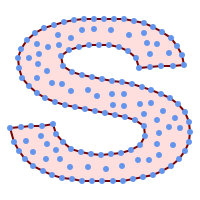


Concave Hull of a MultiPoint


```sql

SELECT ST_AsText( ST_ConcaveHull(
        'MULTIPOINT ((10 72), (53 76), (56 66), (63 58), (71 51), (81 48), (91 46), (101 45), (111 46), (121 47), (131 50), (140 55), (145 64), (144 74), (135 80), (125 83), (115 85), (105 87), (95 89), (85 91), (75 93), (65 95), (55 98), (45 102), (37 107), (29 114), (22 122), (19 132), (18 142), (21 151), (27 160), (35 167), (44 172), (54 175), (64 178), (74 180), (84 181), (94 181), (104 181), (114 181), (124 181), (134 179), (144 177), (153 173), (162 168), (171 162), (177 154), (182 145), (184 135), (139 132), (136 142), (128 149), (119 153), (109 155), (99 155), (89 155), (79 153), (69 150), (61 144), (63 134), (72 128), (82 125), (92 123), (102 121), (112 119), (122 118), (132 116), (142 113), (151 110), (161 106), (170 102), (178 96), (185 88), (189 78), (190 68), (189 58), (185 49), (179 41), (171 34), (162 29), (153 25), (143 23), (133 21), (123 19), (113 19), (102 19), (92 19), (82 19), (72 21), (62 22), (52 25), (43 29), (33 34), (25 41), (19 49), (14 58), (21 73), (31 74), (42 74), (173 134), (161 134), (150 133), (97 104), (52 117), (157 156), (94 171), (112 106), (169 73), (58 165), (149 40), (70 33), (147 157), (48 153), (140 96), (47 129), (173 55), (144 86), (159 67), (150 146), (38 136), (111 170), (124 94), (26 59), (60 41), (71 162), (41 64), (88 110), (122 34), (151 97), (157 56), (39 146), (88 33), (159 45), (47 56), (138 40), (129 165), (33 48), (106 31), (169 147), (37 122), (71 109), (163 89), (37 156), (82 170), (180 72), (29 142), (46 41), (59 155), (124 106), (157 80), (175 82), (56 50), (62 116), (113 95), (144 167))',
         0.1 ) );
---st_astext--
POLYGON ((18 142, 21 151, 27 160, 35 167, 44 172, 54 175, 64 178, 74 180, 84 181, 94 181, 104 181, 114 181, 124 181, 134 179, 144 177, 153 173, 162 168, 171 162, 177 154, 182 145, 184 135, 173 134, 161 134, 150 133, 139 132, 136 142, 128 149, 119 153, 109 155, 99 155, 89 155, 79 153, 69 150, 61 144, 63 134, 72 128, 82 125, 92 123, 102 121, 112 119, 122 118, 132 116, 142 113, 151 110, 161 106, 170 102, 178 96, 185 88, 189 78, 190 68, 189 58, 185 49, 179 41, 171 34, 162 29, 153 25, 143 23, 133 21, 123 19, 113 19, 102 19, 92 19, 82 19, 72 21, 62 22, 52 25, 43 29, 33 34, 25 41, 19 49, 14 58, 10 72, 21 73, 31 74, 42 74, 53 76, 56 66, 63 58, 71 51, 81 48, 91 46, 101 45, 111 46, 121 47, 131 50, 140 55, 145 64, 144 74, 135 80, 125 83, 115 85, 105 87, 95 89, 85 91, 75 93, 65 95, 55 98, 45 102, 37 107, 29 114, 22 122, 19 132, 18 142))

```


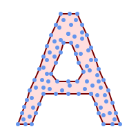


Concave Hull of a MultiPoint, allowing holes


```sql

SELECT ST_AsText( ST_ConcaveHull(
        'MULTIPOINT ((132 64), (114 64), (99 64), (81 64), (63 64), (57 49), (52 36), (46 20), (37 20), (26 20), (32 36), (39 55), (43 69), (50 84), (57 100), (63 118), (68 133), (74 149), (81 164), (88 180), (101 180), (112 180), (119 164), (126 149), (132 131), (139 113), (143 100), (150 84), (157 69), (163 51), (168 36), (174 20), (163 20), (150 20), (143 36), (139 49), (132 64), (99 151), (92 138), (88 124), (81 109), (74 93), (70 82), (83 82), (99 82), (112 82), (126 82), (121 96), (114 109), (110 122), (103 138), (99 151), (34 27), (43 31), (48 44), (46 58), (52 73), (63 73), (61 84), (72 71), (90 69), (101 76), (123 71), (141 62), (166 27), (150 33), (159 36), (146 44), (154 53), (152 62), (146 73), (134 76), (143 82), (141 91), (130 98), (126 104), (132 113), (128 127), (117 122), (112 133), (119 144), (108 147), (119 153), (110 171), (103 164), (92 171), (86 160), (88 142), (79 140), (72 124), (83 131), (79 118), (68 113), (63 102), (68 93), (35 45))',
         0.15, true ) );
---st_astext--
POLYGON ((43 69, 50 84, 57 100, 63 118, 68 133, 74 149, 81 164, 88 180, 101 180, 112 180, 119 164, 126 149, 132 131, 139 113, 143 100, 150 84, 157 69, 163 51, 168 36, 174 20, 163 20, 150 20, 143 36, 139 49, 132 64, 114 64, 99 64, 81 64, 63 64, 57 49, 52 36, 46 20, 37 20, 26 20, 32 36, 35 45, 39 55, 43 69), (88 124, 81 109, 74 93, 83 82, 99 82, 112 82, 121 96, 114 109, 110 122, 103 138, 92 138, 88 124))

```


<table>
<tbody>
<tr>
<td><p></p>
<p><code>polygon_hull</code></p></td>
<td><p></p>
<p><code>points_hull</code></p></td>
</tr>
</tbody>
</table>


Comparing a concave hull of a Polygon to the concave hull of the constituent points. The hull respects the boundary of the polygon, whereas the points-based hull does not.


```sql

WITH data(geom) AS (VALUES
   ('POLYGON ((10 90, 39 85, 61 79, 50 90, 80 80, 95 55, 25 60, 90 45, 70 16, 63 38, 60 10, 50 30, 43 27, 30 10, 20 20, 10 90))'::geometry)
)
SELECT  ST_ConcaveHull( geom,            0.1) AS polygon_hull,
        ST_ConcaveHull( ST_Points(geom), 0.1) AS points_hull
    FROM data;
```


Using with ST_Collect to compute the concave hull of a geometry set.


```

-- Compute estimate of infected area based on point observations
SELECT disease_type,
    ST_ConcaveHull( ST_Collect(obs_pnt), 0.3 ) AS geom
  FROM disease_obs
  GROUP BY disease_type;
```


## See Also


[ST_ConvexHull](#ST_ConvexHull), [ST_Collect](geometry-constructors.md#ST_Collect), [ST_AlphaShape](../sfcgal-functions-reference/sfcgal-processing-and-relationship-functions.md#ST_AlphaShape), [ST_OptimalAlphaShape](../sfcgal-functions-reference/sfcgal-processing-and-relationship-functions.md#ST_OptimalAlphaShape)
  <a id="ST_ConvexHull"></a>

# ST_ConvexHull

Computes the convex hull of a geometry.

## Synopsis


```sql
geometry ST_ConvexHull(geometry  geomA)
```


## Description


Computes the convex hull of a geometry. The convex hull is the smallest convex geometry that encloses all geometries in the input.


One can think of the convex hull as the geometry obtained by wrapping an rubber band around a set of geometries. This is different from a [concave hull](#ST_ConcaveHull) which is analogous to "shrink-wrapping" the geometries. A convex hull is often used to determine an affected area based on a set of point observations.


In the general case the convex hull is a Polygon. The convex hull of two or more collinear points is a two-point LineString. The convex hull of one or more identical points is a Point.


This is not an aggregate function. To compute the convex hull of a set of geometries, use [ST_Collect](geometry-constructors.md#ST_Collect) to aggregate them into a geometry collection (e.g. <code>ST_ConvexHull(ST_Collect(geom))</code>.


Performed by the GEOS module


 s2.1.1.3


 SQL-MM IEC 13249-3: 5.1.16


## Examples


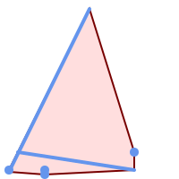


Convex Hull of a MultiLinestring and a MultiPoint


```sql

SELECT ST_AsText(ST_ConvexHull(
    ST_Collect(
        ST_GeomFromText('MULTILINESTRING((100 190,10 8),(150 10, 20 30))'),
            ST_GeomFromText('MULTIPOINT(50 5, 150 30, 50 10, 10 10)')
            )) );
---st_astext--
POLYGON((50 5,10 8,10 10,100 190,150 30,150 10,50 5))

```


Using with ST_Collect to compute the convex hulls of geometry sets.


```

--Get estimate of infected area based on point observations
SELECT d.disease_type,
    ST_ConvexHull(ST_Collect(d.geom)) As geom
    FROM disease_obs As d
    GROUP BY d.disease_type;
```


## See Also


[ST_Collect](geometry-constructors.md#ST_Collect), [ST_ConcaveHull](#ST_ConcaveHull), [ST_MinimumBoundingCircle](#ST_MinimumBoundingCircle)
  <a id="ST_DelaunayTriangles"></a>

# ST_DelaunayTriangles

Returns the Delaunay triangulation of the vertices of a geometry.

## Synopsis


```sql
geometry ST_DelaunayTriangles(geometry  g1, float  tolerance = 0.0, int4  flags = 0)
```


## Description


 Computes the [Delaunay triangulation](http://en.wikipedia.org/wiki/Delaunay_triangulation) of the vertices of the input geometry. The optional `tolerance` can be used to snap nearby input vertices together, which improves robustness in some situations. The result geometry is bounded by the convex hull of the input vertices. The result geometry representation is determined by the `flags` code:


-  <code>0</code> - a GEOMETRYCOLLECTION of triangular POLYGONs (default)
-  <code>1</code> - a MULTILINESTRING of the edges of the triangulation
-  <code>2</code> - A TIN of the triangulation


Performed by the GEOS module.


Availability: 2.1.0


## Examples


<table>
<tbody>
<tr>
<td><p></p>
<p>Original polygons</p>
<pre><code>
our original geometry
    ST_Union(ST_GeomFromText('POLYGON((175 150, 20 40,
            50 60, 125 100, 175 150))'),
        ST_Buffer(ST_GeomFromText('POINT(110 170)'), 20)
        )</code></pre></td>
</tr>
<tr>
<td><p></p>
<p>ST_DelaunayTriangles of 2 polygons: delaunay triangle polygons each triangle themed in different color</p>
<pre><code>

geometries overlaid multilinestring triangles

SELECT
    ST_DelaunayTriangles(
        ST_Union(ST_GeomFromText('POLYGON((175 150, 20 40,
            50 60, 125 100, 175 150))'),
        ST_Buffer(ST_GeomFromText('POINT(110 170)'), 20)
        ))
     As  dtriag;
                </code></pre></td>
</tr>
<tr>
<td><p></p>
<p>-- delaunay triangles as multilinestring</p>
<pre><code class="language-sql">SELECT
    ST_DelaunayTriangles(
        ST_Union(ST_GeomFromText('POLYGON((175 150, 20 40,
            50 60, 125 100, 175 150))'),
        ST_Buffer(ST_GeomFromText('POINT(110 170)'), 20)
        ),0.001,1)
     As  dtriag;</code></pre></td>
</tr>
<tr>
<td><p></p>
<p>-- delaunay triangles of 45 points as 55 triangle polygons</p>
<pre><code>

this produces a table of 42 points that form an L shape

SELECT (ST_DumpPoints(ST_GeomFromText(
'MULTIPOINT(14 14,34 14,54 14,74 14,94 14,114 14,134 14,
150 14,154 14,154 6,134 6,114 6,94 6,74 6,54 6,34 6,
14 6,10 6,8 6,7 7,6 8,6 10,6 30,6 50,6 70,6 90,6 110,6 130,
6 150,6 170,6 190,6 194,14 194,14 174,14 154,14 134,14 114,
14 94,14 74,14 54,14 34,14 14)'))).geom
    INTO TABLE l_shape;

output as individual polygon triangles

SELECT ST_AsText((ST_Dump(geom)).geom) As wkt
FROM ( SELECT ST_DelaunayTriangles(ST_Collect(geom)) As geom
FROM l_shape) As foo;


wkt

POLYGON((6 194,6 190,14 194,6 194))
POLYGON((14 194,6 190,14 174,14 194))
POLYGON((14 194,14 174,154 14,14 194))
POLYGON((154 14,14 174,14 154,154 14))
POLYGON((154 14,14 154,150 14,154 14))
POLYGON((154 14,150 14,154 6,154 14))</code></pre></td>
</tr>
</tbody>
</table>


Example using vertices with Z values.


```


3D multipoint

SELECT ST_AsText(ST_DelaunayTriangles(ST_GeomFromText(
         'MULTIPOINT Z(14 14 10, 150 14 100,34 6 25, 20 10 150)'))) As wkt;


wkt

GEOMETRYCOLLECTION Z (POLYGON Z ((14 14 10,20 10 150,34 6 25,14 14 10))
 ,POLYGON Z ((14 14 10,34 6 25,150 14 100,14 14 10)))
```


## See Also


[ST_VoronoiPolygons](#ST_VoronoiPolygons), [ST_TriangulatePolygon](#ST_TriangulatePolygon), [ST_ConstrainedDelaunayTriangles](../sfcgal-functions-reference/sfcgal-processing-and-relationship-functions.md#ST_ConstrainedDelaunayTriangles), [ST_VoronoiLines](#ST_VoronoiLines), [ST_ConvexHull](#ST_ConvexHull)
  <a id="ST_FilterByM"></a>

# ST_FilterByM

Removes vertices based on their M value

## Synopsis


```sql
geometry ST_FilterByM(geometry geom, double precision min, double precision max = null, boolean returnM = false)
```


## Description


Filters out vertex points based on their M-value. Returns a geometry with only vertex points that have a M-value larger or equal to the min value and smaller or equal to the max value. If max-value argument is left out only min value is considered. If fourth argument is left out the m-value will not be in the resulting geometry. If resulting geometry have too few vertex points left for its geometry type an empty geometry will be returned. In a geometry collection geometries without enough points will just be left out silently.


This function is mainly intended to be used in conjunction with ST_SetEffectiveArea. ST_EffectiveArea sets the effective area of a vertex in its m-value. With ST_FilterByM it then is possible to get a simplified version of the geometry without any calculations, just by filtering


!!! note

    There is a difference in what ST_SimplifyVW returns when not enough points meet the criteria compared to ST_FilterByM. ST_SimplifyVW returns the geometry with enough points while ST_FilterByM returns an empty geometry


!!! note

    Note that the returned geometry might be invalid


!!! note

    This function returns all dimensions, including the Z and M values


Availability: 2.5.0


## Examples


A linestring is filtered


```sql

SELECT ST_AsText(ST_FilterByM(geom,30)) simplified
FROM (SELECT  ST_SetEffectiveArea('LINESTRING(5 2, 3 8, 6 20, 7 25, 10 10)'::geometry) geom) As foo;

result

         simplified
----------------------------
 LINESTRING(5 2,7 25,10 10)

```


## See Also


[ST_SetEffectiveArea](#ST_SetEffectiveArea), [ST_SimplifyVW](#ST_SimplifyVW)
  <a id="ST_GeneratePoints"></a>

# ST_GeneratePoints

Generates a multipoint of random points contained in a Polygon or MultiPolygon.

## Synopsis


```sql
geometry ST_GeneratePoints(geometry g, integer npoints, integer seed = 0)
```


## Description


 ST_GeneratePoints generates a multipoint consisting of a given number of pseudo-random points which lie within the input area. The optional `seed` is used to regenerate a deterministic sequence of points, and must be greater than zero.


Availability: 2.3.0


Enhanced: 3.0.0, added seed parameter


## Examples


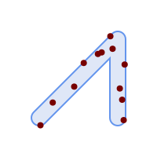


Generated a multipoint consisting of 12 Points overlaid on top of original polygon using a random seed value 1996


```sql
SELECT ST_GeneratePoints(geom, 12, 1996)
FROM (
    SELECT ST_Buffer(
        ST_GeomFromText(
        'LINESTRING(50 50,150 150,150 50)'),
        10, 'endcap=round join=round') AS geom
) AS s;
```


Given a table of polygons s, return 12 individual points per polygon. Results will be different each time you run.


```sql
SELECT s.id, dp.path[1] AS pt_id, dp.geom
FROM s, ST_DumpPoints(ST_GeneratePoints(s.geom,12)) AS dp;
```


## See Also


[ST_DumpPoints](geometry-accessors.md#ST_DumpPoints)
  <a id="ST_GeometricMedian"></a>

#
              ST_GeometricMedian


Returns the geometric median of a MultiPoint.

## Synopsis


```sql
geometry ST_GeometricMedian(geometry geom, float8 tolerance = NULL, int max_iter = 10000, boolean fail_if_not_converged = false)
```


## Description


 Computes the approximate geometric median of a MultiPoint geometry using the Weiszfeld algorithm. The geometric median is the point minimizing the sum of distances to the input points. It provides a centrality measure that is less sensitive to outlier points than the centroid (center of mass).


 The algorithm iterates until the distance change between successive iterations is less than the supplied `tolerance` parameter. If this condition has not been met after `max_iterations` iterations, the function produces an error and exits, unless `fail_if_not_converged` is set to <code>false</code> (the default).


 If a `tolerance` argument is not provided, the tolerance value is calculated based on the extent of the input geometry.


 If present, the input point M values are interpreted as their relative weights.


Availability: 2.3.0


Enhanced: 2.5.0 Added support for M as weight of points.


## Examples


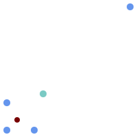


 Comparison of the geometric median (red) and centroid (turquoise) of a MultiPoint.


```sql

WITH test AS (
SELECT 'MULTIPOINT((10 10), (10 40), (40 10), (190 190))'::geometry geom)
SELECT
  ST_AsText(ST_Centroid(geom)) centroid,
  ST_AsText(ST_GeometricMedian(geom)) median
FROM test;

      centroid      |                 median
--------------------+----------------------------------------
   POINT(62.5 62.5) | POINT(25.01778421249728 25.01778421249728)
(1 row)

```


## See Also


[ST_Centroid](#ST_Centroid)
  <a id="ST_LineMerge"></a>

# ST_LineMerge

Return the lines formed by sewing together a MultiLineString.

## Synopsis


```sql
geometry ST_LineMerge(geometry  amultilinestring)
geometry ST_LineMerge(geometry  amultilinestring, boolean  directed)
```


## Description


Returns a LineString or MultiLineString formed by joining together the line elements of a MultiLineString. Lines are joined at their endpoints at 2-way intersections. Lines are not joined across intersections of 3-way or greater degree.


If **directed** is TRUE, then ST_LineMerge will not change point order within LineStrings, so lines with opposite directions will not be merged


!!! note

    Only use with MultiLineString/LineStrings. Other geometry types return an empty GeometryCollection


Performed by the GEOS module.


Enhanced: 3.3.0 accept a directed parameter.


Requires GEOS >= 3.11.0 to use the directed parameter.


Availability: 1.1.0


!!! warning

    This function strips the M dimension.


## Examples


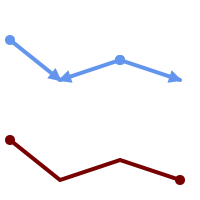


Merging lines with different orientation.


```sql
SELECT ST_AsText(ST_LineMerge(
'MULTILINESTRING((10 160, 60 120), (120 140, 60 120), (120 140, 180 120))'
		));
--------------------------------------------
 LINESTRING(10 160,60 120,120 140,180 120)
```


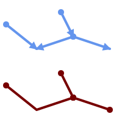


Lines are not merged across intersections with degree > 2.


```sql
SELECT ST_AsText(ST_LineMerge(
'MULTILINESTRING((10 160, 60 120), (120 140, 60 120), (120 140, 180 120), (100 180, 120 140))'
		));
--------------------------------------------
 MULTILINESTRING((10 160,60 120,120 140),(100 180,120 140),(120 140,180 120))
```


If merging is not possible due to non-touching lines, the original MultiLineString is returned.


```sql

SELECT ST_AsText(ST_LineMerge(
'MULTILINESTRING((-29 -27,-30 -29.7,-36 -31,-45 -33),(-45.2 -33.2,-46 -32))'
));
----------------
MULTILINESTRING((-45.2 -33.2,-46 -32),(-29 -27,-30 -29.7,-36 -31,-45 -33))
```


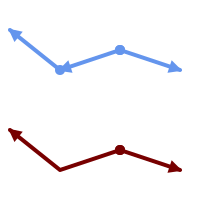


Lines with opposite directions are not merged if directed = TRUE.


```sql

SELECT ST_AsText(ST_LineMerge(
'MULTILINESTRING((60 30, 10 70), (120 50, 60 30), (120 50, 180 30))',
TRUE));
-------------------------------------------------------
 MULTILINESTRING((120 50,60 30,10 70),(120 50,180 30))
```


Example showing Z-dimension handling.


```sql

SELECT ST_AsText(ST_LineMerge(
      'MULTILINESTRING((-29 -27 11,-30 -29.7 10,-36 -31 5,-45 -33 6), (-29 -27 12,-30 -29.7 5), (-45 -33 1,-46 -32 11))'
        ));
--------------------------------------------------------------------------------------------------
LINESTRING Z (-30 -29.7 5,-29 -27 11,-30 -29.7 10,-36 -31 5,-45 -33 1,-46 -32 11)
```


## See Also


[ST_Segmentize](geometry-editors.md#ST_Segmentize), [ST_LineSubstring](linear-referencing.md#ST_LineSubstring)
  <a id="ST_MaximumInscribedCircle"></a>

# ST_MaximumInscribedCircle

Computes the largest circle contained within a geometry.

## Synopsis


```sql
(geometry, geometry, double precision) ST_MaximumInscribedCircle(geometry  geom)
```


## Description


Finds the largest circle that is contained within a (multi)polygon, or which does not overlap any lines and points. Returns a record with fields:


-  `center` - center point of the circle
-  `nearest` - a point on the geometry nearest to the center
-  `radius` - radius of the circle


For polygonal inputs, the circle is inscribed within the boundary rings, using the internal rings as boundaries. For linear and point inputs, the circle is inscribed within the convex hull of the input, using the input lines and points as further boundaries.


Availability: 3.1.0.


Requires GEOS >= 3.9.0.


## Examples


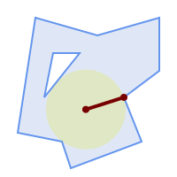


Maximum inscribed circle of a polygon. Center, nearest point, and radius are returned.


```sql
SELECT radius, ST_AsText(center) AS center, ST_AsText(nearest) AS nearest
    FROM ST_MaximumInscribedCircle(
        'POLYGON ((40 180, 110 160, 180 180, 180 120, 140 90, 160 40, 80 10, 70 40, 20 50, 40 180),
        (60 140, 50 90, 90 140, 60 140))');

     radius      |           center           |    nearest
-----------------+----------------------------+---------------
 45.165845650018 | POINT(96.953125 76.328125) | POINT(140 90)
```


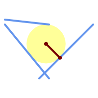


Maximum inscribed circle of a multi-linestring. Center, nearest point, and radius are returned.


## See Also


[ST_MinimumBoundingRadius](#ST_MinimumBoundingRadius), [ST_LargestEmptyCircle](#ST_LargestEmptyCircle)
  <a id="ST_LargestEmptyCircle"></a>

# ST_LargestEmptyCircle

Computes the largest circle not overlapping a geometry.

## Synopsis


```sql
(geometry, geometry, double precision) ST_LargestEmptyCircle(geometry  geom, double precision  tolerance=0.0, geometry  boundary=POINT EMPTY)
```


## Description


Finds the largest circle which does not overlap a set of point and line obstacles. (Polygonal geometries may be included as obstacles, but only their boundary lines are used.) The center of the circle is constrained to lie inside a polygonal boundary, which by default is the convex hull of the input geometry. The circle center is the point in the interior of the boundary which has the farthest distance from the obstacles. The circle itself is provided by the center point and a nearest point lying on an obstacle determining the circle radius.


The circle center is determined to a given accuracy specified by a distance tolerance, using an iterative algorithm. If the accuracy distance is not specified a reasonable default is used.


Returns a record with fields:


-  `center` - center point of the circle
-  `nearest` - a point on the geometry nearest to the center
-  `radius` - radius of the circle


To find the largest empty circle in the interior of a polygon, see [ST_MaximumInscribedCircle](#ST_MaximumInscribedCircle).


Availability: 3.4.0.


Requires GEOS >= 3.9.0.


## Examples


```sql
SELECT radius,
      center,
      nearest
  FROM ST_LargestEmptyCircle(
        'MULTILINESTRING (
          (10 100, 60 180, 130 150, 190 160),
          (20 50, 70 70, 90 20, 110 40),
          (160 30, 100 100, 180 100))');
```


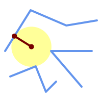


Largest Empty Circle within a set of lines.


```sql
SELECT radius,
       center,
       nearest
  FROM ST_LargestEmptyCircle(
         ST_Collect(
           'MULTIPOINT ((70 50), (60 130), (130 150), (80 90))'::geometry,
           'POLYGON ((90 190, 10 100, 60 10, 190 40, 120 100, 190 180, 90 190))'::geometry),
           0,
         'POLYGON ((90 190, 10 100, 60 10, 190 40, 120 100, 190 180, 90 190))'::geometry
       );
```


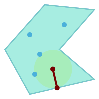


Largest Empty Circle within a set of points, constrained to lie in a polygon. The constraint polygon boundary must be included as an obstacle, as well as specified as the constraint for the circle center.


## See Also


[ST_MinimumBoundingRadius](#ST_MinimumBoundingRadius)
  <a id="ST_MinimumBoundingCircle"></a>

# ST_MinimumBoundingCircle

Returns the smallest circle polygon that contains a geometry.

## Synopsis


```sql
geometry ST_MinimumBoundingCircle(geometry  geomA, integer  num_segs_per_qt_circ=48)
```


## Description


Returns the smallest circle polygon that contains a geometry.


!!! note

    The bounding circle is approximated by a polygon with a default of 48 segments per quarter circle. Because the polygon is an approximation of the minimum bounding circle, some points in the input geometry may not be contained within the polygon. The approximation can be improved by increasing the number of segments. For applications where an approximation is not suitable [ST_MinimumBoundingRadius](#ST_MinimumBoundingRadius) may be used.


Use with [ST_Collect](geometry-constructors.md#ST_Collect) to get the minimum bounding circle of a set of geometries.


To compute two points lying on the minimum circle (the "maximum diameter") use [ST_LongestLine](measurement-functions.md#ST_LongestLine).


The ratio of the area of a polygon divided by the area of its Minimum Bounding Circle is referred to as the *Reock compactness score*.


Performed by the GEOS module.


Availability: 1.4.0


## Examples


```sql
SELECT d.disease_type,
    ST_MinimumBoundingCircle(ST_Collect(d.geom)) As geom
    FROM disease_obs As d
    GROUP BY d.disease_type;
```


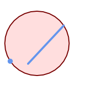


Minimum bounding circle of a point and linestring. Using 8 segs to approximate a quarter circle


```sql

SELECT ST_AsText(ST_MinimumBoundingCircle(
        ST_Collect(
            ST_GeomFromText('LINESTRING(55 75,125 150)'),
                ST_Point(20, 80)), 8
                )) As wktmbc;
wktmbc
-----------
POLYGON((135.59714732062 115,134.384753327498 102.690357210921,130.79416296937 90.8537670908995,124.963360620072 79.9451031602111,117.116420743937 70.3835792560632,107.554896839789 62.5366393799277,96.6462329091006 56.70583703063,84.8096427890789 53.115246672502,72.5000000000001 51.9028526793802,60.1903572109213 53.1152466725019,48.3537670908996 56.7058370306299,37.4451031602112 62.5366393799276,27.8835792560632 70.383579256063,20.0366393799278 79.9451031602109,14.20583703063 90.8537670908993,10.615246672502 102.690357210921,9.40285267938019 115,10.6152466725019 127.309642789079,14.2058370306299 139.1462329091,20.0366393799275 150.054896839789,27.883579256063 159.616420743937,
37.4451031602108 167.463360620072,48.3537670908992 173.29416296937,60.190357210921 176.884753327498,
72.4999999999998 178.09714732062,84.8096427890786 176.884753327498,96.6462329091003 173.29416296937,107.554896839789 167.463360620072,
117.116420743937 159.616420743937,124.963360620072 150.054896839789,130.79416296937 139.146232909101,134.384753327498 127.309642789079,135.59714732062 115))

```


## See Also


[ST_Collect](geometry-constructors.md#ST_Collect), [ST_MinimumBoundingRadius](#ST_MinimumBoundingRadius), [ST_LargestEmptyCircle](#ST_LargestEmptyCircle), [ST_LongestLine](measurement-functions.md#ST_LongestLine)
  <a id="ST_MinimumBoundingRadius"></a>

# ST_MinimumBoundingRadius

Returns the center point and radius of the smallest circle that contains a geometry.

## Synopsis


```sql
(geometry, double precision) ST_MinimumBoundingRadius(geometry geom)
```


## Description


Computes the center point and radius of the smallest circle that contains a geometry. Returns a record with fields:


-  `center` - center point of the circle
-  `radius` - radius of the circle


Use with [ST_Collect](geometry-constructors.md#ST_Collect) to get the minimum bounding circle of a set of geometries.


To compute two points lying on the minimum circle (the "maximum diameter") use [ST_LongestLine](measurement-functions.md#ST_LongestLine).


Availability - 2.3.0


## Examples


```sql
SELECT ST_AsText(center), radius FROM ST_MinimumBoundingRadius('POLYGON((26426 65078,26531 65242,26075 65136,26096 65427,26426 65078))');

                st_astext                 |      radius
------------------------------------------+------------------
 POINT(26284.8418027133 65267.1145090825) | 247.436045591407
```


## See Also


[ST_Collect](geometry-constructors.md#ST_Collect), [ST_MinimumBoundingCircle](#ST_MinimumBoundingCircle), [ST_LongestLine](measurement-functions.md#ST_LongestLine)
  <a id="ST_OrientedEnvelope"></a>

# ST_OrientedEnvelope

Returns a minimum-area rectangle containing a geometry.

## Synopsis


```sql
geometry ST_OrientedEnvelope(geometry
                        geom)
```


## Description


 Returns the minimum-area rotated rectangle enclosing a geometry. Note that more than one such rectangle may exist. May return a Point or LineString in the case of degenerate inputs.


 Availability: 2.5.0.


Requires GEOS >= 3.6.0.


## Examples


```sql

                SELECT ST_AsText(ST_OrientedEnvelope('MULTIPOINT ((0 0), (-1 -1), (3 2))'));

                st_astext
                ------------------------------------------------
                POLYGON((3 2,2.88 2.16,-1.12 -0.84,-1 -1,3 2))

```


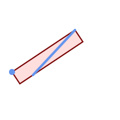


Oriented envelope of a point and linestring.


```sql

SELECT ST_AsText(ST_OrientedEnvelope(
        ST_Collect(
            ST_GeomFromText('LINESTRING(55 75,125 150)'),
                ST_Point(20, 80))
                )) As wktenv;
wktenv
-----------
POLYGON((19.9999999999997 79.9999999999999,33.0769230769229 60.3846153846152,138.076923076924 130.384615384616,125.000000000001 150.000000000001,19.9999999999997 79.9999999999999))
```


## See Also


 [ST_Envelope](geometry-accessors.md#ST_Envelope) [ST_MinimumBoundingCircle](#ST_MinimumBoundingCircle)
  <a id="ST_OffsetCurve"></a>

# ST_OffsetCurve

Returns an offset line at a given distance and side from an input line.

## Synopsis


```sql
geometry ST_OffsetCurve(geometry  line, float  signed_distance, text  style_parameters='')
```


## Description


 Return an offset line at a given distance and side from an input line. All points of the returned geometries are not further than the given distance from the input geometry. Useful for computing parallel lines about a center line.


 For positive distance the offset is on the left side of the input line and retains the same direction. For a negative distance it is on the right side and in the opposite direction.


 Units of distance are measured in units of the spatial reference system.


 Note that output may be a MULTILINESTRING or EMPTY for some jigsaw-shaped input geometries.


 The optional third parameter allows specifying a list of blank-separated key=value pairs to tweak operations as follows:

- 'quad_segs=#' : number of segments used to approximate a quarter circle (defaults to 8).
- 'join=round|mitre|bevel' : join style (defaults to "round"). 'miter' is also accepted as a synonym for 'mitre'.
- 'mitre_limit=#.#' : mitre ratio limit (only affects mitred join style). 'miter_limit' is also accepted as a synonym for 'mitre_limit'.


Performed by the GEOS module.


Behavior changed in GEOS 3.11 so offset curves now have the same direction as the input line, for both positive and negative offsets.


Availability: 2.0


Enhanced: 2.5 - added support for GEOMETRYCOLLECTION and MULTILINESTRING


!!! note

    This function ignores the Z dimension. It always gives a 2D result even when used on a 3D geometry.


## Examples


Compute an open buffer around roads


```sql

SELECT ST_Union(
 ST_OffsetCurve(f.geom,  f.width/2, 'quad_segs=4 join=round'),
 ST_OffsetCurve(f.geom, -f.width/2, 'quad_segs=4 join=round')
) as track
FROM someroadstable;


```


<table>
<tbody>
<tr>
<td><p></p>
<p>15, 'quad_segs=4 join=round' original line and its offset 15 units.</p>
<pre><code class="language-sql">
SELECT ST_AsText(ST_OffsetCurve(ST_GeomFromText(
'LINESTRING(164 16,144 16,124 16,104 16,84 16,64 16,
    44 16,24 16,20 16,18 16,17 17,
    16 18,16 20,16 40,16 60,16 80,16 100,
    16 120,16 140,16 160,16 180,16 195)'),
    15, 'quad_segs=4 join=round'));

output

LINESTRING(164 1,18 1,12.2597485145237 2.1418070123307,
    7.39339828220179 5.39339828220179,
    5.39339828220179 7.39339828220179,
    2.14180701233067 12.2597485145237,1 18,1 195)
                </code></pre></td>
<td><p></p>
<p>-15, 'quad_segs=4 join=round' original line and its offset -15 units</p>
<pre><code class="language-sql">
SELECT ST_AsText(ST_OffsetCurve(geom,
    -15, 'quad_segs=4 join=round')) As notsocurvy
    FROM ST_GeomFromText(
'LINESTRING(164 16,144 16,124 16,104 16,84 16,64 16,
    44 16,24 16,20 16,18 16,17 17,
    16 18,16 20,16 40,16 60,16 80,16 100,
    16 120,16 140,16 160,16 180,16 195)') As geom;

notsocurvy

LINESTRING(31 195,31 31,164 31)
                </code></pre></td>
</tr>
<tr>
<td><p></p>
<p>double-offset to get more curvy, note the first reverses direction, so -30 + 15 = -15</p>
<pre><code class="language-sql">
SELECT ST_AsText(ST_OffsetCurve(ST_OffsetCurve(geom,
    -30, 'quad_segs=4 join=round'), -15, 'quad_segs=4 join=round')) As morecurvy
    FROM ST_GeomFromText(
'LINESTRING(164 16,144 16,124 16,104 16,84 16,64 16,
    44 16,24 16,20 16,18 16,17 17,
    16 18,16 20,16 40,16 60,16 80,16 100,
    16 120,16 140,16 160,16 180,16 195)') As geom;

morecurvy

LINESTRING(164 31,46 31,40.2597485145236 32.1418070123307,
35.3933982822018 35.3933982822018,
32.1418070123307 40.2597485145237,31 46,31 195)
                </code></pre></td>
<td><p></p>
<p>double-offset to get more curvy,combined with regular offset 15 to get parallel lines. Overlaid with original.</p>
<pre><code class="language-sql">SELECT ST_AsText(ST_Collect(
    ST_OffsetCurve(geom, 15, 'quad_segs=4 join=round'),
    ST_OffsetCurve(ST_OffsetCurve(geom,
    -30, 'quad_segs=4 join=round'), -15, 'quad_segs=4 join=round')
    )
) As parallel_curves
    FROM ST_GeomFromText(
'LINESTRING(164 16,144 16,124 16,104 16,84 16,64 16,
    44 16,24 16,20 16,18 16,17 17,
    16 18,16 20,16 40,16 60,16 80,16 100,
    16 120,16 140,16 160,16 180,16 195)') As geom;

parallel curves

MULTILINESTRING((164 1,18 1,12.2597485145237 2.1418070123307,
7.39339828220179 5.39339828220179,5.39339828220179 7.39339828220179,
2.14180701233067 12.2597485145237,1 18,1 195),
(164 31,46 31,40.2597485145236 32.1418070123307,35.3933982822018 35.3933982822018,
32.1418070123307 40.2597485145237,31 46,31 195))
                </code></pre></td>
</tr>
<tr>
<td><p></p>
<p>15, 'quad_segs=4 join=bevel' shown with original line</p>
<pre><code class="language-sql">
SELECT ST_AsText(ST_OffsetCurve(ST_GeomFromText(
'LINESTRING(164 16,144 16,124 16,104 16,84 16,64 16,
    44 16,24 16,20 16,18 16,17 17,
    16 18,16 20,16 40,16 60,16 80,16 100,
    16 120,16 140,16 160,16 180,16 195)'),
        15, 'quad_segs=4 join=bevel'));

output

LINESTRING(164 1,18 1,7.39339828220179 5.39339828220179,
    5.39339828220179 7.39339828220179,1 18,1 195)
                </code></pre></td>
<td><p></p>
<p>15,-15 collected, join=mitre mitre_limit=2.1</p>
<pre><code class="language-sql">
SELECT ST_AsText(ST_Collect(
    ST_OffsetCurve(geom, 15, 'quad_segs=4 join=mitre mitre_limit=2.2'),
    ST_OffsetCurve(geom, -15, 'quad_segs=4 join=mitre mitre_limit=2.2')
    ) )
    FROM ST_GeomFromText(
'LINESTRING(164 16,144 16,124 16,104 16,84 16,64 16,
    44 16,24 16,20 16,18 16,17 17,
    16 18,16 20,16 40,16 60,16 80,16 100,
    16 120,16 140,16 160,16 180,16 195)') As geom;

output

MULTILINESTRING((164 1,11.7867965644036 1,1 11.7867965644036,1 195),
    (31 195,31 31,164 31))
                </code></pre></td>
</tr>
</tbody>
</table>


## See Also


[ST_Buffer](#ST_Buffer)
  <a id="ST_PointOnSurface"></a>

# ST_PointOnSurface

Computes a point guaranteed to lie in a polygon, or on a geometry.

## Synopsis


```sql
geometry ST_PointOnSurface(geometry
            g1)
```


## Description


Returns a `POINT` which is guaranteed to lie in the interior of a surface (`POLYGON`, `MULTIPOLYGON`, and `CURVEPOLYGON`). In PostGIS this function also works on line and point geometries.


 s3.2.14.2 // s3.2.18.2


 SQL-MM 3: 8.1.5, 9.5.6. The specifications define ST_PointOnSurface for surface geometries only. PostGIS extends the function to support all common geometry types. Other databases (Oracle, DB2, ArcSDE) seem to support this function only for surfaces. SQL Server 2008 supports all common geometry types.


## Examples


<table>
<tbody>
<tr>
<td><p></p>
<p>Point on surface of a <code>MULTIPOINT</code></p></td>
<td><p></p>
<p>Point on surface of a <code>LINESTRING</code></p></td>
</tr>
<tr>
<td><p></p>
<p>Point on surface of a <code>POLYGON</code></p></td>
<td><p></p>
<p>Point on surface of a <code>GEOMETRYCOLLECTION</code></p></td>
</tr>
</tbody>
</table>


```sql
SELECT ST_AsText(ST_PointOnSurface('POINT(0 5)'::geometry));
------------
 POINT(0 5)

SELECT ST_AsText(ST_PointOnSurface('LINESTRING(0 5, 0 10)'::geometry));
------------
 POINT(0 5)

SELECT ST_AsText(ST_PointOnSurface('POLYGON((0 0, 0 5, 5 5, 5 0, 0 0))'::geometry));
----------------
 POINT(2.5 2.5)

SELECT ST_AsEWKT(ST_PointOnSurface(ST_GeomFromEWKT('LINESTRING(0 5 1, 0 0 1, 0 10 2)')));
----------------
 POINT(0 0 1)
```


**Example:** The result of ST_PointOnSurface is guaranteed to lie within polygons, whereas the point computed by [ST_Centroid](#ST_Centroid) may be outside.


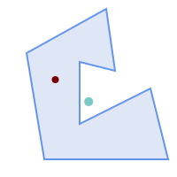


Red: point on surface; Green: centroid


```sql

SELECT ST_AsText(ST_PointOnSurface(geom)) AS pt_on_surf,
       ST_AsText(ST_Centroid(geom)) AS centroid
    FROM (SELECT 'POLYGON ((130 120, 120 190, 30 140, 50 20, 190 20,
                      170 100, 90 60, 90 130, 130 120))'::geometry AS geom) AS t;

   pt_on_surf    |                  centroid
-----------------+---------------------------------------------
 POINT(62.5 110) | POINT(100.18264840182648 85.11415525114155)
```


## See Also


[ST_Centroid](#ST_Centroid), [ST_MaximumInscribedCircle](#ST_MaximumInscribedCircle)
  <a id="ST_Polygonize"></a>

# ST_Polygonize

Computes a collection of polygons formed from the linework of a set of geometries.

## Synopsis


```sql
geometry ST_Polygonize(geometry set geomfield)
geometry ST_Polygonize(geometry[] geom_array)
```


## Description


Creates a GeometryCollection containing the polygons formed by the linework of a set of geometries. If the input linework does not form any polygons, an empty GeometryCollection is returned.


This function creates polygons covering all delimited areas. If the result is intended to form a valid polygonal geometry, use [ST_BuildArea](#ST_BuildArea) to prevent holes being filled.


!!! note

    The input linework must be correctly noded for this function to work properly. To ensure input is noded use [ST_Node](overlay-functions.md#ST_Node) on the input geometry before polygonizing.


!!! note

    GeometryCollections can be difficult to handle with external tools. Use [ST_Dump](geometry-accessors.md#ST_Dump) to convert the polygonized result into separate polygons.


Performed by the GEOS module.


Availability: 1.0.0RC1


## Examples


<table>
<tbody>
<tr>
<td><p></p>
<p>Input lines</p></td>
<td><p></p>
<p>Polygonized result</p></td>
</tr>
</tbody>
</table>


```sql
WITH data(geom) AS (VALUES
   ('LINESTRING (180 40, 30 20, 20 90)'::geometry)
  ,('LINESTRING (180 40, 160 160)'::geometry)
  ,('LINESTRING (80 60, 120 130, 150 80)'::geometry)
  ,('LINESTRING (80 60, 150 80)'::geometry)
  ,('LINESTRING (20 90, 70 70, 80 130)'::geometry)
  ,('LINESTRING (80 130, 160 160)'::geometry)
  ,('LINESTRING (20 90, 20 160, 70 190)'::geometry)
  ,('LINESTRING (70 190, 80 130)'::geometry)
  ,('LINESTRING (70 190, 160 160)'::geometry)
)
SELECT ST_AsText( ST_Polygonize( geom ))
    FROM data;

------------------------------------------------------------------------------------------
GEOMETRYCOLLECTION (POLYGON ((180 40, 30 20, 20 90, 70 70, 80 130, 160 160, 180 40), (150 80, 120 130, 80 60, 150 80)),
                    POLYGON ((20 90, 20 160, 70 190, 80 130, 70 70, 20 90)),
                    POLYGON ((160 160, 80 130, 70 190, 160 160)),
                    POLYGON ((80 60, 120 130, 150 80, 80 60)))
```


Polygonizing a table of linestrings:


```sql

SELECT ST_AsEWKT(ST_Polygonize(geom_4269)) As geomtextrep
FROM (SELECT geom_4269 FROM ma.suffolk_edges) As foo;

-------------------------------------
 SRID=4269;GEOMETRYCOLLECTION(POLYGON((-71.040878 42.285678,-71.040943 42.2856,-71.04096 42.285752,-71.040878 42.285678)),
 POLYGON((-71.17166 42.353675,-71.172026 42.354044,-71.17239 42.354358,-71.171794 42.354971,-71.170511 42.354855,
 -71.17112 42.354238,-71.17166 42.353675)))

--Use ST_Dump to dump out the polygonize geoms into individual polygons
SELECT ST_AsEWKT((ST_Dump(t.polycoll)).geom) AS geomtextrep
FROM (SELECT ST_Polygonize(geom_4269) AS polycoll
    FROM (SELECT geom_4269 FROM ma.suffolk_edges)
        As foo) AS t;

------------------------
 SRID=4269;POLYGON((-71.040878 42.285678,-71.040943 42.2856,-71.04096 42.285752,
-71.040878 42.285678))
 SRID=4269;POLYGON((-71.17166 42.353675,-71.172026 42.354044,-71.17239 42.354358
,-71.171794 42.354971,-71.170511 42.354855,-71.17112 42.354238,-71.17166 42.353675))
```


## See Also


 [ST_BuildArea](#ST_BuildArea), [ST_Dump](geometry-accessors.md#ST_Dump), [ST_Node](overlay-functions.md#ST_Node)
  <a id="ST_ReducePrecision"></a>

# ST_ReducePrecision

Returns a valid geometry with points rounded to a grid tolerance.

## Synopsis


```sql
geometry ST_ReducePrecision(geometry
            g, float8
            gridsize)
```


## Description


Returns a valid geometry with all points rounded to the provided grid tolerance, and features below the tolerance removed.


Unlike [ST_SnapToGrid](geometry-editors.md#ST_SnapToGrid) the returned geometry will be valid, with no ring self-intersections or collapsed components.


 Precision reduction can be used to:

-  match coordinate precision to the data accuracy
-  reduce the number of coordinates needed to represent a geometry
-  ensure valid geometry output to formats which use lower precision (e.g. text formats such as WKT, GeoJSON or KML when the number of output decimal places is limited).
-  export valid geometry to systems which use lower or limited precision (e.g. SDE, Oracle tolerance value)


Availability: 3.1.0.


Requires GEOS >= 3.9.0.


## Examples


```sql
SELECT ST_AsText(ST_ReducePrecision('POINT(1.412 19.323)', 0.1));
    st_astext
-----------------
 POINT(1.4 19.3)

SELECT ST_AsText(ST_ReducePrecision('POINT(1.412 19.323)', 1.0));
  st_astext
-------------
 POINT(1 19)

SELECT ST_AsText(ST_ReducePrecision('POINT(1.412 19.323)', 10));
  st_astext
-------------
 POINT(0 20)
```


Precision reduction can reduce number of vertices


```sql
SELECT ST_AsText(ST_ReducePrecision('LINESTRING (10 10, 19.6 30.1, 20 30, 20.3 30, 40 40)', 1));
  st_astext
-------------
 LINESTRING (10 10, 20 30, 40 40)
```


Precision reduction splits polygons if needed to ensure validity


```sql
SELECT ST_AsText(ST_ReducePrecision('POLYGON ((10 10, 60 60.1, 70 30, 40 40, 50 10, 10 10))', 10));
  st_astext
-------------
 MULTIPOLYGON (((60 60, 70 30, 40 40, 60 60)), ((40 40, 50 10, 10 10, 40 40)))
```


## See Also


[ST_SnapToGrid](geometry-editors.md#ST_SnapToGrid), [ST_Simplify](#ST_Simplify), [ST_SimplifyVW](#ST_SimplifyVW)
  <a id="ST_SharedPaths"></a>

# ST_SharedPaths

Returns a collection containing paths shared by the two input linestrings/multilinestrings.

## Synopsis


```sql
geometry ST_SharedPaths(geometry lineal1, geometry lineal2)
```


## Description


Returns a collection containing paths shared by the two input geometries. Those going in the same direction are in the first element of the collection, those going in the opposite direction are in the second element. The paths themselves are given in the direction of the first geometry.


Performed by the GEOS module.


Availability: 2.0.0


## Examples: Finding shared paths


<table>
<tbody>
<tr>
<td><p></p>
<p>A multilinestring and a linestring</p></td>
</tr>
<tr>
<td><p></p>
<p>The shared path of multilinestring and linestring overlaid with original geometries.</p>
<pre><code class="language-sql">
 SELECT ST_AsText(
  ST_SharedPaths(
    ST_GeomFromText('MULTILINESTRING((26 125,26 200,126 200,126 125,26 125),
       (51 150,101 150,76 175,51 150))'),
    ST_GeomFromText('LINESTRING(151 100,126 156.25,126 125,90 161, 76 175)')
    )
  ) As wkt

                                wkt
-------------------------------------------------------------
GEOMETRYCOLLECTION(MULTILINESTRING((126 156.25,126 125),
 (101 150,90 161),(90 161,76 175)),MULTILINESTRING EMPTY)
              </code></pre></td>
</tr>
<tr>
<td><pre><code>

same example but linestring orientation flipped

SELECT ST_AsText(
  ST_SharedPaths(
   ST_GeomFromText('LINESTRING(76 175,90 161,126 125,126 156.25,151 100)'),
   ST_GeomFromText('MULTILINESTRING((26 125,26 200,126 200,126 125,26 125),
       (51 150,101 150,76 175,51 150))')
    )
  ) As wkt

                                wkt
-------------------------------------------------------------
GEOMETRYCOLLECTION(MULTILINESTRING EMPTY,
MULTILINESTRING((76 175,90 161),(90 161,101 150),(126 125,126 156.25)))
              </code></pre></td>
</tr>
</tbody>
</table>


## See Also


 [ST_Dump](geometry-accessors.md#ST_Dump), [ST_GeometryN](geometry-accessors.md#ST_GeometryN), [ST_NumGeometries](geometry-accessors.md#ST_NumGeometries)
  <a id="ST_Simplify"></a>

# ST_Simplify

Returns a simplified representation of a geometry, using the Douglas-Peucker algorithm.

## Synopsis


```sql
geometry ST_Simplify(geometry geom, float tolerance)
geometry ST_Simplify(geometry geom, float tolerance, boolean preserveCollapsed)
```


## Description


Computes a simplified representation of a geometry using the [Douglas-Peucker algorithm](https://en.wikipedia.org/wiki/Ramer%E2%80%93Douglas%E2%80%93Peucker_algorithm). The simplification `tolerance` is a distance value, in the units of the input SRS. Simplification removes vertices which are within the tolerance distance of the simplified linework. The result may not be valid even if the input is.


 The function can be called with any kind of geometry (including GeometryCollections), but only line and polygon elements are simplified. Endpoints of linear geometry are preserved.


The `preserveCollapsed` flag retains small geometries that would otherwise be removed at the given tolerance. For example, if a 1m long line is simplified with a 10m tolerance, when `preserveCollapsed` is true the line will not disappear. This flag is useful for rendering purposes, to prevent very small features disappearing from a map.


!!! note

    The returned geometry may lose its simplicity (see [ST_IsSimple](geometry-accessors.md#ST_IsSimple)), topology may not be preserved, and polygonal results may be invalid (see [ST_IsValid](geometry-validation.md#ST_IsValid)). Use [ST_SimplifyPreserveTopology](#ST_SimplifyPreserveTopology) to preserve topology and ensure validity.


!!! note

    This function does not preserve boundaries shared between polygons. Use [ST_CoverageSimplify](coverages.md#ST_CoverageSimplify) if this is required.


Availability: 1.2.2


## Examples


A circle simplified too much becomes a triangle, medium an octagon,


```sql
SELECT ST_Npoints(geom) AS np_before,
       ST_NPoints(ST_Simplify(geom, 0.1)) AS np01_notbadcircle,
       ST_NPoints(ST_Simplify(geom, 0.5)) AS np05_notquitecircle,
       ST_NPoints(ST_Simplify(geom, 1)) AS np1_octagon,
       ST_NPoints(ST_Simplify(geom, 10)) AS np10_triangle,
       (ST_Simplify(geom, 100) is null) AS  np100_geometrygoesaway
  FROM (SELECT ST_Buffer('POINT(1 3)', 10,12) As geom) AS t;

 np_before | np01_notbadcircle | np05_notquitecircle | np1_octagon | np10_triangle | np100_geometrygoesaway
-----------+-------------------+---------------------+-------------+---------------+------------------------
        49 |                33 |                  17 |           9 |             4 | t
```


Simplifying a set of lines. Lines may intersect after simplification.


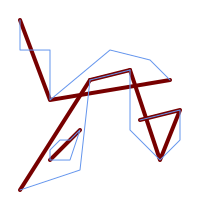


```sql
SELECT ST_Simplify(
  'MULTILINESTRING ((20 180, 20 150, 50 150, 50 100, 110 150, 150 140, 170 120), (20 10, 80 30, 90 120), (90 120, 130 130), (130 130, 130 70, 160 40, 180 60, 180 90, 140 80), (50 40, 70 40, 80 70, 70 60, 60 60, 50 50, 50 40))',
    40);
```


Simplifying a MultiPolygon. Polygonal results may be invalid.


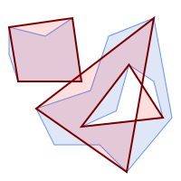


```sql
SELECT ST_Simplify(
  'MULTIPOLYGON (((90 110, 80 180, 50 160, 10 170, 10 140, 20 110, 90 110)), ((40 80, 100 100, 120 160, 170 180, 190 70, 140 10, 110 40, 60 40, 40 80), (180 70, 170 110, 142.5 128.5, 128.5 77.5, 90 60, 180 70)))',
    40);
```


## See Also


 [ST_IsSimple](geometry-accessors.md#ST_IsSimple), [ST_SimplifyPreserveTopology](#ST_SimplifyPreserveTopology), [ST_SimplifyVW](#ST_SimplifyVW), [ST_CoverageSimplify](coverages.md#ST_CoverageSimplify), Topology [TP_ST_Simplify](../topology/topology-processing.md#TP_ST_Simplify)
  <a id="ST_SimplifyPreserveTopology"></a>

# ST_SimplifyPreserveTopology

Returns a simplified and valid representation of a geometry, using the Douglas-Peucker algorithm.

## Synopsis


```sql
geometry ST_SimplifyPreserveTopology(geometry geom, float tolerance)
```


## Description


Computes a simplified representation of a geometry using a variant of the [Douglas-Peucker algorithm](https://en.wikipedia.org/wiki/Ramer%E2%80%93Douglas%E2%80%93Peucker_algorithm) which limits simplification to ensure the result has the same topology as the input. The simplification `tolerance` is a distance value, in the units of the input SRS. Simplification removes vertices which are within the tolerance distance of the simplified linework, as long as topology is preserved. The result will be valid and simple if the input is.


 The function can be called with any kind of geometry (including GeometryCollections), but only line and polygon elements are simplified. For polygonal inputs, the result will have the same number of rings (shells and holes), and the rings will not cross. Ring endpoints may be simplified. For linear inputs, the result will have the same number of lines, and lines will not intersect if they did not do so in the original geometry. Endpoints of linear geometry are preserved.


!!! note

    This function does not preserve boundaries shared between polygons. Use [ST_CoverageSimplify](coverages.md#ST_CoverageSimplify) if this is required.


Performed by the GEOS module.


Availability: 1.3.3


## Examples


For the same example as [ST_Simplify](#ST_Simplify), ST_SimplifyPreserveTopology prevents oversimplification. The circle can at most become a square.


```sql

SELECT  ST_Npoints(geom) AS np_before,
        ST_NPoints(ST_SimplifyPreserveTopology(geom, 0.1)) AS np01_notbadcircle,
        ST_NPoints(ST_SimplifyPreserveTopology(geom, 0.5)) AS np05_notquitecircle,
        ST_NPoints(ST_SimplifyPreserveTopology(geom, 1))   AS np1_octagon,
        ST_NPoints(ST_SimplifyPreserveTopology(geom, 10))  AS np10_square,
        ST_NPoints(ST_SimplifyPreserveTopology(geom, 100)) AS np100_stillsquare
FROM (SELECT ST_Buffer('POINT(1 3)', 10,12) AS geom) AS t;

 np_before | np01_notbadcircle | np05_notquitecircle | np1_octagon | np10_square | np100_stillsquare
-----------+-------------------+---------------------+-------------+-------------+-------------------
        49 |                33 |                  17 |           9 |           5 |                 5
```


Simplifying a set of lines, preserving topology of non-intersecting lines.


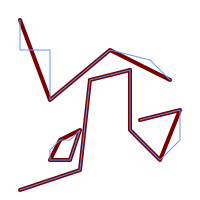


```sql
SELECT ST_SimplifyPreserveTopology(
  'MULTILINESTRING ((20 180, 20 150, 50 150, 50 100, 110 150, 150 140, 170 120), (20 10, 80 30, 90 120), (90 120, 130 130), (130 130, 130 70, 160 40, 180 60, 180 90, 140 80), (50 40, 70 40, 80 70, 70 60, 60 60, 50 50, 50 40))',
    40);
```


Simplifying a MultiPolygon, preserving topology of shells and holes.


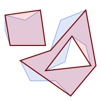


```sql
SELECT ST_SimplifyPreserveTopology(
  'MULTIPOLYGON (((90 110, 80 180, 50 160, 10 170, 10 140, 20 110, 90 110)), ((40 80, 100 100, 120 160, 170 180, 190 70, 140 10, 110 40, 60 40, 40 80), (180 70, 170 110, 142.5 128.5, 128.5 77.5, 90 60, 180 70)))',
    40);
```


## See Also


[ST_Simplify](#ST_Simplify), [ST_SimplifyVW](#ST_SimplifyVW), [ST_CoverageSimplify](coverages.md#ST_CoverageSimplify)
  <a id="ST_SimplifyPolygonHull"></a>

# ST_SimplifyPolygonHull

Computes a simplified topology-preserving outer or inner hull of a polygonal geometry.

## Synopsis


```sql
geometry ST_SimplifyPolygonHull(geometry  param_geom, float  vertex_fraction, boolean  is_outer = true)
```


## Description


Computes a simplified topology-preserving outer or inner hull of a polygonal geometry. An outer hull completely covers the input geometry. An inner hull is completely covered by the input geometry. The result is a polygonal geometry formed by a subset of the input vertices. MultiPolygons and holes are handled and produce a result with the same structure as the input.


The reduction in vertex count is controlled by the `vertex_fraction` parameter, which is a number in the range 0 to 1. Lower values produce simpler results, with smaller vertex count and less concaveness. For both outer and inner hulls a vertex fraction of 1.0 produces the original geometry. For outer hulls a value of 0.0 produces the convex hull (for a single polygon); for inner hulls it produces a triangle.


 The simplification process operates by progressively removing concave corners that contain the least amount of area, until the vertex count target is reached. It prevents edges from crossing, so the result is always a valid polygonal geometry.


To get better results with geometries that contain relatively long line segments, it might be necessary to "segmentize" the input, as shown below.


Performed by the GEOS module.


Availability: 3.3.0.


Requires GEOS >= 3.11.0.


## Examples


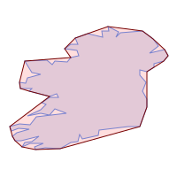


Outer hull of a Polygon


```sql
SELECT ST_SimplifyPolygonHull(
  'POLYGON ((131 158, 136 163, 161 165, 173 156, 179 148, 169 140, 186 144, 190 137, 185 131, 174 128, 174 124, 166 119, 158 121, 158 115, 165 107, 161 97, 166 88, 166 79, 158 57, 145 57, 112 53, 111 47, 93 43, 90 48, 88 40, 80 39, 68 32, 51 33, 40 31, 39 34, 49 38, 34 38, 25 34, 28 39, 36 40, 44 46, 24 41, 17 41, 14 46, 19 50, 33 54, 21 55, 13 52, 11 57, 22 60, 34 59, 41 68, 75 72, 62 77, 56 70, 46 72, 31 69, 46 76, 52 82, 47 84, 56 90, 66 90, 64 94, 56 91, 33 97, 36 100, 23 100, 22 107, 29 106, 31 112, 46 116, 36 118, 28 131, 53 132, 59 127, 62 131, 76 130, 80 135, 89 137, 87 143, 73 145, 80 150, 88 150, 85 157, 99 162, 116 158, 115 165, 123 165, 122 170, 134 164, 131 158))',
    0.3);
```


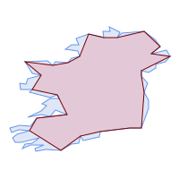


Inner hull of a Polygon


```sql
SELECT ST_SimplifyPolygonHull(
  'POLYGON ((131 158, 136 163, 161 165, 173 156, 179 148, 169 140, 186 144, 190 137, 185 131, 174 128, 174 124, 166 119, 158 121, 158 115, 165 107, 161 97, 166 88, 166 79, 158 57, 145 57, 112 53, 111 47, 93 43, 90 48, 88 40, 80 39, 68 32, 51 33, 40 31, 39 34, 49 38, 34 38, 25 34, 28 39, 36 40, 44 46, 24 41, 17 41, 14 46, 19 50, 33 54, 21 55, 13 52, 11 57, 22 60, 34 59, 41 68, 75 72, 62 77, 56 70, 46 72, 31 69, 46 76, 52 82, 47 84, 56 90, 66 90, 64 94, 56 91, 33 97, 36 100, 23 100, 22 107, 29 106, 31 112, 46 116, 36 118, 28 131, 53 132, 59 127, 62 131, 76 130, 80 135, 89 137, 87 143, 73 145, 80 150, 88 150, 85 157, 99 162, 116 158, 115 165, 123 165, 122 170, 134 164, 131 158))',
    0.3, false);
```


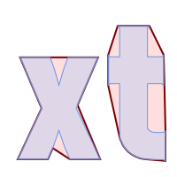


Outer hull simplification of a MultiPolygon, with segmentization


```sql
SELECT ST_SimplifyPolygonHull(
  ST_Segmentize(ST_Letters('xt'), 2.0),
    0.1);
```


## See Also


[ST_ConvexHull](#ST_ConvexHull), [ST_SimplifyVW](#ST_SimplifyVW), [ST_ConcaveHull](#ST_ConcaveHull), [ST_Segmentize](geometry-editors.md#ST_Segmentize)
  <a id="ST_SimplifyVW"></a>

# ST_SimplifyVW

Returns a simplified representation of a geometry, using the Visvalingam-Whyatt algorithm

## Synopsis


```sql
geometry ST_SimplifyVW(geometry geom, float tolerance)
```


## Description


 Returns a simplified representation of a geometry using the [Visvalingam-Whyatt algorithm](https://en.wikipedia.org/wiki/Visvalingam%E2%80%93Whyatt_algorithm). The simplification `tolerance` is an area value, in the units of the input SRS. Simplification removes vertices which form "corners" with area less than the tolerance. The result may not be valid even if the input is.


 The function can be called with any kind of geometry (including GeometryCollections), but only line and polygon elements are simplified. Endpoints of linear geometry are preserved.


!!! note

    The returned geometry may lose its simplicity (see [ST_IsSimple](geometry-accessors.md#ST_IsSimple)), topology may not be preserved, and polygonal results may be invalid (see [ST_IsValid](geometry-validation.md#ST_IsValid)). Use [ST_SimplifyPreserveTopology](#ST_SimplifyPreserveTopology) to preserve topology and ensure validity. [ST_CoverageSimplify](coverages.md#ST_CoverageSimplify) also preserves topology and validity.


!!! note

    This function does not preserve boundaries shared between polygons. Use [ST_CoverageSimplify](coverages.md#ST_CoverageSimplify) if this is required.


!!! note

    This function handles 3D and the third dimension will affect the result.


Availability: 2.2.0


## Examples


A LineString is simplified with a minimum-area tolerance of 30.


```sql

SELECT ST_AsText(ST_SimplifyVW(geom,30)) simplified
  FROM (SELECT 'LINESTRING(5 2, 3 8, 6 20, 7 25, 10 10)'::geometry AS geom) AS t;

 simplified
------------------------------
LINESTRING(5 2,7 25,10 10)
```


Simplifying a line.


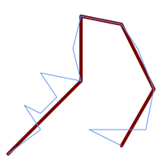


```sql
SELECT ST_SimplifyVW(
  'LINESTRING (10 10, 50 40, 30 70, 50 60, 70 80, 50 110, 100 100, 90 140, 100 180, 150 170, 170 140, 190 90, 180 40, 110 40, 150 20)',
    1600);
```


Simplifying a polygon.


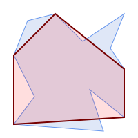


```sql
SELECT ST_SimplifyVW(
  'MULTIPOLYGON (((90 110, 80 180, 50 160, 10 170, 10 140, 20 110, 90 110)), ((40 80, 100 100, 120 160, 170 180, 190 70, 140 10, 110 40, 60 40, 40 80), (180 70, 170 110, 142.5 128.5, 128.5 77.5, 90 60, 180 70)))',
    40);
```


## See Also


[ST_SetEffectiveArea](#ST_SetEffectiveArea), [ST_Simplify](#ST_Simplify), [ST_SimplifyPreserveTopology](#ST_SimplifyPreserveTopology), [ST_CoverageSimplify](coverages.md#ST_CoverageSimplify), Topology [TP_ST_Simplify](../topology/topology-processing.md#TP_ST_Simplify)
  <a id="ST_SetEffectiveArea"></a>

# ST_SetEffectiveArea

Sets the effective area for each vertex, using the Visvalingam-Whyatt algorithm.

## Synopsis


```sql
geometry ST_SetEffectiveArea(geometry geom, float threshold = 0, integer set_area = 1)
```


## Description


 Sets the effective area for each vertex, using the Visvalingam-Whyatt algorithm. The effective area is stored as the M-value of the vertex. If the optional "threshold" parameter is used, a simplified geometry will be returned, containing only vertices with an effective area greater than or equal to the threshold value.

 This function can be used for server-side simplification when a threshold is specified. Another option is to use a threshold value of zero. In this case, the full geometry will be returned with effective areas as M-values, which can be used by the client to simplify very quickly.

 Will actually do something only with (multi)lines and (multi)polygons but you can safely call it with any kind of geometry. Since simplification occurs on a object-by-object basis you can also feed a GeometryCollection to this function.


!!! note

    Note that returned geometry might lose its simplicity (see [ST_IsSimple](geometry-accessors.md#ST_IsSimple))


!!! note

    Note topology may not be preserved and may result in invalid geometries. Use (see [ST_SimplifyPreserveTopology](#ST_SimplifyPreserveTopology)) to preserve topology.


!!! note

    The output geometry will lose all previous information in the M-values


!!! note

    This function handles 3D and the third dimension will affect the effective area


Availability: 2.2.0


## Examples


 Calculating the effective area of a LineString. Because we use a threshold value of zero, all vertices in the input geometry are returned.


```


select ST_AsText(ST_SetEffectiveArea(geom)) all_pts, ST_AsText(ST_SetEffectiveArea(geom,30) ) thrshld_30
FROM (SELECT  'LINESTRING(5 2, 3 8, 6 20, 7 25, 10 10)'::geometry geom) As foo;
-result
 all_pts | thrshld_30
-----------+-------------------+
LINESTRING M (5 2 3.40282346638529e+38,3 8 29,6 20 1.5,7 25 49.5,10 10 3.40282346638529e+38) | LINESTRING M (5 2 3.40282346638529e+38,7 25 49.5,10 10 3.40282346638529e+38)


```


## See Also


[ST_SimplifyVW](#ST_SimplifyVW)
  <a id="ST_TriangulatePolygon"></a>

# ST_TriangulatePolygon

Computes the constrained Delaunay triangulation of polygons

## Synopsis


```sql
geometry ST_TriangulatePolygon(geometry geom)
```


## Description


Computes the constrained Delaunay triangulation of polygons. Holes and Multipolygons are supported.


 The "constrained Delaunay triangulation" of a polygon is a set of triangles formed from the vertices of the polygon, and covering it exactly, with the maximum total interior angle over all possible triangulations. It provides the "best quality" triangulation of the polygon.


Availability: 3.3.0.


Requires GEOS >= 3.11.0.


## Example


Triangulation of a square.


```sql

SELECT ST_AsText(
    ST_TriangulatePolygon('POLYGON((0 0, 0 1, 1 1, 1 0, 0 0))'));

                                 st_astext
---------------------------------------------------------------------------
 GEOMETRYCOLLECTION(POLYGON((0 0,0 1,1 1,0 0)),POLYGON((1 1,1 0,0 0,1 1)))

```


## Example


Triangulation of the letter P.


```sql
SELECT ST_AsText(ST_TriangulatePolygon(
    'POLYGON ((26 17, 31 19, 34 21, 37 24, 38 29, 39 43, 39 161, 38 172, 36 176, 34 179, 30 181, 25 183, 10 185, 10 190, 100 190, 121 189, 139 187, 154 182, 167 177, 177 169, 184 161, 189 152, 190 141, 188 128, 186 123, 184 117, 180 113, 176 108, 170 104, 164 101, 151 96, 136 92, 119 89, 100 89, 86 89, 73 89, 73 39, 74 32, 75 27, 77 23, 79 20, 83 18, 89 17, 106 15, 106 10, 10 10, 10 15, 26 17), (152 147, 151 152, 149 157, 146 162, 142 166, 137 169, 132 172, 126 175, 118 177, 109 179, 99 180, 89 180, 80 179, 76 178, 74 176, 73 171, 73 100, 85 99, 91 99, 102 99, 112 100, 121 102, 128 104, 134 107, 139 110, 143 114, 147 118, 149 123, 151 128, 153 141, 152 147))'
    ));
```


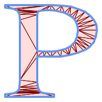


Polygon Triangulation


## Same example as ST_Tesselate


```sql
SELECT ST_TriangulatePolygon(
                'POLYGON (( 10 190, 10 70, 80 70, 80 130, 50 160, 120 160, 120 190, 10 190 ))'::geometry
                );
```


ST_AsText output


```
GEOMETRYCOLLECTION(POLYGON((50 160,120 190,120 160,50 160))
    ,POLYGON((10 70,80 130,80 70,10 70))
    ,POLYGON((50 160,10 70,10 190,50 160))
    ,POLYGON((120 190,50 160,10 190,120 190))
    ,POLYGON((80 130,10 70,50 160,80 130)))
```


<table>
<tbody>
<tr>
<td><p></p>
<p>Original polygon</p></td>
<td><p></p>
<p>Triangulated Polygon</p></td>
</tr>
</tbody>
</table>


## See Also


[ST_ConstrainedDelaunayTriangles](../sfcgal-functions-reference/sfcgal-processing-and-relationship-functions.md#ST_ConstrainedDelaunayTriangles), [ST_DelaunayTriangles](#ST_DelaunayTriangles), [ST_Tesselate](../sfcgal-functions-reference/sfcgal-processing-and-relationship-functions.md#ST_Tesselate)
  <a id="ST_VoronoiLines"></a>

# ST_VoronoiLines

Returns the boundaries of the Voronoi diagram of the vertices of a geometry.

## Synopsis


```sql
geometry ST_VoronoiLines(geometry geom, float8 tolerance = 0.0, geometry extend_to = NULL)
```


## Description


 Computes a two-dimensional [Voronoi diagram](https://en.wikipedia.org/wiki/Voronoi_diagram) from the vertices of the supplied geometry and returns the boundaries between cells in the diagram as a MultiLineString. Returns null if input geometry is null. Returns an empty geometry collection if the input geometry contains only one vertex. Returns an empty geometry collection if the `extend_to` envelope has zero area.


 Optional parameters:

-  `tolerance`: The distance within which vertices will be considered equivalent. Robustness of the algorithm can be improved by supplying a nonzero tolerance distance. (default = 0.0)
-  `extend_to`: If present, the diagram is extended to cover the envelope of the supplied geometry, unless smaller than the default envelope (default = NULL, default envelope is the bounding box of the input expanded by about 50%).


Performed by the GEOS module.


Availability: 2.3.0


## Examples


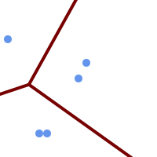


Voronoi diagram lines, with tolerance of 30 units


```sql

SELECT ST_VoronoiLines(
            'MULTIPOINT (50 30, 60 30, 100 100,10 150, 110 120)'::geometry,
            30) AS geom;
```


```
ST_AsText output
MULTILINESTRING((135.555555555556 270,36.8181818181818 92.2727272727273),(36.8181818181818 92.2727272727273,-110 43.3333333333333),(230 -45.7142857142858,36.8181818181818 92.2727272727273))
```


## See Also


 [ST_DelaunayTriangles](#ST_DelaunayTriangles), [ST_VoronoiPolygons](#ST_VoronoiPolygons)
  <a id="ST_VoronoiPolygons"></a>

# ST_VoronoiPolygons

Returns the cells of the Voronoi diagram of the vertices of a geometry.

## Synopsis


```sql
geometry ST_VoronoiPolygons(geometry geom, float8 tolerance = 0.0, geometry extend_to = NULL)
```


## Description


 Computes a two-dimensional [Voronoi diagram](https://en.wikipedia.org/wiki/Voronoi_diagram) from the vertices of the supplied geometry. The result is a GEOMETRYCOLLECTION of POLYGONs that covers an envelope larger than the extent of the input vertices. Returns null if input geometry is null. Returns an empty geometry collection if the input geometry contains only one vertex. Returns an empty geometry collection if the `extend_to` envelope has zero area.


 Optional parameters:

-  `tolerance`: The distance within which vertices will be considered equivalent. Robustness of the algorithm can be improved by supplying a nonzero tolerance distance. (default = 0.0)
-  `extend_to`: If present, the diagram is extended to cover the envelope of the supplied geometry, unless smaller than the default envelope (default = NULL, default envelope is the bounding box of the input expanded by about 50%).


Performed by the GEOS module.


Availability: 2.3.0


## Examples


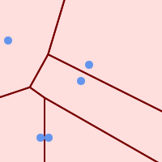


Points overlaid on top of Voronoi diagram


```sql

SELECT ST_VoronoiPolygons(
                'MULTIPOINT (50 30, 60 30, 100 100,10 150, 110 120)'::geometry
            ) AS geom;
```


```
ST_AsText output
GEOMETRYCOLLECTION(POLYGON((-110 43.3333333333333,-110 270,100.5 270,59.3478260869565 132.826086956522,36.8181818181818 92.2727272727273,-110 43.3333333333333)),
POLYGON((55 -90,-110 -90,-110 43.3333333333333,36.8181818181818 92.2727272727273,55 79.2857142857143,55 -90)),
POLYGON((230 47.5,230 -20.7142857142857,55 79.2857142857143,36.8181818181818 92.2727272727273,59.3478260869565 132.826086956522,230 47.5)),POLYGON((230 -20.7142857142857,230 -90,55 -90,55 79.2857142857143,230 -20.7142857142857)),
POLYGON((100.5 270,230 270,230 47.5,59.3478260869565 132.826086956522,100.5 270)))
```


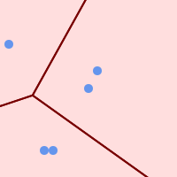


Voronoi diagram, with tolerance of 30 units


```sql

SELECT ST_VoronoiPolygons(
            'MULTIPOINT (50 30, 60 30, 100 100,10 150, 110 120)'::geometry,
            30) AS geom;
```


```
ST_AsText output
GEOMETRYCOLLECTION(POLYGON((-110 43.3333333333333,-110 270,100.5 270,59.3478260869565 132.826086956522,36.8181818181818 92.2727272727273,-110 43.3333333333333)),
POLYGON((230 47.5,230 -45.7142857142858,36.8181818181818 92.2727272727273,59.3478260869565 132.826086956522,230 47.5)),POLYGON((230 -45.7142857142858,230 -90,-110 -90,-110 43.3333333333333,36.8181818181818 92.2727272727273,230 -45.7142857142858)),
POLYGON((100.5 270,230 270,230 47.5,59.3478260869565 132.826086956522,100.5 270)))
```


## See Also


 [ST_DelaunayTriangles](#ST_DelaunayTriangles), [ST_VoronoiLines](#ST_VoronoiLines)
