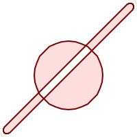
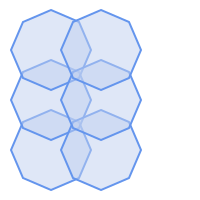
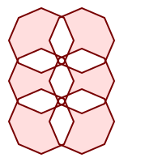
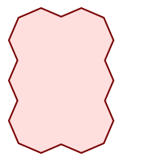

<a id="Geometry_Validation"></a>

## Geometry Validation
  <a id="ST_IsValid"></a>

# ST_IsValid

Tests if a geometry is well-formed in 2D.

## Synopsis


```sql
boolean ST_IsValid(geometry  g)
boolean ST_IsValid(geometry  g, integer  flags)
```


## Description


 Tests if an ST_Geometry value is well-formed and valid in 2D according to the OGC rules. For geometries with 3 and 4 dimensions, the validity is still only tested in 2 dimensions. For geometries that are invalid, a PostgreSQL NOTICE is emitted providing details of why it is not valid.


 For the version with the `flags` parameter, supported values are documented in [ST_IsValidDetail](#ST_IsValidDetail) This version does not print a NOTICE explaining invalidity.


For more information on the definition of geometry validity, refer to [Geometry Validation](../data-management/geometry-validation.md#OGC_Validity)


!!! note

    SQL-MM defines the result of ST_IsValid(NULL) to be 0, while PostGIS returns NULL.


Performed by the GEOS module.


The version accepting flags is available starting with 2.0.0.


 SQL-MM 3: 5.1.9


!!! note

    Neither OGC-SFS nor SQL-MM specifications include a flag argument for ST_IsValid. The flag is a PostGIS extension.


## Examples


```sql
SELECT ST_IsValid(ST_GeomFromText('LINESTRING(0 0, 1 1)')) As good_line,
	ST_IsValid(ST_GeomFromText('POLYGON((0 0, 1 1, 1 2, 1 1, 0 0))')) As bad_poly
--results
NOTICE:  Self-intersection at or near point 0 0
 good_line | bad_poly
-----------+----------
 t         | f
```


## See Also


 [ST_IsSimple](geometry-accessors.md#ST_IsSimple), [ST_IsValidReason](#ST_IsValidReason), [ST_IsValidDetail](#ST_IsValidDetail),
  <a id="ST_IsValidDetail"></a>

# ST_IsValidDetail

Returns a `valid_detail` row stating if a geometry is valid or if not a reason and a location.

## Synopsis


```sql
valid_detail ST_IsValidDetail(geometry  geom, integer  flags)
```


## Description


Returns a `valid_detail` row, containing a boolean (`valid`) stating if a geometry is valid, a varchar (`reason`) stating a reason why it is invalid and a geometry (`location`) pointing out where it is invalid.


Useful to improve on the combination of [ST_IsValid](#ST_IsValid) and [ST_IsValidReason](#ST_IsValidReason) to generate a detailed report of invalid geometries.


 The optional `flags` parameter is a bitfield. It can have the following values:

-  0: Use usual OGC SFS validity semantics.
-  1: Consider certain kinds of self-touching rings (inverted shells and exverted holes) as valid. This is also known as "the ESRI flag", since this is the validity model used by those tools. Note that this is invalid under the OGC model.


Performed by the GEOS module.


Availability: 2.0.0


## Examples


```


--First 3 Rejects from a successful quintuplet experiment
SELECT gid, reason(ST_IsValidDetail(geom)), ST_AsText(location(ST_IsValidDetail(geom))) as location
FROM
(SELECT ST_MakePolygon(ST_ExteriorRing(e.buff), array_agg(f.line)) As geom, gid
FROM (SELECT ST_Buffer(ST_Point(x1*10,y1), z1) As buff, x1*10 + y1*100 + z1*1000 As gid
	FROM generate_series(-4,6) x1
	CROSS JOIN generate_series(2,5) y1
	CROSS JOIN generate_series(1,8) z1
	WHERE x1 > y1*0.5 AND z1 < x1*y1) As e
	INNER JOIN (SELECT ST_Translate(ST_ExteriorRing(ST_Buffer(ST_Point(x1*10,y1), z1)),y1*1, z1*2) As line
	FROM generate_series(-3,6) x1
	CROSS JOIN generate_series(2,5) y1
	CROSS JOIN generate_series(1,10) z1
	WHERE x1 > y1*0.75 AND z1 < x1*y1) As f
ON (ST_Area(e.buff) > 78 AND ST_Contains(e.buff, f.line))
GROUP BY gid, e.buff) As quintuplet_experiment
WHERE ST_IsValid(geom) = false
ORDER BY gid
LIMIT 3;

 gid  |      reason       |  location
------+-------------------+-------------
 5330 | Self-intersection | POINT(32 5)
 5340 | Self-intersection | POINT(42 5)
 5350 | Self-intersection | POINT(52 5)

 --simple example
SELECT * FROM ST_IsValidDetail('LINESTRING(220227 150406,2220227 150407,222020 150410)');

 valid | reason | location
-------+--------+----------
 t     |        |
```


## See Also


 [ST_IsValid](#ST_IsValid), [ST_IsValidReason](#ST_IsValidReason)
  <a id="ST_IsValidReason"></a>

# ST_IsValidReason

Returns text stating if a geometry is valid, or a reason for invalidity.

## Synopsis


```sql
text ST_IsValidReason(geometry  geomA)
text ST_IsValidReason(geometry  geomA, integer  flags)
```


## Description


Returns text stating if a geometry is valid, or if invalid a reason why.


Useful in combination with [ST_IsValid](#ST_IsValid) to generate a detailed report of invalid geometries and reasons.


 Allowed `flags` are documented in [ST_IsValidDetail](#ST_IsValidDetail).


Performed by the GEOS module.


Availability: 1.4


Availability: 2.0 version taking flags.


## Examples


```
-- invalid bow-tie polygon
SELECT ST_IsValidReason(
    'POLYGON ((100 200, 100 100, 200 200,
     200 100, 100 200))'::geometry) as validity_info;
validity_info
--------------------------
Self-intersection[150 150]

```


```


--First 3 Rejects from a successful quintuplet experiment
SELECT gid, ST_IsValidReason(geom) as validity_info
FROM
(SELECT ST_MakePolygon(ST_ExteriorRing(e.buff), array_agg(f.line)) As geom, gid
FROM (SELECT ST_Buffer(ST_Point(x1*10,y1), z1) As buff, x1*10 + y1*100 + z1*1000 As gid
	FROM generate_series(-4,6) x1
	CROSS JOIN generate_series(2,5) y1
	CROSS JOIN generate_series(1,8) z1
	WHERE x1 > y1*0.5 AND z1 < x1*y1) As e
	INNER JOIN (SELECT ST_Translate(ST_ExteriorRing(ST_Buffer(ST_Point(x1*10,y1), z1)),y1*1, z1*2) As line
	FROM generate_series(-3,6) x1
	CROSS JOIN generate_series(2,5) y1
	CROSS JOIN generate_series(1,10) z1
	WHERE x1 > y1*0.75 AND z1 < x1*y1) As f
ON (ST_Area(e.buff) > 78 AND ST_Contains(e.buff, f.line))
GROUP BY gid, e.buff) As quintuplet_experiment
WHERE ST_IsValid(geom) = false
ORDER BY gid
LIMIT 3;

 gid  |      validity_info
------+--------------------------
 5330 | Self-intersection [32 5]
 5340 | Self-intersection [42 5]
 5350 | Self-intersection [52 5]

 --simple example
SELECT ST_IsValidReason('LINESTRING(220227 150406,2220227 150407,222020 150410)');

 st_isvalidreason
------------------
 Valid Geometry
```


## See Also


[ST_IsValid](#ST_IsValid), [ST_Summary](geometry-accessors.md#ST_Summary)
  <a id="ST_MakeValid"></a>

# ST_MakeValid

Attempts to make an invalid geometry valid without losing vertices.

## Synopsis


```sql
geometry ST_MakeValid(geometry input)
geometry ST_MakeValid(geometry input, text params)
```


## Description


 The function attempts to create a valid representation of a given invalid geometry without losing any of the input vertices. Valid geometries are returned unchanged.


 Supported inputs are: POINTS, MULTIPOINTS, LINESTRINGS, MULTILINESTRINGS, POLYGONS, MULTIPOLYGONS and GEOMETRYCOLLECTIONS containing any mix of them.


 In case of full or partial dimensional collapses, the output geometry may be a collection of lower-to-equal dimension geometries, or a geometry of lower dimension.


 Single polygons may become multi-geometries in case of self-intersections.


 The `params` argument can be used to supply an options string to select the method to use for building valid geometry. The options string is in the format "method=linework|structure keepcollapsed=true|false". If no "params" argument is provided, the "linework" algorithm will be used as the default.


The "method" key has two values.


- "linework" is the original algorithm, and builds valid geometries by first extracting all lines, noding that linework together, then building a value output from the linework.
- "structure" is an algorithm that distinguishes between interior and exterior rings, building new geometry by unioning exterior rings, and then differencing all interior rings.


The "keepcollapsed" key is only valid for the "structure" algorithm, and takes a value of "true" or "false". When set to "false", geometry components that collapse to a lower dimensionality, for example a one-point linestring would be dropped.


Performed by the GEOS module.


Availability: 2.0.0


Enhanced: 2.0.1, speed improvements


Enhanced: 2.1.0, added support for GEOMETRYCOLLECTION and MULTIPOINT.


Enhanced: 3.1.0, added removal of Coordinates with NaN values.


Enhanced: 3.2.0, added algorithm options, 'linework' and 'structure' which requires GEOS >= 3.10.0.


## Examples


|    before_geom: MULTIPOLYGON of 2 overlapping polygons          after_geom: MULTIPOLYGON of 4 non-overlapping polygons           after_geom_structure: MULTIPOLYGON of 1 non-overlapping polygon     ```sql SELECT f.geom AS before_geom, ST_MakeValid(f.geom) AS after_geom, ST_MakeValid(f.geom, 'method=structure') AS after_geom_structure FROM (SELECT 'MULTIPOLYGON(((186 194,187 194,188 195,189 195,190 195, 191 195,192 195,193 194,194 194,194 193,195 192,195 191, 195 190,195 189,195 188,194 187,194 186,14 6,13 6,12 5,11 5, 10 5,9 5,8 5,7 6,6 6,6 7,5 8,5 9,5 10,5 11,5 12,6 13,6 14,186 194)), ((150 90,149 80,146 71,142 62,135 55,128 48,119 44,110 41,100 40, 90 41,81 44,72 48,65 55,58 62,54 71,51 80,50 90,51 100, 54 109,58 118,65 125,72 132,81 136,90 139,100 140,110 139, 119 136,128 132,135 125,142 118,146 109,149 100,150 90)))'::geometry AS geom) AS f; ``` |
|   before_geom: MULTIPOLYGON of 6 overlapping polygons        after_geom: MULTIPOLYGON of 14 Non-overlapping polygons        after_geom_structure: MULTIPOLYGON of 1 Non-overlapping polygon    ```sql SELECT c.geom AS before_geom,                     ST_MakeValid(c.geom) AS after_geom,                     ST_MakeValid(c.geom, 'method=structure') AS after_geom_structure 	FROM (SELECT 'MULTIPOLYGON(((91 50,79 22,51 10,23 22,11 50,23 78,51 90,79 78,91 50)), 		  ((91 100,79 72,51 60,23 72,11 100,23 128,51 140,79 128,91 100)), 		  ((91 150,79 122,51 110,23 122,11 150,23 178,51 190,79 178,91 150)), 		  ((141 50,129 22,101 10,73 22,61 50,73 78,101 90,129 78,141 50)), 		  ((141 100,129 72,101 60,73 72,61 100,73 128,101 140,129 128,141 100)), 		  ((141 150,129 122,101 110,73 122,61 150,73 178,101 190,129 178,141 150)))'::geometry AS geom) AS c; ``` |


## Examples


```sql
SELECT ST_AsText(ST_MakeValid(
    'LINESTRING(0 0, 0 0)',
    'method=structure keepcollapsed=true'
    ));

 st_astext
------------
 POINT(0 0)


SELECT ST_AsText(ST_MakeValid(
    'LINESTRING(0 0, 0 0)',
    'method=structure keepcollapsed=false'
    ));

    st_astext
------------------
 LINESTRING EMPTY
```


## See Also


 [ST_IsValid](#ST_IsValid), [ST_Collect](geometry-constructors.md#ST_Collect), [ST_CollectionExtract](geometry-editors.md#ST_CollectionExtract)
