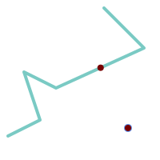
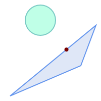
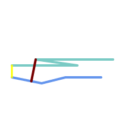
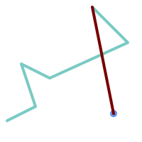
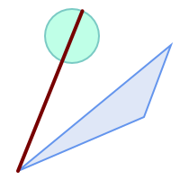
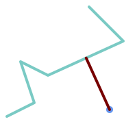
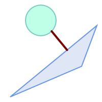

<a id="Measurement_Functions"></a>

## Measurement Functions
  <a id="ST_Area"></a>

# ST_Area

Returns the area of a polygonal geometry.

## Synopsis


```sql
float ST_Area(geometry g1)
float ST_Area(geography geog, boolean use_spheroid = true)
```


## Description


Returns the area of a polygonal geometry. For geometry types a 2D Cartesian (planar) area is computed, with units specified by the SRID. For geography types by default area is determined on a spheroid with units in square meters. To compute the area using the faster but less accurate spherical model use `ST_Area(geog,false)`.


Enhanced: 2.0.0 - support for 2D polyhedral surfaces was introduced.


Enhanced: 2.2.0 - measurement on spheroid performed with GeographicLib for improved accuracy and robustness. Requires PROJ >= 4.9.0 to take advantage of the new feature.


Changed: 3.0.0 - does not depend on SFCGAL anymore.


 SQL-MM 3: 8.1.2, 9.5.3


!!! note

    For polyhedral surfaces, only supports 2D polyhedral surfaces (not 2.5D). For 2.5D, may give a non-zero answer, but only for the faces that sit completely in XY plane.


## Examples


Return area in square feet for a plot of Massachusetts land and multiply by conversion to get square meters. Note this is in square feet because EPSG:2249 is Massachusetts State Plane Feet


```

select ST_Area(geom) sqft,
    ST_Area(geom) * 0.3048 ^ 2 sqm
from (
         select 'SRID=2249;POLYGON((743238 2967416,743238 2967450,
				 743265 2967450,743265.625 2967416,743238 2967416))' :: geometry geom
     ) subquery;
┌─────────┬─────────────┐
│  sqft   │     sqm     │
├─────────┼─────────────┤
│ 928.625 │ 86.27208552 │
└─────────┴─────────────┘
```


Return area square feet and transform to Massachusetts state plane meters (EPSG:26986) to get square meters. Note this is in square feet because 2249 is Massachusetts State Plane Feet and transformed area is in square meters since EPSG:26986 is state plane Massachusetts meters


```
select ST_Area(geom) sqft,
    ST_Area(ST_Transform(geom, 26986)) As sqm
from (
         select
             'SRID=2249;POLYGON((743238 2967416,743238 2967450,
             743265 2967450,743265.625 2967416,743238 2967416))' :: geometry geom
     ) subquery;
┌─────────┬─────────────────┐
│  sqft   │       sqm       │
├─────────┼─────────────────┤
│ 928.625 │ 86.272430607008 │
└─────────┴─────────────────┘
```


Return area square feet and square meters using geography data type. Note that we transform to our geometry to geography (before you can do that make sure your geometry is in WGS 84 long lat 4326). Geography always measures in meters. This is just for demonstration to compare. Normally your table will be stored in geography data type already.


```


select ST_Area(geog) / 0.3048 ^ 2 sqft_spheroid,
    ST_Area(geog, false) / 0.3048 ^ 2 sqft_sphere,
    ST_Area(geog) sqm_spheroid
from (
         select ST_Transform(
                    'SRID=2249;POLYGON((743238 2967416,743238 2967450,743265 2967450,743265.625 2967416,743238 2967416))'::geometry,
                    4326
             ) :: geography geog
     ) as subquery;
┌──────────────────┬──────────────────┬──────────────────┐
│  sqft_spheroid   │   sqft_sphere    │   sqm_spheroid   │
├──────────────────┼──────────────────┼──────────────────┤
│ 928.684405784452 │ 927.049336105925 │ 86.2776044979692 │
└──────────────────┴──────────────────┴──────────────────┘
```


If your data is in geography already:


```

select ST_Area(geog) / 0.3048 ^ 2 sqft,
    ST_Area(the_geog) sqm
from somegeogtable;
```


## See Also


[ST_3DArea](../sfcgal-functions-reference/sfcgal-accessors-and-setters.md#ST_3DArea), [ST_GeomFromText](geometry-input.md#ST_GeomFromText), [ST_GeographyFromText](geometry-input.md#ST_GeographyFromText), [ST_SetSRID](spatial-reference-system-functions.md#ST_SetSRID), [ST_Transform](spatial-reference-system-functions.md#ST_Transform)
  <a id="ST_Azimuth"></a>

# ST_Azimuth

Returns the north-based azimuth of a line between two points.

## Synopsis


```sql
float ST_Azimuth(geometry origin, geometry target)
float ST_Azimuth(geography origin, geography target)
```


## Description


Returns the azimuth in radians of the target point from the origin point, or NULL if the two points are coincident. The azimuth angle is a positive clockwise angle referenced from the positive Y axis (geometry) or the North meridian (geography): North = 0; Northeast = π/4; East = π/2; Southeast = 3π/4; South = π; Southwest 5π/4; West = 3π/2; Northwest = 7π/4.


For the geography type, the azimuth solution is known as the [inverse geodesic problem](https://en.wikipedia.org/wiki/Geodesics_on_an_ellipsoid).


The azimuth is a mathematical concept defined as the angle between a reference vector and a point, with angular units in radians. The result value in radians can be converted to degrees using the PostgreSQL function `degrees()`.


Azimuth can be used in conjunction with [ST_Translate](affine-transformations.md#ST_Translate) to shift an object along its perpendicular axis. See the `upgis_lineshift()` function in the [PostGIS wiki](http://trac.osgeo.org/postgis/wiki/UsersWikiplpgsqlfunctions) for an implementation of this.


Availability: 1.1.0


Enhanced: 2.0.0 support for geography was introduced.


Enhanced: 2.2.0 measurement on spheroid performed with GeographicLib for improved accuracy and robustness. Requires PROJ >= 4.9.0 to take advantage of the new feature.


## Examples


Geometry Azimuth in degrees


```sql

SELECT degrees(ST_Azimuth( ST_Point(25, 45),  ST_Point(75, 100))) AS degA_B,
       degrees(ST_Azimuth( ST_Point(75, 100), ST_Point(25, 45) )) AS degB_A;

      dega_b       |     degb_a
------------------+------------------
 42.2736890060937 | 222.273689006094
```


<table>
<tbody>
<tr>
<td><p></p>
<p>Blue: origin Point(25,45); Green: target Point(75, 100); Yellow: Y axis or North; Red: azimuth angle.</p></td>
<td><p></p>
<p>Blue: origin Point(75, 100); Green: target Point(25, 45); Yellow: Y axis or North; Red: azimuth angle.</p></td>
</tr>
</tbody>
</table>


## See Also


[ST_Angle](#ST_Angle), [ST_Point](geometry-constructors.md#ST_Point), [ST_Translate](affine-transformations.md#ST_Translate), [ST_Project](geometry-editors.md#ST_Project), [PostgreSQL Math Functions](http://www.postgresql.org/docs/current/interactive/functions-math.html)
  <a id="ST_Angle"></a>

# ST_Angle

Returns the angle between two vectors defined by 3 or 4 points, or 2 lines.

## Synopsis


```sql
float ST_Angle(geometry point1, geometry point2, geometry point3, geometry point4)
float ST_Angle(geometry line1, geometry line2)
```


## Description


 Computes the clockwise angle between two vectors.


**Variant 1:** computes the angle enclosed by the points P1-P2-P3. If a 4th point provided computes the angle points P1-P2 and P3-P4


**Variant 2:** computes the angle between two vectors S1-E1 and S2-E2, defined by the start and end points of the input lines


The result is a positive angle between 0 and 2π radians. The radian result can be converted to degrees using the PostgreSQL function `degrees()`.


Note that `ST_Angle(P1,P2,P3) = ST_Angle(P2,P1,P2,P3)`.


Availability: 2.5.0


## Examples


Angle between three points


```sql

SELECT degrees( ST_Angle('POINT(0 0)', 'POINT(10 10)', 'POINT(20 0)') );

 degrees
---------
     270
```


Angle between vectors defined by four points


```sql

SELECT degrees( ST_Angle('POINT (10 10)', 'POINT (0 0)', 'POINT(90 90)', 'POINT (100 80)') );

      degrees
-------------------
 269.9999999999999
```


Angle between vectors defined by the start and end points of lines


```sql

SELECT degrees( ST_Angle('LINESTRING(0 0, 0.3 0.7, 1 1)', 'LINESTRING(0 0, 0.2 0.5, 1 0)') );

      degrees
--------------
           45
```


## See Also


[ST_Azimuth](#ST_Azimuth)
  <a id="ST_ClosestPoint"></a>

# ST_ClosestPoint

Returns the 2D point on g1 that is closest to g2. This is the first point of the shortest line from one geometry to the other.

## Synopsis


```sql
geometry ST_ClosestPoint(geometry
			geom1, geometry
			geom2)
geography ST_ClosestPoint(geography
              geom1, geography
              geom2, boolean
              use_spheroid = true)
```


## Description


Returns the 2-dimensional point on `geom1` that is closest to `geom2`. This is the first point of the shortest line between the geometries (as computed by [ST_ShortestLine](#ST_ShortestLine)).


!!! note

    If you have a 3D Geometry, you may prefer to use [ST_3DClosestPoint](#ST_3DClosestPoint).


Enhanced: 3.4.0 - Support for geography.


Availability: 1.5.0


## Examples





The closest point for a Point and a LineString is the point itself. The closest point for a LineString and a Point is a point on the line.


```sql

SELECT ST_AsText( ST_ClosestPoint(pt,line)) AS cp_pt_line,
       ST_AsText( ST_ClosestPoint(line,pt)) AS cp_line_pt
    FROM (SELECT 'POINT (160 40)'::geometry AS pt,
                 'LINESTRING (10 30, 50 50, 30 110, 70 90, 180 140, 130 190)'::geometry AS line ) AS t;

   cp_pt_line   |                cp_line_pt
----------------+------------------------------------------
 POINT(160 40)  | POINT(125.75342465753425 115.34246575342466)
```





The closest point on polygon A to polygon B


```sql

SELECT ST_AsText( ST_ClosestPoint(
		'POLYGON ((190 150, 20 10, 160 70, 190 150))',
		ST_Buffer('POINT(80 160)', 30)	)) As ptwkt;
------------------------------------------
 POINT(131.59149149528952 101.89887534906197)
```


## See Also


[ST_3DClosestPoint](#ST_3DClosestPoint), [ST_Distance](#ST_Distance), [ST_LongestLine](#ST_LongestLine), [ST_ShortestLine](#ST_ShortestLine), [ST_MaxDistance](#ST_MaxDistance)
  <a id="ST_3DClosestPoint"></a>

# ST_3DClosestPoint

Returns the 3D point on g1 that is closest to g2. This is the first point of the 3D shortest line.

## Synopsis


```sql
geometry ST_3DClosestPoint(geometry
				g1, geometry
				g2)
```


## Description


Returns the 3-dimensional point on g1 that is closest to g2. This is the first point of the 3D shortest line. The 3D length of the 3D shortest line is the 3D distance.


Availability: 2.0.0


Changed: 2.2.0 - if 2 2D geometries are input, a 2D point is returned (instead of old behavior assuming 0 for missing Z). In case of 2D and 3D, Z is no longer assumed to be 0 for missing Z.


## Examples


<table>
<tbody>
<tr>
<td><p>linestring and point -- both 3d and 2d closest point</p>
<pre><code class="language-sql">
SELECT ST_AsEWKT(ST_3DClosestPoint(line,pt)) AS cp3d_line_pt,
		ST_AsEWKT(ST_ClosestPoint(line,pt)) As cp2d_line_pt
	FROM (SELECT 'POINT(100 100 30)'::geometry As pt,
			'LINESTRING (20 80 20, 98 190 1, 110 180 3, 50 75 1000)'::geometry As line
		) As foo;


 cp3d_line_pt						|               cp2d_line_pt
-----------------------------------------------------------+------------------------------------------
 POINT(54.6993798867619 128.935022917228 11.5475869506606) | POINT(73.0769230769231 115.384615384615)
					</code></pre></td>
</tr>
<tr>
<td><p>linestring and multipoint -- both 3d and 2d closest point</p>
<pre><code class="language-sql">SELECT ST_AsEWKT(ST_3DClosestPoint(line,pt)) AS cp3d_line_pt,
		ST_AsEWKT(ST_ClosestPoint(line,pt)) As cp2d_line_pt
	FROM (SELECT 'MULTIPOINT(100 100 30, 50 74 1000)'::geometry As pt,
			'LINESTRING (20 80 20, 98 190 1, 110 180 3, 50 75 900)'::geometry As line
		) As foo;


                       cp3d_line_pt                        | cp2d_line_pt
-----------------------------------------------------------+--------------
 POINT(54.6993798867619 128.935022917228 11.5475869506606) | POINT(50 75)
					</code></pre></td>
</tr>
<tr>
<td><p>Multilinestring and polygon both 3d and 2d closest point</p>
<pre><code class="language-sql">SELECT ST_AsEWKT(ST_3DClosestPoint(poly, mline)) As cp3d,
    ST_AsEWKT(ST_ClosestPoint(poly, mline)) As cp2d
        FROM (SELECT  ST_GeomFromEWKT('POLYGON((175 150 5, 20 40 5, 35 45 5, 50 60 5, 100 100 5, 175 150 5))') As poly,
                ST_GeomFromEWKT('MULTILINESTRING((175 155 2, 20 40 20, 50 60 -2, 125 100 1, 175 155 1),
                (1 10 2, 5 20 1))') As mline ) As foo;
                   cp3d                    |     cp2d
-------------------------------------------+--------------
 POINT(39.993580415989 54.1889925532825 5) | POINT(20 40)
             </code></pre></td>
</tr>
</tbody>
</table>


## See Also


[ST_AsEWKT](geometry-output.md#ST_AsEWKT), [ST_ClosestPoint](#ST_ClosestPoint), [ST_3DDistance](#ST_3DDistance), [ST_3DShortestLine](#ST_3DShortestLine)
  <a id="ST_Distance"></a>

# ST_Distance

Returns the distance between two geometry or geography values.

## Synopsis


```sql
float ST_Distance(geometry
			g1, geometry
			g2)
float ST_Distance(geography
			geog1, geography
			geog2, boolean
			use_spheroid = true)
```


## Description


For [geometry](postgis-geometry-geography-box-data-types.md#geometry) types returns the minimum 2D Cartesian (planar) distance between two geometries, in projected units (spatial ref units).


For [geography](postgis-geometry-geography-box-data-types.md#geography) types defaults to return the minimum geodesic distance between two geographies in meters, compute on the spheroid determined by the SRID. If `use_spheroid` is false, a faster spherical calculation is used.


 SQL-MM 3: 5.1.23


Availability: 1.5.0 geography support was introduced in 1.5. Speed improvements for planar to better handle large or many vertex geometries


Enhanced: 2.1.0 improved speed for geography. See [Making Geography faster](https://web.archive.org/web/20160827203903/http://boundlessgeo.com/2012/07/making-geography-faster/) for details.


Enhanced: 2.1.0 - support for curved geometries was introduced.


Enhanced: 2.2.0 - measurement on spheroid performed with GeographicLib for improved accuracy and robustness. Requires PROJ >= 4.9.0 to take advantage of the new feature.


Changed: 3.0.0 - does not depend on SFCGAL anymore.


## Geometry Examples


Geometry example - units in planar degrees 4326 is WGS 84 long lat, units are degrees.


```sql
SELECT ST_Distance(
    'SRID=4326;POINT(-72.1235 42.3521)'::geometry,
    'SRID=4326;LINESTRING(-72.1260 42.45, -72.123 42.1546)'::geometry );
-----------------
0.00150567726382282
```


Geometry example - units in meters (SRID: 3857, proportional to pixels on popular web maps). Although the value is off, nearby ones can be compared correctly, which makes it a good choice for algorithms like KNN or KMeans.


```sql
SELECT ST_Distance(
    ST_Transform('SRID=4326;POINT(-72.1235 42.3521)'::geometry, 3857),
    ST_Transform('SRID=4326;LINESTRING(-72.1260 42.45, -72.123 42.1546)'::geometry, 3857) );
-----------------
167.441410065196
```


Geometry example - units in meters (SRID: 3857 as above, but corrected by cos(lat) to account for distortion)


```sql
SELECT ST_Distance(
    ST_Transform('SRID=4326;POINT(-72.1235 42.3521)'::geometry, 3857),
    ST_Transform('SRID=4326;LINESTRING(-72.1260 42.45, -72.123 42.1546)'::geometry, 3857)
		) * cosd(42.3521);
-----------------
123.742351254151
```


Geometry example - units in meters (SRID: 26986 Massachusetts state plane meters) (most accurate for Massachusetts)


```sql
SELECT ST_Distance(
    ST_Transform('SRID=4326;POINT(-72.1235 42.3521)'::geometry, 26986),
    ST_Transform('SRID=4326;LINESTRING(-72.1260 42.45, -72.123 42.1546)'::geometry, 26986) );
-----------------
123.797937878454
```


Geometry example - units in meters (SRID: 2163 US National Atlas Equal area) (least accurate)


```sql
SELECT ST_Distance(
    ST_Transform('SRID=4326;POINT(-72.1235 42.3521)'::geometry, 2163),
    ST_Transform('SRID=4326;LINESTRING(-72.1260 42.45, -72.123 42.1546)'::geometry, 2163) );
------------------
126.664256056812
```


## Geography Examples


Same as geometry example but note units in meters - use sphere for slightly faster and less accurate computation.


```sql
SELECT ST_Distance(gg1, gg2) As spheroid_dist, ST_Distance(gg1, gg2, false) As sphere_dist
FROM (SELECT
    'SRID=4326;POINT(-72.1235 42.3521)'::geography as gg1,
    'SRID=4326;LINESTRING(-72.1260 42.45, -72.123 42.1546)'::geography as gg2
	) As foo  ;

  spheroid_dist   |   sphere_dist
------------------+------------------
 123.802076746848 | 123.475736916397
```


## See Also


[ST_3DDistance](#ST_3DDistance), [ST_DWithin](spatial-relationships.md#ST_DWithin), [ST_DistanceSphere](#ST_DistanceSphere), [ST_Distance_Spheroid](#ST_Distance_Spheroid), [ST_MaxDistance](#ST_MaxDistance), [ST_HausdorffDistance](#ST_HausdorffDistance), [ST_FrechetDistance](#ST_FrechetDistance), [ST_Transform](spatial-reference-system-functions.md#ST_Transform)
  <a id="ST_3DDistance"></a>

# ST_3DDistance

Returns the 3D cartesian minimum distance (based on spatial ref) between two geometries in projected units.

## Synopsis


```sql
float ST_3DDistance(geometry
			g1, geometry
			g2)
```


## Description


Returns the 3-dimensional minimum cartesian distance between two geometries in projected units (spatial ref units).


 SQL-MM ISO/IEC 13249-3


Availability: 2.0.0


Changed: 2.2.0 - In case of 2D and 3D, Z is no longer assumed to be 0 for missing Z.


Changed: 3.0.0 - SFCGAL version removed


## Examples


```

-- Geometry example - units in meters (SRID: 2163 US National Atlas Equal area) (3D point and line compared 2D point and line)
-- Note: currently no vertical datum support so Z is not transformed and assumed to be same units as final.
SELECT ST_3DDistance(
			ST_Transform('SRID=4326;POINT(-72.1235 42.3521 4)'::geometry,2163),
			ST_Transform('SRID=4326;LINESTRING(-72.1260 42.45 15, -72.123 42.1546 20)'::geometry,2163)
		) As dist_3d,
		ST_Distance(
			ST_Transform('SRID=4326;POINT(-72.1235 42.3521)'::geometry,2163),
			ST_Transform('SRID=4326;LINESTRING(-72.1260 42.45, -72.123 42.1546)'::geometry,2163)
		) As dist_2d;

     dist_3d      |     dist_2d
------------------+-----------------
 127.295059324629 | 126.66425605671
```


```

-- Multilinestring and polygon both 3d and 2d distance
-- Same example as 3D closest point example
SELECT ST_3DDistance(poly, mline) As dist3d,
    ST_Distance(poly, mline) As dist2d
        FROM (SELECT  'POLYGON((175 150 5, 20 40 5, 35 45 5, 50 60 5, 100 100 5, 175 150 5))'::geometry as poly,
               'MULTILINESTRING((175 155 2, 20 40 20, 50 60 -2, 125 100 1, 175 155 1), (1 10 2, 5 20 1))'::geometry as mline) as foo;
      dist3d       | dist2d
-------------------+--------
 0.716635696066337 |      0
```


## See Also


[ST_Distance](#ST_Distance), [ST_3DClosestPoint](#ST_3DClosestPoint), [ST_3DDWithin](spatial-relationships.md#ST_3DDWithin), [ST_3DMaxDistance](#ST_3DMaxDistance), [ST_3DShortestLine](#ST_3DShortestLine), [ST_Transform](spatial-reference-system-functions.md#ST_Transform)
  <a id="ST_DistanceSphere"></a>

# ST_DistanceSphere

Returns minimum distance in meters between two lon/lat geometries using a spherical earth model.

## Synopsis


```sql
float ST_DistanceSphere(geometry  geomlonlatA, geometry  geomlonlatB, float8  radius=6371008)
```


## Description


Returns minimum distance in meters between two lon/lat points. Uses a spherical earth and radius derived from the spheroid defined by the SRID. Faster than [ST_Distance_Spheroid](#ST_Distance_Spheroid), but less accurate. PostGIS Versions prior to 1.5 only implemented for points.


Availability: 1.5 - support for other geometry types besides points was introduced. Prior versions only work with points.


Changed: 2.2.0 In prior versions this used to be called ST_Distance_Sphere


## Examples


```sql
SELECT round(CAST(ST_DistanceSphere(ST_Centroid(geom), ST_GeomFromText('POINT(-118 38)',4326)) As numeric),2) As dist_meters,
round(CAST(ST_Distance(ST_Transform(ST_Centroid(geom),32611),
		ST_Transform(ST_GeomFromText('POINT(-118 38)', 4326),32611)) As numeric),2) As dist_utm11_meters,
round(CAST(ST_Distance(ST_Centroid(geom), ST_GeomFromText('POINT(-118 38)', 4326)) As numeric),5) As dist_degrees,
round(CAST(ST_Distance(ST_Transform(geom,32611),
		ST_Transform(ST_GeomFromText('POINT(-118 38)', 4326),32611)) As numeric),2) As min_dist_line_point_meters
FROM
	(SELECT ST_GeomFromText('LINESTRING(-118.584 38.374,-118.583 38.5)', 4326) As geom) as foo;
	 dist_meters | dist_utm11_meters | dist_degrees | min_dist_line_point_meters
	-------------+-------------------+--------------+----------------------------
		70424.47 |          70438.00 |      0.72900 |                   65871.18


```


## See Also


[ST_Distance](#ST_Distance), [ST_Distance_Spheroid](#ST_Distance_Spheroid)
  <a id="ST_Distance_Spheroid"></a>

# ST_DistanceSpheroid

Returns the minimum distance between two lon/lat geometries using a spheroidal earth model.

## Synopsis


```sql
float ST_DistanceSpheroid(geometry  geomlonlatA, geometry  geomlonlatB, spheroid measurement_spheroid=WGS84)
```


## Description


Returns minimum distance in meters between two lon/lat geometries given a particular spheroid. See the explanation of spheroids given for [ST_Length_Spheroid](#ST_Length_Spheroid).


!!! note

    This function does not look at the SRID of the geometry. It assumes the geometry coordinates are based on the provided spheroid.


Availability: 1.5 - support for other geometry types besides points was introduced. Prior versions only work with points.


Changed: 2.2.0 In prior versions this was called ST_Distance_Spheroid


## Examples


```sql
SELECT round(CAST(
		ST_DistanceSpheroid(ST_Centroid(geom), ST_GeomFromText('POINT(-118 38)',4326), 'SPHEROID["WGS 84",6378137,298.257223563]')
			As numeric),2) As dist_meters_spheroid,
		round(CAST(ST_DistanceSphere(ST_Centroid(geom), ST_GeomFromText('POINT(-118 38)',4326)) As numeric),2) As dist_meters_sphere,
round(CAST(ST_Distance(ST_Transform(ST_Centroid(geom),32611),
		ST_Transform(ST_GeomFromText('POINT(-118 38)', 4326),32611)) As numeric),2) As dist_utm11_meters
FROM
	(SELECT ST_GeomFromText('LINESTRING(-118.584 38.374,-118.583 38.5)', 4326) As geom) as foo;
 dist_meters_spheroid | dist_meters_sphere | dist_utm11_meters
----------------------+--------------------+-------------------
			 70454.92 |           70424.47 |          70438.00


```


## See Also


[ST_Distance](#ST_Distance), [ST_DistanceSphere](#ST_DistanceSphere)
  <a id="ST_FrechetDistance"></a>

# ST_FrechetDistance

Returns the Fréchet distance between two geometries.

## Synopsis


```sql
float ST_FrechetDistance(geometry
			g1, geometry
			g2, float
			densifyFrac = -1)
```


## Description


Implements algorithm for computing the Fréchet distance restricted to discrete points for both geometries, based on [Computing Discrete Fréchet Distance](http://www.kr.tuwien.ac.at/staff/eiter/et-archive/cdtr9464.pdf). The Fréchet distance is a measure of similarity between curves that takes into account the location and ordering of the points along the curves. Therefore it is often better than the Hausdorff distance.


 When the optional densifyFrac is specified, this function performs a segment densification before computing the discrete Fréchet distance. The densifyFrac parameter sets the fraction by which to densify each segment. Each segment will be split into a number of equal-length subsegments, whose fraction of the total length is closest to the given fraction.


Units are in the units of the spatial reference system of the geometries.


!!! note

    The current implementation supports only vertices as the discrete locations. This could be extended to allow an arbitrary density of points to be used.


!!! note

    The smaller densifyFrac we specify, the more accurate Fréchet distance we get. But, the computation time and the memory usage increase with the square of the number of subsegments.


Performed by the GEOS module.


Availability: 2.4.0 - requires GEOS >= 3.7.0


## Examples


```
postgres=# SELECT st_frechetdistance('LINESTRING (0 0, 100 0)'::geometry, 'LINESTRING (0 0, 50 50, 100 0)'::geometry);
 st_frechetdistance
--------------------
   70.7106781186548
(1 row)

```


```sql
SELECT st_frechetdistance('LINESTRING (0 0, 100 0)'::geometry, 'LINESTRING (0 0, 50 50, 100 0)'::geometry, 0.5);
 st_frechetdistance
--------------------
                 50
(1 row)

```


## See Also


[ST_HausdorffDistance](#ST_HausdorffDistance)
  <a id="ST_HausdorffDistance"></a>

# ST_HausdorffDistance

Returns the Hausdorff distance between two geometries.

## Synopsis


```sql
float ST_HausdorffDistance(geometry
			g1, geometry
			g2)
float ST_HausdorffDistance(geometry
			g1, geometry
			g2, float
			densifyFrac)
```


## Description


Returns the [Hausdorff distance](http://en.wikipedia.org/wiki/Hausdorff_distance) between two geometries. The Hausdorff distance is a measure of how similar or dissimilar 2 geometries are.


The function actually computes the "Discrete Hausdorff Distance". This is the Hausdorff distance computed at discrete points on the geometries. The `densifyFrac` parameter can be specified, to provide a more accurate answer by densifying segments before computing the discrete Hausdorff distance. Each segment is split into a number of equal-length subsegments whose fraction of the segment length is closest to the given fraction.


Units are in the units of the spatial reference system of the geometries.


!!! note

    This algorithm is NOT equivalent to the standard Hausdorff distance. However, it computes an approximation that is correct for a large subset of useful cases. One important case is Linestrings that are roughly parallel to each other, and roughly equal in length. This is a useful metric for line matching.


Availability: 1.5.0


## Examples





Hausdorff distance (red) and distance (yellow) between two lines


```sql

SELECT ST_HausdorffDistance(geomA, geomB),
       ST_Distance(geomA, geomB)
    FROM (SELECT 'LINESTRING (20 70, 70 60, 110 70, 170 70)'::geometry AS geomA,
                 'LINESTRING (20 90, 130 90, 60 100, 190 100)'::geometry AS geomB) AS t;
 st_hausdorffdistance | st_distance
----------------------+-------------
    37.26206567625497 |          20
```


**Example:** Hausdorff distance with densification.


```sql

SELECT ST_HausdorffDistance(
            'LINESTRING (130 0, 0 0, 0 150)'::geometry,
            'LINESTRING (10 10, 10 150, 130 10)'::geometry,
            0.5);
 ----------------------
          70
```


**Example:** For each building, find the parcel that best represents it. First we require that the parcel intersect with the building geometry. <code>DISTINCT ON</code> guarantees we get each building listed only once. <code>ORDER BY .. ST_HausdorffDistance</code> selects the parcel that is most similar to the building.


```sql

SELECT DISTINCT ON (buildings.gid) buildings.gid, parcels.parcel_id
   FROM buildings
       INNER JOIN parcels
       ON ST_Intersects(buildings.geom, parcels.geom)
   ORDER BY buildings.gid, ST_HausdorffDistance(buildings.geom, parcels.geom);
```


## See Also


[ST_FrechetDistance](#ST_FrechetDistance)
  <a id="ST_Length"></a>

# ST_Length

Returns the 2D length of a linear geometry.

## Synopsis


```sql
float ST_Length(geometry a_2dlinestring)
float ST_Length(geography geog, boolean use_spheroid = true)
```


## Description


For geometry types: returns the 2D Cartesian length of the geometry if it is a LineString, MultiLineString, ST_Curve, ST_MultiCurve. For areal geometries 0 is returned; use [ST_Perimeter](#ST_Perimeter) instead. The units of length is determined by the spatial reference system of the geometry.


For geography types: computation is performed using the inverse geodesic calculation. Units of length are in meters. If PostGIS is compiled with PROJ version 4.8.0 or later, the spheroid is specified by the SRID, otherwise it is exclusive to WGS84. If `use_spheroid = false`, then the calculation is based on a sphere instead of a spheroid.


Currently for geometry this is an alias for ST_Length2D, but this may change to support higher dimensions.


!!! warning

    Changed: 2.0.0 Breaking change -- in prior versions applying this to a MULTI/POLYGON of type geography would give you the perimeter of the POLYGON/MULTIPOLYGON. In 2.0.0 this was changed to return 0 to be in line with geometry behavior. Please use ST_Perimeter if you want the perimeter of a polygon


!!! note

    For geography the calculation defaults to using a spheroidal model. To use the faster but less accurate spherical calculation use ST_Length(gg,false);


 s2.1.5.1


 SQL-MM 3: 7.1.2, 9.3.4


Availability: 1.5.0 geography support was introduced in 1.5.


## Geometry Examples


Return length in feet for line string. Note this is in feet because EPSG:2249 is Massachusetts State Plane Feet


```sql

SELECT ST_Length(ST_GeomFromText('LINESTRING(743238 2967416,743238 2967450,743265 2967450,
743265.625 2967416,743238 2967416)',2249));

st_length
---------
 122.630744000095


--Transforming WGS 84 LineString to Massachusetts state plane meters
SELECT ST_Length(
	ST_Transform(
		ST_GeomFromEWKT('SRID=4326;LINESTRING(-72.1260 42.45, -72.1240 42.45666, -72.123 42.1546)'),
		26986
	)
);

st_length
---------
34309.4563576191

```


## Geography Examples


Return length of WGS 84 geography line


```

-- the default calculation uses a spheroid
SELECT ST_Length(the_geog) As length_spheroid,  ST_Length(the_geog,false) As length_sphere
FROM (SELECT ST_GeographyFromText(
'SRID=4326;LINESTRING(-72.1260 42.45, -72.1240 42.45666, -72.123 42.1546)') As the_geog)
 As foo;

 length_spheroid  |  length_sphere
------------------+------------------
 34310.5703627288 | 34346.2060960742

```


## See Also


[ST_GeographyFromText](geometry-input.md#ST_GeographyFromText), [ST_GeomFromEWKT](geometry-input.md#ST_GeomFromEWKT), [ST_Length_Spheroid](#ST_Length_Spheroid), [ST_Perimeter](#ST_Perimeter), [ST_Transform](spatial-reference-system-functions.md#ST_Transform)
  <a id="ST_Length2D"></a>

# ST_Length2D

Returns the 2D length of a linear geometry. Alias for `ST_Length`

## Synopsis


```sql
float ST_Length2D(geometry  a_2dlinestring)
```


## Description


Returns the 2D length of the geometry if it is a linestring or multi-linestring. This is an alias for `ST_Length`


## See Also


[ST_Length](#ST_Length), [ST_3DLength](#ST_3DLength)
  <a id="ST_3DLength"></a>

# ST_3DLength

Returns the 3D length of a linear geometry.

## Synopsis


```sql
float ST_3DLength(geometry  a_3dlinestring)
```


## Description


Returns the 3-dimensional or 2-dimensional length of the geometry if it is a LineString or MultiLineString. For 2-d lines it will just return the 2-d length (same as ST_Length and ST_Length2D)


 SQL-MM IEC 13249-3: 7.1, 10.3


Changed: 2.0.0 In prior versions this used to be called ST_Length3D


## Examples


Return length in feet for a 3D cable. Note this is in feet because EPSG:2249 is Massachusetts State Plane Feet


```sql

SELECT ST_3DLength(ST_GeomFromText('LINESTRING(743238 2967416 1,743238 2967450 1,743265 2967450 3,
743265.625 2967416 3,743238 2967416 3)',2249));
ST_3DLength
-----------
122.704716741457

```


## See Also


[ST_Length](#ST_Length), [ST_Length2D](#ST_Length2D)
  <a id="ST_Length_Spheroid"></a>

# ST_LengthSpheroid

Returns the 2D or 3D length/perimeter of a lon/lat geometry on a spheroid.

## Synopsis


```sql
float ST_LengthSpheroid(geometry  a_geometry, spheroid  a_spheroid)
```


## Description


Calculates the length or perimeter of a geometry on an ellipsoid. This is useful if the coordinates of the geometry are in longitude/latitude and a length is desired without reprojection. The spheroid is specified by a text value as follows:


<pre>

SPHEROID[<NAME>,<SEMI-MAJOR AXIS>,<INVERSE FLATTENING>]

</pre>


For example:


<pre>
SPHEROID["GRS_1980",6378137,298.257222101]
</pre>


Availability: 1.2.2


Changed: 2.2.0 In prior versions this was called ST_Length_Spheroid and had the alias ST_3DLength_Spheroid


## Examples


```sql
SELECT ST_LengthSpheroid( geometry_column,
			  'SPHEROID["GRS_1980",6378137,298.257222101]' )
			  FROM geometry_table;

SELECT ST_LengthSpheroid( geom, sph_m ) As tot_len,
ST_LengthSpheroid(ST_GeometryN(geom,1), sph_m) As len_line1,
ST_LengthSpheroid(ST_GeometryN(geom,2), sph_m) As len_line2
			  FROM (SELECT ST_GeomFromText('MULTILINESTRING((-118.584 38.374,-118.583 38.5),
	(-71.05957 42.3589 , -71.061 43))') As geom,
CAST('SPHEROID["GRS_1980",6378137,298.257222101]' As spheroid) As sph_m)  as foo;
	tot_len      |    len_line1     |    len_line2
------------------+------------------+------------------
 85204.5207562955 | 13986.8725229309 | 71217.6482333646

 --3D
SELECT ST_LengthSpheroid( geom, sph_m ) As tot_len,
ST_LengthSpheroid(ST_GeometryN(geom,1), sph_m) As len_line1,
ST_LengthSpheroid(ST_GeometryN(geom,2), sph_m) As len_line2
			  FROM (SELECT ST_GeomFromEWKT('MULTILINESTRING((-118.584 38.374 20,-118.583 38.5 30),
	(-71.05957 42.3589 75, -71.061 43 90))') As geom,
CAST('SPHEROID["GRS_1980",6378137,298.257222101]' As spheroid) As sph_m)  as foo;

	 tot_len      |    len_line1    |    len_line2
------------------+-----------------+------------------
 85204.5259107402 | 13986.876097711 | 71217.6498130292
```


## See Also


[ST_GeometryN](geometry-accessors.md#ST_GeometryN), [ST_Length](#ST_Length)
  <a id="ST_LongestLine"></a>

# ST_LongestLine

Returns the 2D longest line between two geometries.

## Synopsis


```sql
geometry ST_LongestLine(geometry
			g1, geometry
			g2)
```


## Description


Returns the 2-dimensional longest line between the points of two geometries. The line returned starts on `g1` and ends on `g2`.


The longest line always occurs between two vertices. The function returns the first longest line if more than one is found. The length of the line is equal to the distance returned by [ST_MaxDistance](#ST_MaxDistance).


 If g1 and g2 are the same geometry, returns the line between the two vertices farthest apart in the geometry. The endpoints of the line lie on the circle computed by [ST_MinimumBoundingCircle](geometry-processing.md#ST_MinimumBoundingCircle).


Availability: 1.5.0


## Examples





Longest line between a point and a line


```sql

SELECT ST_AsText( ST_LongestLine(
        'POINT (160 40)',
        'LINESTRING (10 30, 50 50, 30 110, 70 90, 180 140, 130 190)' )
	) AS lline;
-----------------
LINESTRING(160 40,130 190)
```





Longest line between two polygons


```sql

SELECT ST_AsText( ST_LongestLine(
        'POLYGON ((190 150, 20 10, 160 70, 190 150))',
        ST_Buffer('POINT(80 160)', 30)
            ) ) AS llinewkt;
-----------------
LINESTRING(20 10,105.3073372946034 186.95518130045156)
```


Longest line across a single geometry. The length of the line is equal to the Maximum Distance. The endpoints of the line lie on the Minimum Bounding Circle.


```sql

SELECT ST_AsText( ST_LongestLine( geom, geom)) AS llinewkt,
                  ST_MaxDistance( geom, geom) AS max_dist,
                  ST_Length( ST_LongestLine(geom, geom)) AS lenll
FROM (SELECT 'POLYGON ((40 180, 110 160, 180 180, 180 120, 140 90, 160 40, 80 10, 70 40, 20 50, 40 180),
              (60 140, 99 77.5, 90 140, 60 140))'::geometry AS geom) AS t;

         llinewkt          |      max_dist      |       lenll
---------------------------+--------------------+--------------------
 LINESTRING(20 50,180 180) | 206.15528128088303 | 206.15528128088303
```


## See Also


[ST_MaxDistance](#ST_MaxDistance), [ST_ShortestLine](#ST_ShortestLine), [ST_3DLongestLine](#ST_3DLongestLine), [ST_MinimumBoundingCircle](geometry-processing.md#ST_MinimumBoundingCircle)
  <a id="ST_3DLongestLine"></a>

# ST_3DLongestLine

Returns the 3D longest line between two geometries

## Synopsis


```sql
geometry ST_3DLongestLine(geometry
			g1, geometry
			g2)
```


## Description


Returns the 3-dimensional longest line between two geometries. The function returns the first longest line if more than one. The line returned starts in g1 and ends in g2. The 3D length of the line is equal to the distance returned by [ST_3DMaxDistance](#ST_3DMaxDistance).


Availability: 2.0.0


Changed: 2.2.0 - if 2 2D geometries are input, a 2D point is returned (instead of old behavior assuming 0 for missing Z). In case of 2D and 3D, Z is no longer assumed to be 0 for missing Z.


## Examples


<table>
<tbody>
<tr>
<td><p>linestring and point -- both 3d and 2d longest line</p>
<pre><code class="language-sql">
SELECT ST_AsEWKT(ST_3DLongestLine(line,pt)) AS lol3d_line_pt,
		ST_AsEWKT(ST_LongestLine(line,pt)) As lol2d_line_pt
	FROM (SELECT 'POINT(100 100 30)'::geometry As pt,
			'LINESTRING (20 80 20, 98 190 1, 110 180 3, 50 75 1000)'::geometry As line
		) As foo;


           lol3d_line_pt           |       lol2d_line_pt
-----------------------------------+----------------------------
 LINESTRING(50 75 1000,100 100 30) | LINESTRING(98 190,100 100)
					</code></pre></td>
</tr>
<tr>
<td><p>linestring and multipoint -- both 3d and 2d longest line</p>
<pre><code class="language-sql">SELECT ST_AsEWKT(ST_3DLongestLine(line,pt)) AS lol3d_line_pt,
		ST_AsEWKT(ST_LongestLine(line,pt)) As lol2d_line_pt
	FROM (SELECT 'MULTIPOINT(100 100 30, 50 74 1000)'::geometry As pt,
			'LINESTRING (20 80 20, 98 190 1, 110 180 3, 50 75 900)'::geometry As line
		) As foo;


          lol3d_line_pt          |      lol2d_line_pt
---------------------------------+--------------------------
 LINESTRING(98 190 1,50 74 1000) | LINESTRING(98 190,50 74)
					</code></pre></td>
</tr>
<tr>
<td><p>MultiLineString and Polygon both 3d and 2d longest line</p>
<pre><code class="language-sql">SELECT ST_AsEWKT(ST_3DLongestLine(poly, mline)) As lol3d,
    ST_AsEWKT(ST_LongestLine(poly, mline)) As lol2d
        FROM (SELECT  ST_GeomFromEWKT('POLYGON((175 150 5, 20 40 5, 35 45 5, 50 60 5, 100 100 5, 175 150 5))') As poly,
                ST_GeomFromEWKT('MULTILINESTRING((175 155 2, 20 40 20, 50 60 -2, 125 100 1, 175 155 1),
                (1 10 2, 5 20 1))') As mline ) As foo;
            lol3d             |          lol2d
------------------------------+--------------------------
 LINESTRING(175 150 5,1 10 2) | LINESTRING(175 150,1 10)
             </code></pre></td>
</tr>
</tbody>
</table>


## See Also


[ST_3DClosestPoint](#ST_3DClosestPoint), [ST_3DDistance](#ST_3DDistance), [ST_LongestLine](#ST_LongestLine), [ST_3DShortestLine](#ST_3DShortestLine), [ST_3DMaxDistance](#ST_3DMaxDistance)
  <a id="ST_MaxDistance"></a>

# ST_MaxDistance

Returns the 2D largest distance between two geometries in projected units.

## Synopsis


```sql
float ST_MaxDistance(geometry  g1, geometry  g2)
```


## Description


Returns the 2-dimensional maximum distance between two geometries, in projected units. The maximum distance always occurs between two vertices. This is the length of the line returned by [ST_LongestLine](#ST_LongestLine).


If g1 and g2 are the same geometry, returns the distance between the two vertices farthest apart in that geometry.


Availability: 1.5.0


## Examples


Maximum distance between a point and lines.


```sql
SELECT ST_MaxDistance('POINT(0 0)'::geometry, 'LINESTRING ( 2 0, 0 2 )'::geometry);
-----------------
 2

SELECT ST_MaxDistance('POINT(0 0)'::geometry, 'LINESTRING ( 2 2, 2 2 )'::geometry);
------------------
 2.82842712474619
```


Maximum distance between vertices of a single geometry.


```sql

SELECT ST_MaxDistance('POLYGON ((10 10, 10 0, 0 0, 10 10))'::geometry,
                      'POLYGON ((10 10, 10 0, 0 0, 10 10))'::geometry);
------------------
 14.142135623730951
```


## See Also


[ST_Distance](#ST_Distance), [ST_LongestLine](#ST_LongestLine), [ST_DFullyWithin](spatial-relationships.md#ST_DFullyWithin)
  <a id="ST_3DMaxDistance"></a>

# ST_3DMaxDistance

Returns the 3D cartesian maximum distance (based on spatial ref) between two geometries in projected units.

## Synopsis


```sql
float ST_3DMaxDistance(geometry
			g1, geometry
			g2)
```


## Description


Returns the 3-dimensional maximum cartesian distance between two geometries in projected units (spatial ref units).


Availability: 2.0.0


Changed: 2.2.0 - In case of 2D and 3D, Z is no longer assumed to be 0 for missing Z.


## Examples


```

-- Geometry example - units in meters (SRID: 2163 US National Atlas Equal area) (3D point and line compared 2D point and line)
-- Note: currently no vertical datum support so Z is not transformed and assumed to be same units as final.
SELECT ST_3DMaxDistance(
			ST_Transform(ST_GeomFromEWKT('SRID=4326;POINT(-72.1235 42.3521 10000)'),2163),
			ST_Transform(ST_GeomFromEWKT('SRID=4326;LINESTRING(-72.1260 42.45 15, -72.123 42.1546 20)'),2163)
		) As dist_3d,
		ST_MaxDistance(
			ST_Transform(ST_GeomFromEWKT('SRID=4326;POINT(-72.1235 42.3521 10000)'),2163),
			ST_Transform(ST_GeomFromEWKT('SRID=4326;LINESTRING(-72.1260 42.45 15, -72.123 42.1546 20)'),2163)
		) As dist_2d;

     dist_3d      |     dist_2d
------------------+------------------
 24383.7467488441 | 22247.8472107251
```


## See Also


[ST_Distance](#ST_Distance), [ST_3DDWithin](spatial-relationships.md#ST_3DDWithin), [ST_3DMaxDistance](#ST_3DMaxDistance), [ST_Transform](spatial-reference-system-functions.md#ST_Transform)
  <a id="ST_MinimumClearance"></a>

# ST_MinimumClearance

Returns the minimum clearance of a geometry, a measure of a geometry's robustness.

## Synopsis


```sql
float ST_MinimumClearance(geometry g)
```


## Description


 It is possible for a geometry to meet the criteria for validity according to [ST_IsValid](geometry-validation.md#ST_IsValid) (polygons) or [ST_IsSimple](geometry-accessors.md#ST_IsSimple) (lines), but to become invalid if one of its vertices is moved by a small distance. This can happen due to loss of precision during conversion to text formats (such as WKT, KML, GML, GeoJSON), or binary formats that do not use double-precision floating point coordinates (e.g. MapInfo TAB).


 The minimum clearance is a quantitative measure of a geometry's robustness to change in coordinate precision. It is the largest distance by which vertices of the geometry can be moved without creating an invalid geometry. Larger values of minimum clearance indicate greater robustness.


 If a geometry has a minimum clearance of `e`, then:

-  No two distinct vertices in the geometry are closer than the distance `e`.
-  No vertex is closer than `e` to a line segment of which it is not an endpoint.


 If no minimum clearance exists for a geometry (e.g. a single point, or a MultiPoint whose points are identical), the return value is `Infinity`.


 To avoid validity issues caused by precision loss, [ST_ReducePrecision](geometry-processing.md#ST_ReducePrecision) can reduce coordinate precision while ensuring that polygonal geometry remains valid.


Availability: 2.3.0


## Examples


```sql

SELECT ST_MinimumClearance('POLYGON ((0 0, 1 0, 1 1, 0.5 3.2e-4, 0 0))');
 st_minimumclearance
---------------------
             0.00032

```


## See Also


 [ST_MinimumClearanceLine](#ST_MinimumClearanceLine), [ST_IsSimple](geometry-accessors.md#ST_IsSimple), [ST_IsValid](geometry-validation.md#ST_IsValid), [ST_ReducePrecision](geometry-processing.md#ST_ReducePrecision)
  <a id="ST_MinimumClearanceLine"></a>

# ST_MinimumClearanceLine

Returns the two-point LineString spanning a geometry's minimum clearance.

## Synopsis


```sql
Geometry ST_MinimumClearanceLine(geometry
			    g)
```


## Description


 Returns the two-point LineString spanning a geometry's minimum clearance. If the geometry does not have a minimum clearance, `LINESTRING EMPTY` is returned.


Performed by the GEOS module.


Availability: 2.3.0 - requires GEOS >= 3.6.0


## Examples


```sql

SELECT ST_AsText(ST_MinimumClearanceLine('POLYGON ((0 0, 1 0, 1 1, 0.5 3.2e-4, 0 0))'));
-------------------------------
LINESTRING(0.5 0.00032,0.5 0)

```


## See Also


[ST_MinimumClearance](#ST_MinimumClearance)
  <a id="ST_Perimeter"></a>

# ST_Perimeter

Returns the length of the boundary of a polygonal geometry or geography.

## Synopsis


```sql
float ST_Perimeter(geometry g1)
float ST_Perimeter(geography geog, boolean use_spheroid = true)
```


## Description


Returns the 2D perimeter of the geometry/geography if it is a ST_Surface, ST_MultiSurface (Polygon, MultiPolygon). 0 is returned for non-areal geometries. For linear geometries use [ST_Length](#ST_Length). For geometry types, units for perimeter measures are specified by the spatial reference system of the geometry.


For geography types, the calculations are performed using the inverse geodesic problem, where perimeter units are in meters. If PostGIS is compiled with PROJ version 4.8.0 or later, the spheroid is specified by the SRID, otherwise it is exclusive to WGS84. If `use_spheroid = false`, then calculations will approximate a sphere instead of a spheroid.


Currently this is an alias for ST_Perimeter2D, but this may change to support higher dimensions.


 s2.1.5.1


 SQL-MM 3: 8.1.3, 9.5.4


Availability 2.0.0: Support for geography was introduced


## Examples: Geometry


Return perimeter in feet for Polygon and MultiPolygon. Note this is in feet because EPSG:2249 is Massachusetts State Plane Feet


```sql

SELECT ST_Perimeter(ST_GeomFromText('POLYGON((743238 2967416,743238 2967450,743265 2967450,
743265.625 2967416,743238 2967416))', 2249));
st_perimeter
---------
 122.630744000095
(1 row)

SELECT ST_Perimeter(ST_GeomFromText('MULTIPOLYGON(((763104.471273676 2949418.44119003,
763104.477769673 2949418.42538203,
763104.189609677 2949418.22343004,763104.471273676 2949418.44119003)),
((763104.471273676 2949418.44119003,763095.804579742 2949436.33850239,
763086.132105649 2949451.46730207,763078.452329651 2949462.11549407,
763075.354136904 2949466.17407812,763064.362142565 2949477.64291974,
763059.953961626 2949481.28983009,762994.637609571 2949532.04103014,
762990.568508415 2949535.06640477,762986.710889563 2949539.61421415,
763117.237897679 2949709.50493431,763235.236617789 2949617.95619822,
763287.718121842 2949562.20592617,763111.553321674 2949423.91664605,
763104.471273676 2949418.44119003)))', 2249));
st_perimeter
---------
 845.227713366825
(1 row)

```


## Examples: Geography


Return perimeter in meters and feet for Polygon and MultiPolygon. Note this is geography (WGS 84 long lat)


```sql

SELECT  ST_Perimeter(geog) As per_meters, ST_Perimeter(geog)/0.3048 As per_ft
FROM ST_GeogFromText('POLYGON((-71.1776848522251 42.3902896512902,-71.1776843766326 42.3903829478009,
-71.1775844305465 42.3903826677917,-71.1775825927231 42.3902893647987,-71.1776848522251 42.3902896512902))') As geog;

   per_meters    |      per_ft
-----------------+------------------
37.3790462565251 | 122.634666195949


-- MultiPolygon example --
SELECT  ST_Perimeter(geog) As per_meters, ST_Perimeter(geog,false) As per_sphere_meters,  ST_Perimeter(geog)/0.3048 As per_ft
FROM ST_GeogFromText('MULTIPOLYGON(((-71.1044543107478 42.340674480411,-71.1044542869917 42.3406744369506,
-71.1044553562977 42.340673886454,-71.1044543107478 42.340674480411)),
((-71.1044543107478 42.340674480411,-71.1044860600303 42.3407237015564,-71.1045215770124 42.3407653385914,
-71.1045498002983 42.3407946553165,-71.1045611902745 42.3408058316308,-71.1046016507427 42.340837442371,
-71.104617893173 42.3408475056957,-71.1048586153981 42.3409875993595,-71.1048736143677 42.3409959528211,
-71.1048878050242 42.3410084812078,-71.1044020965803 42.3414730072048,
-71.1039672113619 42.3412202916693,-71.1037740497748 42.3410666421308,
-71.1044280218456 42.3406894151355,-71.1044543107478 42.340674480411)))') As geog;

    per_meters    | per_sphere_meters |      per_ft
------------------+-------------------+------------------
 257.634283683311 |  257.412311446337 | 845.256836231335

```


## See Also


[ST_GeogFromText](geometry-input.md#ST_GeogFromText), [ST_GeomFromText](geometry-input.md#ST_GeomFromText), [ST_Length](#ST_Length)
  <a id="ST_Perimeter2D"></a>

# ST_Perimeter2D

Returns the 2D perimeter of a polygonal geometry. Alias for `ST_Perimeter`.

## Synopsis


```sql
float ST_Perimeter2D(geometry  geomA)
```


## Description


Returns the 2-dimensional perimeter of a polygonal geometry.


!!! note

    This is currently an alias for ST_Perimeter. In future versions ST_Perimeter may return the highest dimension perimeter for a geometry. This is still under consideration


## See Also


[ST_Perimeter](#ST_Perimeter)
  <a id="ST_3DPerimeter"></a>

# ST_3DPerimeter

Returns the 3D perimeter of a polygonal geometry.

## Synopsis


```sql
float ST_3DPerimeter(geometry  geomA)
```


## Description


Returns the 3-dimensional perimeter of the geometry, if it is a polygon or multi-polygon. If the geometry is 2-dimensional, then the 2-dimensional perimeter is returned.


 SQL-MM ISO/IEC 13249-3: 8.1, 10.5


Changed: 2.0.0 In prior versions this used to be called ST_Perimeter3D


## Examples


Perimeter of a slightly elevated polygon in the air in Massachusetts state plane feet


```sql
SELECT ST_3DPerimeter(geom), ST_Perimeter2d(geom), ST_Perimeter(geom) FROM
			(SELECT ST_GeomFromEWKT('SRID=2249;POLYGON((743238 2967416 2,743238 2967450 1,
743265.625 2967416 1,743238 2967416 2))') As geom) As foo;

  ST_3DPerimeter  |  st_perimeter2d  |   st_perimeter
------------------+------------------+------------------
 105.465793597674 | 105.432997272188 | 105.432997272188
```


## See Also


[ST_GeomFromEWKT](geometry-input.md#ST_GeomFromEWKT), [ST_Perimeter](#ST_Perimeter), [ST_Perimeter2D](#ST_Perimeter2D)
  <a id="ST_ShortestLine"></a>

# ST_ShortestLine

Returns the 2D shortest line between two geometries

## Synopsis


```sql
geometry ST_ShortestLine(geometry
			geom1, geometry
			geom2)
geography ST_ShortestLine(geography
            geom1, geography
            geom2, boolean use_spheroid = true)
```


## Description


Returns the 2-dimensional shortest line between two geometries. The line returned starts in `geom1` and ends in `geom2`. If `geom1` and `geom2` intersect the result is a line with start and end at an intersection point. The length of the line is the same as [ST_Distance](#ST_Distance) returns for g1 and g2.


Enhanced: 3.4.0 - support for geography.


Availability: 1.5.0


## Examples





Shortest line between Point and LineString


```sql

SELECT ST_AsText(  ST_ShortestLine(
        'POINT (160 40)',
        'LINESTRING (10 30, 50 50, 30 110, 70 90, 180 140, 130 190)')
	) As sline;
---------------------------------------------------------
 LINESTRING(160 40,125.75342465753425 115.34246575342466)
```





Shortest line between Polygons


```sql

SELECT ST_AsText( ST_ShortestLine(
         'POLYGON ((190 150, 20 10, 160 70, 190 150))',
         ST_Buffer('POINT(80 160)', 30)
              ) ) AS llinewkt;
-----------------
LINESTRING(131.59149149528952 101.89887534906197,101.21320343559644 138.78679656440357)
```


## See Also


[ST_ClosestPoint](#ST_ClosestPoint), [ST_Distance](#ST_Distance), [ST_LongestLine](#ST_LongestLine), [ST_MaxDistance](#ST_MaxDistance)
  <a id="ST_3DShortestLine"></a>

# ST_3DShortestLine

Returns the 3D shortest line between two geometries

## Synopsis


```sql
geometry ST_3DShortestLine(geometry
			g1, geometry
			g2)
```


## Description


Returns the 3-dimensional shortest line between two geometries. The function will only return the first shortest line if more than one, that the function finds. If g1 and g2 intersects in just one point the function will return a line with both start and end in that intersection-point. If g1 and g2 are intersecting with more than one point the function will return a line with start and end in the same point but it can be any of the intersecting points. The line returned will always start in g1 and end in g2. The 3D length of the line this function returns will always be the same as [ST_3DDistance](#ST_3DDistance) returns for g1 and g2.


Availability: 2.0.0


Changed: 2.2.0 - if 2 2D geometries are input, a 2D point is returned (instead of old behavior assuming 0 for missing Z). In case of 2D and 3D, Z is no longer assumed to be 0 for missing Z.


## Examples


<table>
<tbody>
<tr>
<td><p>linestring and point -- both 3d and 2d shortest line</p>
<pre><code class="language-sql">
SELECT ST_AsEWKT(ST_3DShortestLine(line,pt)) AS shl3d_line_pt,
		ST_AsEWKT(ST_ShortestLine(line,pt)) As shl2d_line_pt
	FROM (SELECT 'POINT(100 100 30)'::geometry As pt,
			'LINESTRING (20 80 20, 98 190 1, 110 180 3, 50 75 1000)'::geometry As line
		) As foo;


 shl3d_line_pt						                 |               shl2d_line_pt
----------------------------------------------------------------------------+------------------------------------------------------
 LINESTRING(54.6993798867619 128.935022917228 11.5475869506606,100 100 30)  | LINESTRING(73.0769230769231 115.384615384615,100 100)
					</code></pre></td>
</tr>
<tr>
<td><p>linestring and multipoint -- both 3d and 2d shortest line</p>
<pre><code class="language-sql">SELECT ST_AsEWKT(ST_3DShortestLine(line,pt)) AS shl3d_line_pt,
		ST_AsEWKT(ST_ShortestLine(line,pt)) As shl2d_line_pt
	FROM (SELECT 'MULTIPOINT(100 100 30, 50 74 1000)'::geometry As pt,
			'LINESTRING (20 80 20, 98 190 1, 110 180 3, 50 75 900)'::geometry As line
		) As foo;


                       shl3d_line_pt                                       | shl2d_line_pt
---------------------------------------------------------------------------+------------------------
 LINESTRING(54.6993798867619 128.935022917228 11.5475869506606,100 100 30) | LINESTRING(50 75,50 74)
					</code></pre></td>
</tr>
<tr>
<td><p>MultiLineString and polygon both 3d and 2d shortest line</p>
<pre><code class="language-sql">SELECT ST_AsEWKT(ST_3DShortestLine(poly, mline)) As shl3d,
    ST_AsEWKT(ST_ShortestLine(poly, mline)) As shl2d
        FROM (SELECT  ST_GeomFromEWKT('POLYGON((175 150 5, 20 40 5, 35 45 5, 50 60 5, 100 100 5, 175 150 5))') As poly,
                ST_GeomFromEWKT('MULTILINESTRING((175 155 2, 20 40 20, 50 60 -2, 125 100 1, 175 155 1),
                (1 10 2, 5 20 1))') As mline ) As foo;
                   shl3d                                                                           |     shl2d
---------------------------------------------------------------------------------------------------+------------------------
 LINESTRING(39.993580415989 54.1889925532825 5,40.4078575708294 53.6052383805529 5.03423778139177) | LINESTRING(20 40,20 40)
             </code></pre></td>
</tr>
</tbody>
</table>


## See Also


[ST_3DClosestPoint](#ST_3DClosestPoint), [ST_3DDistance](#ST_3DDistance), [ST_LongestLine](#ST_LongestLine), [ST_ShortestLine](#ST_ShortestLine), [ST_3DMaxDistance](#ST_3DMaxDistance)
