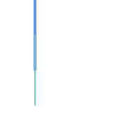
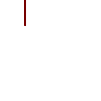
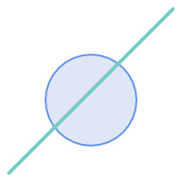
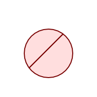
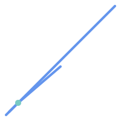
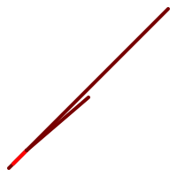
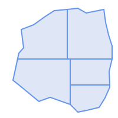
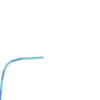
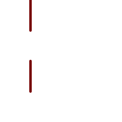

<a id="Overlay_Functions"></a>

## Overlay Functions
  <a id="ST_ClipByBox2D"></a>

# ST_ClipByBox2D

Computes the portion of a geometry falling within a rectangle.

## Synopsis


```sql
geometry ST_ClipByBox2D(geometry geom, box2d box)
```


## Description


 Clips a geometry by a 2D box in a fast and tolerant but possibly invalid way. Topologically invalid input geometries do not result in exceptions being thrown. The output geometry is not guaranteed to be valid (in particular, self-intersections for a polygon may be introduced).


Performed by the GEOS module.


Availability: 2.2.0


## Examples


```

-- Rely on implicit cast from geometry to box2d for the second parameter
SELECT ST_ClipByBox2D(geom, ST_MakeEnvelope(0,0,10,10)) FROM mytab;

```


## See Also


 [ST_Intersection](#ST_Intersection), [ST_MakeBox2D](bounding-box-functions.md#ST_MakeBox2D), [ST_MakeEnvelope](geometry-constructors.md#ST_MakeEnvelope)
  <a id="ST_Difference"></a>

# ST_Difference

Computes a geometry representing the part of geometry A that does not intersect geometry B.

## Synopsis


```sql
geometry ST_Difference(geometry  geomA, geometry  geomB, float8  gridSize = -1)
```


## Description


Returns a geometry representing the part of geometry A that does not intersect geometry B. This is equivalent to <code>A - ST_Intersection(A,B)</code>. If A is completely contained in B then an empty atomic geometry of appropriate type is returned.


!!! note

    This is the only overlay function where input order matters. ST_Difference(A, B) always returns a portion of A.


Performed by the GEOS module


Enhanced: 3.1.0 accept a gridSize parameter.


Requires GEOS >= 3.9.0 to use the gridSize parameter.


 s2.1.1.3


 SQL-MM 3: 5.1.20


 However, the result is computed using XY only. The result Z values are copied, averaged or interpolated.


## Examples


|    The input linestrings |    The difference of the two linestrings |


The difference of 2D linestrings.


```sql
SELECT ST_AsText(
    ST_Difference(
            'LINESTRING(50 100, 50 200)'::geometry,
            'LINESTRING(50 50, 50 150)'::geometry
        )
    );

st_astext
---------
LINESTRING(50 150,50 200)
```


The difference of 3D points.


```sql
SELECT ST_AsEWKT( ST_Difference(
                   'MULTIPOINT(-118.58 38.38 5,-118.60 38.329 6,-118.614 38.281 7)' :: geometry,
                   'POINT(-118.614 38.281 5)' :: geometry
                  ) );

st_asewkt
---------
MULTIPOINT(-118.6 38.329 6,-118.58 38.38 5)
```


## See Also


 [ST_SymDifference](#ST_SymDifference), [ST_Intersection](#ST_Intersection), [ST_Union](#ST_Union), [ST_ReducePrecision](geometry-processing.md#ST_ReducePrecision)
  <a id="ST_Intersection"></a>

# ST_Intersection

Computes a geometry representing the shared portion of geometries A and B.

## Synopsis


```sql
geometry ST_Intersection(geometry
                        geomA, geometry
                        geomB, float8
                        gridSize = -1)
geography ST_Intersection(geography
                        geogA, geography
                        geogB)
```


## Description


Returns a geometry representing the point-set intersection of two geometries. In other words, that portion of geometry A and geometry B that is shared between the two geometries.


If the geometries have no points in common (i.e. are disjoint) then an empty atomic geometry of appropriate type is returned.


ST_Intersection in conjunction with [ST_Intersects](spatial-relationships.md#ST_Intersects) is useful for clipping geometries such as in bounding box, buffer, or region queries where you only require the portion of a geometry that is inside a country or region of interest.


!!! note

    It first determines the best SRID that fits the bounding box of the 2 geography objects (if geography objects are within one half zone UTM but not same UTM will pick one of those) (favoring UTM or Lambert Azimuthal Equal Area (LAEA) north/south pole, and falling back on mercator in worst case scenario) and then intersection in that best fit planar spatial ref and retransforms back to WGS84 geography.


!!! warning

    This function will drop the M coordinate values if present.


!!! warning

    If working with 3D geometries, you may want to use SFGCAL based [ST_3DIntersection](../sfcgal-functions-reference/sfcgal-processing-and-relationship-functions.md#ST_3DIntersection) which does a proper 3D intersection for 3D geometries. Although this function works with Z-coordinate, it does an averaging of Z-Coordinate.


Performed by the GEOS module


Enhanced: 3.1.0 accept a gridSize parameter


Requires GEOS >= 3.9.0 to use the gridSize parameter


Changed: 3.0.0 does not depend on SFCGAL.


Availability: 1.5 support for geography data type was introduced.


 s2.1.1.3


 SQL-MM 3: 5.1.18


 However, the result is computed using XY only. The result Z values are copied, averaged or interpolated.


## Examples


```sql
SELECT ST_AsText(ST_Intersection('POINT(0 0)'::geometry, 'LINESTRING ( 2 0, 0 2 )'::geometry));
 st_astext
---------------
GEOMETRYCOLLECTION EMPTY

SELECT ST_AsText(ST_Intersection('POINT(0 0)'::geometry, 'LINESTRING ( 0 0, 0 2 )'::geometry));
 st_astext
---------------
POINT(0 0)
```


 Clip all lines (trails) by country. Here we assume country geom are POLYGON or MULTIPOLYGONS. NOTE: we are only keeping intersections that result in a LINESTRING or MULTILINESTRING because we don't care about trails that just share a point. The dump is needed to expand a geometry collection into individual single MULT* parts. The below is fairly generic and will work for polys, etc. by just changing the where clause.


```
select clipped.gid, clipped.f_name, clipped_geom
from (
         select trails.gid, trails.f_name,
             (ST_Dump(ST_Intersection(country.geom, trails.geom))).geom clipped_geom
         from country
              inner join trails on ST_Intersects(country.geom, trails.geom)
     ) as clipped
where ST_Dimension(clipped.clipped_geom) = 1;
```


For polys e.g. polygon landmarks, you can also use the sometimes faster hack that buffering anything by 0.0 except a polygon results in an empty geometry collection. (So a geometry collection containing polys, lines and points buffered by 0.0 would only leave the polygons and dissolve the collection shell.)


```
select poly.gid,
    ST_Multi(
        ST_Buffer(
            ST_Intersection(country.geom, poly.geom),
            0.0
        )
    ) clipped_geom
from country
     inner join poly on ST_Intersects(country.geom, poly.geom)
where not ST_IsEmpty(ST_Buffer(ST_Intersection(country.geom, poly.geom), 0.0));
```


## Examples: 2.5Dish


Note this is not a true intersection, compare to the same example using [ST_3DIntersection](../sfcgal-functions-reference/sfcgal-processing-and-relationship-functions.md#ST_3DIntersection).


```

select ST_AsText(ST_Intersection(linestring, polygon)) As wkt
from  ST_GeomFromText('LINESTRING Z (2 2 6,1.5 1.5 7,1 1 8,0.5 0.5 8,0 0 10)') AS linestring
 CROSS JOIN ST_GeomFromText('POLYGON((0 0 8, 0 1 8, 1 1 8, 1 0 8, 0 0 8))') AS polygon;

               st_astext
---------------------------------------
 LINESTRING Z (1 1 8,0.5 0.5 8,0 0 10)

```


## See Also


 [ST_3DIntersection](../sfcgal-functions-reference/sfcgal-processing-and-relationship-functions.md#ST_3DIntersection), [ST_Difference](#ST_Difference), [ST_Union](#ST_Union), [ST_ClipByBox2D](#ST_ClipByBox2D), [ST_Dimension](geometry-accessors.md#ST_Dimension), [ST_Dump](geometry-accessors.md#ST_Dump), [ST_Force2D](geometry-editors.md#ST_Force2D), [ST_SymDifference](#ST_SymDifference), [ST_Intersects](spatial-relationships.md#ST_Intersects), [ST_Multi](geometry-editors.md#ST_Multi), [ST_ReducePrecision](geometry-processing.md#ST_ReducePrecision)
  <a id="ST_MemUnion"></a>

# ST_MemUnion

Aggregate function which unions geometries in a memory-efficent but slower way

## Synopsis


```sql
geometry ST_MemUnion(geometry set geomfield)
```


## Description


An aggregate function that unions the input geometries, merging them to produce a result geometry with no overlaps. The output may be a single geometry, a MultiGeometry, or a Geometry Collection.


!!! note

    Produces the same result as [ST_Union](#ST_Union), but uses less memory and more processor time. This aggregate function works by unioning the geometries incrementally, as opposed to the ST_Union aggregate which first accumulates an array and then unions the contents using a fast algorithm.


 However, the result is computed using XY only. The result Z values are copied, averaged or interpolated.


## Examples


```sql

SELECT id,
       ST_MemUnion(geom) as singlegeom
FROM sometable f
GROUP BY id;
```


## See Also


[ST_Union](#ST_Union)
  <a id="ST_Node"></a>

# ST_Node

Nodes a collection of lines.

## Synopsis


```sql
geometry ST_Node(geometry  geom)
```


## Description


 Returns a (Multi)LineString representing the fully noded version of a collection of linestrings. The noding preserves all of the input nodes, and introduces the least possible number of new nodes. The resulting linework is dissolved (duplicate lines are removed).


This is a good way to create fully-noded linework suitable for use as input to [ST_Polygonize](geometry-processing.md#ST_Polygonize).


[ST_UnaryUnion](#ST_UnaryUnion) can also be used to node and dissolve linework. It provides an option to specify a gridSize, which can provide simpler and more robust output. See also [ST_Union](#ST_Union) for an aggregate variant.


Performed by the GEOS module.


Availability: 2.0.0


 Changed: 2.4.0 this function uses GEOSNode internally instead of GEOSUnaryUnion. This may cause the resulting linestrings to have a different order and direction compared to PostGIS < 2.4.


## Examples


Noding a 3D LineString which self-intersects


```sql

SELECT ST_AsText(
        ST_Node('LINESTRINGZ(0 0 0, 10 10 10, 0 10 5, 10 0 3)'::geometry)
    ) As  output;
output
-----------
MULTILINESTRING Z ((0 0 0,5 5 4.5),(5 5 4.5,10 10 10,0 10 5,5 5 4.5),(5 5 4.5,10 0 3))

```


Noding two LineStrings which share common linework. Note that the result linework is dissolved.


```sql

SELECT ST_AsText(
        ST_Node('MULTILINESTRING ((2 5, 2 1, 7 1), (6 1, 4 1, 2 3, 2 5))'::geometry)
    ) As  output;
output
-----------
MULTILINESTRING((2 5,2 3),(2 3,2 1,4 1),(4 1,2 3),(4 1,6 1),(6 1,7 1))

```


## See Also


 [ST_UnaryUnion](#ST_UnaryUnion), [ST_Union](#ST_Union)
  <a id="ST_Split"></a>

# ST_Split

Returns a collection of geometries created by splitting a geometry by another geometry.

## Synopsis


```sql
geometry ST_Split(geometry input, geometry blade)
```


## Description


 The function supports splitting a LineString by a (Multi)Point, (Multi)LineString or (Multi)Polygon boundary, or a (Multi)Polygon by a LineString. When a (Multi)Polygon is used as as the blade, its linear components (the boundary) are used for splitting the input. The result geometry is always a collection.


 This function is in a sense the opposite of [ST_Union](#ST_Union). Applying ST_Union to the returned collection should theoretically yield the original geometry (although due to numerical rounding this may not be exactly the case).


!!! note

    If the the input and blade do not intersect due to numerical precision issues, the input may not be split as expected. To avoid this situation it may be necessary to snap the input to the blade first, using [ST_Snap](geometry-editors.md#ST_Snap) with a small tolerance.


Availability: 2.0.0 requires GEOS


Enhanced: 2.2.0 support for splitting a line by a multiline, a multipoint or (multi)polygon boundary was introduced.


Enhanced: 2.5.0 support for splitting a polygon by a multiline was introduced.


## Examples


Split a Polygon by a Line.


|    Before Split |    After split |


```sql

SELECT ST_AsText( ST_Split(
                ST_Buffer(ST_GeomFromText('POINT(100 90)'), 50), -- circle
                ST_MakeLine(ST_Point(10, 10),ST_Point(190, 190)) -- line
    ));

-- result --
 GEOMETRYCOLLECTION(
            POLYGON((150 90,149.039264020162 80.2454838991936,146.193976625564 70.8658283817455,..),
            POLYGON(..))
)

```


Split a MultiLineString by a Point, where the point lies exactly on both LineStrings elements.


|    Before Split |    After split |


```sql

SELECT ST_AsText(ST_Split(
    'MULTILINESTRING((10 10, 190 190), (15 15, 30 30, 100 90))',
    ST_Point(30,30))) As split;

split
------
GEOMETRYCOLLECTION(
    LINESTRING(10 10,30 30),
    LINESTRING(30 30,190 190),
    LINESTRING(15 15,30 30),
    LINESTRING(30 30,100 90)
)

```


Split a LineString by a Point, where the point does not lie exactly on the line. Shows using [ST_Snap](geometry-editors.md#ST_Snap) to snap the line to the point to allow it to be split.


```sql

WITH data AS (SELECT
  'LINESTRING(0 0, 100 100)'::geometry AS line,
  'POINT(51 50)':: geometry AS point
)
SELECT ST_AsText( ST_Split( ST_Snap(line, point, 1), point)) AS snapped_split,
       ST_AsText( ST_Split(line, point)) AS not_snapped_not_split
       FROM data;

                            snapped_split                            |            not_snapped_not_split
---------------------------------------------------------------------+---------------------------------------------
 GEOMETRYCOLLECTION(LINESTRING(0 0,51 50),LINESTRING(51 50,100 100)) | GEOMETRYCOLLECTION(LINESTRING(0 0,100 100))
```


## See Also


 [ST_Snap](geometry-editors.md#ST_Snap), [ST_Union](#ST_Union)
  <a id="ST_Subdivide"></a>

# ST_Subdivide

Computes a rectilinear subdivision of a geometry.

## Synopsis


```sql
setof geometry ST_Subdivide(geometry geom, integer max_vertices=256, float8 gridSize = -1)
```


## Description


 Returns a set of geometries that are the result of dividing `geom` into parts using rectilinear lines, with each part containing no more than <code>max_vertices</code>.


 <code>max_vertices</code> must be 5 or more, as 5 points are needed to represent a closed box.


 Point-in-polygon and other spatial operations are normally faster for indexed subdivided datasets. Since the bounding boxes for the parts usually cover a smaller area than the original geometry bbox, index queries produce fewer "hit" cases. The "hit" cases are faster because the spatial operations executed by the index recheck process fewer points.


!!! note

    When casting a subdivided geometry to geography, the resulting geography may differ from the original. Subdivision adds vertices in planar (geometry) space. If vertices are inserted along the boundary, they will alter the geographical representation, where edges are interpreted as geodesic segments. To minimize distortion, first densify the geography using [ST_Segmentize](geometry-editors.md#ST_Segmentize) to add geodesic vertices, then cast to geometry before subdivision.


!!! note

    This is a [set-returning function](https://www.postgresql.org/docs/current/queries-table-expressions.html#QUERIES-TABLEFUNCTIONS) (SRF) that return a set of rows containing single geometry values. It can be used in a SELECT list or a FROM clause to produce a result set with one record for each result geometry.


Performed by the GEOS module.


Availability: 2.2.0


Enhanced: 2.5.0 reuses existing points on polygon split, vertex count is lowered from 8 to 5.


Enhanced: 3.1.0 accept a gridSize parameter.


Requires GEOS >= 3.9.0 to use the gridSize parameter


## Examples


**Example:** Subdivide a polygon into parts with no more than 10 vertices, and assign each part a unique id.





Subdivided to maximum 10 vertices


```sql

SELECT row_number() OVER() As rn, ST_AsText(geom) As wkt
    FROM (SELECT ST_SubDivide(
        'POLYGON((132 10,119 23,85 35,68 29,66 28,49 42,32 56,22 64,32 110,40 119,36 150,
        57 158,75 171,92 182,114 184,132 186,146 178,176 184,179 162,184 141,190 122,
        190 100,185 79,186 56,186 52,178 34,168 18,147 13,132 10))'::geometry,10))  AS f(geom);
```


```
 rn │                                                      wkt
────┼────────────────────────────────────────────────────────────────────────────────────────────────────────────────
  1 │ POLYGON((119 23,85 35,68 29,66 28,32 56,22 64,29.8260869565217 100,119 100,119 23))
  2 │ POLYGON((132 10,119 23,119 56,186 56,186 52,178 34,168 18,147 13,132 10))
  3 │ POLYGON((119 56,119 100,190 100,185 79,186 56,119 56))
  4 │ POLYGON((29.8260869565217 100,32 110,40 119,36 150,57 158,75 171,92 182,114 184,114 100,29.8260869565217 100))
  5 │ POLYGON((114 184,132 186,146 178,176 184,179 162,184 141,190 122,190 100,114 100,114 184))

```


**Example:** Densify a long geography line using ST_Segmentize(geography, distance), and use ST_Subdivide to split the resulting line into sublines of 8 vertices. Densification minimizes the impact of changes to the geography representation of a geometry when subdividing.





The densified and split lines.


```sql

SELECT ST_AsText( ST_Subdivide(
            ST_Segmentize('LINESTRING(0 0, 85 85)'::geography,
                          1200000)::geometry,    8));
```


```

LINESTRING(0 0,0.487578359029357 5.57659056746196,0.984542144675897 11.1527721155093,1.50101059639722 16.7281035483571,1.94532113630331 21.25)
LINESTRING(1.94532113630331 21.25,2.04869538062779 22.3020741387339,2.64204641967673 27.8740533545155,3.29994062412787 33.443216802941,4.04836719489742 39.0084282520239,4.59890468420694 42.5)
LINESTRING(4.59890468420694 42.5,4.92498503922732 44.5680389206321,5.98737409390639 50.1195229244701,7.3290919767674 55.6587646879025,8.79638749938413 60.1969505994924)
LINESTRING(8.79638749938413 60.1969505994924,9.11375579533779 61.1785363177625,11.6558166691368 66.6648504160202,15.642041247655 72.0867690601745,22.8716627200212 77.3609628116894,24.6991785131552 77.8939011989848)
LINESTRING(24.6991785131552 77.8939011989848,39.4046096622744 82.1822848017636,44.7994523421035 82.5156766227011)
LINESTRING(44.7994523421035 82.5156766227011,85 85)
```


**Example:** Subdivide the complex geometries of a table in-place. The original geometry records are deleted from the source table, and new records for each subdivided result geometry are inserted.


```sql


WITH complex_areas_to_subdivide AS (
    DELETE from polygons_table
    WHERE ST_NPoints(geom) > 255
    RETURNING id, column1, column2, column3, geom
)
INSERT INTO polygons_table (fid, column1, column2, column3, geom)
    SELECT fid, column1, column2, column3,
           ST_Subdivide(geom, 255) as geom
    FROM complex_areas_to_subdivide;
```


**Example:** Create a new table containing subdivided geometries, retaining the key of the original geometry so that the new table can be joined to the source table. Since ST_Subdivide is a set-returning (table) function that returns a set of single-value rows, this syntax automatically produces a table with one row for each result part.


```sql

CREATE TABLE subdivided_geoms AS
    SELECT pkey, ST_Subdivide(geom) AS geom
    FROM original_geoms;
```


## See Also


 [ST_ClipByBox2D](#ST_ClipByBox2D), [ST_Segmentize](geometry-editors.md#ST_Segmentize), [ST_Split](#ST_Split), [ST_NPoints](geometry-accessors.md#ST_NPoints), [ST_ReducePrecision](geometry-processing.md#ST_ReducePrecision)
  <a id="ST_SymDifference"></a>

# ST_SymDifference

Computes a geometry representing the portions of geometries A and B that do not intersect.

## Synopsis


```sql
geometry ST_SymDifference(geometry  geomA, geometry  geomB, float8  gridSize = -1)
```


## Description


Returns a geometry representing the portions of geonetries A and B that do not intersect. This is equivalent to <code>ST_Union(A,B) - ST_Intersection(A,B)</code>. It is called a symmetric difference because <code>ST_SymDifference(A,B) = ST_SymDifference(B,A)</code>.


Performed by the GEOS module


Enhanced: 3.1.0 accept a gridSize parameter.


Requires GEOS >= 3.9.0 to use the gridSize parameter


 s2.1.1.3


 SQL-MM 3: 5.1.21


 However, the result is computed using XY only. The result Z values are copied, averaged or interpolated.


## Examples


|    The original linestrings shown together |    The symmetric difference of the two linestrings |


```

--Safe for 2d - symmetric difference of 2 linestrings
SELECT ST_AsText(
    ST_SymDifference(
        ST_GeomFromText('LINESTRING(50 100, 50 200)'),
        ST_GeomFromText('LINESTRING(50 50, 50 150)')
    )
);

st_astext
---------
MULTILINESTRING((50 150,50 200),(50 50,50 100))
```


```


--When used in 3d doesn't quite do the right thing
SELECT ST_AsEWKT(ST_SymDifference(ST_GeomFromEWKT('LINESTRING(1 2 1, 1 4 2)'),
    ST_GeomFromEWKT('LINESTRING(1 1 3, 1 3 4)')))

st_astext
------------
MULTILINESTRING((1 3 2.75,1 4 2),(1 1 3,1 2 2.25))

```


## See Also


 [ST_Difference](#ST_Difference), [ST_Intersection](#ST_Intersection), [ST_Union](#ST_Union), [ST_ReducePrecision](geometry-processing.md#ST_ReducePrecision)
  <a id="ST_UnaryUnion"></a>

# ST_UnaryUnion

Computes the union of the components of a single geometry.

## Synopsis


```sql
geometry ST_UnaryUnion(geometry  geom, float8  gridSize = -1)
```


## Description


 A single-input variant of [ST_Union](#ST_Union). The input may be a single geometry, a MultiGeometry, or a GeometryCollection. The union is applied to the individual elements of the input.


 This function can be used to fix MultiPolygons which are invalid due to overlapping components. However, the input components must each be valid. An invalid input component such as a bow-tie polygon may cause an error. For this reason it may be better to use [ST_MakeValid](geometry-validation.md#ST_MakeValid).


 Another use of this function is to node and dissolve a collection of linestrings which cross or overlap to make them [simple](../data-management/geometry-validation.md#Simple_Geometry). ([ST_Node](#ST_Node) also does this, but it does not provide the <code>gridSize</code> option.)


 It is possible to combine ST_UnaryUnion with [ST_Collect](geometry-constructors.md#ST_Collect) to fine-tune how many geometries are be unioned at once. This allows trading off between memory usage and compute time, striking a balance between ST_Union and [ST_MemUnion](#ST_MemUnion).


 However, the result is computed using XY only. The result Z values are copied, averaged or interpolated.


Enhanced: 3.1.0 accept a gridSize parameter.


Requires GEOS >= 3.9.0 to use the gridSize parameter


Availability: 2.0.0


## See Also


 [ST_Union](#ST_Union), [ST_MemUnion](#ST_MemUnion), [ST_MakeValid](geometry-validation.md#ST_MakeValid), [ST_Collect](geometry-constructors.md#ST_Collect), [ST_Node](#ST_Node), [ST_ReducePrecision](geometry-processing.md#ST_ReducePrecision)
  <a id="ST_Union"></a>

# ST_Union

Computes a geometry representing the point-set union of the input geometries.

## Synopsis


```sql
geometry ST_Union(geometry g1, geometry g2)
geometry ST_Union(geometry g1, geometry g2, float8 gridSize)
geometry ST_Union(geometry[] g1_array)
geometry ST_Union(geometry set g1field)
geometry ST_Union(geometry set g1field, float8 gridSize)
```


## Description


Unions the input geometries, merging geometry to produce a result geometry with no overlaps. The output may be an atomic geometry, a MultiGeometry, or a Geometry Collection. Comes in several variants:


**Two-input variant:** returns a geometry that is the union of two input geometries. If either input is NULL, then NULL is returned.


**Array variant:** returns a geometry that is the union of an array of geometries.


**Aggregate variant:** returns a geometry that is the union of a rowset of geometries. The ST_Union() function is an "aggregate" function in the terminology of PostgreSQL. That means that it operates on rows of data, in the same way the SUM() and AVG() functions do and like most aggregates, it also ignores NULL geometries.


See [ST_UnaryUnion](#ST_UnaryUnion) for a non-aggregate, single-input variant.


The ST_Union array and set variants use the fast Cascaded Union algorithm described in [http://blog.cleverelephant.ca/2009/01/must-faster-unions-in-postgis-14.html](http://blog.cleverelephant.ca/2009/01/must-faster-unions-in-postgis-14.html)


!!! note

    [ST_Collect](geometry-constructors.md#ST_Collect) may sometimes be used in place of ST_Union, if the result is not required to be non-overlapping. ST_Collect is usually faster than ST_Union because it performs no processing on the collected geometries.


Performed by the GEOS module.


ST_Union creates MultiLineString and does not sew LineStrings into a single LineString. Use [ST_LineMerge](geometry-processing.md#ST_LineMerge) to sew LineStrings.


NOTE: this function was formerly called GeomUnion(), which was renamed from "Union" because UNION is an SQL reserved word.


Enhanced: 3.1.0 accept a gridSize parameter.


Requires GEOS >= 3.9.0 to use the gridSize parameter


Changed: 3.0.0 does not depend on SFCGAL.


Availability: 1.4.0 - ST_Union was enhanced. ST_Union(geomarray) was introduced and also faster aggregate collection in PostgreSQL.


 s2.1.1.3


!!! note

    Aggregate version is not explicitly defined in OGC SPEC.


 SQL-MM 3: 5.1.19 the z-index (elevation) when polygons are involved.


 However, the result is computed using XY only. The result Z values are copied, averaged or interpolated.


## Examples


Aggregate example


```sql

SELECT id,
       ST_Union(geom) as singlegeom
FROM sometable f
GROUP BY id;

```


Non-Aggregate example


```

select ST_AsText(ST_Union('POINT(1 2)' :: geometry, 'POINT(-2 3)' :: geometry))

st_astext
----------
MULTIPOINT(-2 3,1 2)

select ST_AsText(ST_Union('POINT(1 2)' :: geometry, 'POINT(1 2)' :: geometry))

st_astext
----------
POINT(1 2)
```


3D example - sort of supports 3D (and with mixed dimensions!)


```
select ST_AsEWKT(ST_Union(geom))
from (
         select 'POLYGON((-7 4.2,-7.1 4.2,-7.1 4.3, -7 4.2))'::geometry geom
         union all
         select 'POINT(5 5 5)'::geometry geom
         union all
         select 'POINT(-2 3 1)'::geometry geom
         union all
         select 'LINESTRING(5 5 5, 10 10 10)'::geometry geom
     ) as foo;

st_asewkt
---------
GEOMETRYCOLLECTION(POINT(-2 3 1),LINESTRING(5 5 5,10 10 10),POLYGON((-7 4.2 5,-7.1 4.2 5,-7.1 4.3 5,-7 4.2 5)));
```


3d example not mixing dimensions


```
select ST_AsEWKT(ST_Union(geom))
from (
         select 'POLYGON((-7 4.2 2,-7.1 4.2 3,-7.1 4.3 2, -7 4.2 2))'::geometry geom
         union all
         select 'POINT(5 5 5)'::geometry geom
         union all
         select 'POINT(-2 3 1)'::geometry geom
         union all
         select 'LINESTRING(5 5 5, 10 10 10)'::geometry geom
     ) as foo;

st_asewkt
---------
GEOMETRYCOLLECTION(POINT(-2 3 1),LINESTRING(5 5 5,10 10 10),POLYGON((-7 4.2 2,-7.1 4.2 3,-7.1 4.3 2,-7 4.2 2)))

--Examples using new Array construct
SELECT ST_Union(ARRAY(SELECT geom FROM sometable));

SELECT ST_AsText(ST_Union(ARRAY[ST_GeomFromText('LINESTRING(1 2, 3 4)'),
            ST_GeomFromText('LINESTRING(3 4, 4 5)')])) As wktunion;

--wktunion---
MULTILINESTRING((3 4,4 5),(1 2,3 4))


```


## See Also


 [ST_Collect](geometry-constructors.md#ST_Collect), [ST_UnaryUnion](#ST_UnaryUnion), [ST_MemUnion](#ST_MemUnion), [ST_Intersection](#ST_Intersection), [ST_Difference](#ST_Difference), [ST_SymDifference](#ST_SymDifference), [ST_ReducePrecision](geometry-processing.md#ST_ReducePrecision)
