<a id="Spatial_Relationships"></a>

## Spatial Relationships


## Topological Relationships
  <a id="ST_3DIntersects"></a>

# ST_3DIntersects

Tests if two geometries spatially intersect in 3D - only for points, linestrings, polygons, polyhedral surface (area)

## Synopsis


```sql
boolean ST_3DIntersects(geometry
            geomA, geometry
            geomB)
```


## Description


Overlaps, Touches, Within all imply spatial intersection. If any of the aforementioned returns true, then the geometries also spatially intersect. Disjoint implies false for spatial intersection.


!!! note


!!! note

    Because of floating robustness failures, geometries don't always intersect as you'd expect them to after geometric processing. For example the closest point on a linestring to a geometry may not lie on the linestring. For these kind of issues where a distance of a centimeter you want to just consider as intersecting, use [ST_3DDWithin](#ST_3DDWithin).


Changed: 3.0.0 SFCGAL backend removed, GEOS backend supports TINs.


Availability: 2.0.0


 SQL-MM IEC 13249-3: 5.1


## Geometry Examples


```sql
SELECT ST_3DIntersects(pt, line), ST_Intersects(pt, line)
  FROM (SELECT 'POINT(0 0 2)'::geometry As pt, 'LINESTRING (0 0 1, 0 2 3)'::geometry As line) As foo;
 st_3dintersects | st_intersects
-----------------+---------------
 f               | t
(1 row)

```


## TIN Examples


```sql
SELECT ST_3DIntersects('TIN(((0 0 0,1 0 0,0 1 0,0 0 0)))'::geometry, 'POINT(.1 .1 0)'::geometry);
 st_3dintersects
-----------------
 t
```

## See Also


[ST_3DDWithin](#ST_3DDWithin), [ST_Intersects](#ST_Intersects)
  <a id="ST_Contains"></a>

# ST_Contains

Tests if every point of B lies in A, and their interiors have a point in common

## Synopsis


```sql
boolean ST_Contains(geometry
      geomA, geometry
      geomB)
```


## Description


Returns TRUE if geometry A contains geometry B. A contains B if and only if all points of B lie inside (i.e. in the interior or boundary of) A (or equivalently, no points of B lie in the exterior of A), and the interiors of A and B have at least one point in common.


In mathematical terms: *ST_Contains(A, B) ⇔ (A ⋂ B = B) ∧ (Int(A) ⋂ Int(B) ≠ ∅) *


The contains relationship is reflexive: every geometry contains itself. (In contrast, in the [ST_ContainsProperly](#ST_ContainsProperly) predicate a geometry does *not* properly contain itself.) The relationship is antisymmetric: if <code>ST_Contains(A,B) = true</code> and <code>ST_Contains(B,A) = true</code>, then the two geometries must be topologically equal (<code>ST_Equals(A,B) = true</code>).


ST_Contains is the converse of [ST_Within](#ST_Within). So, <code>ST_Contains(A,B) = ST_Within(B,A)</code>.


!!! note

    Because the interiors must have a common point, a subtlety of the definition is that polygons and lines do *not* contain lines and points lying fully in their boundary. For further details see [Subtleties of OGC Covers, Contains, Within](http://lin-ear-th-inking.blogspot.com/2007/06/subtleties-of-ogc-covers-spatial.html). The [ST_Covers](#ST_Covers) predicate provides a more inclusive relationship.


!!! note

    To avoid index use, use the function `_ST_Contains`.


Performed by the GEOS module


Enhanced: 2.3.0 Enhancement to PIP short-circuit extended to support MultiPoints with few points. Prior versions only supported point in polygon.


!!! important

    Enhanced: 3.0.0 enabled support for `GEOMETRYCOLLECTION`


!!! important

    Do not use this function with invalid geometries. You will get unexpected results.


NOTE: this is the "allowable" version that returns a boolean, not an integer.


 s2.1.1.2 // s2.1.13.3 - same as within(geometry B, geometry A)


 SQL-MM 3: 5.1.31


## Examples


`ST_Contains` returns `TRUE` in the following situations:


| 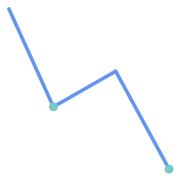   `LINESTRING` / `MULTIPOINT` | 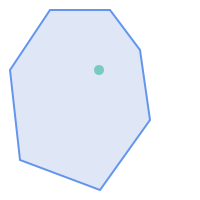   `POLYGON` / `POINT` |
| 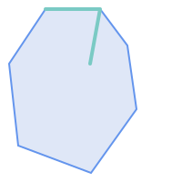   `POLYGON` / `LINESTRING` | 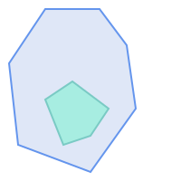   `POLYGON` / `POLYGON` |


`ST_Contains` returns `FALSE` in the following situations:


| 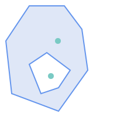   `POLYGON` / `MULTIPOINT` | 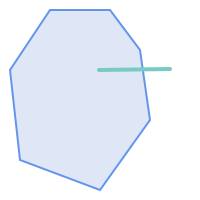   `POLYGON` / `LINESTRING` |


Due to the interior intersection condition `ST_Contains` returns `FALSE` in the following situations (whereas `ST_Covers` returns `TRUE`):


| 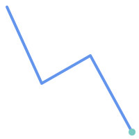   `LINESTRING` / `POINT` | 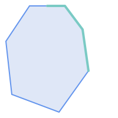   `POLYGON` / `LINESTRING` |


```

-- A circle within a circle
SELECT ST_Contains(smallc, bigc) As smallcontainsbig,
     ST_Contains(bigc,smallc) As bigcontainssmall,
     ST_Contains(bigc, ST_Union(smallc, bigc)) as bigcontainsunion,
     ST_Equals(bigc, ST_Union(smallc, bigc)) as bigisunion,
     ST_Covers(bigc, ST_ExteriorRing(bigc)) As bigcoversexterior,
     ST_Contains(bigc, ST_ExteriorRing(bigc)) As bigcontainsexterior
FROM (SELECT ST_Buffer(ST_GeomFromText('POINT(1 2)'), 10) As smallc,
       ST_Buffer(ST_GeomFromText('POINT(1 2)'), 20) As bigc) As foo;

-- Result
  smallcontainsbig | bigcontainssmall | bigcontainsunion | bigisunion | bigcoversexterior | bigcontainsexterior
------------------+------------------+------------------+------------+-------------------+---------------------
 f                | t                | t                | t          | t        | f

-- Example demonstrating difference between contains and contains properly
SELECT ST_GeometryType(geomA) As geomtype, ST_Contains(geomA,geomA) AS acontainsa, ST_ContainsProperly(geomA, geomA) AS acontainspropa,
   ST_Contains(geomA, ST_Boundary(geomA)) As acontainsba, ST_ContainsProperly(geomA, ST_Boundary(geomA)) As acontainspropba
FROM (VALUES ( ST_Buffer(ST_Point(1,1), 5,1) ),
       ( ST_MakeLine(ST_Point(1,1), ST_Point(-1,-1) ) ),
       ( ST_Point(1,1) )
    ) As foo(geomA);

  geomtype    | acontainsa | acontainspropa | acontainsba | acontainspropba
--------------+------------+----------------+-------------+-----------------
ST_Polygon    | t          | f              | f           | f
ST_LineString | t          | f              | f           | f
ST_Point      | t          | t              | f           | f


```


## See Also


[ST_Boundary](geometry-accessors.md#ST_Boundary), [ST_ContainsProperly](#ST_ContainsProperly), [ST_Covers](#ST_Covers), [ST_CoveredBy](#ST_CoveredBy), [ST_Equals](#ST_Equals), [ST_Within](#ST_Within)
  <a id="ST_ContainsProperly"></a>

# ST_ContainsProperly

Tests if every point of B lies in the interior of A

## Synopsis


```sql
boolean ST_ContainsProperly(geometry
      geomA, geometry
      geomB)
```


## Description


Returns `true` if every point of B lies in the interior of A (or equivalently, no point of B lies in the the boundary or exterior of A).


In mathematical terms: *ST_ContainsProperly(A, B) ⇔ Int(A) ⋂ B = B *


A contains B properly if the DE-9IM Intersection Matrix for the two geometries matches [T**FF*FF*]


A does not properly contain itself, but does contain itself.


 A use for this predicate is computing the intersections of a set of geometries with a large polygonal geometry. Since intersection is a fairly slow operation, it can be more efficient to use containsProperly to filter out test geometries which lie fully inside the area. In these cases the intersection is known a priori to be exactly the original test geometry.


!!! note

    To avoid index use, use the function `_ST_ContainsProperly`.


!!! note

    The advantage of this predicate over [ST_Contains](#ST_Contains) and [ST_Intersects](#ST_Intersects) is that it can be computed more efficiently, with no need to compute topology at individual points.


Performed by the GEOS module.


Availability: 1.4.0


!!! important

    Enhanced: 3.0.0 enabled support for `GEOMETRYCOLLECTION`


!!! important

    Do not use this function with invalid geometries. You will get unexpected results.


## Examples


```

  --a circle within a circle
  SELECT ST_ContainsProperly(smallc, bigc) As smallcontainspropbig,
  ST_ContainsProperly(bigc,smallc) As bigcontainspropsmall,
  ST_ContainsProperly(bigc, ST_Union(smallc, bigc)) as bigcontainspropunion,
  ST_Equals(bigc, ST_Union(smallc, bigc)) as bigisunion,
  ST_Covers(bigc, ST_ExteriorRing(bigc)) As bigcoversexterior,
  ST_ContainsProperly(bigc, ST_ExteriorRing(bigc)) As bigcontainsexterior
  FROM (SELECT ST_Buffer(ST_GeomFromText('POINT(1 2)'), 10) As smallc,
  ST_Buffer(ST_GeomFromText('POINT(1 2)'), 20) As bigc) As foo;
  --Result
  smallcontainspropbig | bigcontainspropsmall | bigcontainspropunion | bigisunion | bigcoversexterior | bigcontainsexterior
------------------+------------------+------------------+------------+-------------------+---------------------
 f                     | t                    | f                    | t          | t                 | f

 --example demonstrating difference between contains and contains properly
 SELECT ST_GeometryType(geomA) As geomtype, ST_Contains(geomA,geomA) AS acontainsa, ST_ContainsProperly(geomA, geomA) AS acontainspropa,
 ST_Contains(geomA, ST_Boundary(geomA)) As acontainsba, ST_ContainsProperly(geomA, ST_Boundary(geomA)) As acontainspropba
 FROM (VALUES ( ST_Buffer(ST_Point(1,1), 5,1) ),
      ( ST_MakeLine(ST_Point(1,1), ST_Point(-1,-1) ) ),
      ( ST_Point(1,1) )
  ) As foo(geomA);

  geomtype    | acontainsa | acontainspropa | acontainsba | acontainspropba
--------------+------------+----------------+-------------+-----------------
ST_Polygon    | t          | f              | f           | f
ST_LineString | t          | f              | f           | f
ST_Point      | t          | t              | f           | f

```


## See Also


[ST_GeometryType](geometry-accessors.md#ST_GeometryType), [ST_Boundary](geometry-accessors.md#ST_Boundary), [ST_Contains](#ST_Contains), [ST_Covers](#ST_Covers), [ST_CoveredBy](#ST_CoveredBy), [ST_Equals](#ST_Equals), [ST_Relate](#ST_Relate), [ST_Within](#ST_Within)
  <a id="ST_CoveredBy"></a>

# ST_CoveredBy

Tests if every point of A lies in B

## Synopsis


```sql
boolean ST_CoveredBy(geometry
      geomA, geometry
      geomB)
boolean ST_CoveredBy(geography
      geogA, geography
      geogB)
```


## Description


Returns `true` if every point in Geometry/Geography A lies inside (i.e. intersects the interior or boundary of) Geometry/Geography B. Equivalently, tests that no point of A lies outside (in the exterior of) B.


In mathematical terms: *ST_CoveredBy(A, B) ⇔ A ⋂ B = A *


ST_CoveredBy is the converse of [ST_Covers](#ST_Covers). So, <code>ST_CoveredBy(A,B) = ST_Covers(B,A)</code>.


Generally this function should be used instead of [ST_Within](#ST_Within), since it has a simpler definition which does not have the quirk that "boundaries are not within their geometry".


!!! note

    To avoid index use, use the function `_ST_CoveredBy`.


!!! important

    Enhanced: 3.0.0 enabled support for `GEOMETRYCOLLECTION`


!!! important

    Do not use this function with invalid geometries. You will get unexpected results.


Performed by the GEOS module


Availability: 1.2.2


NOTE: this is the "allowable" version that returns a boolean, not an integer.


Not an OGC standard, but Oracle has it too.


## Examples


```

  --a circle coveredby a circle
SELECT ST_CoveredBy(smallc,smallc) As smallinsmall,
  ST_CoveredBy(smallc, bigc) As smallcoveredbybig,
  ST_CoveredBy(ST_ExteriorRing(bigc), bigc) As exteriorcoveredbybig,
  ST_Within(ST_ExteriorRing(bigc),bigc) As exeriorwithinbig
FROM (SELECT ST_Buffer(ST_GeomFromText('POINT(1 2)'), 10) As smallc,
  ST_Buffer(ST_GeomFromText('POINT(1 2)'), 20) As bigc) As foo;
  --Result
 smallinsmall | smallcoveredbybig | exteriorcoveredbybig | exeriorwithinbig
--------------+-------------------+----------------------+------------------
 t            | t                 | t                    | f
(1 row)
```


## See Also


[ST_Contains](#ST_Contains), [ST_Covers](#ST_Covers), [ST_ExteriorRing](geometry-accessors.md#ST_ExteriorRing), [ST_Within](#ST_Within)
  <a id="ST_Covers"></a>

# ST_Covers

Tests if every point of B lies in A

## Synopsis


```sql
boolean ST_Covers(geometry
      geomA, geometry
      geomB)
boolean ST_Covers(geography
      geogpolyA, geography
      geogpointB)
```


## Description


Returns `true` if every point in Geometry/Geography B lies inside (i.e. intersects the interior or boundary of) Geometry/Geography A. Equivalently, tests that no point of B lies outside (in the exterior of) A.


In mathematical terms: *ST_Covers(A, B) ⇔ A ⋂ B = B *


ST_Covers is the converse of [ST_CoveredBy](#ST_CoveredBy). So, <code>ST_Covers(A,B) = ST_CoveredBy(B,A)</code>.


Generally this function should be used instead of [ST_Contains](#ST_Contains), since it has a simpler definition which does not have the quirk that "geometries do not contain their boundary".


!!! note

    To avoid index use, use the function `_ST_Covers`.


!!! important

    Enhanced: 3.0.0 enabled support for `GEOMETRYCOLLECTION`


!!! important

    Do not use this function with invalid geometries. You will get unexpected results.


Performed by the GEOS module


Enhanced: 2.4.0 Support for polygon in polygon and line in polygon added for geography type


Enhanced: 2.3.0 Enhancement to PIP short-circuit for geometry extended to support MultiPoints with few points. Prior versions only supported point in polygon.


Availability: 1.5 - support for geography was introduced.


Availability: 1.2.2


NOTE: this is the "allowable" version that returns a boolean, not an integer.


Not an OGC standard, but Oracle has it too.


## Examples


 Geometry example


```

  --a circle covering a circle
SELECT ST_Covers(smallc,smallc) As smallinsmall,
  ST_Covers(smallc, bigc) As smallcoversbig,
  ST_Covers(bigc, ST_ExteriorRing(bigc)) As bigcoversexterior,
  ST_Contains(bigc, ST_ExteriorRing(bigc)) As bigcontainsexterior
FROM (SELECT ST_Buffer(ST_GeomFromText('POINT(1 2)'), 10) As smallc,
  ST_Buffer(ST_GeomFromText('POINT(1 2)'), 20) As bigc) As foo;
  --Result
 smallinsmall | smallcoversbig | bigcoversexterior | bigcontainsexterior
--------------+----------------+-------------------+---------------------
 t            | f              | t                 | f
(1 row)
```


Geeography Example


```

-- a point with a 300 meter buffer compared to a point, a point and its 10 meter buffer
SELECT ST_Covers(geog_poly, geog_pt) As poly_covers_pt,
  ST_Covers(ST_Buffer(geog_pt,10), geog_pt) As buff_10m_covers_cent
  FROM (SELECT ST_Buffer(ST_GeogFromText('SRID=4326;POINT(-99.327 31.4821)'), 300) As geog_poly,
        ST_GeogFromText('SRID=4326;POINT(-99.33 31.483)') As geog_pt ) As foo;

 poly_covers_pt | buff_10m_covers_cent
----------------+------------------
 f              | t

```


## See Also


[ST_Contains](#ST_Contains), [ST_CoveredBy](#ST_CoveredBy), [ST_Within](#ST_Within)
  <a id="ST_Crosses"></a>

# ST_Crosses

Tests if two geometries have some, but not all, interior points in common

## Synopsis


```sql
boolean ST_Crosses(geometry g1, geometry g2)
```


## Description


Compares two geometry objects and returns `true` if their intersection "spatially crosses"; that is, the geometries have some, but not all interior points in common. The intersection of the interiors of the geometries must be non-empty and must have dimension less than the maximum dimension of the two input geometries, and the intersection of the two geometries must not equal either geometry. Otherwise, it returns `false`. The crosses relation is symmetric and irreflexive.


In mathematical terms: *ST_Crosses(A, B) ⇔ (dim( Int(A) ⋂ Int(B) ) < max( dim( Int(A) ), dim( Int(B) ) )) ∧ (A ⋂ B ≠ A) ∧ (A ⋂ B ≠ B) *


Geometries cross if their DE-9IM Intersection Matrix matches:


- <code>T*T******</code> for Point/Line, Point/Area, and Line/Area situations
- <code>T*****T**</code> for Line/Point, Area/Point, and Area/Line situations
- <code>0********</code> for Line/Line situations
- the result is `false` for Point/Point and Area/Area situations


!!! note

    The OpenGIS Simple Features Specification defines this predicate only for Point/Line, Point/Area, Line/Line, and Line/Area situations. JTS / GEOS extends the definition to apply to Line/Point, Area/Point and Area/Line situations as well. This makes the relation symmetric.


!!! note


!!! important

    Enhanced: 3.0.0 enabled support for `GEOMETRYCOLLECTION`


 s2.1.13.3


 SQL-MM 3: 5.1.29


## Examples


The following situations all return `true`.


| 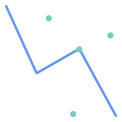   `MULTIPOINT` / `LINESTRING` | 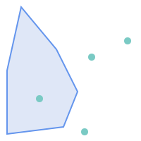   `MULTIPOINT` / `POLYGON` |
| 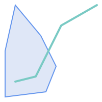   `LINESTRING` / `POLYGON` | 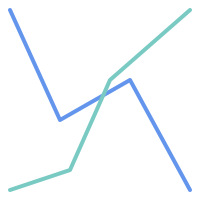   `LINESTRING` / `LINESTRING` |


Consider a situation where a user has two tables: a table of roads and a table of highways.


| ```sql CREATE TABLE roads (   id serial NOT NULL,   geom geometry,   CONSTRAINT roads_pkey PRIMARY KEY (road_id) ); ``` | ```sql CREATE TABLE highways (   id serial NOT NULL,   the_gem geometry,   CONSTRAINT roads_pkey PRIMARY KEY (road_id) ); ``` |


To determine a list of roads that cross a highway, use a query similar to:


```sql
SELECT roads.id
FROM roads, highways
WHERE ST_Crosses(roads.geom, highways.geom);
```


## See Also


[ST_Contains](#ST_Contains), [ST_Overlaps](#ST_Overlaps)
  <a id="ST_Disjoint"></a>

# ST_Disjoint

Tests if two geometries have no points in common

## Synopsis


```sql
boolean ST_Disjoint(geometry
            A, geometry
            B)
```


## Description


Returns `true` if two geometries are disjoint. Geometries are disjoint if they have no point in common.


If any other spatial relationship is true for a pair of geometries, they are not disjoint. Disjoint implies that [ST_Intersects](#ST_Intersects) is false.


In mathematical terms: *ST_Disjoint(A, B) ⇔ A ⋂ B = ∅ *


!!! important

    Enhanced: 3.0.0 enabled support for `GEOMETRYCOLLECTION`


Performed by the GEOS module


!!! note

    This function call does not use indexes. A negated [ST_Intersects](#ST_Intersects) predicate can be used as a more performant alternative that uses indexes: <code>ST_Disjoint(A,B) = NOT ST_Intersects(A,B)</code>


!!! note

    NOTE: this is the "allowable" version that returns a boolean, not an integer.


 s2.1.1.2 //s2.1.13.3 - a.Relate(b, 'FF*FF****')


 SQL-MM 3: 5.1.26


## Examples


```sql
SELECT ST_Disjoint('POINT(0 0)'::geometry, 'LINESTRING ( 2 0, 0 2 )'::geometry);
 st_disjoint
---------------
 t
(1 row)
SELECT ST_Disjoint('POINT(0 0)'::geometry, 'LINESTRING ( 0 0, 0 2 )'::geometry);
 st_disjoint
---------------
 f
(1 row)

```


## See Also


[ST_Intersects](#ST_Intersects)
  <a id="ST_Equals"></a>

# ST_Equals

Tests if two geometries include the same set of points

## Synopsis


```sql
boolean ST_Equals(geometry  A, geometry  B)
```


## Description


Returns `true` if the given geometries are "topologically equal". Use this for a 'better' answer than '='. Topological equality means that the geometries have the same dimension, and their point-sets occupy the same space. This means that the order of vertices may be different in topologically equal geometries. To verify the order of points is consistent use [ST_OrderingEquals](#ST_OrderingEquals) (it must be noted ST_OrderingEquals is a little more stringent than simply verifying order of points are the same).


In mathematical terms: *ST_Equals(A, B) ⇔ A = B *


The following relation holds: *ST_Equals(A, B) ⇔ ST_Within(A,B) ∧ ST_Within(B,A) *


!!! important

    Enhanced: 3.0.0 enabled support for `GEOMETRYCOLLECTION`


 s2.1.1.2


 SQL-MM 3: 5.1.24


Changed: 2.2.0 Returns true even for invalid geometries if they are binary equal


## Examples


```sql
SELECT ST_Equals(ST_GeomFromText('LINESTRING(0 0, 10 10)'),
    ST_GeomFromText('LINESTRING(0 0, 5 5, 10 10)'));
 st_equals
-----------
 t
(1 row)

SELECT ST_Equals(ST_Reverse(ST_GeomFromText('LINESTRING(0 0, 10 10)')),
    ST_GeomFromText('LINESTRING(0 0, 5 5, 10 10)'));
 st_equals
-----------
 t
(1 row)
```


## See Also


[ST_IsValid](geometry-validation.md#ST_IsValid), [ST_OrderingEquals](#ST_OrderingEquals), [ST_Reverse](geometry-editors.md#ST_Reverse), [ST_Within](#ST_Within)
  <a id="ST_Intersects"></a>

# ST_Intersects

Tests if two geometries intersect (they have at least one point in common)

## Synopsis


```sql
boolean ST_Intersects(geometry
            geomA, geometry
            geomB)
boolean ST_Intersects(geography
            geogA, geography
            geogB)
```


## Description


Returns `true` if two geometries intersect. Geometries intersect if they have any point in common.


 For geography, a distance tolerance of 0.00001 meters is used (so points that are very close are considered to intersect).


In mathematical terms: *ST_Intersects(A, B) ⇔ A ⋂ B ≠ ∅ *


Geometries intersect if their DE-9IM Intersection Matrix matches one of:


- <code>T********</code>
- <code>*T*******</code>
- <code>***T*****</code>
- <code>****T****</code>


Spatial intersection is implied by all the other spatial relationship tests, except [ST_Disjoint](#ST_Disjoint), which tests that geometries do NOT intersect.


!!! note


Changed: 3.0.0 SFCGAL version removed and native support for 2D TINS added.


Enhanced: 2.5.0 Supports GEOMETRYCOLLECTION.


Enhanced: 2.3.0 Enhancement to PIP short-circuit extended to support MultiPoints with few points. Prior versions only supported point in polygon.


Performed by the GEOS module (for geometry), geography is native


Availability: 1.5 support for geography was introduced.


!!! note

    For geography, this function has a distance tolerance of about 0.00001 meters and uses the sphere rather than spheroid calculation.


!!! note

    NOTE: this is the "allowable" version that returns a boolean, not an integer.


 s2.1.1.2 //s2.1.13.3 - ST_Intersects(g1, g2 ) --> Not (ST_Disjoint(g1, g2 ))


 SQL-MM 3: 5.1.27


## Geometry Examples


```sql
SELECT ST_Intersects('POINT(0 0)'::geometry, 'LINESTRING ( 2 0, 0 2 )'::geometry);
 st_intersects
---------------
 f
(1 row)
SELECT ST_Intersects('POINT(0 0)'::geometry, 'LINESTRING ( 0 0, 0 2 )'::geometry);
 st_intersects
---------------
 t
(1 row)

-- Look up in table. Make sure table has a GiST index on geometry column for faster lookup.
SELECT id, name FROM cities WHERE ST_Intersects(geom, 'SRID=4326;POLYGON((28 53,27.707 52.293,27 52,26.293 52.293,26 53,26.293 53.707,27 54,27.707 53.707,28 53))');
 id | name
----+-------
  2 | Minsk
(1 row)
```


## Geography Examples


```sql
SELECT ST_Intersects(
    'SRID=4326;LINESTRING(-43.23456 72.4567,-43.23456 72.4568)'::geography,
    'SRID=4326;POINT(-43.23456 72.4567772)'::geography
    );

 st_intersects
---------------
t
```


## See Also


[geometry_overlaps](operators.md#geometry_overlaps), [ST_3DIntersects](#ST_3DIntersects), [ST_Disjoint](#ST_Disjoint)
  <a id="ST_LineCrossingDirection"></a>

# ST_LineCrossingDirection

Returns a number indicating the crossing behavior of two LineStrings

## Synopsis


```sql
integer ST_LineCrossingDirection(geometry  linestringA, geometry  linestringB)
```


## Description


Given two linestrings returns an integer between -3 and 3 indicating what kind of crossing behavior exists between them. 0 indicates no crossing. This is only supported for `LINESTRING`s.


The crossing number has the following meaning:

-  0: LINE NO CROSS
- -1: LINE CROSS LEFT
-  1: LINE CROSS RIGHT
- -2: LINE MULTICROSS END LEFT
-  2: LINE MULTICROSS END RIGHT
- -3: LINE MULTICROSS END SAME FIRST LEFT
-  3: LINE MULTICROSS END SAME FIRST RIGHT


Availability: 1.4


## Examples


**Example:** LINE CROSS LEFT and LINE CROSS RIGHT


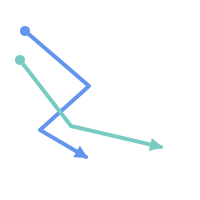


Blue: Line A; Green: Line B


```sql

SELECT ST_LineCrossingDirection(lineA, lineB) As A_cross_B,
       ST_LineCrossingDirection(lineB, lineA) As B_cross_A
FROM (SELECT
  ST_GeomFromText('LINESTRING(25 169,89 114,40 70,86 43)') As lineA,
  ST_GeomFromText('LINESTRING (20 140, 71 74, 161 53)') As lineB
  ) As foo;

 A_cross_B | B_cross_A
-----------+-----------
        -1 |         1
```


**Example:** LINE MULTICROSS END SAME FIRST LEFT and LINE MULTICROSS END SAME FIRST RIGHT


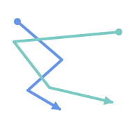


Blue: Line A; Green: Line B


```sql

SELECT ST_LineCrossingDirection(lineA, lineB) As A_cross_B,
       ST_LineCrossingDirection(lineB, lineA) As B_cross_A
FROM (SELECT
 ST_GeomFromText('LINESTRING(25 169,89 114,40 70,86 43)') As lineA,
 ST_GeomFromText('LINESTRING(171 154,20 140,71 74,161 53)') As lineB
  ) As foo;

 A_cross_B | B_cross_A
-----------+-----------
         3 |        -3
```


**Example:** LINE MULTICROSS END LEFT and LINE MULTICROSS END RIGHT


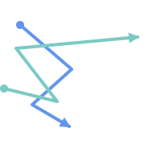


Blue: Line A; Green: Line B


```sql

SELECT ST_LineCrossingDirection(lineA, lineB) As A_cross_B,
       ST_LineCrossingDirection(lineB, lineA) As B_cross_A
FROM (SELECT
  ST_GeomFromText('LINESTRING(25 169,89 114,40 70,86 43)') As lineA,
  ST_GeomFromText('LINESTRING(5 90, 71 74, 20 140, 171 154)') As lineB
  ) As foo;

 A_cross_B | B_cross_A
-----------+-----------
        -2 |         2
```


**Example:** Finds all streets that cross


```sql


SELECT s1.gid, s2.gid, ST_LineCrossingDirection(s1.geom, s2.geom)
  FROM streets s1 CROSS JOIN streets s2
         ON (s1.gid != s2.gid AND s1.geom && s2.geom )
WHERE ST_LineCrossingDirection(s1.geom, s2.geom) > 0;
```


## See Also


[ST_Crosses](#ST_Crosses)
  <a id="ST_OrderingEquals"></a>

# ST_OrderingEquals

Tests if two geometries represent the same geometry and have points in the same directional order

## Synopsis


```sql
boolean ST_OrderingEquals(geometry  A, geometry  B)
```


## Description


ST_OrderingEquals compares two geometries and returns t (TRUE) if the geometries are equal and the coordinates are in the same order; otherwise it returns f (FALSE).


!!! note

    This function is implemented as per the ArcSDE SQL specification rather than SQL-MM. http://edndoc.esri.com/arcsde/9.1/sql_api/sqlapi3.htm#ST_OrderingEquals


 SQL-MM 3: 5.1.43


## Examples


```sql
SELECT ST_OrderingEquals(ST_GeomFromText('LINESTRING(0 0, 10 10)'),
    ST_GeomFromText('LINESTRING(0 0, 5 5, 10 10)'));
 st_orderingequals
-----------
 f
(1 row)

SELECT ST_OrderingEquals(ST_GeomFromText('LINESTRING(0 0, 10 10)'),
    ST_GeomFromText('LINESTRING(0 0, 0 0, 10 10)'));
 st_orderingequals
-----------
 t
(1 row)

SELECT ST_OrderingEquals(ST_Reverse(ST_GeomFromText('LINESTRING(0 0, 10 10)')),
    ST_GeomFromText('LINESTRING(0 0, 0 0, 10 10)'));
 st_orderingequals
-----------
 f
(1 row)
```


## See Also


[geometry_overlaps](operators.md#geometry_overlaps), [ST_Equals](#ST_Equals), [ST_Reverse](geometry-editors.md#ST_Reverse)
  <a id="ST_Overlaps"></a>

# ST_Overlaps

Tests if two geometries have the same dimension and intersect, but each has at least one point not in the other

## Synopsis


```sql
boolean ST_Overlaps(geometry  A, geometry  B)
```


## Description


Returns TRUE if geometry A and B "spatially overlap". Two geometries overlap if they have the same dimension, their interiors intersect in that dimension. and each has at least one point inside the other (or equivalently, neither one covers the other). The overlaps relation is symmetric and irreflexive.


In mathematical terms: *ST_Overlaps(A, B) ⇔ ( dim(A) = dim(B) = dim( Int(A) ⋂ Int(B) )) ∧ (A ⋂ B ≠ A) ∧ (A ⋂ B ≠ B) *


!!! note

    To avoid index use, use the function `_ST_Overlaps`.


Performed by the GEOS module


!!! important

    Enhanced: 3.0.0 enabled support for `GEOMETRYCOLLECTION`


NOTE: this is the "allowable" version that returns a boolean, not an integer.


 s2.1.1.2 // s2.1.13.3


 SQL-MM 3: 5.1.32


## Examples


`ST_Overlaps` returns `TRUE` in the following situations:


| 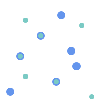   `MULTIPOINT` / `MULTIPOINT` | 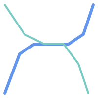   `LINESTRING` / `LINESTRING` | 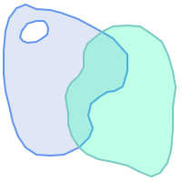   `POLYGON` / `POLYGON` |


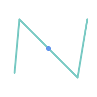


A Point on a LineString is contained, but since it has lower dimension it does not overlap or cross.


```sql

SELECT ST_Overlaps(a,b) AS overlaps,       ST_Crosses(a,b) AS crosses,
       ST_Intersects(a, b) AS intersects,  ST_Contains(b,a) AS b_contains_a
FROM (SELECT ST_GeomFromText('POINT (100 100)') As a,
             ST_GeomFromText('LINESTRING (30 50, 40 160, 160 40, 180 160)')  AS b) AS t

overlaps | crosses | intersects | b_contains_a
---------+----------------------+--------------
f        | f       | t          | t
```


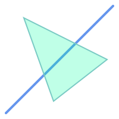


A LineString that partly covers a Polygon intersects and crosses, but does not overlap since it has different dimension.


```sql

SELECT ST_Overlaps(a,b) AS overlaps,        ST_Crosses(a,b) AS crosses,
       ST_Intersects(a, b) AS intersects,   ST_Contains(a,b) AS contains
FROM (SELECT ST_GeomFromText('POLYGON ((40 170, 90 30, 180 100, 40 170))') AS a,
             ST_GeomFromText('LINESTRING(10 10, 190 190)') AS b) AS t;

 overlap | crosses | intersects | contains
---------+---------+------------+--------------
 f       | t       | t          | f
```


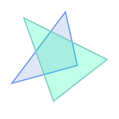


Two Polygons that intersect but with neither contained by the other overlap, but do not cross because their intersection has the same dimension.


```sql

SELECT ST_Overlaps(a,b) AS overlaps,       ST_Crosses(a,b) AS crosses,
       ST_Intersects(a, b) AS intersects,  ST_Contains(b, a) AS b_contains_a,
       ST_Dimension(a) AS dim_a, ST_Dimension(b) AS dim_b,
       ST_Dimension(ST_Intersection(a,b)) AS dim_int
FROM (SELECT ST_GeomFromText('POLYGON ((40 170, 90 30, 180 100, 40 170))') AS a,
             ST_GeomFromText('POLYGON ((110 180, 20 60, 130 90, 110 180))') AS b) As t;

 overlaps | crosses | intersects | b_contains_a | dim_a | dim_b | dim_int
----------+---------+------------+--------------+-------+-------+-----------
 t        | f       | t          | f            |     2 |     2 |       2
```


## See Also


[ST_Contains](#ST_Contains), [ST_Crosses](#ST_Crosses), [ST_Dimension](geometry-accessors.md#ST_Dimension), [ST_Intersects](#ST_Intersects)
  <a id="ST_Relate"></a>

# ST_Relate

Tests if two geometries have a topological relationship matching an Intersection Matrix pattern, or computes their Intersection Matrix

## Synopsis


```sql
boolean ST_Relate(geometry  geomA, geometry  geomB, text  intersectionMatrixPattern)
text ST_Relate(geometry  geomA, geometry  geomB)
text ST_Relate(geometry  geomA, geometry  geomB, integer  boundaryNodeRule)
```


## Description


 These functions allow testing and evaluating the spatial (topological) relationship between two geometries, as defined by the [Dimensionally Extended 9-Intersection Model](http://en.wikipedia.org/wiki/DE-9IM) (DE-9IM).


 The DE-9IM is specified as a 9-element matrix indicating the dimension of the intersections between the Interior, Boundary and Exterior of two geometries. It is represented by a 9-character text string using the symbols 'F', '0', '1', '2' (e.g. <code>'FF1FF0102'</code>).


 A specific kind of spatial relationship can be tested by matching the intersection matrix to an *intersection matrix pattern*. Patterns can include the additional symbols 'T' (meaning "intersection is non-empty") and '*' (meaning "any value"). Common spatial relationships are provided by the named functions [ST_Contains](#ST_Contains), [ST_ContainsProperly](#ST_ContainsProperly), [ST_Covers](#ST_Covers), [ST_CoveredBy](#ST_CoveredBy), [ST_Crosses](#ST_Crosses), [ST_Disjoint](#ST_Disjoint), [ST_Equals](#ST_Equals), [ST_Intersects](#ST_Intersects), [ST_Overlaps](#ST_Overlaps), [ST_Touches](#ST_Touches), and [ST_Within](#ST_Within). Using an explicit pattern allows testing multiple conditions of intersects, crosses, etc in one step. It also allows testing spatial relationships which do not have a named spatial relationship function. For example, the relationship "Interior-Intersects" has the DE-9IM pattern <code>T********</code>, which is not evaluated by any named predicate.


 For more information refer to [Determining Spatial Relationships](../spatial-queries/determining-spatial-relationships.md#eval_spatial_rel).


**Variant 1:** Tests if two geometries are spatially related according to the given `intersectionMatrixPattern`.


!!! note

    Unlike most of the named spatial relationship predicates, this does NOT automatically include an index call. The reason is that some relationships are true for geometries which do NOT intersect (e.g. Disjoint). If you are using a relationship pattern that requires intersection, then include the && index call.


!!! note

    It is better to use a named relationship function if available, since they automatically use a spatial index where one exists. Also, they may implement performance optimizations which are not available with full relate evaluation.


**Variant 2:** Returns the DE-9IM matrix string for the spatial relationship between the two input geometries. The matrix string can be tested for matching a DE-9IM pattern using [ST_RelateMatch](#ST_RelateMatch).


**Variant 3:** Like variant 2, but allows specifying a **Boundary Node Rule**. A boundary node rule allows finer control over whether the endpoints of MultiLineStrings are considered to lie in the DE-9IM Interior or Boundary. The `boundaryNodeRule` values are:


- <code>1</code>: **OGC-Mod2** - line endpoints are in the Boundary if they occur an odd number of times. This is the rule defined by the OGC SFS standard, and is the default for `ST_Relate`.
- <code>2</code>: **Endpoint** - all endpoints are in the Boundary.
- <code>3</code>: **MultivalentEndpoint** - endpoints are in the Boundary if they occur more than once. In other words, the boundary is all the "attached" or "inner" endpoints (but not the "unattached/outer" ones).
- <code>4</code>: **MonovalentEndpoint** - endpoints are in the Boundary if they occur only once. In other words, the boundary is all the "unattached" or "outer" endpoints.


This function is not in the OGC spec, but is implied. see s2.1.13.2


 s2.1.1.2 // s2.1.13.3


 SQL-MM 3: 5.1.25


Performed by the GEOS module


Enhanced: 2.0.0 - added support for specifying boundary node rule.


!!! important

    Enhanced: 3.0.0 enabled support for `GEOMETRYCOLLECTION`


## Examples


Using the boolean-valued function to test spatial relationships.


```sql

SELECT ST_Relate('POINT(1 2)', ST_Buffer( 'POINT(1 2)', 2), '0FFFFF212');
st_relate
-----------
t

SELECT ST_Relate(POINT(1 2)', ST_Buffer( 'POINT(1 2)', 2), '*FF*FF212');
st_relate
-----------
t
```


Testing a custom spatial relationship pattern as a query condition, with <code>&&</code> to enable using a spatial index.


```

-- Find compounds that properly intersect (not just touch) a poly (Interior Intersects)

SELECT c.* , p.name As poly_name
    FROM polys AS p
    INNER JOIN compounds As c
          ON c.geom && p.geom
             AND ST_Relate(p.geom, c.geom,'T********');
```


Computing the intersection matrix for spatial relationships.


```sql

SELECT ST_Relate( 'POINT(1 2)',
                  ST_Buffer( 'POINT(1 2)', 2));
-----------
0FFFFF212

SELECT ST_Relate( 'LINESTRING(1 2, 3 4)',
                  'LINESTRING(5 6, 7 8)' );
-----------
FF1FF0102
```


Using different Boundary Node Rules to compute the spatial relationship between a LineString and a MultiLineString with a duplicate endpoint <code>(3 3)</code>:


- Using the **OGC-Mod2** rule (1) the duplicate endpoint is in the **interior** of the MultiLineString, so the DE-9IM matrix entry [aB:bI] is <code>0</code> and [aB:bB] is <code>F</code>.
- Using the **Endpoint** rule (2) the duplicate endpoint is in the **boundary** of the MultiLineString, so the DE-9IM matrix entry [aB:bI] is <code>F</code> and [aB:bB] is <code>0</code>.


```sql

WITH data AS (SELECT
  'LINESTRING(1 1, 3 3)'::geometry AS a_line,
  'MULTILINESTRING((3 3, 3 5), (3 3, 5 3))':: geometry AS b_multiline
)
SELECT ST_Relate( a_line, b_multiline, 1) AS bnr_mod2,
       ST_Relate( a_line, b_multiline, 2) AS bnr_endpoint
    FROM data;

 bnr_mod2  | bnr_endpoint
-----------+--------------
 FF10F0102 | FF1F00102
```


## See Also


 [Determining Spatial Relationships](../spatial-queries/determining-spatial-relationships.md#eval_spatial_rel), [ST_RelateMatch](#ST_RelateMatch), [ST_Contains](#ST_Contains), [ST_ContainsProperly](#ST_ContainsProperly), [ST_Covers](#ST_Covers), [ST_CoveredBy](#ST_CoveredBy), [ST_Crosses](#ST_Crosses), [ST_Disjoint](#ST_Disjoint), [ST_Equals](#ST_Equals), [ST_Intersects](#ST_Intersects), [ST_Overlaps](#ST_Overlaps), [ST_Touches](#ST_Touches), [ST_Within](#ST_Within)
  <a id="ST_RelateMatch"></a>

# ST_RelateMatch

Tests if a DE-9IM Intersection Matrix matches an Intersection Matrix pattern

## Synopsis


```sql
boolean ST_RelateMatch(text  intersectionMatrix, text  intersectionMatrixPattern)
```


## Description


 Tests if a [Dimensionally Extended 9-Intersection Model](http://en.wikipedia.org/wiki/DE-9IM) (DE-9IM) `intersectionMatrix` value satisfies an `intersectionMatrixPattern`. Intersection matrix values can be computed by [ST_Relate](#ST_Relate).


 For more information refer to [Determining Spatial Relationships](../spatial-queries/determining-spatial-relationships.md#eval_spatial_rel).


Performed by the GEOS module


Availability: 2.0.0


## Examples


```sql

SELECT ST_RelateMatch('101202FFF', 'TTTTTTFFF') ;
-- result --
t
```


Patterns for common spatial relationships matched against intersection matrix values, for a line in various positions relative to a polygon


```sql

SELECT pat.name AS relationship, pat.val AS pattern,
       mat.name AS position, mat.val AS matrix,
       ST_RelateMatch(mat.val, pat.val) AS match
    FROM (VALUES ( 'Equality', 'T1FF1FFF1' ),
                 ( 'Overlaps', 'T*T***T**' ),
                 ( 'Within',   'T*F**F***' ),
                 ( 'Disjoint', 'FF*FF****' )) AS pat(name,val)
    CROSS JOIN
        (VALUES  ('non-intersecting', 'FF1FF0212'),
                 ('overlapping',      '1010F0212'),
                 ('inside',           '1FF0FF212')) AS mat(name,val);

 relationship |  pattern  |     position     |  matrix   | match
--------------+-----------+------------------+-----------+-------
 Equality     | T1FF1FFF1 | non-intersecting | FF1FF0212 | f
 Equality     | T1FF1FFF1 | overlapping      | 1010F0212 | f
 Equality     | T1FF1FFF1 | inside           | 1FF0FF212 | f
 Overlaps     | T*T***T** | non-intersecting | FF1FF0212 | f
 Overlaps     | T*T***T** | overlapping      | 1010F0212 | t
 Overlaps     | T*T***T** | inside           | 1FF0FF212 | f
 Within       | T*F**F*** | non-intersecting | FF1FF0212 | f
 Within       | T*F**F*** | overlapping      | 1010F0212 | f
 Within       | T*F**F*** | inside           | 1FF0FF212 | t
 Disjoint     | FF*FF**** | non-intersecting | FF1FF0212 | t
 Disjoint     | FF*FF**** | overlapping      | 1010F0212 | f
 Disjoint     | FF*FF**** | inside           | 1FF0FF212 | f
```


## See Also


[Determining Spatial Relationships](../spatial-queries/determining-spatial-relationships.md#eval_spatial_rel), [ST_Relate](#ST_Relate)
  <a id="ST_Touches"></a>

# ST_Touches

Tests if two geometries have at least one point in common, but their interiors do not intersect

## Synopsis


```sql
boolean ST_Touches(geometry
      A, geometry
      B)
```


## Description


Returns `TRUE` if A and B intersect, but their interiors do not intersect. Equivalently, A and B have at least one point in common, and the common points lie in at least one boundary. For Point/Point inputs the relationship is always `FALSE`, since points do not have a boundary.


In mathematical terms: *ST_Touches(A, B) ⇔ (Int(A) ⋂ Int(B) = ∅) ∧ (A ⋂ B ≠ ∅) *


This relationship holds if the DE-9IM Intersection Matrix for the two geometries matches one of:


- `FT*******`
- `F**T*****`
- `F***T****`


!!! note

    To avoid using an index, use `_ST_Touches` instead.


!!! important

    Enhanced: 3.0.0 enabled support for `GEOMETRYCOLLECTION`


 s2.1.1.2 // s2.1.13.3


 SQL-MM 3: 5.1.28


## Examples


The `ST_Touches` predicate returns `TRUE` in the following examples.


| 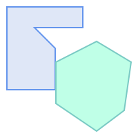   `POLYGON` / `POLYGON` | 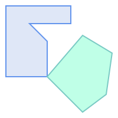   `POLYGON` / `POLYGON` | 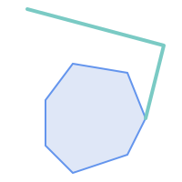   `POLYGON` / `LINESTRING` |
| 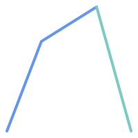   `LINESTRING` / `LINESTRING` | 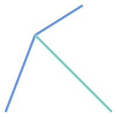   `LINESTRING` / `LINESTRING` | 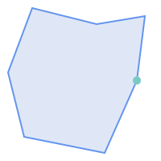   `POLYGON` / `POINT` |


```sql
SELECT ST_Touches('LINESTRING(0 0, 1 1, 0 2)'::geometry, 'POINT(1 1)'::geometry);
 st_touches
------------
 f
(1 row)

SELECT ST_Touches('LINESTRING(0 0, 1 1, 0 2)'::geometry, 'POINT(0 2)'::geometry);
 st_touches
------------
 t
(1 row)
```
  <a id="ST_Within"></a>

# ST_Within

Tests if every point of A lies in B, and their interiors have a point in common

## Synopsis


```sql
boolean ST_Within(geometry
      A, geometry
      B)
```


## Description


Returns TRUE if geometry A is within geometry B. A is within B if and only if all points of A lie inside (i.e. in the interior or boundary of) B (or equivalently, no points of A lie in the exterior of B), and the interiors of A and B have at least one point in common.


For this function to make sense, the source geometries must both be of the same coordinate projection, having the same SRID.


In mathematical terms: *ST_Within(A, B) ⇔ (A ⋂ B = A) ∧ (Int(A) ⋂ Int(B) ≠ ∅) *


The within relation is reflexive: every geometry is within itself. The relation is antisymmetric: if <code>ST_Within(A,B) = true</code> and <code>ST_Within(B,A) = true</code>, then the two geometries must be topologically equal (<code>ST_Equals(A,B) = true</code>).


ST_Within is the converse of [ST_Contains](#ST_Contains). So, <code>ST_Within(A,B) = ST_Contains(B,A)</code>.


!!! note

    Because the interiors must have a common point, a subtlety of the definition is that lines and points lying fully in the boundary of polygons or lines are *not* within the geometry. For further details see [Subtleties of OGC Covers, Contains, Within](http://lin-ear-th-inking.blogspot.com/2007/06/subtleties-of-ogc-covers-spatial.html). The [ST_CoveredBy](#ST_CoveredBy) predicate provides a more inclusive relationship.


!!! note

    To avoid index use, use the function `_ST_Within`.


Performed by the GEOS module


Enhanced: 2.3.0 Enhancement to PIP short-circuit for geometry extended to support MultiPoints with few points. Prior versions only supported point in polygon.


!!! important

    Enhanced: 3.0.0 enabled support for `GEOMETRYCOLLECTION`


!!! important

    Do not use this function with invalid geometries. You will get unexpected results.


NOTE: this is the "allowable" version that returns a boolean, not an integer.


 s2.1.1.2 // s2.1.13.3 - a.Relate(b, 'T*F**F***')


 SQL-MM 3: 5.1.30


## Examples


```

--a circle within a circle
SELECT ST_Within(smallc,smallc) As smallinsmall,
  ST_Within(smallc, bigc) As smallinbig,
  ST_Within(bigc,smallc) As biginsmall,
  ST_Within(ST_Union(smallc, bigc), bigc) as unioninbig,
  ST_Within(bigc, ST_Union(smallc, bigc)) as biginunion,
  ST_Equals(bigc, ST_Union(smallc, bigc)) as bigisunion
FROM
(
SELECT ST_Buffer(ST_GeomFromText('POINT(50 50)'), 20) As smallc,
  ST_Buffer(ST_GeomFromText('POINT(50 50)'), 40) As bigc) As foo;
--Result
 smallinsmall | smallinbig | biginsmall | unioninbig | biginunion | bigisunion
--------------+------------+------------+------------+------------+------------
 t            | t          | f          | t          | t          | t
(1 row)

```


## See Also


[ST_Contains](#ST_Contains), [ST_CoveredBy](#ST_CoveredBy), [ST_Equals](#ST_Equals), [ST_IsValid](geometry-validation.md#ST_IsValid)


## Distance Relationships
  <a id="ST_3DDWithin"></a>

# ST_3DDWithin

Tests if two 3D geometries are within a given 3D distance

## Synopsis


```sql
boolean ST_3DDWithin(geometry
      g1, geometry
      g2, double precision
      distance_of_srid)
```


## Description


Returns true if the 3D distance between two geometry values is no larger than distance `distance_of_srid`. The distance is specified in units defined by the spatial reference system of the geometries. For this function to make sense the source geometries must be in the same coordinate system (have the same SRID).


!!! note


 SQL-MM ?


Availability: 2.0.0


## Examples


```

-- Geometry example - units in meters (SRID: 2163 US National Atlas Equal area) (3D point and line compared 2D point and line)
-- Note: currently no vertical datum support so Z is not transformed and assumed to be same units as final.
SELECT ST_3DDWithin(
      ST_Transform(ST_GeomFromEWKT('SRID=4326;POINT(-72.1235 42.3521 4)'),2163),
      ST_Transform(ST_GeomFromEWKT('SRID=4326;LINESTRING(-72.1260 42.45 15, -72.123 42.1546 20)'),2163),
      126.8
    ) As within_dist_3d,
ST_DWithin(
      ST_Transform(ST_GeomFromEWKT('SRID=4326;POINT(-72.1235 42.3521 4)'),2163),
      ST_Transform(ST_GeomFromEWKT('SRID=4326;LINESTRING(-72.1260 42.45 15, -72.123 42.1546 20)'),2163),
      126.8
    ) As within_dist_2d;

 within_dist_3d | within_dist_2d
----------------+----------------
 f              | t
```


## See Also


 [ST_3DDFullyWithin](#ST_3DDFullyWithin), [ST_DWithin](#ST_DWithin), [ST_DFullyWithin](#ST_DFullyWithin), [ST_3DDistance](measurement-functions.md#ST_3DDistance), [ST_Distance](measurement-functions.md#ST_Distance), [ST_3DMaxDistance](measurement-functions.md#ST_3DMaxDistance), [ST_Transform](spatial-reference-system-functions.md#ST_Transform)
  <a id="ST_3DDFullyWithin"></a>

# ST_3DDFullyWithin

Tests if two 3D geometries are entirely within a given 3D distance

## Synopsis


```sql
boolean ST_3DDFullyWithin(geometry
      g1, geometry
      g2, double precision
      distance)
```


## Description


Returns true if the 3D geometries are fully within the specified distance of one another. The distance is specified in units defined by the spatial reference system of the geometries. For this function to make sense, the source geometries must both be of the same coordinate projection, having the same SRID.


!!! note


Availability: 2.0.0


## Examples


```

    -- This compares the difference between fully within and distance within as well
    -- as the distance fully within for the 2D footprint of the line/point vs. the 3d fully within
    SELECT ST_3DDFullyWithin(geom_a, geom_b, 10) as D3DFullyWithin10, ST_3DDWithin(geom_a, geom_b, 10) as D3DWithin10,
  ST_DFullyWithin(geom_a, geom_b, 20) as D2DFullyWithin20,
  ST_3DDFullyWithin(geom_a, geom_b, 20) as D3DFullyWithin20 from
    (select ST_GeomFromEWKT('POINT(1 1 2)') as geom_a,
    ST_GeomFromEWKT('LINESTRING(1 5 2, 2 7 20, 1 9 100, 14 12 3)') as geom_b) t1;
 d3dfullywithin10 | d3dwithin10 | d2dfullywithin20 | d3dfullywithin20
------------------+-------------+------------------+------------------
 f                | t           | t                | f
```


## See Also


[ST_3DDWithin](#ST_3DDWithin), [ST_DWithin](#ST_DWithin), [ST_DFullyWithin](#ST_DFullyWithin), [ST_3DMaxDistance](measurement-functions.md#ST_3DMaxDistance)
  <a id="ST_DFullyWithin"></a>

# ST_DFullyWithin

Tests if a geometry is entirely inside a distance of another

## Synopsis


```sql
boolean ST_DFullyWithin(geometry
      g1, geometry
      g2, double precision
      distance)
```


## Description


Returns true if <code>g2</code> is entirely within <code>distance</code> of <code>g1</code>. Visually, the condition is true if <code>g2</code> is contained within a <code>distance</code> buffer of <code>g1</code>. The distance is specified in units defined by the spatial reference system of the geometries.


!!! note


Availability: 1.5.0


Changed: 3.5.0 : the logic behind the function now uses a test of containment within a buffer, rather than the ST_MaxDistance algorithm. Results will differ from prior versions, but should be closer to user expectations.


## Examples


```sql
SELECT
    ST_DFullyWithin(geom_a, geom_b, 10) AS DFullyWithin10,
    ST_DWithin(geom_a, geom_b, 10) AS DWithin10,
    ST_DFullyWithin(geom_a, geom_b, 20) AS DFullyWithin20
FROM (VALUES
    ('POINT(1 1)', 'LINESTRING(1 5, 2 7, 1 9, 14 12)')
    ) AS v(geom_a, geom_b)

 dfullywithin10 | dwithin10 | dfullywithin20
----------------+-----------+----------------
 f              | t         | t
```


## See Also


[ST_MaxDistance](measurement-functions.md#ST_MaxDistance), [ST_DWithin](#ST_DWithin), [ST_3DDWithin](#ST_3DDWithin), [ST_3DDFullyWithin](#ST_3DDFullyWithin)
  <a id="ST_DWithin"></a>

# ST_DWithin

Tests if two geometries are within a given distance

## Synopsis


```sql
boolean ST_DWithin(geometry
        g1, geometry
        g2, double precision
        distance_of_srid)
boolean ST_DWithin(geography
        gg1, geography
        gg2, double precision
        distance_meters, boolean
        use_spheroid = true)
```


## Description


Returns true if the geometries are within a given distance


For `geometry`: The distance is specified in units defined by the spatial reference system of the geometries. For this function to make sense, the source geometries must be in the same coordinate system (have the same SRID).


For `geography`: units are in meters and distance measurement defaults to `use_spheroid = true`. For faster evaluation use `use_spheroid = false` to measure on the sphere.


!!! note

    Use [ST_3DDWithin](#ST_3DDWithin) for 3D geometries.


!!! note

    This function call includes a bounding box comparison that makes use of any indexes that are available on the geometries.


Availability: 1.5.0 support for geography was introduced


Enhanced: 2.1.0 improved speed for geography. See [Making Geography faster](http://blog.opengeo.org/2012/07/12/making-geography-faster/) for details.


Enhanced: 2.1.0 support for curved geometries was introduced.


Prior to 1.3, [ST_Expand](bounding-box-functions.md#ST_Expand) was commonly used in conjunction with && and ST_Distance to test for distance, and in pre-1.3.4 this function used that logic. From 1.3.4, ST_DWithin uses a faster short-circuit distance function.


## Examples


```

-- Find the nearest hospital to each school
-- that is within 3000 units of the school.
--  We do an ST_DWithin search to utilize indexes to limit our search list
--  that the non-indexable ST_Distance needs to process
-- If the units of the spatial reference is meters then units would be meters
SELECT DISTINCT ON (s.gid) s.gid, s.school_name, s.geom, h.hospital_name
  FROM schools s
    LEFT JOIN hospitals h ON ST_DWithin(s.geom, h.geom, 3000)
  ORDER BY s.gid, ST_Distance(s.geom, h.geom);

-- The schools with no close hospitals
-- Find all schools with no hospital within 3000 units
-- away from the school.  Units is in units of spatial ref (e.g. meters, feet, degrees)
SELECT s.gid, s.school_name
  FROM schools s
    LEFT JOIN hospitals h ON ST_DWithin(s.geom, h.geom, 3000)
  WHERE h.gid IS NULL;

-- Find broadcasting towers that receiver with limited range can receive.
-- Data is geometry in Spherical Mercator (SRID=3857), ranges are approximate.

-- Create geometry index that will check proximity limit of user to tower
CREATE INDEX ON broadcasting_towers using gist (geom);

-- Create geometry index that will check proximity limit of tower to user
CREATE INDEX ON broadcasting_towers using gist (ST_Expand(geom, sending_range));

-- Query towers that 4-kilometer receiver in Minsk Hackerspace can get
-- Note: two conditions, because shorter LEAST(b.sending_range, 4000) will not use index.
SELECT b.tower_id, b.geom
  FROM broadcasting_towers b
  WHERE ST_DWithin(b.geom, 'SRID=3857;POINT(3072163.4 7159374.1)', 4000)
    AND ST_DWithin(b.geom, 'SRID=3857;POINT(3072163.4 7159374.1)', b.sending_range);


```


## See Also


[ST_Distance](measurement-functions.md#ST_Distance), [ST_3DDWithin](#ST_3DDWithin)
  <a id="ST_PointInsideCircle"></a>

# ST_PointInsideCircle

Tests if a point geometry is inside a circle defined by a center and radius

## Synopsis


```sql
boolean ST_PointInsideCircle(geometry  a_point, float  center_x, float  center_y, float  radius)
```


## Description


Returns true if the geometry is a point and is inside the circle with center `center_x`,`center_y` and radius `radius`.


!!! warning

    Does not use spatial indexes. Use [ST_DWithin](#ST_DWithin) instead.


Availability: 1.2


Changed: 2.2.0 In prior versions this was called ST_Point_Inside_Circle


## Examples


```sql
SELECT ST_PointInsideCircle(ST_Point(1,2), 0.5, 2, 3);
 st_pointinsidecircle
------------------------
 t
```


## See Also


[ST_DWithin](#ST_DWithin)
