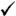

## PostGIS Function Support Matrix

Below is an alphabetical listing of spatial specific functions in PostGIS and the kinds of spatial types they work with or OGC/SQL compliance they try to conform to.

- A

   means the function works with the type or subtype natively.
- A

   means it works but with a transform cast built-in using cast to geometry, transform to a "best srid" spatial ref and then cast back. Results may not be as expected for large areas or areas at poles and may accumulate floating point junk.
- A

   means the function works with the type because of a auto-cast to another such as to box3d rather than direct type support.
- A

   means the function only available if PostGIS compiled with SFCGAL support.
- geom - Basic 2D geometry support (x,y).
- geog - Basic 2D geography support (x,y).
- 2.5D - basic 2D geometries in 3 D/4D space (has Z or M coord).
- PS - Polyhedral surfaces
- T - Triangles and Triangulated Irregular Network surfaces (TIN)

| Function | geom | geog | 2.5D | Curves | SQL MM | PS | T |
| --- | --- | --- | --- | --- | --- | --- | --- |
