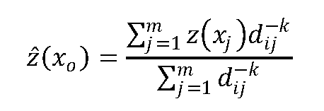

<a id="Raster_Processing_MapAlgebra_Callbacks"></a>

## Built-in Map Algebra Callback Functions
  <a id="RT_ST_Distinct4ma"></a>

# ST_Distinct4ma

Raster processing function that calculates the number of unique pixel values in a neighborhood.

## Synopsis


```sql
float8 ST_Distinct4ma(float8[][] matrix, text nodatamode, text[] VARIADIC args)
double precision ST_Distinct4ma(double precision[][][] value, integer[][]  pos, text[] VARIADIC userargs)
```


## Description


Calculate the number of unique pixel values in a neighborhood of pixels.


!!! note

    Variant 1 is a specialized callback function for use as a callback parameter to [RT_ST_MapAlgebraFctNgb](raster-processing-map-algebra.md#RT_ST_MapAlgebraFctNgb).


!!! note

    Variant 2 is a specialized callback function for use as a callback parameter to [RT_ST_MapAlgebra](raster-processing-map-algebra.md#RT_ST_MapAlgebra).


!!! warning

    Use of Variant 1 is discouraged since [RT_ST_MapAlgebraFctNgb](raster-processing-map-algebra.md#RT_ST_MapAlgebraFctNgb) has been deprecated as of 2.1.0.


Availability: 2.0.0


Enhanced: 2.1.0 Addition of Variant 2


## Examples


```sql
SELECT
    rid,
    st_value(
        st_mapalgebrafctngb(rast, 1, NULL, 1, 1, 'st_distinct4ma(float[][],text,text[])'::regprocedure, 'ignore', NULL), 2, 2
    )
FROM dummy_rast
WHERE rid = 2;
 rid | st_value
-----+----------
   2 |        3
(1 row)

```


## See Also


 [RT_ST_MapAlgebraFctNgb](raster-processing-map-algebra.md#RT_ST_MapAlgebraFctNgb), [RT_ST_MapAlgebra](raster-processing-map-algebra.md#RT_ST_MapAlgebra), [RT_ST_Min4ma](#RT_ST_Min4ma), [RT_ST_Max4ma](#RT_ST_Max4ma), [RT_ST_Sum4ma](#RT_ST_Sum4ma), [RT_ST_Mean4ma](#RT_ST_Mean4ma), [RT_ST_Distinct4ma](#RT_ST_Distinct4ma), [RT_ST_StdDev4ma](#RT_ST_StdDev4ma)
  <a id="RT_ST_InvDistWeight4ma"></a>

# ST_InvDistWeight4ma

Raster processing function that interpolates a pixel's value from the pixel's neighborhood.

## Synopsis


```sql
double precision ST_InvDistWeight4ma(double precision[][][] value, integer[][] pos, text[] VARIADIC userargs)
```


## Description


Calculate an interpolated value for a pixel using the Inverse Distance Weighted method.


 There are two optional parameters that can be passed through `userargs`. The first parameter is the power factor (variable k in the equation below) between 0 and 1 used in the Inverse Distance Weighted equation. If not specified, default value is 1. The second parameter is the weight percentage applied only when the value of the pixel of interest is included with the interpolated value from the neighborhood. If not specified and the pixel of interest has a value, that value is returned.


 The basic inverse distance weight equation is:




 k = power factor, a real number between 0 and 1


!!! note

    This function is a specialized callback function for use as a callback parameter to [RT_ST_MapAlgebra](raster-processing-map-algebra.md#RT_ST_MapAlgebra).


Availability: 2.1.0


## Examples


```

-- NEEDS EXAMPLE

```


## See Also


 [RT_ST_MapAlgebra](raster-processing-map-algebra.md#RT_ST_MapAlgebra), [RT_ST_MinDist4ma](#RT_ST_MinDist4ma)
  <a id="RT_ST_Max4ma"></a>

# ST_Max4ma

Raster processing function that calculates the maximum pixel value in a neighborhood.

## Synopsis


```sql
float8 ST_Max4ma(float8[][] matrix, text nodatamode, text[] VARIADIC args)
double precision ST_Max4ma(double precision[][][] value, integer[][]  pos, text[] VARIADIC userargs)
```


## Description


Calculate the maximum pixel value in a neighborhood of pixels.


 For Variant 2, a substitution value for NODATA pixels can be specified by passing that value to userargs.


!!! note

    Variant 1 is a specialized callback function for use as a callback parameter to [RT_ST_MapAlgebraFctNgb](raster-processing-map-algebra.md#RT_ST_MapAlgebraFctNgb).


!!! note

    Variant 2 is a specialized callback function for use as a callback parameter to [RT_ST_MapAlgebra](raster-processing-map-algebra.md#RT_ST_MapAlgebra).


!!! warning

    Use of Variant 1 is discouraged since [RT_ST_MapAlgebraFctNgb](raster-processing-map-algebra.md#RT_ST_MapAlgebraFctNgb) has been deprecated as of 2.1.0.


Availability: 2.0.0


Enhanced: 2.1.0 Addition of Variant 2


## Examples


```sql
SELECT
    rid,
    st_value(
        st_mapalgebrafctngb(rast, 1, NULL, 1, 1, 'st_max4ma(float[][],text,text[])'::regprocedure, 'ignore', NULL), 2, 2
    )
FROM dummy_rast
WHERE rid = 2;
 rid | st_value
-----+----------
   2 |      254
(1 row)

```


## See Also


 [RT_ST_MapAlgebraFctNgb](raster-processing-map-algebra.md#RT_ST_MapAlgebraFctNgb), [RT_ST_MapAlgebra](raster-processing-map-algebra.md#RT_ST_MapAlgebra), [RT_ST_Min4ma](#RT_ST_Min4ma), [RT_ST_Sum4ma](#RT_ST_Sum4ma), [RT_ST_Mean4ma](#RT_ST_Mean4ma), [RT_ST_Range4ma](#RT_ST_Range4ma), [RT_ST_Distinct4ma](#RT_ST_Distinct4ma), [RT_ST_StdDev4ma](#RT_ST_StdDev4ma)
  <a id="RT_ST_Mean4ma"></a>

# ST_Mean4ma

Raster processing function that calculates the mean pixel value in a neighborhood.

## Synopsis


```sql
float8 ST_Mean4ma(float8[][] matrix, text nodatamode, text[] VARIADIC args)
double precision ST_Mean4ma(double precision[][][] value, integer[][]  pos, text[] VARIADIC userargs)
```


## Description


Calculate the mean pixel value in a neighborhood of pixels.


 For Variant 2, a substitution value for NODATA pixels can be specified by passing that value to userargs.


!!! note

    Variant 1 is a specialized callback function for use as a callback parameter to [RT_ST_MapAlgebraFctNgb](raster-processing-map-algebra.md#RT_ST_MapAlgebraFctNgb).


!!! note

    Variant 2 is a specialized callback function for use as a callback parameter to [RT_ST_MapAlgebra](raster-processing-map-algebra.md#RT_ST_MapAlgebra).


!!! warning

    Use of Variant 1 is discouraged since [RT_ST_MapAlgebraFctNgb](raster-processing-map-algebra.md#RT_ST_MapAlgebraFctNgb) has been deprecated as of 2.1.0.


Availability: 2.0.0


Enhanced: 2.1.0 Addition of Variant 2


## Examples: Variant 1


```sql
SELECT
    rid,
    st_value(
        st_mapalgebrafctngb(rast, 1, '32BF', 1, 1, 'st_mean4ma(float[][],text,text[])'::regprocedure, 'ignore', NULL), 2, 2
    )
FROM dummy_rast
WHERE rid = 2;
 rid |     st_value
-----+------------------
   2 | 253.222229003906
(1 row)

```


## Examples: Variant 2


```sql
SELECT
    rid,
    st_value(
              ST_MapAlgebra(rast, 1, 'st_mean4ma(double precision[][][], integer[][], text[])'::regprocedure,'32BF', 'FIRST', NULL, 1, 1)
       ,  2, 2)
  FROM dummy_rast
   WHERE rid = 2;
 rid |     st_value
-----+------------------
   2 | 253.222229003906
(1 row)
```


## See Also


 [RT_ST_MapAlgebraFctNgb](raster-processing-map-algebra.md#RT_ST_MapAlgebraFctNgb), [RT_ST_MapAlgebra](raster-processing-map-algebra.md#RT_ST_MapAlgebra), [RT_ST_Min4ma](#RT_ST_Min4ma), [RT_ST_Max4ma](#RT_ST_Max4ma), [RT_ST_Sum4ma](#RT_ST_Sum4ma), [RT_ST_Range4ma](#RT_ST_Range4ma), [RT_ST_StdDev4ma](#RT_ST_StdDev4ma)
  <a id="RT_ST_Min4ma"></a>

# ST_Min4ma

Raster processing function that calculates the minimum pixel value in a neighborhood.

## Synopsis


```sql
float8 ST_Min4ma(float8[][] matrix, text  nodatamode, text[] VARIADIC args)
double precision ST_Min4ma(double precision[][][] value, integer[][]  pos, text[] VARIADIC userargs)
```


## Description


 Calculate the minimum pixel value in a neighborhood of pixels.


 For Variant 2, a substitution value for NODATA pixels can be specified by passing that value to userargs.


!!! note

    Variant 1 is a specialized callback function for use as a callback parameter to [RT_ST_MapAlgebraFctNgb](raster-processing-map-algebra.md#RT_ST_MapAlgebraFctNgb).


!!! note

    Variant 2 is a specialized callback function for use as a callback parameter to [RT_ST_MapAlgebra](raster-processing-map-algebra.md#RT_ST_MapAlgebra).


!!! warning

    Use of Variant 1 is discouraged since [RT_ST_MapAlgebraFctNgb](raster-processing-map-algebra.md#RT_ST_MapAlgebraFctNgb) has been deprecated as of 2.1.0.


Availability: 2.0.0


Enhanced: 2.1.0 Addition of Variant 2


## Examples


```sql

SELECT
    rid,
    st_value(
        st_mapalgebrafctngb(rast, 1, NULL, 1, 1, 'st_min4ma(float[][],text,text[])'::regprocedure, 'ignore', NULL), 2, 2
    )
FROM dummy_rast
WHERE rid = 2;
 rid | st_value
-----+----------
   2 |      250
(1 row)

```


## See Also


 [RT_ST_MapAlgebraFctNgb](raster-processing-map-algebra.md#RT_ST_MapAlgebraFctNgb), [RT_ST_MapAlgebra](raster-processing-map-algebra.md#RT_ST_MapAlgebra), [RT_ST_Max4ma](#RT_ST_Max4ma), [RT_ST_Sum4ma](#RT_ST_Sum4ma), [RT_ST_Mean4ma](#RT_ST_Mean4ma), [RT_ST_Range4ma](#RT_ST_Range4ma), [RT_ST_Distinct4ma](#RT_ST_Distinct4ma), [RT_ST_StdDev4ma](#RT_ST_StdDev4ma)
  <a id="RT_ST_MinDist4ma"></a>

# ST_MinDist4ma

Raster processing function that returns the minimum distance (in number of pixels) between the pixel of interest and a neighboring pixel with value.

## Synopsis


```sql
double precision ST_MinDist4ma(double precision[][][] value, integer[][] pos, text[] VARIADIC userargs)
```


## Description


Return the shortest distance (in number of pixels) between the pixel of interest and the closest pixel with value in the neighborhood.


!!! note

    The intent of this function is to provide an informative data point that helps infer the usefulness of the pixel of interest's interpolated value from [RT_ST_InvDistWeight4ma](#RT_ST_InvDistWeight4ma). This function is particularly useful when the neighborhood is sparsely populated.


!!! note

    This function is a specialized callback function for use as a callback parameter to [RT_ST_MapAlgebra](raster-processing-map-algebra.md#RT_ST_MapAlgebra).


Availability: 2.1.0


## Examples


```

-- NEEDS EXAMPLE

```


## See Also


 [RT_ST_MapAlgebra](raster-processing-map-algebra.md#RT_ST_MapAlgebra), [RT_ST_InvDistWeight4ma](#RT_ST_InvDistWeight4ma)
  <a id="RT_ST_Range4ma"></a>

# ST_Range4ma

Raster processing function that calculates the range of pixel values in a neighborhood.

## Synopsis


```sql
float8 ST_Range4ma(float8[][] matrix, text nodatamode, text[] VARIADIC args)
double precision ST_Range4ma(double precision[][][] value, integer[][]  pos, text[] VARIADIC userargs)
```


## Description


Calculate the range of pixel values in a neighborhood of pixels.


 For Variant 2, a substitution value for NODATA pixels can be specified by passing that value to userargs.


!!! note

    Variant 1 is a specialized callback function for use as a callback parameter to [RT_ST_MapAlgebraFctNgb](raster-processing-map-algebra.md#RT_ST_MapAlgebraFctNgb).


!!! note

    Variant 2 is a specialized callback function for use as a callback parameter to [RT_ST_MapAlgebra](raster-processing-map-algebra.md#RT_ST_MapAlgebra).


!!! warning

    Use of Variant 1 is discouraged since [RT_ST_MapAlgebraFctNgb](raster-processing-map-algebra.md#RT_ST_MapAlgebraFctNgb) has been deprecated as of 2.1.0.


Availability: 2.0.0


Enhanced: 2.1.0 Addition of Variant 2


## Examples


```sql
SELECT
    rid,
    st_value(
        st_mapalgebrafctngb(rast, 1, NULL, 1, 1, 'st_range4ma(float[][],text,text[])'::regprocedure, 'ignore', NULL), 2, 2
    )
FROM dummy_rast
WHERE rid = 2;
 rid | st_value
-----+----------
   2 |        4
(1 row)

```


## See Also


 [RT_ST_MapAlgebraFctNgb](raster-processing-map-algebra.md#RT_ST_MapAlgebraFctNgb), [RT_ST_MapAlgebra](raster-processing-map-algebra.md#RT_ST_MapAlgebra), [RT_ST_Min4ma](#RT_ST_Min4ma), [RT_ST_Max4ma](#RT_ST_Max4ma), [RT_ST_Sum4ma](#RT_ST_Sum4ma), [RT_ST_Mean4ma](#RT_ST_Mean4ma), [RT_ST_Distinct4ma](#RT_ST_Distinct4ma), [RT_ST_StdDev4ma](#RT_ST_StdDev4ma)
  <a id="RT_ST_StdDev4ma"></a>

# ST_StdDev4ma

Raster processing function that calculates the standard deviation of pixel values in a neighborhood.

## Synopsis


```sql
float8 ST_StdDev4ma(float8[][] matrix, text  nodatamode, text[] VARIADIC args)
double precision ST_StdDev4ma(double precision[][][] value, integer[][]  pos, text[] VARIADIC userargs)
```


## Description


Calculate the standard deviation of pixel values in a neighborhood of pixels.


!!! note

    Variant 1 is a specialized callback function for use as a callback parameter to [RT_ST_MapAlgebraFctNgb](raster-processing-map-algebra.md#RT_ST_MapAlgebraFctNgb).


!!! note

    Variant 2 is a specialized callback function for use as a callback parameter to [RT_ST_MapAlgebra](raster-processing-map-algebra.md#RT_ST_MapAlgebra).


!!! warning

    Use of Variant 1 is discouraged since [RT_ST_MapAlgebraFctNgb](raster-processing-map-algebra.md#RT_ST_MapAlgebraFctNgb) has been deprecated as of 2.1.0.


Availability: 2.0.0


Enhanced: 2.1.0 Addition of Variant 2


## Examples


```sql
SELECT
    rid,
    st_value(
        st_mapalgebrafctngb(rast, 1, '32BF', 1, 1, 'st_stddev4ma(float[][],text,text[])'::regprocedure, 'ignore', NULL), 2, 2
    )
FROM dummy_rast
WHERE rid = 2;
 rid |     st_value
-----+------------------
   2 | 1.30170822143555
(1 row)

```


## See Also


 [RT_ST_MapAlgebraFctNgb](raster-processing-map-algebra.md#RT_ST_MapAlgebraFctNgb), [RT_ST_MapAlgebra](raster-processing-map-algebra.md#RT_ST_MapAlgebra), [RT_ST_Min4ma](#RT_ST_Min4ma), [RT_ST_Max4ma](#RT_ST_Max4ma), [RT_ST_Sum4ma](#RT_ST_Sum4ma), [RT_ST_Mean4ma](#RT_ST_Mean4ma), [RT_ST_Distinct4ma](#RT_ST_Distinct4ma), [RT_ST_StdDev4ma](#RT_ST_StdDev4ma)
  <a id="RT_ST_Sum4ma"></a>

# ST_Sum4ma

Raster processing function that calculates the sum of all pixel values in a neighborhood.

## Synopsis


```sql
float8 ST_Sum4ma(float8[][] matrix, text nodatamode, text[] VARIADIC args)
double precision ST_Sum4ma(double precision[][][] value, integer[][]  pos, text[] VARIADIC userargs)
```


## Description


Calculate the sum of all pixel values in a neighborhood of pixels.


 For Variant 2, a substitution value for NODATA pixels can be specified by passing that value to userargs.


!!! note

    Variant 1 is a specialized callback function for use as a callback parameter to [RT_ST_MapAlgebraFctNgb](raster-processing-map-algebra.md#RT_ST_MapAlgebraFctNgb).


!!! note

    Variant 2 is a specialized callback function for use as a callback parameter to [RT_ST_MapAlgebra](raster-processing-map-algebra.md#RT_ST_MapAlgebra).


!!! warning

    Use of Variant 1 is discouraged since [RT_ST_MapAlgebraFctNgb](raster-processing-map-algebra.md#RT_ST_MapAlgebraFctNgb) has been deprecated as of 2.1.0.


Availability: 2.0.0


Enhanced: 2.1.0 Addition of Variant 2


## Examples


```sql
SELECT
    rid,
    st_value(
        st_mapalgebrafctngb(rast, 1, '32BF', 1, 1, 'st_sum4ma(float[][],text,text[])'::regprocedure, 'ignore', NULL), 2, 2
    )
FROM dummy_rast
WHERE rid = 2;
 rid | st_value
-----+----------
   2 |     2279
(1 row)

```


## See Also


 [RT_ST_MapAlgebraFctNgb](raster-processing-map-algebra.md#RT_ST_MapAlgebraFctNgb), [RT_ST_MapAlgebra](raster-processing-map-algebra.md#RT_ST_MapAlgebra), [RT_ST_Min4ma](#RT_ST_Min4ma), [RT_ST_Max4ma](#RT_ST_Max4ma), [RT_ST_Mean4ma](#RT_ST_Mean4ma), [RT_ST_Range4ma](#RT_ST_Range4ma), [RT_ST_Distinct4ma](#RT_ST_Distinct4ma), [RT_ST_StdDev4ma](#RT_ST_StdDev4ma)
