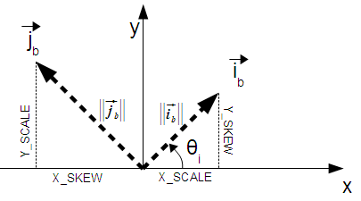

<a id="Raster_Accessors"></a>

## Raster Accessors
  <a id="RT_ST_GeoReference"></a>

# ST_GeoReference

Returns the georeference meta data in GDAL or ESRI format as commonly seen in a world file. Default is GDAL.

## Synopsis


```sql
text ST_GeoReference(raster  rast, text  format=GDAL)
```


## Description


Returns the georeference meta data including carriage return in GDAL or ESRI format as commonly seen in a [world file](http://en.wikipedia.org/wiki/World_file). Default is GDAL if no type specified. type is string 'GDAL' or 'ESRI'.


Difference between format representations is as follows:


`GDAL`:

```
scalex
skewy
skewx
scaley
upperleftx
upperlefty
```


`ESRI`:

```
scalex
skewy
skewx
scaley
upperleftx + scalex*0.5
upperlefty + scaley*0.5
```


## Examples


```sql
SELECT ST_GeoReference(rast, 'ESRI') As esri_ref, ST_GeoReference(rast, 'GDAL') As gdal_ref
 FROM dummy_rast WHERE rid=1;

   esri_ref   |   gdal_ref
--------------+--------------
 2.0000000000 | 2.0000000000
 0.0000000000 : 0.0000000000
 0.0000000000 : 0.0000000000
 3.0000000000 : 3.0000000000
 1.5000000000 : 0.5000000000
 2.0000000000 : 0.5000000000

```


## See Also


[RT_ST_SetGeoReference](raster-editors.md#RT_ST_SetGeoReference), [RT_ST_ScaleX](#RT_ST_ScaleX), [RT_ST_ScaleY](#RT_ST_ScaleY)
  <a id="RT_ST_Height"></a>

# ST_Height

Returns the height of the raster in pixels.

## Synopsis


```sql
integer ST_Height(raster  rast)
```


## Description


Returns the height of the raster.


## Examples


```sql
SELECT rid, ST_Height(rast) As rastheight
FROM dummy_rast;

 rid | rastheight
-----+------------
   1 |         20
   2 |          5

```


## See Also


[RT_ST_Width](#RT_ST_Width)
  <a id="RT_ST_IsEmpty"></a>

# ST_IsEmpty

Returns true if the raster is empty (width = 0 and height = 0). Otherwise, returns false.

## Synopsis


```sql
boolean ST_IsEmpty(raster  rast)
```


## Description


Returns true if the raster is empty (width = 0 and height = 0). Otherwise, returns false.


Availability: 2.0.0


## Examples


```sql
SELECT ST_IsEmpty(ST_MakeEmptyRaster(100, 100, 0, 0, 0, 0, 0, 0))
st_isempty |
-----------+
f          |


SELECT ST_IsEmpty(ST_MakeEmptyRaster(0, 0, 0, 0, 0, 0, 0, 0))
st_isempty |
-----------+
t          |


```


## See Also


[RT_ST_HasNoBand](raster-band-accessors.md#RT_ST_HasNoBand)
  <a id="RT_ST_MemSize"></a>

# ST_MemSize

Returns the amount of space (in bytes) the raster takes.

## Synopsis


```sql
integer ST_MemSize(raster  rast)
```


## Description


Returns the amount of space (in bytes) the raster takes.


This is a nice compliment to PostgreSQL built in functions pg_column_size, pg_size_pretty, pg_relation_size, pg_total_relation_size.


!!! note

    pg_relation_size which gives the byte size of a table may return byte size lower than ST_MemSize. This is because pg_relation_size does not add toasted table contribution and large geometries are stored in TOAST tables. pg_column_size might return lower because it returns the compressed size.


    pg_total_relation_size - includes, the table, the toasted tables, and the indexes.


Availability: 2.2.0


## Examples


```sql

        SELECT ST_MemSize(ST_AsRaster(ST_Buffer(ST_Point(1,5),10,1000),150, 150, '8BUI')) As rast_mem;

        rast_mem
        --------
        22568

```


## See Also


  <a id="RT_ST_MetaData"></a>

# ST_MetaData

Returns basic meta data about a raster object such as pixel size, rotation (skew), upper, lower left, etc.

## Synopsis


```sql
record ST_MetaData(raster  rast)
```


## Description


Returns basic meta data about a raster object such as pixel size, rotation (skew), upper, lower left, etc. Columns returned: upperleftx | upperlefty | width | height | scalex | scaley | skewx | skewy | srid | numbands


## Examples


```sql
SELECT rid, (foo.md).*
 FROM (SELECT rid, ST_MetaData(rast) As md
FROM dummy_rast) As foo;

 rid | upperleftx | upperlefty | width | height | scalex | scaley | skewx | skewy | srid | numbands
 ----+------------+------------+-------+--------+--------+-----------+-------+-------+------+-------
   1 |        0.5 |        0.5 |    10 |     20 |      2 |      3 |     0 |     0 |    0 |        0
   2 | 3427927.75 |    5793244 |     5 |      5 |   0.05 |  -0.05 |     0 |     0 |    0 |        3

```


## See Also


[RT_ST_BandMetaData](raster-band-accessors.md#RT_ST_BandMetaData), [RT_ST_NumBands](#RT_ST_NumBands)
  <a id="RT_ST_NumBands"></a>

# ST_NumBands

Returns the number of bands in the raster object.

## Synopsis


```sql
integer ST_NumBands(raster  rast)
```


## Description


Returns the number of bands in the raster object.


## Examples


```sql
SELECT rid, ST_NumBands(rast) As numbands
FROM dummy_rast;

rid | numbands
----+----------
  1 |        0
  2 |        3

```


## See Also


[RT_ST_Value](raster-pixel-accessors-and-setters.md#RT_ST_Value)
  <a id="RT_ST_PixelHeight"></a>

# ST_PixelHeight

Returns the pixel height in geometric units of the spatial reference system.

## Synopsis


```sql
double precision ST_PixelHeight(raster  rast)
```


## Description


Returns the height of a pixel in geometric units of the spatial reference system. In the common case where there is no skew, the pixel height is just the scale ratio between geometric coordinates and raster pixels.


Refer to [RT_ST_PixelWidth](#RT_ST_PixelWidth) for a diagrammatic visualization of the relationship.


## Examples: Rasters with no skew


```sql
SELECT ST_Height(rast) As rastheight, ST_PixelHeight(rast) As pixheight,
 ST_ScaleX(rast) As scalex, ST_ScaleY(rast) As scaley, ST_SkewX(rast) As skewx,
        ST_SkewY(rast) As skewy
FROM dummy_rast;

 rastheight | pixheight | scalex | scaley | skewx | skewy
------------+-----------+--------+--------+-------+----------
         20 |         3 |      2 |      3 |     0 |        0
          5 |      0.05 |   0.05 |  -0.05 |     0 |        0

```


## Examples: Rasters with skew different than 0


```sql
SELECT ST_Height(rast) As rastheight, ST_PixelHeight(rast) As pixheight,
 ST_ScaleX(rast) As scalex, ST_ScaleY(rast) As scaley, ST_SkewX(rast) As skewx,
        ST_SkewY(rast) As skewy
FROM (SELECT ST_SetSKew(rast,0.5,0.5) As rast
        FROM dummy_rast) As skewed;

rastheight |     pixheight     | scalex | scaley | skewx | skewy
-----------+-------------------+--------+--------+-------+----------
        20 |  3.04138126514911 |      2 |      3 |   0.5 |      0.5
         5 | 0.502493781056044 |   0.05 |  -0.05 |   0.5 |      0.5

```


## See Also


 [RT_ST_PixelWidth](#RT_ST_PixelWidth), [RT_ST_ScaleX](#RT_ST_ScaleX), [RT_ST_ScaleY](#RT_ST_ScaleY), [RT_ST_SkewX](#RT_ST_SkewX), [RT_ST_SkewY](#RT_ST_SkewY)
  <a id="RT_ST_PixelWidth"></a>

# ST_PixelWidth

Returns the pixel width in geometric units of the spatial reference system.

## Synopsis


```sql
double precision ST_PixelWidth(raster  rast)
```


## Description


Returns the width of a pixel in geometric units of the spatial reference system. In the common case where there is no skew, the pixel width is just the scale ratio between geometric coordinates and raster pixels.


The following diagram demonstrates the relationship:





Pixel Width: Pixel size in the i direction

Pixel Height: Pixel size in the j direction


## Examples: Rasters with no skew


```sql
SELECT ST_Width(rast) As rastwidth, ST_PixelWidth(rast) As pixwidth,
    ST_ScaleX(rast) As scalex, ST_ScaleY(rast) As scaley, ST_SkewX(rast) As skewx,
    ST_SkewY(rast) As skewy
    FROM dummy_rast;

    rastwidth | pixwidth | scalex | scaley | skewx | skewy
    -----------+----------+--------+--------+-------+----------
    10 |        2 |      2 |      3 |     0 |        0
     5 |     0.05 |   0.05 |  -0.05 |     0 |        0

```


## Examples: Rasters with skew different than 0


```sql
SELECT ST_Width(rast) As rastwidth, ST_PixelWidth(rast) As pixwidth,
    ST_ScaleX(rast) As scalex, ST_ScaleY(rast) As scaley, ST_SkewX(rast) As skewx,
    ST_SkewY(rast) As skewy
    FROM (SELECT ST_SetSkew(rast,0.5,0.5) As rast
    FROM dummy_rast) As skewed;

    rastwidth |     pixwidth      | scalex | scaley | skewx | skewy
    -----------+-------------------+--------+--------+-------+----------
    10 |  2.06155281280883 |      2 |      3 |   0.5 |      0.5
     5 | 0.502493781056044 |   0.05 |  -0.05 |   0.5 |      0.5

```


## See Also


[RT_ST_PixelHeight](#RT_ST_PixelHeight), [RT_ST_ScaleX](#RT_ST_ScaleX), [RT_ST_ScaleY](#RT_ST_ScaleY), [RT_ST_SkewX](#RT_ST_SkewX), [RT_ST_SkewY](#RT_ST_SkewY)
  <a id="RT_ST_ScaleX"></a>

# ST_ScaleX

Returns the X component of the pixel width in units of coordinate reference system.

## Synopsis


```sql
float8 ST_ScaleX(raster  rast)
```


## Description


Returns the X component of the pixel width in units of coordinate reference system. Refer to [World File](http://en.wikipedia.org/wiki/World_file) for more details.


Changed: 2.0.0. In WKTRaster versions this was called ST_PixelSizeX.


## Examples


```sql
SELECT rid, ST_ScaleX(rast) As rastpixwidth
FROM dummy_rast;

 rid | rastpixwidth
-----+--------------
   1 |            2
   2 |         0.05

```


## See Also


[RT_ST_Width](#RT_ST_Width)
  <a id="RT_ST_ScaleY"></a>

# ST_ScaleY

Returns the Y component of the pixel height in units of coordinate reference system.

## Synopsis


```sql
float8 ST_ScaleY(raster  rast)
```


## Description


Returns the Y component of the pixel height in units of coordinate reference system. May be negative. Refer to [World File](http://en.wikipedia.org/wiki/World_file) for more details.


Changed: 2.0.0. In WKTRaster versions this was called ST_PixelSizeY.


## Examples


```sql
SELECT rid, ST_ScaleY(rast) As rastpixheight
FROM dummy_rast;

 rid | rastpixheight
-----+---------------
   1 |             3
   2 |         -0.05

```


## See Also


[RT_ST_Height](#RT_ST_Height)
  <a id="RT_ST_RasterToWorldCoord"></a>

# ST_RasterToWorldCoord

Returns the raster's upper left corner as geometric X and Y (longitude and latitude) given a column and row. Column and row starts at 1.

## Synopsis


```sql
record ST_RasterToWorldCoord(raster  rast, integer  xcolumn, integer  yrow)
```


## Description


 Returns the upper left corner as geometric X and Y (longitude and latitude) given a column and row. Returned X and Y are in geometric units of the georeferenced raster. Numbering of column and row starts at 1 but if either parameter is passed a zero, a negative number or a number greater than the respective dimension of the raster, it will return coordinates outside of the raster assuming the raster's grid is applicable outside the raster's bounds.


Availability: 2.1.0


## Examples


```

-- non-skewed raster
SELECT
    rid,
    (ST_RasterToWorldCoord(rast,1, 1)).*,
    (ST_RasterToWorldCoord(rast,2, 2)).*
FROM dummy_rast

 rid | longitude  | latitude | longitude |  latitude
-----+------------+----------+-----------+------------
   1 |        0.5 |      0.5 |       2.5 |        3.5
   2 | 3427927.75 |  5793244 | 3427927.8 | 5793243.95

```


```

-- skewed raster
SELECT
    rid,
    (ST_RasterToWorldCoord(rast, 1, 1)).*,
    (ST_RasterToWorldCoord(rast, 2, 3)).*
FROM (
    SELECT
        rid,
        ST_SetSkew(rast, 100.5, 0) As rast
    FROM dummy_rast
) As foo

 rid | longitude  | latitude | longitude | latitude
-----+------------+----------+-----------+-----------
   1 |        0.5 |      0.5 |     203.5 |       6.5
   2 | 3427927.75 |  5793244 | 3428128.8 | 5793243.9

```


## See Also


 [RT_ST_RasterToWorldCoordX](#RT_ST_RasterToWorldCoordX), [RT_ST_RasterToWorldCoordY](#RT_ST_RasterToWorldCoordY), [RT_ST_SetSkew](raster-editors.md#RT_ST_SetSkew)
  <a id="RT_ST_RasterToWorldCoordX"></a>

# ST_RasterToWorldCoordX

Returns the geometric X coordinate upper left of a raster, column and row. Numbering of columns and rows starts at 1.

## Synopsis


```sql
float8 ST_RasterToWorldCoordX(raster  rast, integer  xcolumn)
float8 ST_RasterToWorldCoordX(raster  rast, integer  xcolumn, integer  yrow)
```


## Description


Returns the upper left X coordinate of a raster column row in geometric units of the georeferenced raster. Numbering of columns and rows starts at 1 but if you pass in a negative number or number higher than number of columns in raster, it will give you coordinates outside of the raster file to left or right with the assumption that the skew and pixel sizes are same as selected raster.


!!! note

    For non-skewed rasters, providing the X column is sufficient. For skewed rasters, the georeferenced coordinate is a function of the ST_ScaleX and ST_SkewX and row and column. An error will be raised if you give just the X column for a skewed raster.


Changed: 2.1.0 In prior versions, this was called ST_Raster2WorldCoordX


## Examples


```

-- non-skewed raster providing column is sufficient
SELECT rid, ST_RasterToWorldCoordX(rast,1) As x1coord,
    ST_RasterToWorldCoordX(rast,2) As x2coord,
    ST_ScaleX(rast) As pixelx
FROM dummy_rast;

 rid |  x1coord   |  x2coord  | pixelx
-----+------------+-----------+--------
   1 |        0.5 |       2.5 |      2
   2 | 3427927.75 | 3427927.8 |   0.05

```


```

-- for fun lets skew it
SELECT rid, ST_RasterToWorldCoordX(rast, 1, 1) As x1coord,
    ST_RasterToWorldCoordX(rast, 2, 3) As x2coord,
    ST_ScaleX(rast) As pixelx
FROM (SELECT rid, ST_SetSkew(rast, 100.5, 0) As rast FROM dummy_rast) As foo;

 rid |  x1coord   |  x2coord  | pixelx
-----+------------+-----------+--------
   1 |        0.5 |     203.5 |      2
   2 | 3427927.75 | 3428128.8 |   0.05

```


## See Also


[RT_ST_ScaleX](#RT_ST_ScaleX), [RT_ST_RasterToWorldCoordY](#RT_ST_RasterToWorldCoordY), [RT_ST_SetSkew](raster-editors.md#RT_ST_SetSkew), [RT_ST_SkewX](#RT_ST_SkewX)
  <a id="RT_ST_RasterToWorldCoordY"></a>

# ST_RasterToWorldCoordY

Returns the geometric Y coordinate upper left corner of a raster, column and row. Numbering of columns and rows starts at 1.

## Synopsis


```sql
float8 ST_RasterToWorldCoordY(raster  rast, integer  yrow)
float8 ST_RasterToWorldCoordY(raster  rast, integer  xcolumn, integer  yrow)
```


## Description


Returns the upper left Y coordinate of a raster column row in geometric units of the georeferenced raster. Numbering of columns and rows starts at 1 but if you pass in a negative number or number higher than number of columns/rows in raster, it will give you coordinates outside of the raster file to left or right with the assumption that the skew and pixel sizes are same as selected raster tile.


!!! note

    For non-skewed rasters, providing the Y column is sufficient. For skewed rasters, the georeferenced coordinate is a function of the ST_ScaleY and ST_SkewY and row and column. An error will be raised if you give just the Y row for a skewed raster.


Changed: 2.1.0 In prior versions, this was called ST_Raster2WorldCoordY


## Examples


```

-- non-skewed raster providing row is sufficient
SELECT rid, ST_RasterToWorldCoordY(rast,1) As y1coord,
    ST_RasterToWorldCoordY(rast,3) As y2coord,
    ST_ScaleY(rast) As pixely
FROM dummy_rast;

 rid | y1coord |  y2coord  | pixely
-----+---------+-----------+--------
   1 |     0.5 |       6.5 |      3
   2 | 5793244 | 5793243.9 |  -0.05

```


```

-- for fun lets skew it
SELECT rid, ST_RasterToWorldCoordY(rast,1,1) As y1coord,
    ST_RasterToWorldCoordY(rast,2,3) As y2coord,
    ST_ScaleY(rast) As pixely
FROM (SELECT rid, ST_SetSkew(rast,0,100.5) As rast FROM dummy_rast) As foo;

 rid | y1coord |  y2coord  | pixely
-----+---------+-----------+--------
   1 |     0.5 |       107 |      3
   2 | 5793244 | 5793344.4 |  -0.05

```


## See Also


[RT_ST_ScaleY](#RT_ST_ScaleY), [RT_ST_RasterToWorldCoordX](#RT_ST_RasterToWorldCoordX), [RT_ST_SetSkew](raster-editors.md#RT_ST_SetSkew), [RT_ST_SkewY](#RT_ST_SkewY)
  <a id="RT_ST_Rotation"></a>

# ST_Rotation

Returns the rotation of the raster in radian.

## Synopsis


```sql
float8 ST_Rotation(raster rast)
```


## Description


Returns the uniform rotation of the raster in radian. If a raster does not have uniform rotation, NaN is returned. Refer to [World File](http://en.wikipedia.org/wiki/World_file) for more details.


## Examples


```sql
SELECT rid, ST_Rotation(ST_SetScale(ST_SetSkew(rast, sqrt(2)), sqrt(2))) as rot FROM dummy_rast;

 rid |        rot
-----+-------------------
   1 | 0.785398163397448
   2 | 0.785398163397448

```


## See Also


[RT_ST_SetRotation](raster-editors.md#RT_ST_SetRotation), [RT_ST_SetScale](raster-editors.md#RT_ST_SetScale), [RT_ST_SetSkew](raster-editors.md#RT_ST_SetSkew)
  <a id="RT_ST_SkewX"></a>

# ST_SkewX

Returns the georeference X skew (or rotation parameter).

## Synopsis


```sql
float8 ST_SkewX(raster  rast)
```


## Description


Returns the georeference X skew (or rotation parameter). Refer to [World File](http://en.wikipedia.org/wiki/World_file) for more details.


## Examples


```sql
SELECT rid, ST_SkewX(rast) As skewx, ST_SkewY(rast) As skewy,
    ST_GeoReference(rast) as georef
FROM dummy_rast;

 rid | skewx | skewy |       georef
-----+-------+-------+--------------------
   1 |     0 |     0 | 2.0000000000
                     : 0.0000000000
                     : 0.0000000000
                     : 3.0000000000
                     : 0.5000000000
                     : 0.5000000000
                     :
   2 |     0 |     0 | 0.0500000000
                     : 0.0000000000
                     : 0.0000000000
                     : -0.0500000000
                     : 3427927.7500000000
                     : 5793244.0000000000

```


## See Also


[RT_ST_GeoReference](#RT_ST_GeoReference), [RT_ST_SkewY](#RT_ST_SkewY), [RT_ST_SetSkew](raster-editors.md#RT_ST_SetSkew)
  <a id="RT_ST_SkewY"></a>

# ST_SkewY

Returns the georeference Y skew (or rotation parameter).

## Synopsis


```sql
float8 ST_SkewY(raster  rast)
```


## Description


Returns the georeference Y skew (or rotation parameter). Refer to [World File](http://en.wikipedia.org/wiki/World_file) for more details.


## Examples


```sql
SELECT rid, ST_SkewX(rast) As skewx, ST_SkewY(rast) As skewy,
    ST_GeoReference(rast) as georef
FROM dummy_rast;

 rid | skewx | skewy |       georef
-----+-------+-------+--------------------
   1 |     0 |     0 | 2.0000000000
                     : 0.0000000000
                     : 0.0000000000
                     : 3.0000000000
                     : 0.5000000000
                     : 0.5000000000
                     :
   2 |     0 |     0 | 0.0500000000
                     : 0.0000000000
                     : 0.0000000000
                     : -0.0500000000
                     : 3427927.7500000000
                     : 5793244.0000000000

```


## See Also


[RT_ST_GeoReference](#RT_ST_GeoReference), [RT_ST_SkewX](#RT_ST_SkewX), [RT_ST_SetSkew](raster-editors.md#RT_ST_SetSkew)
  <a id="RT_ST_SRID"></a>

# ST_SRID

Returns the spatial reference identifier of the raster as defined in spatial_ref_sys table.

## Synopsis


```sql
integer ST_SRID(raster  rast)
```


## Description


Returns the spatial reference identifier of the raster object as defined in the spatial_ref_sys table.


!!! note

    From PostGIS 2.0+ the srid of a non-georeferenced raster/geometry is 0 instead of the prior -1.


## Examples


```sql
SELECT ST_SRID(rast) As srid
FROM dummy_rast WHERE rid=1;

srid
----------------
0

```


## See Also


[Spatial Reference Systems](../data-management/spatial-reference-systems.md#spatial_ref_sys), [ST_SRID](../postgis-reference/spatial-reference-system-functions.md#ST_SRID)
  <a id="RT_ST_Summary"></a>

# ST_Summary

Returns a text summary of the contents of the raster.

## Synopsis


```sql
text ST_Summary(raster  rast)
```


## Description


Returns a text summary of the contents of the raster.


Availability: 2.1.0


## Examples


```sql

SELECT ST_Summary(
    ST_AddBand(
        ST_AddBand(
            ST_AddBand(
                ST_MakeEmptyRaster(10, 10, 0, 0, 1, -1, 0, 0, 0)
                , 1, '8BUI', 1, 0
            )
            , 2, '32BF', 0, -9999
        )
        , 3, '16BSI', 0, NULL
    )
);

                            st_summary
------------------------------------------------------------------
 Raster of 10x10 pixels has 3 bands and extent of BOX(0 -10,10 0)+
     band 1 of pixtype 8BUI is in-db with NODATA value of 0      +
     band 2 of pixtype 32BF is in-db with NODATA value of -9999  +
     band 3 of pixtype 16BSI is in-db with no NODATA value
(1 row)

```


## See Also


 [RT_ST_MetaData](#RT_ST_MetaData), [RT_ST_BandMetaData](raster-band-accessors.md#RT_ST_BandMetaData), [ST_Summary](../postgis-reference/geometry-accessors.md#ST_Summary) [ST_Extent](../postgis-reference/bounding-box-functions.md#ST_Extent)
  <a id="RT_ST_UpperLeftX"></a>

# ST_UpperLeftX

Returns the upper left X coordinate of raster in projected spatial ref.

## Synopsis


```sql
float8 ST_UpperLeftX(raster  rast)
```


## Description


Returns the upper left X coordinate of raster in projected spatial ref.


## Examples


```

SELECt rid, ST_UpperLeftX(rast) As ulx
FROM dummy_rast;

 rid |    ulx
-----+------------
   1 |        0.5
   2 | 3427927.75

```


## See Also


[RT_ST_UpperLeftY](#RT_ST_UpperLeftY), [RT_ST_GeoReference](#RT_ST_GeoReference), [RT_Box3D](raster-processing-raster-to-geometry.md#RT_Box3D)
  <a id="RT_ST_UpperLeftY"></a>

# ST_UpperLeftY

Returns the upper left Y coordinate of raster in projected spatial ref.

## Synopsis


```sql
float8 ST_UpperLeftY(raster  rast)
```


## Description


Returns the upper left Y coordinate of raster in projected spatial ref.


## Examples


```sql

SELECT rid, ST_UpperLeftY(rast) As uly
FROM dummy_rast;

 rid |   uly
-----+---------
   1 |     0.5
   2 | 5793244

```


## See Also


[RT_ST_UpperLeftX](#RT_ST_UpperLeftX), [RT_ST_GeoReference](#RT_ST_GeoReference), [RT_Box3D](raster-processing-raster-to-geometry.md#RT_Box3D)
  <a id="RT_ST_Width"></a>

# ST_Width

Returns the width of the raster in pixels.

## Synopsis


```sql
integer ST_Width(raster  rast)
```


## Description


Returns the width of the raster in pixels.


## Examples


```sql
SELECT ST_Width(rast) As rastwidth
FROM dummy_rast WHERE rid=1;

rastwidth
----------------
10

```


## See Also


[RT_ST_Height](#RT_ST_Height)
  <a id="RT_ST_WorldToRasterCoord"></a>

# ST_WorldToRasterCoord

Returns the upper left corner as column and row given geometric X and Y (longitude and latitude) or a point geometry expressed in the spatial reference coordinate system of the raster.

## Synopsis


```sql
record ST_WorldToRasterCoord(raster  rast, geometry  pt)
record ST_WorldToRasterCoord(raster  rast, double precision  longitude, double precision  latitude)
```


## Description


 Returns the upper left corner as column and row given geometric X and Y (longitude and latitude) or a point geometry. This function works regardless of whether or not the geometric X and Y or point geometry is outside the extent of the raster. Geometric X and Y must be expressed in the spatial reference coordinate system of the raster.


Availability: 2.1.0


## Examples


```sql

SELECT
    rid,
    (ST_WorldToRasterCoord(rast,3427927.8,20.5)).*,
    (ST_WorldToRasterCoord(rast,ST_GeomFromText('POINT(3427927.8 20.5)',ST_SRID(rast)))).*
FROM dummy_rast;

 rid | columnx |   rowy    | columnx |   rowy
-----+---------+-----------+---------+-----------
   1 | 1713964 |         7 | 1713964 |         7
   2 |       2 | 115864471 |       2 | 115864471

```


## See Also


 [RT_ST_WorldToRasterCoordX](#RT_ST_WorldToRasterCoordX), [RT_ST_WorldToRasterCoordY](#RT_ST_WorldToRasterCoordY), [RT_ST_RasterToWorldCoordX](#RT_ST_RasterToWorldCoordX), [RT_ST_RasterToWorldCoordY](#RT_ST_RasterToWorldCoordY), [RT_ST_SRID](#RT_ST_SRID)
  <a id="RT_ST_WorldToRasterCoordX"></a>

# ST_WorldToRasterCoordX

Returns the column in the raster of the point geometry (pt) or a X and Y world coordinate (xw, yw) represented in world spatial reference system of raster.

## Synopsis


```sql
integer ST_WorldToRasterCoordX(raster  rast, geometry  pt)
integer ST_WorldToRasterCoordX(raster  rast, double precision  xw)
integer ST_WorldToRasterCoordX(raster  rast, double precision  xw, double precision  yw)
```


## Description


Returns the column in the raster of the point geometry (pt) or a X and Y world coordinate (xw, yw). A point, or (both xw and yw world coordinates are required if a raster is skewed). If a raster is not skewed then xw is sufficient. World coordinates are in the spatial reference coordinate system of the raster.


Changed: 2.1.0 In prior versions, this was called ST_World2RasterCoordX


## Examples


```sql
SELECT rid, ST_WorldToRasterCoordX(rast,3427927.8) As xcoord,
        ST_WorldToRasterCoordX(rast,3427927.8,20.5) As xcoord_xwyw,
        ST_WorldToRasterCoordX(rast,ST_GeomFromText('POINT(3427927.8 20.5)',ST_SRID(rast))) As ptxcoord
FROM dummy_rast;

 rid | xcoord  |  xcoord_xwyw   | ptxcoord
-----+---------+---------+----------
   1 | 1713964 | 1713964 |  1713964
   2 |       1 |       1 |        1

```


## See Also


 [RT_ST_RasterToWorldCoordX](#RT_ST_RasterToWorldCoordX), [RT_ST_RasterToWorldCoordY](#RT_ST_RasterToWorldCoordY), [RT_ST_SRID](#RT_ST_SRID)
  <a id="RT_ST_WorldToRasterCoordY"></a>

# ST_WorldToRasterCoordY

Returns the row in the raster of the point geometry (pt) or a X and Y world coordinate (xw, yw) represented in world spatial reference system of raster.

## Synopsis


```sql
integer ST_WorldToRasterCoordY(raster  rast, geometry  pt)
integer ST_WorldToRasterCoordY(raster  rast, double precision  xw)
integer ST_WorldToRasterCoordY(raster  rast, double precision  xw, double precision  yw)
```


## Description


Returns the row in the raster of the point geometry (pt) or a X and Y world coordinate (xw, yw). A point, or (both xw and yw world coordinates are required if a raster is skewed). If a raster is not skewed then xw is sufficient. World coordinates are in the spatial reference coordinate system of the raster.


Changed: 2.1.0 In prior versions, this was called ST_World2RasterCoordY


## Examples


```sql
SELECT rid, ST_WorldToRasterCoordY(rast,20.5) As ycoord,
        ST_WorldToRasterCoordY(rast,3427927.8,20.5) As ycoord_xwyw,
        ST_WorldToRasterCoordY(rast,ST_GeomFromText('POINT(3427927.8 20.5)',ST_SRID(rast))) As ptycoord
FROM dummy_rast;

 rid |  ycoord   | ycoord_xwyw | ptycoord
-----+-----------+-------------+-----------
   1 |         7 |           7 |         7
   2 | 115864471 |   115864471 | 115864471

```


## See Also


[RT_ST_RasterToWorldCoordX](#RT_ST_RasterToWorldCoordX), [RT_ST_RasterToWorldCoordY](#RT_ST_RasterToWorldCoordY), [RT_ST_SRID](#RT_ST_SRID)
