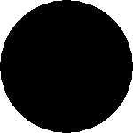
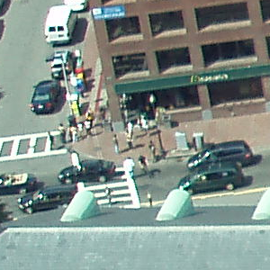
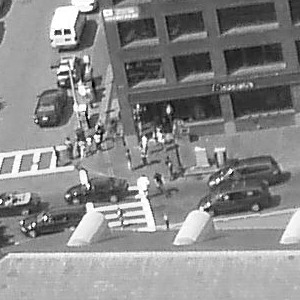

<a id="Raster_Constructors"></a>

## Raster Constructors
  <a id="RT_ST_AddBand"></a>

# ST_AddBand

Returns a raster with the new band(s) of given type added with given initial value in the given index location. If no index is specified, the band is added to the end.

## Synopsis


```sql
(1) raster ST_AddBand(raster  rast, addbandarg[]  addbandargset)
(2) raster ST_AddBand(raster  rast, integer  index, text  pixeltype, double precision  initialvalue=0, double precision  nodataval=NULL)
(3) raster ST_AddBand(raster  rast, text  pixeltype, double precision  initialvalue=0, double precision  nodataval=NULL)
(4) raster ST_AddBand(raster  torast, raster  fromrast, integer  fromband=1, integer  torastindex=at_end)
(5) raster ST_AddBand(raster  torast, raster[]  fromrasts, integer  fromband=1, integer  torastindex=at_end)
(6) raster ST_AddBand(raster  rast, integer  index, text  outdbfile, integer[]  outdbindex, double precision  nodataval=NULL)
(7) raster ST_AddBand(raster  rast, text  outdbfile, integer[]  outdbindex, integer  index=at_end, double precision  nodataval=NULL)
```


## Description


 Returns a raster with a new band added in given position (index), of given type, of given initial value, and of given nodata value. If no index is specified, the band is added to the end. If no `fromband` is specified, band 1 is assumed. Pixel type is a string representation of one of the pixel types specified in [RT_ST_BandPixelType](raster-band-accessors.md#RT_ST_BandPixelType). If an existing index is specified all subsequent bands >= that index are incremented by 1. If an initial value greater than the max of the pixel type is specified, then the initial value is set to the highest value allowed by the pixel type.


 For the variant that takes an array of [addbandarg](raster-support-data-types.md#addbandarg) (Variant 1), a specific addbandarg's index value is relative to the raster at the time when the band described by that addbandarg is being added to the raster. See the Multiple New Bands example below.


 For the variant that takes an array of rasters (Variant 5), if `torast` is NULL then the `fromband` band of each raster in the array is accumulated into a new raster.


 For the variants that take `outdbfile` (Variants 6 and 7), the value must include the full path to the raster file. The file must also be accessible to the postgres server process.


Enhanced: 2.1.0 support for addbandarg added.


Enhanced: 2.1.0 support for new out-db bands added.


## Examples: Single New Band


```

-- Add another band of type 8 bit unsigned integer with pixels initialized to 200
UPDATE dummy_rast
    SET rast = ST_AddBand(rast,'8BUI'::text,200)
WHERE rid = 1;

```


```

-- Create an empty raster 100x100 units, with upper left  right at 0, add 2 bands (band 1 is 0/1 boolean bit switch, band2 allows values 0-15)
-- uses addbandargs
INSERT INTO dummy_rast(rid,rast)
    VALUES(10, ST_AddBand(ST_MakeEmptyRaster(100, 100, 0, 0, 1, -1, 0, 0, 0),
    ARRAY[
        ROW(1, '1BB'::text, 0, NULL),
        ROW(2, '4BUI'::text, 0, NULL)
            ]::addbandarg[]
     )
    );

-- output meta data of raster bands to verify all is right --
SELECT  (bmd).*
FROM (SELECT ST_BandMetaData(rast,generate_series(1,2)) As bmd
    FROM dummy_rast WHERE rid = 10) AS foo;
 --result --
 pixeltype | nodatavalue | isoutdb | path
-----------+----------------+-------------+---------+------
 1BB       |             | f       |
 4BUI      |             | f       |


-- output meta data of raster -
SELECT  (rmd).width, (rmd).height, (rmd).numbands
FROM (SELECT ST_MetaData(rast) As rmd
    FROM dummy_rast WHERE rid = 10) AS foo;
-- result --
 upperleftx | upperlefty | width | height | scalex | scaley | skewx | skewy | srid | numbands
------------+------------+-------+--------+------------+------------+-------+-------+------+----------
          0 |          0 |   100 |    100 |      1 |     -1 |     0 |     0 |   0 |        2

```


## Examples: Multiple New Bands


```sql

SELECT
    *
FROM ST_BandMetadata(
    ST_AddBand(
        ST_MakeEmptyRaster(10, 10, 0, 0, 1, -1, 0, 0, 0),
        ARRAY[
            ROW(NULL, '8BUI', 255, 0),
            ROW(NULL, '16BUI', 1, 2),
            ROW(2, '32BUI', 100, 12),
            ROW(2, '32BF', 3.14, -1)
        ]::addbandarg[]
    ),
    ARRAY[]::integer[]
);

 bandnum | pixeltype | nodatavalue | isoutdb | path
---------+-----------+-------------+---------+------
       1 | 8BUI      |           0 | f       |
       2 | 32BF      |          -1 | f       |
       3 | 32BUI     |          12 | f       |
       4 | 16BUI     |           2 | f       |

```


```

-- Aggregate the 1st band of a table of like rasters into a single raster
-- with as many bands as there are test_types and as many rows (new rasters) as there are mice
-- NOTE: The ORDER BY test_type is only supported in PostgreSQL 9.0+
-- for 8.4 and below it usually works to order your data in a subselect (but not guaranteed)
-- The resulting raster will have a band for each test_type alphabetical by test_type
-- For mouse lovers: No mice were harmed in this exercise
SELECT
    mouse,
    ST_AddBand(NULL, array_agg(rast ORDER BY test_type), 1) As rast
FROM mice_studies
GROUP BY mouse;

```


## Examples: New Out-db band


```sql

SELECT
    *
FROM ST_BandMetadata(
    ST_AddBand(
        ST_MakeEmptyRaster(10, 10, 0, 0, 1, -1, 0, 0, 0),
        '/home/raster/mytestraster.tif'::text, NULL::int[]
    ),
    ARRAY[]::integer[]
);

 bandnum | pixeltype | nodatavalue | isoutdb | path
---------+-----------+-------------+---------+------
       1 | 8BUI      |             | t       | /home/raster/mytestraster.tif
       2 | 8BUI      |             | t       | /home/raster/mytestraster.tif
       3 | 8BUI      |             | t       | /home/raster/mytestraster.tif

```


## See Also


 [RT_ST_BandMetaData](raster-band-accessors.md#RT_ST_BandMetaData), [RT_ST_BandPixelType](raster-band-accessors.md#RT_ST_BandPixelType), [RT_ST_MakeEmptyRaster](#RT_ST_MakeEmptyRaster), [RT_ST_MetaData](raster-accessors.md#RT_ST_MetaData), [RT_ST_NumBands](raster-accessors.md#RT_ST_NumBands), [RT_ST_Reclass](raster-processing-map-algebra.md#RT_ST_Reclass)
  <a id="RT_ST_AsRaster"></a>

# ST_AsRaster

Converts a PostGIS geometry to a PostGIS raster.

## Synopsis


```sql
raster ST_AsRaster(geometry  geom, raster  ref, text  pixeltype, double precision  value=1, double precision  nodataval=0, boolean  touched=false)
raster ST_AsRaster(geometry  geom, raster  ref, text[]  pixeltype=ARRAY['8BUI'], double precision[]  value=ARRAY[1], double precision[]  nodataval=ARRAY[0], boolean  touched=false)
raster ST_AsRaster(geometry  geom, double precision  scalex, double precision  scaley, double precision  gridx, double precision  gridy, text  pixeltype, double precision  value=1, double precision  nodataval=0, double precision  skewx=0, double precision  skewy=0, boolean  touched=false)
raster ST_AsRaster(geometry  geom, double precision  scalex, double precision  scaley, double precision  gridx=NULL, double precision  gridy=NULL, text[]  pixeltype=ARRAY['8BUI'], double precision[]  value=ARRAY[1], double precision[]  nodataval=ARRAY[0], double precision  skewx=0, double precision  skewy=0, boolean  touched=false)
raster ST_AsRaster(geometry  geom, double precision  scalex, double precision  scaley, text  pixeltype, double precision  value=1, double precision  nodataval=0, double precision  upperleftx=NULL, double precision  upperlefty=NULL, double precision  skewx=0, double precision  skewy=0, boolean  touched=false)
raster ST_AsRaster(geometry  geom, double precision  scalex, double precision  scaley, text[]  pixeltype, double precision[]  value=ARRAY[1], double precision[]  nodataval=ARRAY[0], double precision  upperleftx=NULL, double precision  upperlefty=NULL, double precision  skewx=0, double precision  skewy=0, boolean  touched=false)
raster ST_AsRaster(geometry  geom, integer  width, integer  height, double precision  gridx, double precision  gridy, text  pixeltype, double precision  value=1, double precision  nodataval=0, double precision  skewx=0, double precision  skewy=0, boolean  touched=false)
raster ST_AsRaster(geometry  geom, integer  width, integer  height, double precision  gridx=NULL, double precision  gridy=NULL, text[]  pixeltype=ARRAY['8BUI'], double precision[]  value=ARRAY[1], double precision[]  nodataval=ARRAY[0], double precision  skewx=0, double precision  skewy=0, boolean  touched=false)
raster ST_AsRaster(geometry  geom, integer  width, integer  height, text  pixeltype, double precision  value=1, double precision  nodataval=0, double precision  upperleftx=NULL, double precision  upperlefty=NULL, double precision  skewx=0, double precision  skewy=0, boolean  touched=false)
raster ST_AsRaster(geometry  geom, integer  width, integer  height, text[]  pixeltype, double precision[]  value=ARRAY[1], double precision[]  nodataval=ARRAY[0], double precision  upperleftx=NULL, double precision  upperlefty=NULL, double precision  skewx=0, double precision  skewy=0, boolean  touched=false)
```


## Description


Converts a PostGIS geometry to a PostGIS raster. The many variants offers three groups of possibilities for setting the alignment and pixelsize of the resulting raster.


The first group, composed of the two first variants, produce a raster having the same alignment (`scalex`, `scaley`, `gridx` and `gridy`), pixel type and nodata value as the provided reference raster. You generally pass this reference raster by joining the table containing the geometry with the table containing the reference raster.


The second group, composed of four variants, let you set the dimensions of the raster by providing the parameters of a pixel size (`scalex` & `scaley` and `skewx` & `skewy`). The `width` & `height` of the resulting raster will be adjusted to fit the extent of the geometry. In most cases, you must cast integer `scalex` & `scaley` arguments to double precision so that PostgreSQL choose the right variant.


The third group, composed of four variants, let you fix the dimensions of the raster by providing the dimensions of the raster (`width` & `height`). The parameters of the pixel size (`scalex` & `scaley` and `skewx` & `skewy`) of the resulting raster will be adjusted to fit the extent of the geometry.


The two first variants of each of those two last groups let you specify the alignment with an arbitrary corner of the alignment grid (`gridx` & `gridy`) and the two last variants takes the upper left corner (`upperleftx` & `upperlefty`).


Each group of variant allows producing a one band raster or a multiple bands raster. To produce a multiple bands raster, you must provide an array of pixel types (`pixeltype[]`), an array of initial values (`value`) and an array of nodata values (`nodataval`). If not provided pixeltyped defaults to 8BUI, values to 1 and nodataval to 0.


The output raster will be in the same spatial reference as the source geometry. The only exception is for variants with a reference raster. In this case the resulting raster will get the same SRID as the reference raster.


The optional `touched` parameter defaults to false and maps to the GDAL ALL_TOUCHED rasterization option, which determines if pixels touched by lines or polygons will be burned. Not just those on the line render path, or whose center point is within the polygon.


This is particularly useful for rendering jpegs and pngs of geometries directly from the database when using in combination with [RT_ST_AsPNG](raster-outputs.md#RT_ST_AsPNG) and other [RT_ST_AsGDALRaster](raster-outputs.md#RT_ST_AsGDALRaster) family of functions.


Availability: 2.0.0 - requires GDAL >= 1.6.0.


!!! note

    Not yet capable of rendering complex geometry types such as curves, TINS, and PolyhedralSurfaces, but should be able too once GDAL can.


## Examples: Output geometries as PNG files





black circle


```

-- this will output a black circle taking up 150 x 150 pixels --
SELECT ST_AsPNG(ST_AsRaster(ST_Buffer(ST_Point(1,5),10),150, 150));
```


example from buffer rendered with just PostGIS


```
-- the bands map to RGB bands - the value (118,154,118) - teal  --
SELECT ST_AsPNG(
    ST_AsRaster(
        ST_Buffer(
            ST_GeomFromText('LINESTRING(50 50,150 150,150 50)'), 10,'join=bevel'),
            200,200,ARRAY['8BUI', '8BUI', '8BUI'], ARRAY[118,154,118], ARRAY[0,0,0]));
```


## See Also


[RT_ST_BandPixelType](raster-band-accessors.md#RT_ST_BandPixelType), [ST_Buffer](../postgis-reference/geometry-processing.md#ST_Buffer), [RT_ST_GDALDrivers](raster-management.md#RT_ST_GDALDrivers), [RT_ST_AsGDALRaster](raster-outputs.md#RT_ST_AsGDALRaster), [RT_ST_AsPNG](raster-outputs.md#RT_ST_AsPNG), [RT_ST_AsJPEG](raster-outputs.md#RT_ST_AsJPEG), [RT_ST_SRID](raster-accessors.md#RT_ST_SRID)
  <a id="RT_ST_Band"></a>

# ST_Band

Returns one or more bands of an existing raster as a new raster. Useful for building new rasters from existing rasters.

## Synopsis


```sql
raster ST_Band(raster  rast, integer[]  nbands = ARRAY[1])
raster ST_Band(raster  rast, integer  nband)
raster ST_Band(raster  rast, text  nbands, character  delimiter=,)
```


## Description


Returns one or more bands of an existing raster as a new raster. Useful for building new rasters from existing rasters or export of only selected bands of a raster or rearranging the order of bands in a raster. If no band is specified or any of specified bands does not exist in the raster, then all bands are returned. Used as a helper function in various functions such as for deleting a band.


!!! warning

    For the <code>nbands</code> as text variant of function, the default delimiter is <code>,</code> which means you can ask for <code>'1,2,3'</code> and if you wanted to use a different delimiter you would do <code>ST_Band(rast, '1@2@3', '@')</code>. For asking for multiple bands, we strongly suggest you use the array form of this function e.g. <code>ST_Band(rast, '{1,2,3}'::int[]);</code> since the <code>text</code> list of bands form may be removed in future versions of PostGIS.


Availability: 2.0.0


## Examples


```
-- Make 2 new rasters: 1 containing band 1 of dummy, second containing band 2 of dummy and then reclassified as a 2BUI
SELECT ST_NumBands(rast1) As numb1, ST_BandPixelType(rast1) As pix1,
 ST_NumBands(rast2) As numb2,  ST_BandPixelType(rast2) As pix2
FROM (
    SELECT ST_Band(rast) As rast1, ST_Reclass(ST_Band(rast,3), '100-200):1, [200-254:2', '2BUI') As rast2
        FROM dummy_rast
        WHERE rid = 2) As foo;

 numb1 | pix1 | numb2 | pix2
-------+------+-------+------
     1 | 8BUI |     1 | 2BUI

```


```
-- Return bands 2 and 3. Using array cast syntax
SELECT ST_NumBands(ST_Band(rast, '{2,3}'::int[])) As num_bands
    FROM dummy_rast WHERE rid=2;

num_bands
----------
2

-- Return bands 2 and 3. Use array to define bands
SELECT ST_NumBands(ST_Band(rast, ARRAY[2,3])) As num_bands
    FROM dummy_rast
WHERE rid=2;

```


|    original (column rast) |    dupe_band |    sing_band |


```
--Make a new raster with 2nd band of original and 1st band repeated twice,
and another with just the third band
SELECT rast, ST_Band(rast, ARRAY[2,1,1]) As dupe_band,
    ST_Band(rast, 3) As sing_band
FROM samples.than_chunked
WHERE rid=35;

```


## See Also


[RT_ST_AddBand](#RT_ST_AddBand), [RT_ST_NumBands](raster-accessors.md#RT_ST_NumBands), [RT_ST_Reclass](raster-processing-map-algebra.md#RT_ST_Reclass), [Raster Reference](index.md#RT_reference)
  <a id="RT_ST_MakeEmptyCoverage"></a>

# ST_MakeEmptyCoverage

Cover georeferenced area with a grid of empty raster tiles.

## Synopsis


```sql
raster ST_MakeEmptyCoverage(integer  tilewidth, integer  tileheight, integer  width, integer  height, double precision  upperleftx, double precision  upperlefty, double precision  scalex, double precision  scaley, double precision  skewx, double precision  skewy, integer  srid=unknown)
```


## Description


Create a set of raster tiles with [RT_ST_MakeEmptyRaster](#RT_ST_MakeEmptyRaster). Grid dimension is `width` & `height`. Tile dimension is `tilewidth` & `tileheight`. The covered georeferenced area is from upper left corner (`upperleftx`, `upperlefty`) to lower right corner (`upperleftx` + `width` * `scalex`, `upperlefty` + `height` * `scaley`).


!!! note

    Note that scaley is generally negative for rasters and scalex is generally positive. So lower right corner will have a lower y value and higher x value than the upper left corner.


Availability: 2.4.0


## Examples Basic


Create 16 tiles in a 4x4 grid to cover the WGS84 area from upper left corner (22, 77) to lower right corner (55, 33).


```sql
SELECT (ST_MetaData(tile)).* FROM ST_MakeEmptyCoverage(1, 1, 4, 4, 22, 33, (55 - 22)/(4)::float, (33 - 77)/(4)::float, 0., 0., 4326) tile;

 upperleftx | upperlefty | width | height | scalex | scaley | skewx | skewy | srid | numbands
-------------------------------------------------------------------------------------
         22 |         33 |     1 |      1 |   8.25 |    -11 |     0 |     0 | 4326 |        0
      30.25 |         33 |     1 |      1 |   8.25 |    -11 |     0 |     0 | 4326 |        0
       38.5 |         33 |     1 |      1 |   8.25 |    -11 |     0 |     0 | 4326 |        0
      46.75 |         33 |     1 |      1 |   8.25 |    -11 |     0 |     0 | 4326 |        0
         22 |         22 |     1 |      1 |   8.25 |    -11 |     0 |     0 | 4326 |        0
      30.25 |         22 |     1 |      1 |   8.25 |    -11 |     0 |     0 | 4326 |        0
       38.5 |         22 |     1 |      1 |   8.25 |    -11 |     0 |     0 | 4326 |        0
      46.75 |         22 |     1 |      1 |   8.25 |    -11 |     0 |     0 | 4326 |        0
         22 |         11 |     1 |      1 |   8.25 |    -11 |     0 |     0 | 4326 |        0
      30.25 |         11 |     1 |      1 |   8.25 |    -11 |     0 |     0 | 4326 |        0
       38.5 |         11 |     1 |      1 |   8.25 |    -11 |     0 |     0 | 4326 |        0
      46.75 |         11 |     1 |      1 |   8.25 |    -11 |     0 |     0 | 4326 |        0
         22 |          0 |     1 |      1 |   8.25 |    -11 |     0 |     0 | 4326 |        0
      30.25 |          0 |     1 |      1 |   8.25 |    -11 |     0 |     0 | 4326 |        0
       38.5 |          0 |     1 |      1 |   8.25 |    -11 |     0 |     0 | 4326 |        0
      46.75 |          0 |     1 |      1 |   8.25 |    -11 |     0 |     0 | 4326 |        0
```


## See Also


 [RT_ST_MakeEmptyRaster](#RT_ST_MakeEmptyRaster)
  <a id="RT_ST_MakeEmptyRaster"></a>

# ST_MakeEmptyRaster

Returns an empty raster (having no bands) of given dimensions (width & height), upperleft X and Y, pixel size and rotation (scalex, scaley, skewx & skewy) and reference system (srid). If a raster is passed in, returns a new raster with the same size, alignment and SRID. If srid is left out, the spatial ref is set to unknown (0).

## Synopsis


```sql
raster ST_MakeEmptyRaster(raster  rast)
raster ST_MakeEmptyRaster(integer  width, integer  height, float8  upperleftx, float8  upperlefty, float8  scalex, float8  scaley, float8  skewx, float8  skewy, integer  srid=unknown)
raster ST_MakeEmptyRaster(integer  width, integer  height, float8   upperleftx, float8   upperlefty, float8   pixelsize)
```


## Description


Returns an empty raster (having no band) of given dimensions (width & height) and georeferenced in spatial (or world) coordinates with upper left X (upperleftx), upper left Y (upperlefty), pixel size and rotation (scalex, scaley, skewx & skewy) and reference system (srid).


The last version use a single parameter to specify the pixel size (pixelsize). scalex is set to this argument and scaley is set to the negative value of this argument. skewx and skewy are set to 0.


If an existing raster is passed in, it returns a new raster with the same meta data settings (without the bands).


If no srid is specified it defaults to 0. After you create an empty raster you probably want to add bands to it and maybe edit it. Refer to [RT_ST_AddBand](#RT_ST_AddBand) to define bands and [RT_ST_SetValue](raster-pixel-accessors-and-setters.md#RT_ST_SetValue) to set initial pixel values.


## Examples


```sql

INSERT INTO dummy_rast(rid,rast)
VALUES(3, ST_MakeEmptyRaster( 100, 100, 0.0005, 0.0005, 1, 1, 0, 0, 4326) );

--use an existing raster as template for new raster
INSERT INTO dummy_rast(rid,rast)
SELECT 4, ST_MakeEmptyRaster(rast)
FROM dummy_rast WHERE rid = 3;

-- output meta data of rasters we just added
SELECT rid, (md).*
FROM (SELECT rid, ST_MetaData(rast) As md
    FROM dummy_rast
    WHERE rid IN(3,4)) As foo;

-- output --
 rid | upperleftx | upperlefty | width | height | scalex | scaley | skewx | skewy | srid | numbands
-----+------------+------------+-------+--------+------------+------------+-------+-------+------+----------
   3 |     0.0005 |     0.0005 |   100 |    100 |          1 |          1 |    0  |     0 | 4326 |        0
   4 |     0.0005 |     0.0005 |   100 |    100 |          1 |          1 |    0  |     0 | 4326 |        0

```


## See Also


[RT_ST_AddBand](#RT_ST_AddBand), [RT_ST_MetaData](raster-accessors.md#RT_ST_MetaData), [RT_ST_ScaleX](raster-accessors.md#RT_ST_ScaleX), [RT_ST_ScaleY](raster-accessors.md#RT_ST_ScaleY), [RT_ST_SetValue](raster-pixel-accessors-and-setters.md#RT_ST_SetValue), [RT_ST_SkewX](raster-accessors.md#RT_ST_SkewX), , [RT_ST_SkewY](raster-accessors.md#RT_ST_SkewY)
  <a id="RT_ST_Tile"></a>

# ST_Tile

Returns a set of rasters resulting from the split of the input raster based upon the desired dimensions of the output rasters.

## Synopsis


```sql
setof raster ST_Tile(raster  rast, int[]  nband, integer  width, integer  height, boolean  padwithnodata=FALSE, double precision  nodataval=NULL)
setof raster ST_Tile(raster  rast, integer  nband, integer  width, integer  height, boolean  padwithnodata=FALSE, double precision  nodataval=NULL)
setof raster ST_Tile(raster  rast, integer  width, integer  height, boolean  padwithnodata=FALSE, double precision  nodataval=NULL)
```


## Description


 Returns a set of rasters resulting from the split of the input raster based upon the desired dimensions of the output rasters.


 If `padwithnodata` = FALSE, edge tiles on the right and bottom sides of the raster may have different dimensions than the rest of the tiles. If `padwithnodata` = TRUE, all tiles will have the same dimensions with the possibility that edge tiles being padded with NODATA values. If raster band(s) do not have NODATA value(s) specified, one can be specified by setting `nodataval`.


!!! note

    If a specified band of the input raster is out-of-db, the corresponding band in the output rasters will also be out-of-db.


Availability: 2.1.0


## Examples


```sql

WITH foo AS (
    SELECT ST_AddBand(ST_AddBand(ST_MakeEmptyRaster(3, 3, 0, 0, 1, -1, 0, 0, 0), 1, '8BUI', 1, 0), 2, '8BUI', 10, 0) AS rast UNION ALL
    SELECT ST_AddBand(ST_AddBand(ST_MakeEmptyRaster(3, 3, 3, 0, 1, -1, 0, 0, 0), 1, '8BUI', 2, 0), 2, '8BUI', 20, 0) AS rast UNION ALL
    SELECT ST_AddBand(ST_AddBand(ST_MakeEmptyRaster(3, 3, 6, 0, 1, -1, 0, 0, 0), 1, '8BUI', 3, 0), 2, '8BUI', 30, 0) AS rast UNION ALL

    SELECT ST_AddBand(ST_AddBand(ST_MakeEmptyRaster(3, 3, 0, -3, 1, -1, 0, 0, 0), 1, '8BUI', 4, 0), 2, '8BUI', 40, 0) AS rast UNION ALL
    SELECT ST_AddBand(ST_AddBand(ST_MakeEmptyRaster(3, 3, 3, -3, 1, -1, 0, 0, 0), 1, '8BUI', 5, 0), 2, '8BUI', 50, 0) AS rast UNION ALL
    SELECT ST_AddBand(ST_AddBand(ST_MakeEmptyRaster(3, 3, 6, -3, 1, -1, 0, 0, 0), 1, '8BUI', 6, 0), 2, '8BUI', 60, 0) AS rast UNION ALL

    SELECT ST_AddBand(ST_AddBand(ST_MakeEmptyRaster(3, 3, 0, -6, 1, -1, 0, 0, 0), 1, '8BUI', 7, 0), 2, '8BUI', 70, 0) AS rast UNION ALL
    SELECT ST_AddBand(ST_AddBand(ST_MakeEmptyRaster(3, 3, 3, -6, 1, -1, 0, 0, 0), 1, '8BUI', 8, 0), 2, '8BUI', 80, 0) AS rast UNION ALL
    SELECT ST_AddBand(ST_AddBand(ST_MakeEmptyRaster(3, 3, 6, -6, 1, -1, 0, 0, 0), 1, '8BUI', 9, 0), 2, '8BUI', 90, 0) AS rast
), bar AS (
    SELECT ST_Union(rast) AS rast FROM foo
), baz AS (
    SELECT ST_Tile(rast, 3, 3, TRUE) AS rast FROM bar
)
SELECT
    ST_DumpValues(rast)
FROM baz;

              st_dumpvalues
------------------------------------------
 (1,"{{1,1,1},{1,1,1},{1,1,1}}")
 (2,"{{10,10,10},{10,10,10},{10,10,10}}")
 (1,"{{2,2,2},{2,2,2},{2,2,2}}")
 (2,"{{20,20,20},{20,20,20},{20,20,20}}")
 (1,"{{3,3,3},{3,3,3},{3,3,3}}")
 (2,"{{30,30,30},{30,30,30},{30,30,30}}")
 (1,"{{4,4,4},{4,4,4},{4,4,4}}")
 (2,"{{40,40,40},{40,40,40},{40,40,40}}")
 (1,"{{5,5,5},{5,5,5},{5,5,5}}")
 (2,"{{50,50,50},{50,50,50},{50,50,50}}")
 (1,"{{6,6,6},{6,6,6},{6,6,6}}")
 (2,"{{60,60,60},{60,60,60},{60,60,60}}")
 (1,"{{7,7,7},{7,7,7},{7,7,7}}")
 (2,"{{70,70,70},{70,70,70},{70,70,70}}")
 (1,"{{8,8,8},{8,8,8},{8,8,8}}")
 (2,"{{80,80,80},{80,80,80},{80,80,80}}")
 (1,"{{9,9,9},{9,9,9},{9,9,9}}")
 (2,"{{90,90,90},{90,90,90},{90,90,90}}")
(18 rows)

```


```sql

WITH foo AS (
    SELECT ST_AddBand(ST_AddBand(ST_MakeEmptyRaster(3, 3, 0, 0, 1, -1, 0, 0, 0), 1, '8BUI', 1, 0), 2, '8BUI', 10, 0) AS rast UNION ALL
    SELECT ST_AddBand(ST_AddBand(ST_MakeEmptyRaster(3, 3, 3, 0, 1, -1, 0, 0, 0), 1, '8BUI', 2, 0), 2, '8BUI', 20, 0) AS rast UNION ALL
    SELECT ST_AddBand(ST_AddBand(ST_MakeEmptyRaster(3, 3, 6, 0, 1, -1, 0, 0, 0), 1, '8BUI', 3, 0), 2, '8BUI', 30, 0) AS rast UNION ALL

    SELECT ST_AddBand(ST_AddBand(ST_MakeEmptyRaster(3, 3, 0, -3, 1, -1, 0, 0, 0), 1, '8BUI', 4, 0), 2, '8BUI', 40, 0) AS rast UNION ALL
    SELECT ST_AddBand(ST_AddBand(ST_MakeEmptyRaster(3, 3, 3, -3, 1, -1, 0, 0, 0), 1, '8BUI', 5, 0), 2, '8BUI', 50, 0) AS rast UNION ALL
    SELECT ST_AddBand(ST_AddBand(ST_MakeEmptyRaster(3, 3, 6, -3, 1, -1, 0, 0, 0), 1, '8BUI', 6, 0), 2, '8BUI', 60, 0) AS rast UNION ALL

    SELECT ST_AddBand(ST_AddBand(ST_MakeEmptyRaster(3, 3, 0, -6, 1, -1, 0, 0, 0), 1, '8BUI', 7, 0), 2, '8BUI', 70, 0) AS rast UNION ALL
    SELECT ST_AddBand(ST_AddBand(ST_MakeEmptyRaster(3, 3, 3, -6, 1, -1, 0, 0, 0), 1, '8BUI', 8, 0), 2, '8BUI', 80, 0) AS rast UNION ALL
    SELECT ST_AddBand(ST_AddBand(ST_MakeEmptyRaster(3, 3, 6, -6, 1, -1, 0, 0, 0), 1, '8BUI', 9, 0), 2, '8BUI', 90, 0) AS rast
), bar AS (
    SELECT ST_Union(rast) AS rast FROM foo
), baz AS (
    SELECT ST_Tile(rast, 3, 3, 2) AS rast FROM bar
)
SELECT
    ST_DumpValues(rast)
FROM baz;

              st_dumpvalues
------------------------------------------
 (1,"{{10,10,10},{10,10,10},{10,10,10}}")
 (1,"{{20,20,20},{20,20,20},{20,20,20}}")
 (1,"{{30,30,30},{30,30,30},{30,30,30}}")
 (1,"{{40,40,40},{40,40,40},{40,40,40}}")
 (1,"{{50,50,50},{50,50,50},{50,50,50}}")
 (1,"{{60,60,60},{60,60,60},{60,60,60}}")
 (1,"{{70,70,70},{70,70,70},{70,70,70}}")
 (1,"{{80,80,80},{80,80,80},{80,80,80}}")
 (1,"{{90,90,90},{90,90,90},{90,90,90}}")
(9 rows)

```


## See Also


 [RT_ST_Union](raster-processing-map-algebra.md#RT_ST_Union), [RT_Retile](#RT_Retile)
  <a id="RT_Retile"></a>

# ST_Retile

Return a set of configured tiles from an arbitrarily tiled raster coverage.

## Synopsis


```sql
SETOF raster ST_Retile(regclass  tab, name  col, geometry  ext, float8  sfx, float8  sfy, int  tw, int  th, text  algo='NearestNeighbor')
```


## Description


 Return a set of tiles having the specified scale (`sfx`, `sfy`) and max size (`tw`, `th`) and covering the specified extent (`ext`) with data coming from the specified raster coverage (`tab`, `col`).


Algorithm options are: 'NearestNeighbor', 'Bilinear', 'Cubic', 'CubicSpline', and 'Lanczos'. Refer to: [GDAL Warp resampling methods](http://www.gdal.org/gdalwarp.html) for more details.


Availability: 2.2.0


## See Also


 [RT_CreateOverview](raster-management.md#RT_CreateOverview)
  <a id="RT_ST_FromGDALRaster"></a>

# ST_FromGDALRaster

Returns a raster from a supported GDAL raster file.

## Synopsis


```sql
raster ST_FromGDALRaster(bytea  gdaldata, integer  srid=NULL)
```


## Description


 Returns a raster from a supported GDAL raster file. `gdaldata` is of type bytea and should be the contents of the GDAL raster file.


 If `srid` is NULL, the function will try to automatically assign the SRID from the GDAL raster. If `srid` is provided, the value provided will override any automatically assigned SRID.


Availability: 2.1.0


## Examples


```sql

WITH foo AS (
    SELECT ST_AsPNG(ST_AddBand(ST_AddBand(ST_AddBand(ST_MakeEmptyRaster(2, 2, 0, 0, 0.1, -0.1, 0, 0, 4326), 1, '8BUI', 1, 0), 2, '8BUI', 2, 0), 3, '8BUI', 3, 0)) AS png
),
bar AS (
    SELECT 1 AS rid, ST_FromGDALRaster(png) AS rast FROM foo
    UNION ALL
    SELECT 2 AS rid, ST_FromGDALRaster(png, 3310) AS rast FROM foo
)
SELECT
    rid,
    ST_Metadata(rast) AS metadata,
    ST_SummaryStats(rast, 1) AS stats1,
    ST_SummaryStats(rast, 2) AS stats2,
    ST_SummaryStats(rast, 3) AS stats3
FROM bar
ORDER BY rid;

 rid |         metadata          |    stats1     |    stats2     |     stats3
-----+---------------------------+---------------+---------------+----------------
   1 | (0,0,2,2,1,-1,0,0,0,3)    | (4,4,1,0,1,1) | (4,8,2,0,2,2) | (4,12,3,0,3,3)
   2 | (0,0,2,2,1,-1,0,0,3310,3) | (4,4,1,0,1,1) | (4,8,2,0,2,2) | (4,12,3,0,3,3)
(2 rows)

```


## See Also


 [RT_ST_AsGDALRaster](raster-outputs.md#RT_ST_AsGDALRaster)
