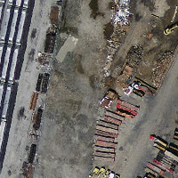
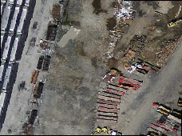
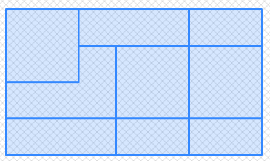

<a id="Raster_Editors"></a>

## Raster Editors
  <a id="RT_ST_SetGeoReference"></a>

# ST_SetGeoReference

Set Georeference 6 georeference parameters in a single call. Numbers should be separated by white space. Accepts inputs in GDAL or ESRI format. Default is GDAL.

## Synopsis


```sql
raster ST_SetGeoReference(raster  rast, text  georefcoords, text  format=GDAL)
raster ST_SetGeoReference(raster  rast, double precision  upperleftx, double precision  upperlefty, double precision  scalex, double precision  scaley, double precision  skewx, double precision  skewy)
```


## Description


Set Georeference 6 georeference parameters in a single call. Accepts inputs in 'GDAL' or 'ESRI' format. Default is GDAL. If 6 coordinates are not provided will return null.


Difference between format representations is as follows:


`GDAL`:

```
scalex skewy skewx scaley upperleftx upperlefty
```


`ESRI`:

```
scalex skewy skewx scaley upperleftx + scalex*0.5 upperlefty + scaley*0.5
```


!!! note

    If the raster has out-db bands, changing the georeference may result in incorrect access of the band's externally stored data.


Enhanced: 2.1.0 Addition of ST_SetGeoReference(raster, double precision, ...) variant


## Examples


```sql

WITH foo AS (
    SELECT ST_MakeEmptyRaster(5, 5, 0, 0, 1, -1, 0, 0, 0) AS rast
)
SELECT
    0 AS rid, (ST_Metadata(rast)).*
FROM foo
UNION ALL
SELECT
    1, (ST_Metadata(ST_SetGeoReference(rast, '10 0 0 -10 0.1 0.1', 'GDAL'))).*
FROM foo
UNION ALL
SELECT
    2, (ST_Metadata(ST_SetGeoReference(rast, '10 0 0 -10 5.1 -4.9', 'ESRI'))).*
FROM foo
UNION ALL
SELECT
    3, (ST_Metadata(ST_SetGeoReference(rast, 1, 1, 10, -10, 0.001, 0.001))).*
FROM foo

 rid |     upperleftx     |     upperlefty     | width | height | scalex | scaley | skewx | skewy | srid | numbands
-----+--------------------+--------------------+-------+--------+--------+--------+-------+-------+------+----------
   0 |                  0 |                  0 |     5 |      5 |      1 |     -1 |     0 |     0 |    0 |        0
   1 |                0.1 |                0.1 |     5 |      5 |     10 |    -10 |     0 |     0 |    0 |        0
   2 | 0.0999999999999996 | 0.0999999999999996 |     5 |      5 |     10 |    -10 |     0 |     0 |    0 |        0
   3 |                  1 |                  1 |     5 |      5 |     10 |    -10 | 0.001 | 0.001 |    0 |        0

```


## See Also


[RT_ST_GeoReference](raster-accessors.md#RT_ST_GeoReference), [RT_ST_ScaleX](raster-accessors.md#RT_ST_ScaleX), [RT_ST_ScaleY](raster-accessors.md#RT_ST_ScaleY), [RT_ST_UpperLeftX](raster-accessors.md#RT_ST_UpperLeftX), [RT_ST_UpperLeftY](raster-accessors.md#RT_ST_UpperLeftY)
  <a id="RT_ST_SetRotation"></a>

# ST_SetRotation

Set the rotation of the raster in radian.

## Synopsis


```sql
raster ST_SetRotation(raster rast, float8 rotation)
```


## Description


Uniformly rotate the raster. Rotation is in radian. Refer to [World File](http://en.wikipedia.org/wiki/World_file) for more details.


## Examples


```sql
SELECT
  ST_ScaleX(rast1), ST_ScaleY(rast1), ST_SkewX(rast1), ST_SkewY(rast1),
  ST_ScaleX(rast2), ST_ScaleY(rast2), ST_SkewX(rast2), ST_SkewY(rast2)
FROM (
  SELECT ST_SetRotation(rast, 15) AS rast1, rast as rast2 FROM dummy_rast
) AS foo;
      st_scalex      |      st_scaley      |      st_skewx      |      st_skewy      | st_scalex | st_scaley | st_skewx | st_skewy
---------------------+---------------------+--------------------+--------------------+-----------+-----------+----------+----------
   -1.51937582571764 |   -2.27906373857646 |   1.95086352047135 |   1.30057568031423 |         2 |         3 |        0 |        0
 -0.0379843956429411 | -0.0379843956429411 | 0.0325143920078558 | 0.0325143920078558 |      0.05 |     -0.05 |        0 |        0

```


## See Also


[RT_ST_Rotation](raster-accessors.md#RT_ST_Rotation), [RT_ST_ScaleX](raster-accessors.md#RT_ST_ScaleX), [RT_ST_ScaleY](raster-accessors.md#RT_ST_ScaleY), [RT_ST_SkewX](raster-accessors.md#RT_ST_SkewX), [RT_ST_SkewY](raster-accessors.md#RT_ST_SkewY)
  <a id="RT_ST_SetScale"></a>

# ST_SetScale

Sets the X and Y size of pixels in units of coordinate reference system. Number units/pixel width/height.

## Synopsis


```sql
raster ST_SetScale(raster  rast, float8  xy)
raster ST_SetScale(raster  rast, float8  x, float8  y)
```


## Description


Sets the X and Y size of pixels in units of coordinate reference system. Number units/pixel width/height. If only one unit passed in, assumed X and Y are the same number.


!!! note

    ST_SetScale is different from [RT_ST_Rescale](#RT_ST_Rescale) in that ST_SetScale do not resample the raster to match the raster extent. It only changes the metadata (or georeference) of the raster to correct an originally mis-specified scaling. ST_Rescale results in a raster having different width and height computed to fit the geographic extent of the input raster. ST_SetScale do not modify the width, nor the height of the raster.


Changed: 2.0.0 In WKTRaster versions this was called ST_SetPixelSize. This was changed in 2.0.0.


## Examples


```sql
UPDATE dummy_rast
    SET rast = ST_SetScale(rast, 1.5)
WHERE rid = 2;

SELECT ST_ScaleX(rast) As pixx, ST_ScaleY(rast) As pixy, Box3D(rast) As newbox
FROM dummy_rast
WHERE rid = 2;

 pixx | pixy |                    newbox
------+------+----------------------------------------------
  1.5 |  1.5 | BOX(3427927.75 5793244 0, 3427935.25 5793251.5 0)

```


```sql
UPDATE dummy_rast
    SET rast = ST_SetScale(rast, 1.5, 0.55)
WHERE rid = 2;

SELECT ST_ScaleX(rast) As pixx, ST_ScaleY(rast) As pixy, Box3D(rast) As newbox
FROM dummy_rast
WHERE rid = 2;

 pixx | pixy |                   newbox
------+------+--------------------------------------------
  1.5 | 0.55 | BOX(3427927.75 5793244 0,3427935.25 5793247 0)

```


## See Also


[RT_ST_ScaleX](raster-accessors.md#RT_ST_ScaleX), [RT_ST_ScaleY](raster-accessors.md#RT_ST_ScaleY), [RT_Box3D](raster-processing-raster-to-geometry.md#RT_Box3D)
  <a id="RT_ST_SetSkew"></a>

# ST_SetSkew

Sets the georeference X and Y skew (or rotation parameter). If only one is passed in, sets X and Y to the same value.

## Synopsis


```sql
raster ST_SetSkew(raster  rast, float8  skewxy)
raster ST_SetSkew(raster  rast, float8  skewx, float8  skewy)
```


## Description


Sets the georeference X and Y skew (or rotation parameter). If only one is passed in, sets X and Y to the same value. Refer to [World File](http://en.wikipedia.org/wiki/World_file) for more details.


## Examples


```

-- Example 1
UPDATE dummy_rast SET rast = ST_SetSkew(rast,1,2) WHERE rid = 1;
SELECT rid, ST_SkewX(rast) As skewx, ST_SkewY(rast) As skewy,
    ST_GeoReference(rast) as georef
FROM dummy_rast WHERE rid = 1;

rid | skewx | skewy |    georef
----+-------+-------+--------------
  1 |     1 |     2 | 2.0000000000
                    : 2.0000000000
                    : 1.0000000000
                    : 3.0000000000
                    : 0.5000000000
                    : 0.5000000000


```


```

-- Example 2 set both to same number:
UPDATE dummy_rast SET rast = ST_SetSkew(rast,0) WHERE rid = 1;
SELECT rid, ST_SkewX(rast) As skewx, ST_SkewY(rast) As skewy,
    ST_GeoReference(rast) as georef
FROM dummy_rast WHERE rid = 1;

 rid | skewx | skewy |    georef
-----+-------+-------+--------------
   1 |     0 |     0 | 2.0000000000
                     : 0.0000000000
                     : 0.0000000000
                     : 3.0000000000
                     : 0.5000000000
                     : 0.5000000000

```


## See Also


[RT_ST_GeoReference](raster-accessors.md#RT_ST_GeoReference), [RT_ST_SetGeoReference](#RT_ST_SetGeoReference), [RT_ST_SkewX](raster-accessors.md#RT_ST_SkewX), [RT_ST_SkewY](raster-accessors.md#RT_ST_SkewY)
  <a id="RT_ST_SetSRID"></a>

# ST_SetSRID

Sets the SRID of a raster to a particular integer srid defined in the spatial_ref_sys table.

## Synopsis


```sql
raster ST_SetSRID(raster
                rast, integer
                srid)
```


## Description


Sets the SRID on a raster to a particular integer value.


!!! note

    This function does not transform the raster in any way - it simply sets meta data defining the spatial ref of the coordinate reference system that it's currently in. Useful for transformations later.


## See Also


[Spatial Reference Systems](../data-management/spatial-reference-systems.md#spatial_ref_sys), [RT_ST_SRID](raster-accessors.md#RT_ST_SRID)
  <a id="RT_ST_SetUpperLeft"></a>

# ST_SetUpperLeft

Sets the value of the upper left corner of the pixel of the raster to projected X and Y coordinates.

## Synopsis


```sql
raster ST_SetUpperLeft(raster  rast, double precision  x, double precision  y)
```


## Description


Set the value of the upper left corner of raster to the projected X and Y coordinates


## Examples


```sql

SELECT ST_SetUpperLeft(rast,-71.01,42.37)
FROM dummy_rast
WHERE rid = 2;

```


## See Also


[RT_ST_UpperLeftX](raster-accessors.md#RT_ST_UpperLeftX), [RT_ST_UpperLeftY](raster-accessors.md#RT_ST_UpperLeftY)
  <a id="RT_ST_Resample"></a>

# ST_Resample

Resample a raster using a specified resampling algorithm, new dimensions, an arbitrary grid corner and a set of raster georeferencing attributes defined or borrowed from another raster.

## Synopsis


```sql
raster ST_Resample(raster  rast, integer  width, integer  height, double precision  gridx=NULL, double precision  gridy=NULL, double precision  skewx=0, double precision  skewy=0, text  algorithm=NearestNeighbor, double precision  maxerr=0.125)
raster ST_Resample(raster  rast, double precision  scalex=0, double precision  scaley=0, double precision  gridx=NULL, double precision  gridy=NULL, double precision  skewx=0, double precision  skewy=0, text  algorithm=NearestNeighbor, double precision  maxerr=0.125)
raster ST_Resample(raster  rast, raster  ref, text  algorithm=NearestNeighbor, double precision  maxerr=0.125, boolean  usescale=true)
raster ST_Resample(raster  rast, raster  ref, boolean  usescale, text  algorithm=NearestNeighbor, double precision  maxerr=0.125)
```


## Description


 Resample a raster using a specified resampling algorithm, new dimensions (width & height), a grid corner (gridx & gridy) and a set of raster georeferencing attributes (scalex, scaley, skewx & skewy) defined or borrowed from another raster. If using a reference raster, the two rasters must have the same SRID.


New pixel values are computed using one of the following resampling algorithms:


- NearestNeighbor (english or american spelling)
- Bilinear
- Cubic
- CubicSpline
- Lanczos
- Max
- Min


The default is NearestNeighbor which is the fastest but results in the worst interpolation.


 A maxerror percent of 0.125 is used if no `maxerr` is specified.


!!! note

    Refer to: [GDAL Warp resampling methods](http://www.gdal.org/gdalwarp.html) for more details.


Availability: 2.0.0 Requires GDAL 1.6.1+


Enhanced: 3.4.0 max and min resampling options added


## Examples


```sql

SELECT
    ST_Width(orig) AS orig_width,
    ST_Width(reduce_100) AS new_width
FROM (
    SELECT
        rast AS orig,
        ST_Resample(rast,100,100) AS reduce_100
    FROM aerials.boston
    WHERE ST_Intersects(rast,
        ST_Transform(
            ST_MakeEnvelope(-71.128, 42.2392,-71.1277, 42.2397, 4326),26986)
    )
    LIMIT 1
) AS foo;

 orig_width | new_width
------------+-------------
        200 |         100

```


## See Also


 [RT_ST_Rescale](#RT_ST_Rescale), [RT_ST_Resize](#RT_ST_Resize), [RT_ST_Transform](#RT_ST_Transform)
  <a id="RT_ST_Rescale"></a>

# ST_Rescale

Resample a raster by adjusting only its scale (or pixel size). New pixel values are computed using the NearestNeighbor (english or american spelling), Bilinear, Cubic, CubicSpline, Lanczos, Max or Min resampling algorithm. Default is NearestNeighbor.

## Synopsis


```sql
raster ST_Rescale(raster  rast, double precision  scalexy, text  algorithm=NearestNeighbor, double precision  maxerr=0.125)
raster ST_Rescale(raster  rast, double precision  scalex, double precision  scaley, text  algorithm=NearestNeighbor, double precision  maxerr=0.125)
```


## Description


Resample a raster by adjusting only its scale (or pixel size). New pixel values are computed using one of the following resampling algorithms:


- NearestNeighbor (english or american spelling)
- Bilinear
- Cubic
- CubicSpline
- Lanczos
- Max
- Min


The default is NearestNeighbor which is the fastest but results in the worst interpolation.


`scalex` and `scaley` define the new pixel size. scaley must often be negative to get well oriented raster.


When the new scalex or scaley is not a divisor of the raster width or height, the extent of the resulting raster is expanded to encompass the extent of the provided raster. If you want to be sure to retain exact input extent see [RT_ST_Resize](#RT_ST_Resize)


`maxerr` is the threshold for transformation approximation by the resampling algorithm (in pixel units). A default of 0.125 is used if no `maxerr` is specified, which is the same value used in GDAL gdalwarp utility. If set to zero, no approximation takes place.


!!! note

    Refer to: [GDAL Warp resampling methods](http://www.gdal.org/gdalwarp.html) for more details.


!!! note

    ST_Rescale is different from [RT_ST_SetScale](#RT_ST_SetScale) in that ST_SetScale do not resample the raster to match the raster extent. ST_SetScale only changes the metadata (or georeference) of the raster to correct an originally mis-specified scaling. ST_Rescale results in a raster having different width and height computed to fit the geographic extent of the input raster. ST_SetScale do not modify the width, nor the height of the raster.


Availability: 2.0.0 Requires GDAL 1.6.1+


Enhanced: 3.4.0 max and min resampling options added


Changed: 2.1.0 Works on rasters with no SRID


## Examples


A simple example rescaling a raster from a pixel size of 0.001 degree to a pixel size of 0.0015 degree.


```
-- the original raster pixel size
SELECT ST_PixelWidth(ST_AddBand(ST_MakeEmptyRaster(100, 100, 0, 0, 0.001, -0.001, 0, 0, 4269), '8BUI'::text, 1, 0)) width

   width
----------
0.001

-- the rescaled raster raster pixel size
SELECT ST_PixelWidth(ST_Rescale(ST_AddBand(ST_MakeEmptyRaster(100, 100, 0, 0, 0.001, -0.001, 0, 0, 4269), '8BUI'::text, 1, 0), 0.0015)) width

   width
----------
0.0015
```


## See Also


 [RT_ST_Resize](#RT_ST_Resize), [RT_ST_Resample](#RT_ST_Resample), [RT_ST_SetScale](#RT_ST_SetScale), [RT_ST_ScaleX](raster-accessors.md#RT_ST_ScaleX), [RT_ST_ScaleY](raster-accessors.md#RT_ST_ScaleY), [RT_ST_Transform](#RT_ST_Transform)
  <a id="RT_ST_Reskew"></a>

# ST_Reskew

Resample a raster by adjusting only its skew (or rotation parameters). New pixel values are computed using the NearestNeighbor (english or american spelling), Bilinear, Cubic, CubicSpline or Lanczos resampling algorithm. Default is NearestNeighbor.

## Synopsis


```sql
raster ST_Reskew(raster  rast, double precision  skewxy, text  algorithm=NearestNeighbor, double precision  maxerr=0.125)
raster ST_Reskew(raster  rast, double precision  skewx, double precision  skewy, text  algorithm=NearestNeighbor, double precision  maxerr=0.125)
```


## Description


Resample a raster by adjusting only its skew (or rotation parameters). New pixel values are computed using the NearestNeighbor (english or american spelling), Bilinear, Cubic, CubicSpline or Lanczos resampling algorithm. The default is NearestNeighbor which is the fastest but results in the worst interpolation.


`skewx` and `skewy` define the new skew.


The extent of the new raster will encompass the extent of the provided raster.


A maxerror percent of 0.125 if no `maxerr` is specified.


!!! note

    Refer to: [GDAL Warp resampling methods](http://www.gdal.org/gdalwarp.html) for more details.


!!! note

    ST_Reskew is different from [RT_ST_SetSkew](#RT_ST_SetSkew) in that ST_SetSkew do not resample the raster to match the raster extent. ST_SetSkew only changes the metadata (or georeference) of the raster to correct an originally mis-specified skew. ST_Reskew results in a raster having different width and height computed to fit the geographic extent of the input raster. ST_SetSkew do not modify the width, nor the height of the raster.


Availability: 2.0.0 Requires GDAL 1.6.1+


Changed: 2.1.0 Works on rasters with no SRID


## Examples


A simple example reskewing a raster from a skew of 0.0 to a skew of 0.0015.


```
-- the original raster non-rotated
SELECT ST_Rotation(ST_AddBand(ST_MakeEmptyRaster(100, 100, 0, 0, 0.001, -0.001, 0, 0, 4269), '8BUI'::text, 1, 0));

-- result
0

-- the reskewed raster raster rotation
SELECT ST_Rotation(ST_Reskew(ST_AddBand(ST_MakeEmptyRaster(100, 100, 0, 0, 0.001, -0.001, 0, 0, 4269), '8BUI'::text, 1, 0), 0.0015));

-- result
-0.982793723247329
```


## See Also


[RT_ST_Resample](#RT_ST_Resample), [RT_ST_Rescale](#RT_ST_Rescale), [RT_ST_SetSkew](#RT_ST_SetSkew), [RT_ST_SetRotation](#RT_ST_SetRotation), [RT_ST_SkewX](raster-accessors.md#RT_ST_SkewX), [RT_ST_SkewY](raster-accessors.md#RT_ST_SkewY), [RT_ST_Transform](#RT_ST_Transform)
  <a id="RT_ST_SnapToGrid"></a>

# ST_SnapToGrid

Resample a raster by snapping it to a grid. New pixel values are computed using the NearestNeighbor (english or american spelling), Bilinear, Cubic, CubicSpline or Lanczos resampling algorithm. Default is NearestNeighbor.

## Synopsis


```sql
raster ST_SnapToGrid(raster  rast, double precision  gridx, double precision  gridy, text  algorithm=NearestNeighbor, double precision  maxerr=0.125, double precision  scalex=DEFAULT 0, double precision  scaley=DEFAULT 0)
raster ST_SnapToGrid(raster  rast, double precision  gridx, double precision  gridy, double precision  scalex, double precision  scaley, text  algorithm=NearestNeighbor, double precision  maxerr=0.125)
raster ST_SnapToGrid(raster  rast, double precision  gridx, double precision  gridy, double precision  scalexy, text  algorithm=NearestNeighbor, double precision  maxerr=0.125)
```


## Description


Resample a raster by snapping it to a grid defined by an arbitrary pixel corner (gridx & gridy) and optionally a pixel size (scalex & scaley). New pixel values are computed using the NearestNeighbor (english or american spelling), Bilinear, Cubic, CubicSpline or Lanczos resampling algorithm. The default is NearestNeighbor which is the fastest but results in the worst interpolation.


`gridx` and `gridy` define any arbitrary pixel corner of the new grid. This is not necessarily the upper left corner of the new raster and it does not have to be inside or on the edge of the new raster extent.


You can optionally define the pixel size of the new grid with `scalex` and `scaley`.


The extent of the new raster will encompass the extent of the provided raster.


A maxerror percent of 0.125 if no `maxerr` is specified.


!!! note

    Refer to: [GDAL Warp resampling methods](http://www.gdal.org/gdalwarp.html) for more details.


!!! note

    Use [RT_ST_Resample](#RT_ST_Resample) if you need more control over the grid parameters.


Availability: 2.0.0 Requires GDAL 1.6.1+


Changed: 2.1.0 Works on rasters with no SRID


## Examples


A simple example snapping a raster to a slightly different grid.


```
-- the original raster upper left X
SELECT ST_UpperLeftX(ST_AddBand(ST_MakeEmptyRaster(10, 10, 0, 0, 0.001, -0.001, 0, 0, 4269), '8BUI'::text, 1, 0));
-- result
0

-- the upper left of raster after snapping
SELECT ST_UpperLeftX(ST_SnapToGrid(ST_AddBand(ST_MakeEmptyRaster(10, 10, 0, 0, 0.001, -0.001, 0, 0, 4269), '8BUI'::text, 1, 0), 0.0002, 0.0002));

--result
-0.0008
```


## See Also


[RT_ST_Resample](#RT_ST_Resample), [RT_ST_Rescale](#RT_ST_Rescale), [RT_ST_UpperLeftX](raster-accessors.md#RT_ST_UpperLeftX), [RT_ST_UpperLeftY](raster-accessors.md#RT_ST_UpperLeftY)
  <a id="RT_ST_Resize"></a>

# ST_Resize

Resize a raster to a new width/height

## Synopsis


```sql
raster ST_Resize(raster  rast, integer  width, integer  height, text  algorithm=NearestNeighbor, double precision  maxerr=0.125)
raster ST_Resize(raster  rast, double precision  percentwidth, double precision  percentheight, text  algorithm=NearestNeighbor, double precision  maxerr=0.125)
raster ST_Resize(raster  rast, text  width, text  height, text  algorithm=NearestNeighbor, double precision  maxerr=0.125)
```


## Description


 Resize a raster to a new width/height. The new width/height can be specified in exact number of pixels or a percentage of the raster's width/height. The extent of the the new raster will be the same as the extent of the provided raster.


 New pixel values are computed using the NearestNeighbor (english or american spelling), Bilinear, Cubic, CubicSpline or Lanczos resampling algorithm. The default is NearestNeighbor which is the fastest but results in the worst interpolation.


 Variant 1 expects the actual width/height of the output raster.


 Variant 2 expects decimal values between zero (0) and one (1) indicating the percentage of the input raster's width/height.


 Variant 3 takes either the actual width/height of the output raster or a textual percentage ("20%") indicating the percentage of the input raster's width/height.


Availability: 2.1.0 Requires GDAL 1.6.1+


## Examples


```sql

WITH foo AS(
SELECT
    1 AS rid,
    ST_Resize(
        ST_AddBand(
            ST_MakeEmptyRaster(1000, 1000, 0, 0, 1, -1, 0, 0, 0)
            , 1, '8BUI', 255, 0
        )
    , '50%', '500') AS rast
UNION ALL
SELECT
    2 AS rid,
    ST_Resize(
        ST_AddBand(
            ST_MakeEmptyRaster(1000, 1000, 0, 0, 1, -1, 0, 0, 0)
            , 1, '8BUI', 255, 0
        )
    , 500, 100) AS rast
UNION ALL
SELECT
    3 AS rid,
    ST_Resize(
        ST_AddBand(
            ST_MakeEmptyRaster(1000, 1000, 0, 0, 1, -1, 0, 0, 0)
            , 1, '8BUI', 255, 0
        )
    , 0.25, 0.9) AS rast
), bar AS (
    SELECT rid, ST_Metadata(rast) AS meta, rast FROM foo
)
SELECT rid, (meta).* FROM bar

 rid | upperleftx | upperlefty | width | height | scalex | scaley | skewx | skewy | srid | numbands
-----+------------+------------+-------+--------+--------+--------+-------+-------+------+----------
   1 |          0 |          0 |   500 |    500 |      1 |     -1 |     0 |     0 |    0 |        1
   2 |          0 |          0 |   500 |    100 |      1 |     -1 |     0 |     0 |    0 |        1
   3 |          0 |          0 |   250 |    900 |      1 |     -1 |     0 |     0 |    0 |        1
(3 rows)

```


## See Also


 [RT_ST_Resample](#RT_ST_Resample), [RT_ST_Rescale](#RT_ST_Rescale), [RT_ST_Reskew](#RT_ST_Reskew), [RT_ST_SnapToGrid](#RT_ST_SnapToGrid)
  <a id="RT_ST_Transform"></a>

# ST_Transform

Reprojects a raster in a known spatial reference system to another known spatial reference system using specified resampling algorithm. Options are NearestNeighbor, Bilinear, Cubic, CubicSpline, Lanczos defaulting to NearestNeighbor.

## Synopsis


```sql
raster ST_Transform(raster  rast, integer  srid, text  algorithm=NearestNeighbor, double precision  maxerr=0.125, double precision  scalex, double precision  scaley)
raster ST_Transform(raster  rast, integer  srid, double precision  scalex, double precision  scaley, text  algorithm=NearestNeighbor, double precision  maxerr=0.125)
raster ST_Transform(raster  rast, raster  alignto, text  algorithm=NearestNeighbor, double precision  maxerr=0.125)
```


## Description


Reprojects a raster in a known spatial reference system to another known spatial reference system using specified pixel warping algorithm. Uses 'NearestNeighbor' if no algorithm is specified and maxerror percent of 0.125 if no maxerr is specified.


Algorithm options are: 'NearestNeighbor', 'Bilinear', 'Cubic', 'CubicSpline', and 'Lanczos'. Refer to: [GDAL Warp resampling methods](http://www.gdal.org/gdalwarp.html) for more details.


 ST_Transform is often confused with ST_SetSRID(). ST_Transform actually changes the coordinates of a raster (and resamples the pixel values) from one spatial reference system to another, while ST_SetSRID() simply changes the SRID identifier of the raster.


 Unlike the other variants, Variant 3 requires a reference raster as `alignto`. The transformed raster will be transformed to the spatial reference system (SRID) of the reference raster and be aligned (ST_SameAlignment = TRUE) to the reference raster.


!!! note

    If you find your transformation support is not working right, you may need to set the environment variable PROJSO to the .so or .dll projection library your PostGIS is using. This just needs to have the name of the file. So for example on windows, you would in Control Panel -> System -> Environment Variables add a system variable called `PROJSO` and set it to `libproj.dll` (if you are using proj 4.6.1). You'll have to restart your PostgreSQL service/daemon after this change.


!!! warning

    When transforming a coverage of tiles, you almost always want to use a reference raster to insure same alignment and no gaps in your tiles as demonstrated in example: Variant 3.


Availability: 2.0.0 Requires GDAL 1.6.1+


Enhanced: 2.1.0 Addition of ST_Transform(rast, alignto) variant


## Examples


```sql
SELECT ST_Width(mass_stm) As w_before, ST_Width(wgs_84) As w_after,
  ST_Height(mass_stm) As h_before, ST_Height(wgs_84) As h_after
    FROM
    ( SELECT rast As mass_stm, ST_Transform(rast,4326) As wgs_84
  ,  ST_Transform(rast,4326, 'Bilinear') AS wgs_84_bilin
        FROM aerials.o_2_boston
            WHERE ST_Intersects(rast,
                ST_Transform(ST_MakeEnvelope(-71.128, 42.2392,-71.1277, 42.2397, 4326),26986) )
        LIMIT 1) As foo;

 w_before | w_after | h_before | h_after
----------+---------+----------+---------
      200 |     228 |      200 |     170

```


<table>
<tbody>
<tr>
<td markdown="block">



original mass state plane meters (mass_stm)
</td>
<td markdown="block">



After transform to wgs 84 long lat (wgs_84)
</td>
<td markdown="block">


After transform to wgs 84 long lat with bilinear algorithm instead of NN default (wgs_84_bilin)
</td>
</tr>
</tbody>
</table>


## Examples: Variant 3


The following shows the difference between using ST_Transform(raster, srid) and ST_Transform(raster, alignto)


```sql

WITH foo AS (
    SELECT 0 AS rid, ST_AddBand(ST_MakeEmptyRaster(2, 2, -500000, 600000, 100, -100, 0, 0, 2163), 1, '16BUI', 1, 0) AS rast UNION ALL
    SELECT 1, ST_AddBand(ST_MakeEmptyRaster(2, 2, -499800, 600000, 100, -100, 0, 0, 2163), 1, '16BUI', 2, 0) AS rast UNION ALL
    SELECT 2, ST_AddBand(ST_MakeEmptyRaster(2, 2, -499600, 600000, 100, -100, 0, 0, 2163), 1, '16BUI', 3, 0) AS rast UNION ALL

    SELECT 3, ST_AddBand(ST_MakeEmptyRaster(2, 2, -500000, 599800, 100, -100, 0, 0, 2163), 1, '16BUI', 10, 0) AS rast UNION ALL
    SELECT 4, ST_AddBand(ST_MakeEmptyRaster(2, 2, -499800, 599800, 100, -100, 0, 0, 2163), 1, '16BUI', 20, 0) AS rast UNION ALL
    SELECT 5, ST_AddBand(ST_MakeEmptyRaster(2, 2, -499600, 599800, 100, -100, 0, 0, 2163), 1, '16BUI', 30, 0) AS rast UNION ALL

    SELECT 6, ST_AddBand(ST_MakeEmptyRaster(2, 2, -500000, 599600, 100, -100, 0, 0, 2163), 1, '16BUI', 100, 0) AS rast UNION ALL
    SELECT 7, ST_AddBand(ST_MakeEmptyRaster(2, 2, -499800, 599600, 100, -100, 0, 0, 2163), 1, '16BUI', 200, 0) AS rast UNION ALL
    SELECT 8, ST_AddBand(ST_MakeEmptyRaster(2, 2, -499600, 599600, 100, -100, 0, 0, 2163), 1, '16BUI', 300, 0) AS rast
), bar AS (
    SELECT
        ST_Transform(rast, 4269) AS alignto
    FROM foo
    LIMIT 1
), baz AS (
    SELECT
        rid,
        rast,
        ST_Transform(rast, 4269) AS not_aligned,
        ST_Transform(rast, alignto) AS aligned
    FROM foo
    CROSS JOIN bar
)
SELECT
    ST_SameAlignment(rast) AS rast,
    ST_SameAlignment(not_aligned) AS not_aligned,
    ST_SameAlignment(aligned) AS aligned
FROM baz

 rast | not_aligned | aligned
------+-------------+---------
 t    | f           | t

```


<table>
<tbody>
<tr>
<td markdown="block">


not_aligned
</td>
<td markdown="block">



aligned
</td>
</tr>
</tbody>
</table>


## See Also


[ST_Transform](../postgis-reference/spatial-reference-system-functions.md#ST_Transform), [RT_ST_SetSRID](#RT_ST_SetSRID)
