<a id="Raster_Processing_MapAlgebra"></a>

## Raster Processing: Map Algebra
  <a id="RT_ST_Clip"></a>

# ST_Clip

Returns the raster clipped by the input geometry. If band number is not specified, all bands are processed. If `crop` is not specified or TRUE, the output raster is cropped. If `touched` is set to TRUE, then touched pixels are included, otherwise only if the center of the pixel is in the geometry it is included.

## Synopsis


```sql
raster ST_Clip(raster  rast, integer[]  nband, geometry  geom, double precision[]  nodataval=NULL, boolean  crop=TRUE, boolean  touched=FALSE)
raster ST_Clip(raster  rast, integer  nband, geometry  geom, double precision  nodataval, boolean  crop=TRUE, boolean  touched=FALSE)
raster ST_Clip(raster  rast, integer  nband, geometry  geom, boolean  crop, boolean  touched=FALSE)
raster ST_Clip(raster  rast, geometry  geom, double precision[]  nodataval=NULL, boolean  crop=TRUE, boolean  touched=FALSE)
raster ST_Clip(raster  rast, geometry  geom, double precision  nodataval, boolean  crop=TRUE, boolean  touched=FALSE)
raster ST_Clip(raster  rast, geometry  geom, boolean  crop, boolean  touched=FALSE)
```


## Description


 Returns a raster that is clipped by the input geometry `geom`. If band index is not specified, all bands are processed.


 Rasters resulting from ST_Clip must have a nodata value assigned for areas clipped, one for each band. If none are provided and the input raster do not have a nodata value defined, nodata values of the resulting raster are set to ST_MinPossibleValue(ST_BandPixelType(rast, band)). When the number of nodata value in the array is smaller than the number of band, the last one in the array is used for the remaining bands. If the number of nodata value is greater than the number of band, the extra nodata values are ignored. All variants accepting an array of nodata values also accept a single value which will be assigned to each band.


 If `crop` is not specified, true is assumed meaning the output raster is cropped to the intersection of the `geom`and `rast` extents. If `crop` is set to false, the new raster gets the same extent as `rast`. If `touched` is set to true, then all pixels in the `rast` that intersect the geometry are selected.


!!! note

    The default behavior is touched=false, which will only select pixels where the center of the pixel is covered by the geometry.


Enhanced: 3.5.0 - touched argument added.


Availability: 2.0.0


Enhanced: 2.1.0 Rewritten in C


 Examples here use Massachusetts aerial data available on MassGIS site [MassGIS Aerial Orthos](https://www.mass.gov/info-details/massgis-data-20082009-aerial-imagery).


## Examples: Comparing selecting all touched vs. not all touched


```sql
SELECT ST_Count(rast) AS count_pixels_in_orig, ST_Count(rast_touched) AS all_touched_pixels, ST_Count(rast_not_touched) AS default_clip
FROM ST_AsRaster(ST_Letters('R'), scalex => 1.0, scaley => -1.0) AS r(rast)
    INNER JOIN ST_GeomFromText('LINESTRING(0 1, 5 6, 10 10)') AS g(geom)
 ON ST_Intersects(r.rast,g.geom)
 , ST_Clip(r.rast, g.geom, touched => true) AS rast_touched
 , ST_Clip(r.rast, g.geom, touched => false) AS rast_not_touched;

 count_pixels_in_orig | all_touched_pixels | default_clip
----------------------+--------------------+--------------
                 2605 |                 16 |           10
(1 row)

```


## Examples: 1 band clipping (not touched)


```

-- Clip the first band of an aerial tile by a 20 meter buffer.
SELECT ST_Clip(rast, 1,
        ST_Buffer(ST_Centroid(ST_Envelope(rast)),20)
    ) from aerials.boston
WHERE rid = 4;

```


```

-- Demonstrate effect of crop on final dimensions of raster
-- Note how final extent is clipped to that of the geometry
-- if crop = true
SELECT ST_XMax(ST_Envelope(ST_Clip(rast, 1, clipper, true))) As xmax_w_trim,
    ST_XMax(clipper) As xmax_clipper,
    ST_XMax(ST_Envelope(ST_Clip(rast, 1, clipper, false))) As xmax_wo_trim,
    ST_XMax(ST_Envelope(rast)) As xmax_rast_orig
FROM (SELECT rast, ST_Buffer(ST_Centroid(ST_Envelope(rast)),6) As clipper
    FROM aerials.boston
WHERE rid = 6) As foo;

   xmax_w_trim    |   xmax_clipper   |   xmax_wo_trim   |  xmax_rast_orig
------------------+------------------+------------------+------------------
 230657.436173996 | 230657.436173996 | 230666.436173996 | 230666.436173996

```


<table>
<tbody>
<tr>
<td><p>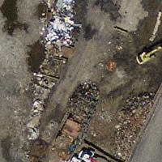</p>
<p>Full raster tile before clipping</p></td>
<td><p>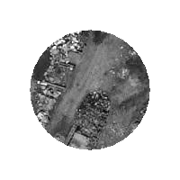</p>
<p>After Clipping</p></td>
</tr>
</tbody>
</table>


## Examples: 1 band clipping with no crop and add back other bands unchanged


```

-- Same example as before, but we need to set crop to false to be able to use ST_AddBand
-- because ST_AddBand requires all bands be the same Width and height
SELECT ST_AddBand(ST_Clip(rast, 1,
        ST_Buffer(ST_Centroid(ST_Envelope(rast)),20),false
    ), ARRAY[ST_Band(rast,2),ST_Band(rast,3)] ) from aerials.boston
WHERE rid = 6;

```


<table>
<tbody>
<tr>
<td><p>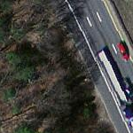</p>
<p>Full raster tile before clipping</p></td>
<td><p>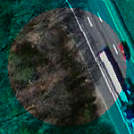</p>
<p>After Clipping - surreal</p></td>
</tr>
</tbody>
</table>


## Examples: Clip all bands


```

-- Clip all bands of an aerial tile by a 20 meter buffer.
-- Only difference is we don't specify a specific band to clip
-- so all bands are clipped
SELECT ST_Clip(rast,
      ST_Buffer(ST_Centroid(ST_Envelope(rast)), 20),
      false
    ) from aerials.boston
WHERE rid = 4;

```


<table>
<tbody>
<tr>
<td><p></p>
<p>Full raster tile before clipping</p></td>
<td><p>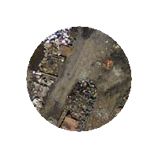</p>
<p>After Clipping</p></td>
</tr>
</tbody>
</table>


## See Also


 [RT_ST_AddBand](raster-constructors.md#RT_ST_AddBand), [RT_ST_Count](raster-band-statistics-and-analytics.md#RT_ST_Count), [RT_ST_MapAlgebra](#RT_ST_MapAlgebra), [RT_ST_Intersection](#RT_ST_Intersection)
  <a id="RT_ST_ColorMap"></a>

# ST_ColorMap

Creates a new raster of up to four 8BUI bands (grayscale, RGB, RGBA) from the source raster and a specified band. Band 1 is assumed if not specified.

## Synopsis


```sql
raster ST_ColorMap(raster  rast, integer  nband=1, text  colormap=grayscale, text  method=INTERPOLATE)
```


```sql
raster ST_ColorMap(raster  rast, text  colormap, text  method=INTERPOLATE)
```


## Description


 Apply a `colormap` to the band at `nband` of `rast` resulting a new raster comprised of up to four 8BUI bands. The number of 8BUI bands in the new raster is determined by the number of color components defined in `colormap`.


If `nband` is not specified, then band 1 is assumed.


 `colormap` can be a keyword of a pre-defined colormap or a set of lines defining the value and the color components.


 Valid pre-defined `colormap` keyword:


-  `grayscale` or `greyscale` for a one 8BUI band raster of shades of gray.
-  `pseudocolor` for a four 8BUI (RGBA) band raster with colors going from blue to green to red.
-  `fire` for a four 8BUI (RGBA) band raster with colors going from black to red to pale yellow.
-  `bluered` for a four 8BUI (RGBA) band raster with colors going from blue to pale white to red.


 Users can pass a set of entries (one per line) to `colormap` to specify custom colormaps. Each entry generally consists of five values: the pixel value and corresponding Red, Green, Blue, Alpha components (color components between 0 and 255). Percent values can be used instead of pixel values where 0% and 100% are the minimum and maximum values found in the raster band. Values can be separated with commas (','), tabs, colons (':') and/or spaces. The pixel value can be set to *nv*, *null* or *nodata* for the NODATA value. An example is provided below.


```

5 0 0 0 255
4 100:50 55 255
1 150,100 150 255
0% 255 255 255 255
nv 0 0 0 0

```


 The syntax of `colormap` is similar to that of the color-relief mode of GDAL [gdaldem](http://www.gdal.org/gdaldem.html#gdaldem_color_relief).


 Valid keywords for `method`:


-  `INTERPOLATE` to use linear interpolation to smoothly blend the colors between the given pixel values
-  `EXACT` to strictly match only those pixels values found in the colormap. Pixels whose value does not match a colormap entry will be set to 0 0 0 0 (RGBA)
-  `NEAREST` to use the colormap entry whose value is closest to the pixel value


!!! note

    A great reference for colormaps is [ColorBrewer](http://www.colorbrewer2.org).


!!! warning

    The resulting bands of new raster will have no NODATA value set. Use [RT_ST_SetBandNoDataValue](raster-band-editors.md#RT_ST_SetBandNoDataValue) to set a NODATA value if one is needed.


Availability: 2.1.0


## Examples


This is a junk table to play with


```

-- setup test raster table --
DROP TABLE IF EXISTS funky_shapes;
CREATE TABLE funky_shapes(rast raster);

INSERT INTO funky_shapes(rast)
WITH ref AS (
    SELECT ST_MakeEmptyRaster( 200, 200, 0, 200, 1, -1, 0, 0) AS rast
)
SELECT
    ST_Union(rast)
FROM (
    SELECT
        ST_AsRaster(
            ST_Rotate(
                ST_Buffer(
                    ST_GeomFromText('LINESTRING(0 2,50 50,150 150,125 50)'),
                    i*2
                ),
                pi() * i * 0.125, ST_Point(50,50)
            ),
            ref.rast, '8BUI'::text, i * 5
        ) AS rast
    FROM ref
    CROSS JOIN generate_series(1, 10, 3) AS i
) AS shapes;

```


```sql

SELECT
    ST_NumBands(rast) As n_orig,
    ST_NumBands(ST_ColorMap(rast,1, 'greyscale')) As ngrey,
    ST_NumBands(ST_ColorMap(rast,1, 'pseudocolor')) As npseudo,
    ST_NumBands(ST_ColorMap(rast,1, 'fire')) As nfire,
    ST_NumBands(ST_ColorMap(rast,1, 'bluered')) As nbluered,
    ST_NumBands(ST_ColorMap(rast,1, '
100% 255   0   0
 80% 160   0   0
 50% 130   0   0
 30%  30   0   0
 20%  60   0   0
  0%   0   0   0
  nv 255 255 255
    ')) As nred
FROM funky_shapes;

```


```

 n_orig | ngrey | npseudo | nfire | nbluered | nred
--------+-------+---------+-------+----------+------
      1 |     1 |       4 |     4 |        4 |    3

```


## Examples: Compare different color map looks using ST_AsPNG


```sql

SELECT
    ST_AsPNG(rast) As orig_png,
    ST_AsPNG(ST_ColorMap(rast,1,'greyscale')) As grey_png,
    ST_AsPNG(ST_ColorMap(rast,1, 'pseudocolor')) As pseudo_png,
    ST_AsPNG(ST_ColorMap(rast,1, 'nfire')) As fire_png,
    ST_AsPNG(ST_ColorMap(rast,1, 'bluered')) As bluered_png,
    ST_AsPNG(ST_ColorMap(rast,1, '
100% 255   0   0
 80% 160   0   0
 50% 130   0   0
 30%  30   0   0
 20%  60   0   0
  0%   0   0   0
  nv 255 255 255
    ')) As red_png
FROM funky_shapes;

```


<table>
<tbody>
<tr>
<td><p></p>
<p>orig_png</p></td>
<td><p></p>
<p>grey_png</p></td>
<td><p></p>
<p>pseudo_png</p></td>
</tr>
<tr>
<td><p></p>
<p>fire_png</p></td>
<td><p></p>
<p>bluered_png</p></td>
<td><p></p>
<p>red_png</p></td>
</tr>
</tbody>
</table>


## See Also


 [RT_ST_AsPNG](raster-outputs.md#RT_ST_AsPNG), [RT_ST_AsRaster](raster-constructors.md#RT_ST_AsRaster) [RT_ST_MapAlgebra](#RT_ST_MapAlgebra), [RT_ST_Grayscale](#RT_ST_Grayscale) [RT_ST_NumBands](raster-accessors.md#RT_ST_NumBands), [RT_ST_Reclass](#RT_ST_Reclass), [RT_ST_SetBandNoDataValue](raster-band-editors.md#RT_ST_SetBandNoDataValue), [RT_ST_Union](#RT_ST_Union)
  <a id="RT_ST_Grayscale"></a>

# ST_Grayscale

Creates a new one-8BUI band raster from the source raster and specified bands representing Red, Green and Blue

## Synopsis


```sql
(1) raster ST_Grayscale(raster  rast, integer  redband=1, integer  greenband=2, integer  blueband=3, text  extenttype=INTERSECTION)
```


```sql
(2) raster ST_Grayscale(rastbandarg[]  rastbandargset, text  extenttype=INTERSECTION)
```


## Description


 Create a raster with one 8BUI band given three input bands (from one or more rasters). Any input band whose pixel type is not 8BUI will be reclassified using [RT_ST_Reclass](#RT_ST_Reclass).


!!! note

    This function is not like [RT_ST_ColorMap](#RT_ST_ColorMap) with the `grayscale` keyword as ST_ColorMap operates on only one band while this function expects three bands for RGB. This function applies the following equation for converting RGB to Grayscale: 0.2989 * RED + 0.5870 * GREEN + 0.1140 * BLUE


Availability: 2.5.0


## Examples: Variant 1


```sql

SET postgis.gdal_enabled_drivers = 'ENABLE_ALL';
SET postgis.enable_outdb_rasters = True;

WITH apple AS (
    SELECT ST_AddBand(
        ST_MakeEmptyRaster(350, 246, 0, 0, 1, -1, 0, 0, 0),
        '/tmp/apple.png'::text,
        NULL::int[]
    ) AS rast
)
SELECT
    ST_AsPNG(rast) AS original_png,
    ST_AsPNG(ST_Grayscale(rast)) AS grayscale_png
FROM apple;

```


<table>
<tbody>
<tr>
<td><p></p>
<p>original_png</p></td>
<td><p></p>
<p>grayscale_png</p></td>
</tr>
</tbody>
</table>


## Examples: Variant 2


```sql

SET postgis.gdal_enabled_drivers = 'ENABLE_ALL';
SET postgis.enable_outdb_rasters = True;

WITH apple AS (
    SELECT ST_AddBand(
        ST_MakeEmptyRaster(350, 246, 0, 0, 1, -1, 0, 0, 0),
        '/tmp/apple.png'::text,
        NULL::int[]
    ) AS rast
)
SELECT
    ST_AsPNG(rast) AS original_png,
    ST_AsPNG(ST_Grayscale(
        ARRAY[
            ROW(rast, 1)::rastbandarg, -- red
            ROW(rast, 2)::rastbandarg, -- green
            ROW(rast, 3)::rastbandarg, -- blue
        ]::rastbandarg[]
    )) AS grayscale_png
FROM apple;

```


## See Also


 [RT_ST_AsPNG](raster-outputs.md#RT_ST_AsPNG), [RT_ST_Reclass](#RT_ST_Reclass), [RT_ST_ColorMap](#RT_ST_ColorMap)
  <a id="RT_ST_Intersection"></a>

# ST_Intersection

Returns a raster or a set of geometry-pixelvalue pairs representing the shared portion of two rasters or the geometrical intersection of a vectorization of the raster and a geometry.

## Synopsis


```sql
setof geomval ST_Intersection(geometry  geom, raster  rast, integer  band_num=1)
setof geomval ST_Intersection(raster  rast, geometry  geom)
setof geomval ST_Intersection(raster  rast, integer  band, geometry  geomin)
raster ST_Intersection(raster  rast1, raster  rast2, double precision[]  nodataval)
raster ST_Intersection(raster  rast1, raster  rast2, text  returnband, double precision[]  nodataval)
raster ST_Intersection(raster  rast1, integer  band1, raster  rast2, integer  band2, double precision[]  nodataval)
raster ST_Intersection(raster  rast1, integer  band1, raster  rast2, integer  band2, text  returnband, double precision[]  nodataval)
```


## Description


 Returns a raster or a set of geometry-pixelvalue pairs representing the shared portion of two rasters or the geometrical intersection of a vectorization of the raster and a geometry.


 The first three variants, returning a setof geomval, works in vector space. The raster is first vectorized (using [RT_ST_DumpAsPolygons](raster-processing-raster-to-geometry.md#RT_ST_DumpAsPolygons)) into a set of geomval rows and those rows are then intersected with the geometry using the [ST_Intersection](../postgis-reference/overlay-functions.md#ST_Intersection) (geometry, geometry) PostGIS function. Geometries intersecting only with a nodata value area of a raster returns an empty geometry. They are normally excluded from the results by the proper usage of [RT_ST_Intersects](raster-and-raster-band-spatial-relationships.md#RT_ST_Intersects) in the WHERE clause.


 You can access the geometry and the value parts of the resulting set of geomval by surrounding them with parenthesis and adding '.geom' or '.val' at the end of the expression. e.g. (ST_Intersection(rast, geom)).geom


 The other variants, returning a raster, works in raster space. They are using the two rasters version of ST_MapAlgebraExpr to perform the intersection.


 The extent of the resulting raster corresponds to the geometrical intersection of the two raster extents. The resulting raster includes 'BAND1', 'BAND2' or 'BOTH' bands, following what is passed as the `returnband` parameter. Nodata value areas present in any band results in nodata value areas in every bands of the result. In other words, any pixel intersecting with a nodata value pixel becomes a nodata value pixel in the result.


 Rasters resulting from ST_Intersection must have a nodata value assigned for areas not intersecting. You can define or replace the nodata value for any resulting band by providing a `nodataval[]` array of one or two nodata values depending if you request 'BAND1', 'BAND2' or 'BOTH' bands. The first value in the array replace the nodata value in the first band and the second value replace the nodata value in the second band. If one input band do not have a nodata value defined and none are provided as an array, one is chosen using the ST_MinPossibleValue function. All variant accepting an array of nodata value can also accept a single value which will be assigned to each requested band.


 In all variants, if no band number is specified band 1 is assumed. If you need an intersection between a raster and geometry that returns a raster, refer to [RT_ST_Clip](#RT_ST_Clip).


!!! note

    To get more control on the resulting extent or on what to return when encountering a nodata value, use the two rasters version of [RT_ST_MapAlgebraExpr2](#RT_ST_MapAlgebraExpr2).


!!! note

    To compute the intersection of a raster band with a geometry in raster space, use [RT_ST_Clip](#RT_ST_Clip). ST_Clip works on multiple bands rasters and does not return a band corresponding to the rasterized geometry.


!!! note

    ST_Intersection should be used in conjunction with [RT_ST_Intersects](raster-and-raster-band-spatial-relationships.md#RT_ST_Intersects) and an index on the raster column and/or the geometry column.


 Enhanced: 2.0.0 - Intersection in the raster space was introduced. In earlier pre-2.0.0 versions, only intersection performed in vector space were supported.


## Examples: Geometry, Raster -- resulting in geometry vals


```sql

SELECT
    foo.rid,
    foo.gid,
    ST_AsText((foo.geomval).geom) As geomwkt,
    (foo.geomval).val
FROM (
    SELECT
        A.rid,
        g.gid,
        ST_Intersection(A.rast, g.geom) As geomval
    FROM dummy_rast AS A
    CROSS JOIN (
        VALUES
            (1, ST_Point(3427928, 5793243.85) ),
            (2, ST_GeomFromText('LINESTRING(3427927.85 5793243.75,3427927.8 5793243.75,3427927.8 5793243.8)')),
            (3, ST_GeomFromText('LINESTRING(1 2, 3 4)'))
    ) As g(gid,geom)
    WHERE A.rid = 2
) As foo;

 rid | gid |      geomwkt                                               | val
-----+-----+---------------------------------------------------------------------------------------------
   2 |   1 | POINT(3427928 5793243.85)                                  | 249
   2 |   1 | POINT(3427928 5793243.85)                                  | 253
   2 |   2 | POINT(3427927.85 5793243.75)                               | 254
   2 |   2 | POINT(3427927.8 5793243.8)                                 | 251
   2 |   2 | POINT(3427927.8 5793243.8)                                 | 253
   2 |   2 | LINESTRING(3427927.8 5793243.75,3427927.8 5793243.8)   | 252
   2 |   2 | MULTILINESTRING((3427927.8 5793243.8,3427927.8 5793243.75),...) | 250
   2 |   3 | GEOMETRYCOLLECTION EMPTY

```


## See Also


 [geomval](raster-support-data-types.md#geomval), [RT_ST_Intersects](raster-and-raster-band-spatial-relationships.md#RT_ST_Intersects), [RT_ST_MapAlgebraExpr2](#RT_ST_MapAlgebraExpr2), [RT_ST_Clip](#RT_ST_Clip), [ST_AsText](../postgis-reference/geometry-output.md#ST_AsText)
  <a id="RT_ST_MapAlgebra"></a>

# ST_MapAlgebra (callback function version)

Callback function version - Returns a one-band raster given one or more input rasters, band indexes and one user-specified callback function.

## Synopsis


```sql
raster ST_MapAlgebra(rastbandarg[]  rastbandargset, regprocedure  callbackfunc, text  pixeltype=NULL, text  extenttype=INTERSECTION, raster  customextent=NULL, integer  distancex=0, integer  distancey=0, text[]  VARIADIC userargs=NULL)
raster ST_MapAlgebra(raster  rast, integer[]  nband, regprocedure  callbackfunc, text  pixeltype=NULL, text  extenttype=FIRST, raster  customextent=NULL, integer  distancex=0, integer  distancey=0, text[]  VARIADIC userargs=NULL)
raster ST_MapAlgebra(raster  rast, integer  nband, regprocedure  callbackfunc, text  pixeltype=NULL, text  extenttype=FIRST, raster  customextent=NULL, integer  distancex=0, integer  distancey=0, text[]  VARIADIC userargs=NULL)
raster ST_MapAlgebra(raster  rast1, integer  nband1, raster  rast2, integer  nband2, regprocedure  callbackfunc, text  pixeltype=NULL, text  extenttype=INTERSECTION, raster  customextent=NULL, integer  distancex=0, integer  distancey=0, text[]  VARIADIC userargs=NULL)
raster ST_MapAlgebra(raster rast, integer nband, regprocedure  callbackfunc, float8[]  mask, boolean  weighted, text  pixeltype=NULL, text  extenttype=INTERSECTION, raster  customextent=NULL, text[]  VARIADIC userargs=NULL)
```


## Description


 Returns a one-band raster given one or more input rasters, band indexes and one user-specified callback function.


`rast,rast1,rast2, rastbandargset`
:   Rasters on which the map algebra process is evaluated.

    `rastbandargset` allows the use of a map algebra operation on many rasters and/or many bands. See example Variant 1.

`nband, nband1, nband2`
:   Band numbers of the raster to be evaluated. nband can be an integer or integer[] denoting the bands. nband1 is band on rast1 and nband2 is band on rast2 for the 2 raster/2band case.

`callbackfunc`
:   The `callbackfunc` parameter must be the name and signature of an SQL or PL/pgSQL function, cast to a regprocedure. An example PL/pgSQL function example is:


    ```sql

    CREATE OR REPLACE FUNCTION sample_callbackfunc(value double precision[][][], position integer[][], VARIADIC userargs text[])
        RETURNS double precision
        AS $$
        BEGIN
            RETURN 0;
        END;
        $$ LANGUAGE 'plpgsql' IMMUTABLE;

    ```


     The `callbackfunc` must have three arguments: a 3-dimension double precision array, a 2-dimension integer array and a variadic 1-dimension text array. The first argument `value` is the set of values (as double precision) from all input rasters. The three dimensions (where indexes are 1-based) are: raster #, row y, column x. The second argument `position` is the set of pixel positions from the output raster and input rasters. The outer dimension (where indexes are 0-based) is the raster #. The position at outer dimension index 0 is the output raster's pixel position. For each outer dimension, there are two elements in the inner dimension for X and Y. The third argument `userargs` is for passing through any user-specified arguments.


     Passing a `regprocedure` argument to a SQL function requires the full function signature to be passed, then cast to a `regprocedure` type. To pass the above example PL/pgSQL function as an argument, the SQL for the argument is:


    ```

    'sample_callbackfunc(double precision[], integer[], text[])'::regprocedure

    ```


     Note that the argument contains the name of the function, the types of the function arguments, quotes around the name and argument types, and a cast to a `regprocedure`.

`mask`
:   An n-dimensional array (matrix) of numbers used to filter what cells get passed to map algebra call-back function. 0 means a neighbor cell value should be treated as no-data and 1 means value should be treated as data. If weight is set to true, then the values, are used as multipliers to multiple the pixel value of that value in the neighborhood position.

`weighted`
:   boolean (true/false) to denote if a mask value should be weighted (multiplied by original value) or not (only applies to proto that takes a mask).

`pixeltype`
:   If `pixeltype` is passed in, the one band of the new raster will be of that pixeltype. If pixeltype is passed NULL or left out, the new raster band will have the same pixeltype as the specified band of the first raster (for extent types: INTERSECTION, UNION, FIRST, CUSTOM) or the specified band of the appropriate raster (for extent types: SECOND, LAST). If in doubt, always specify `pixeltype`.


     The resulting pixel type of the output raster must be one listed in [RT_ST_BandPixelType](raster-band-accessors.md#RT_ST_BandPixelType) or left out or set to NULL.

`extenttype`
:   Possible values are INTERSECTION (default), UNION, FIRST (default for one raster variants), SECOND, LAST, CUSTOM.

`customextent`
:   If `extentype` is CUSTOM, a raster must be provided for `customextent`. See example 4 of Variant 1.

`distancex`
:   The distance in pixels from the reference cell in x direction. So width of resulting matrix would be <code>2*distancex + 1</code>.If not specified only the reference cell is considered (neighborhood of 0).

`distancey`
:   The distance in pixels from reference cell in y direction. Height of resulting matrix would be <code>2*distancey + 1</code> .If not specified only the reference cell is considered (neighborhood of 0).

`userargs`
:   The third argument to the `callbackfunc` is a `variadic text` array. All trailing text arguments are passed through to the specified `callbackfunc`, and are contained in the `userargs` argument.


!!! note

    For more information about the VARIADIC keyword, please refer to the PostgreSQL documentation and the "SQL Functions with Variable Numbers of Arguments" section of [Query Language (SQL) Functions](http://www.postgresql.org/docs/current/static/xfunc-sql.html).


!!! note

    The `text[]` argument to the `callbackfunc` is required, regardless of whether you choose to pass any arguments to the callback function for processing or not.


 Variant 1 accepts an array of `rastbandarg` allowing the use of a map algebra operation on many rasters and/or many bands. See example Variant 1.


 Variants 2 and 3 operate upon one or more bands of one raster. See example Variant 2 and 3.


 Variant 4 operate upon two rasters with one band per raster. See example Variant 4.


Availability: 2.2.0: Ability to add a mask


Availability: 2.1.0


## Examples: Variant 1


One raster, one band


```sql

WITH foo AS (
    SELECT 1 AS rid, ST_AddBand(ST_MakeEmptyRaster(2, 2, 0, 0, 1, -1, 0, 0, 0), 1, '16BUI', 1, 0) AS rast
)
SELECT
    ST_MapAlgebra(
        ARRAY[ROW(rast, 1)]::rastbandarg[],
        'sample_callbackfunc(double precision[], int[], text[])'::regprocedure
    ) AS rast
FROM foo

```


One raster, several bands


```sql

WITH foo AS (
    SELECT 1 AS rid, ST_AddBand(ST_AddBand(ST_AddBand(ST_MakeEmptyRaster(2, 2, 0, 0, 1, -1, 0, 0, 0), 1, '16BUI', 1, 0), 2, '8BUI', 10, 0), 3, '32BUI', 100, 0) AS rast
)
SELECT
    ST_MapAlgebra(
        ARRAY[ROW(rast, 3), ROW(rast, 1), ROW(rast, 3), ROW(rast, 2)]::rastbandarg[],
        'sample_callbackfunc(double precision[], int[], text[])'::regprocedure
    ) AS rast
FROM foo

```


Several rasters, several bands


```sql

WITH foo AS (
    SELECT 1 AS rid, ST_AddBand(ST_AddBand(ST_AddBand(ST_MakeEmptyRaster(2, 2, 0, 0, 1, -1, 0, 0, 0), 1, '16BUI', 1, 0), 2, '8BUI', 10, 0), 3, '32BUI', 100, 0) AS rast UNION ALL
    SELECT 2 AS rid, ST_AddBand(ST_AddBand(ST_AddBand(ST_MakeEmptyRaster(2, 2, 0, 1, 1, -1, 0, 0, 0), 1, '16BUI', 2, 0), 2, '8BUI', 20, 0), 3, '32BUI', 300, 0) AS rast
)
SELECT
    ST_MapAlgebra(
        ARRAY[ROW(t1.rast, 3), ROW(t2.rast, 1), ROW(t2.rast, 3), ROW(t1.rast, 2)]::rastbandarg[],
        'sample_callbackfunc(double precision[], int[], text[])'::regprocedure
    ) AS rast
FROM foo t1
CROSS JOIN foo t2
WHERE t1.rid = 1
    AND t2.rid = 2

```


Complete example of tiles of a coverage with neighborhood. This query only works with PostgreSQL 9.1 or higher.


```sql

WITH foo AS (
    SELECT 0 AS rid, ST_AddBand(ST_MakeEmptyRaster(2, 2, 0, 0, 1, -1, 0, 0, 0), 1, '16BUI', 1, 0) AS rast UNION ALL
    SELECT 1, ST_AddBand(ST_MakeEmptyRaster(2, 2, 2, 0, 1, -1, 0, 0, 0), 1, '16BUI', 2, 0) AS rast UNION ALL
    SELECT 2, ST_AddBand(ST_MakeEmptyRaster(2, 2, 4, 0, 1, -1, 0, 0, 0), 1, '16BUI', 3, 0) AS rast UNION ALL

    SELECT 3, ST_AddBand(ST_MakeEmptyRaster(2, 2, 0, -2, 1, -1, 0, 0, 0), 1, '16BUI', 10, 0) AS rast UNION ALL
    SELECT 4, ST_AddBand(ST_MakeEmptyRaster(2, 2, 2, -2, 1, -1, 0, 0, 0), 1, '16BUI', 20, 0) AS rast UNION ALL
    SELECT 5, ST_AddBand(ST_MakeEmptyRaster(2, 2, 4, -2, 1, -1, 0, 0, 0), 1, '16BUI', 30, 0) AS rast UNION ALL

    SELECT 6, ST_AddBand(ST_MakeEmptyRaster(2, 2, 0, -4, 1, -1, 0, 0, 0), 1, '16BUI', 100, 0) AS rast UNION ALL
    SELECT 7, ST_AddBand(ST_MakeEmptyRaster(2, 2, 2, -4, 1, -1, 0, 0, 0), 1, '16BUI', 200, 0) AS rast UNION ALL
    SELECT 8, ST_AddBand(ST_MakeEmptyRaster(2, 2, 4, -4, 1, -1, 0, 0, 0), 1, '16BUI', 300, 0) AS rast
)
SELECT
    t1.rid,
    ST_MapAlgebra(
        ARRAY[ROW(ST_Union(t2.rast), 1)]::rastbandarg[],
        'sample_callbackfunc(double precision[], int[], text[])'::regprocedure,
        '32BUI',
        'CUSTOM', t1.rast,
        1, 1
    ) AS rast
FROM foo t1
CROSS JOIN foo t2
WHERE t1.rid = 4
    AND t2.rid BETWEEN 0 AND 8
    AND ST_Intersects(t1.rast, t2.rast)
GROUP BY t1.rid, t1.rast

```


Example like the prior one for tiles of a coverage with neighborhood but works with PostgreSQL 9.0.


```sql

WITH src AS (
    SELECT 0 AS rid, ST_AddBand(ST_MakeEmptyRaster(2, 2, 0, 0, 1, -1, 0, 0, 0), 1, '16BUI', 1, 0) AS rast UNION ALL
    SELECT 1, ST_AddBand(ST_MakeEmptyRaster(2, 2, 2, 0, 1, -1, 0, 0, 0), 1, '16BUI', 2, 0) AS rast UNION ALL
    SELECT 2, ST_AddBand(ST_MakeEmptyRaster(2, 2, 4, 0, 1, -1, 0, 0, 0), 1, '16BUI', 3, 0) AS rast UNION ALL

    SELECT 3, ST_AddBand(ST_MakeEmptyRaster(2, 2, 0, -2, 1, -1, 0, 0, 0), 1, '16BUI', 10, 0) AS rast UNION ALL
    SELECT 4, ST_AddBand(ST_MakeEmptyRaster(2, 2, 2, -2, 1, -1, 0, 0, 0), 1, '16BUI', 20, 0) AS rast UNION ALL
    SELECT 5, ST_AddBand(ST_MakeEmptyRaster(2, 2, 4, -2, 1, -1, 0, 0, 0), 1, '16BUI', 30, 0) AS rast UNION ALL

    SELECT 6, ST_AddBand(ST_MakeEmptyRaster(2, 2, 0, -4, 1, -1, 0, 0, 0), 1, '16BUI', 100, 0) AS rast UNION ALL
    SELECT 7, ST_AddBand(ST_MakeEmptyRaster(2, 2, 2, -4, 1, -1, 0, 0, 0), 1, '16BUI', 200, 0) AS rast UNION ALL
    SELECT 8, ST_AddBand(ST_MakeEmptyRaster(2, 2, 4, -4, 1, -1, 0, 0, 0), 1, '16BUI', 300, 0) AS rast
)
WITH foo AS (
    SELECT
        t1.rid,
        ST_Union(t2.rast) AS rast
    FROM src t1
    JOIN src t2
        ON ST_Intersects(t1.rast, t2.rast)
        AND t2.rid BETWEEN 0 AND 8
    WHERE t1.rid = 4
    GROUP BY t1.rid
), bar AS (
    SELECT
        t1.rid,
        ST_MapAlgebra(
            ARRAY[ROW(t2.rast, 1)]::rastbandarg[],
            'raster_nmapalgebra_test(double precision[], int[], text[])'::regprocedure,
            '32BUI',
            'CUSTOM', t1.rast,
            1, 1
        ) AS rast
    FROM src t1
    JOIN foo t2
        ON t1.rid = t2.rid
)
SELECT
    rid,
    (ST_Metadata(rast)),
    (ST_BandMetadata(rast, 1)),
    ST_Value(rast, 1, 1, 1)
FROM bar;

```


## Examples: Variants 2 and 3


One raster, several bands


```sql

WITH foo AS (
    SELECT 1 AS rid, ST_AddBand(ST_AddBand(ST_AddBand(ST_MakeEmptyRaster(2, 2, 0, 0, 1, -1, 0, 0, 0), 1, '16BUI', 1, 0), 2, '8BUI', 10, 0), 3, '32BUI', 100, 0) AS rast
)
SELECT
    ST_MapAlgebra(
        rast, ARRAY[3, 1, 3, 2]::integer[],
        'sample_callbackfunc(double precision[], int[], text[])'::regprocedure
    ) AS rast
FROM foo

```


One raster, one band


```sql

WITH foo AS (
    SELECT 1 AS rid, ST_AddBand(ST_AddBand(ST_AddBand(ST_MakeEmptyRaster(2, 2, 0, 0, 1, -1, 0, 0, 0), 1, '16BUI', 1, 0), 2, '8BUI', 10, 0), 3, '32BUI', 100, 0) AS rast
)
SELECT
    ST_MapAlgebra(
        rast, 2,
        'sample_callbackfunc(double precision[], int[], text[])'::regprocedure
    ) AS rast
FROM foo

```


## Examples: Variant 4


Two rasters, two bands


```sql

WITH foo AS (
    SELECT 1 AS rid, ST_AddBand(ST_AddBand(ST_AddBand(ST_MakeEmptyRaster(2, 2, 0, 0, 1, -1, 0, 0, 0), 1, '16BUI', 1, 0), 2, '8BUI', 10, 0), 3, '32BUI', 100, 0) AS rast UNION ALL
    SELECT 2 AS rid, ST_AddBand(ST_AddBand(ST_AddBand(ST_MakeEmptyRaster(2, 2, 0, 1, 1, -1, 0, 0, 0), 1, '16BUI', 2, 0), 2, '8BUI', 20, 0), 3, '32BUI', 300, 0) AS rast
)
SELECT
    ST_MapAlgebra(
        t1.rast, 2,
        t2.rast, 1,
        'sample_callbackfunc(double precision[], int[], text[])'::regprocedure
    ) AS rast
FROM foo t1
CROSS JOIN foo t2
WHERE t1.rid = 1
    AND t2.rid = 2

```


## Examples: Using Masks


```sql

WITH foo AS (SELECT
   ST_SetBandNoDataValue(
ST_SetValue(ST_SetValue(ST_AsRaster(
        ST_Buffer(
            ST_GeomFromText('LINESTRING(50 50,100 90,100 50)'), 5,'join=bevel'),
            200,200,ARRAY['8BUI'], ARRAY[100], ARRAY[0]), ST_Buffer('POINT(70 70)'::geometry,10,'quad_segs=1') ,50),
  'LINESTRING(20 20, 100 100, 150 98)'::geometry,1),0)  AS rast )
SELECT 'original' AS title, rast
FROM foo
UNION ALL
SELECT 'no mask mean value' AS title, ST_MapAlgebra(rast,1,'ST_mean4ma(double precision[], int[], text[])'::regprocedure) AS rast
FROM foo
UNION ALL
SELECT 'mask only consider neighbors, exclude center' AS title, ST_MapAlgebra(rast,1,'ST_mean4ma(double precision[], int[], text[])'::regprocedure,
    '{{1,1,1}, {1,0,1}, {1,1,1}}'::double precision[], false) As rast
FROM foo

UNION ALL
SELECT 'mask weighted only consider neighbors, exclude center multi other pixel values by 2' AS title, ST_MapAlgebra(rast,1,'ST_mean4ma(double precision[], int[], text[])'::regprocedure,
    '{{2,2,2}, {2,0,2}, {2,2,2}}'::double precision[], true) As rast
FROM foo;

```


<table>
<tbody>
<tr>
<td><p></p>
<p>original</p></td>
<td><p></p>
<p>no mask mean value (same as having all 1s in mask matrix)</p></td>
</tr>
<tr>
<td><p></p>
<p>mask only consider neighbors, exclude center</p></td>
<td><p></p>
<p>mask weighted only consider neighbors, exclude center multi other pixel values by 2</p></td>
</tr>
</tbody>
</table>


## See Also


 [rastbandarg](raster-support-data-types.md#rastbandarg), [RT_ST_Union](#RT_ST_Union), [RT_ST_MapAlgebra_expr](#RT_ST_MapAlgebra_expr)
  <a id="RT_ST_MapAlgebra_expr"></a>

# ST_MapAlgebra (expression version)

Expression version - Returns a one-band raster given one or two input rasters, band indexes and one or more user-specified SQL expressions.

## Synopsis


```sql
raster ST_MapAlgebra(raster  rast, integer  nband, text  pixeltype, text  expression, double precision  nodataval=NULL)
raster ST_MapAlgebra(raster  rast, text  pixeltype, text  expression, double precision  nodataval=NULL)
raster ST_MapAlgebra(raster  rast1, integer  nband1, raster  rast2, integer  nband2, text  expression, text  pixeltype=NULL, text  extenttype=INTERSECTION, text  nodata1expr=NULL, text  nodata2expr=NULL, double precision  nodatanodataval=NULL)
raster ST_MapAlgebra(raster  rast1, raster  rast2, text  expression, text  pixeltype=NULL, text  extenttype=INTERSECTION, text  nodata1expr=NULL, text  nodata2expr=NULL, double precision  nodatanodataval=NULL)
```


## Description


 Expression version - Returns a one-band raster given one or two input rasters, band indexes and one or more user-specified SQL expressions.


Availability: 2.1.0


## Description: Variants 1 and 2 (one raster)


 Creates a new one band raster formed by applying a valid PostgreSQL algebraic operation defined by the `expression` on the input raster (`rast`). If `nband` is not provided, band 1 is assumed. The new raster will have the same georeference, width, and height as the original raster but will only have one band.


 If `pixeltype` is passed in, then the new raster will have a band of that pixeltype. If pixeltype is passed NULL, then the new raster band will have the same pixeltype as the input `rast` band.


- Keywords permitted for `expression`

1. `[rast]` - Pixel value of the pixel of interest
2. `[rast.val]` - Pixel value of the pixel of interest
3. `[rast.x]` - 1-based pixel column of the pixel of interest
4. `[rast.y]` - 1-based pixel row of the pixel of interest


## Description: Variants 3 and 4 (two raster)


 Creates a new one band raster formed by applying a valid PostgreSQL algebraic operation to the two bands defined by the `expression` on the two input raster bands `rast1`, (`rast2`). If no `band1`, `band2` is specified band 1 is assumed. The resulting raster will be aligned (scale, skew and pixel corners) on the grid defined by the first raster. The resulting raster will have the extent defined by the `extenttype` parameter.


`expression`
:   A PostgreSQL algebraic expression involving the two rasters and PostgreSQL defined functions/operators that will define the pixel value when pixels intersect. e.g. (([rast1] + [rast2])/2.0)::integer

`pixeltype`
:   The resulting pixel type of the output raster. Must be one listed in [RT_ST_BandPixelType](raster-band-accessors.md#RT_ST_BandPixelType), left out or set to NULL. If not passed in or set to NULL, will default to the pixeltype of the first raster.

`extenttype`
:   Controls the extent of resulting raster


    1.  `INTERSECTION` - The extent of the new raster is the intersection of the two rasters. This is the default.
    2.  `UNION` - The extent of the new raster is the union of the two rasters.
    3.  `FIRST` - The extent of the new raster is the same as the one of the first raster.
    4.  `SECOND` - The extent of the new raster is the same as the one of the second raster.

`nodata1expr`
:   An algebraic expression involving only `rast2` or a constant that defines what to return when pixels of `rast1` are nodata values and spatially corresponding rast2 pixels have values.

`nodata2expr`
:   An algebraic expression involving only `rast1` or a constant that defines what to return when pixels of `rast2` are nodata values and spatially corresponding rast1 pixels have values.

`nodatanodataval`
:   A numeric constant to return when spatially corresponding rast1 and rast2 pixels are both nodata values.


- Keywords permitted in `expression`, `nodata1expr` and `nodata2expr`

1. `[rast1]` - Pixel value of the pixel of interest from `rast1`
2. `[rast1.val]` - Pixel value of the pixel of interest from `rast1`
3. `[rast1.x]` - 1-based pixel column of the pixel of interest from `rast1`
4. `[rast1.y]` - 1-based pixel row of the pixel of interest from `rast1`
5. `[rast2]` - Pixel value of the pixel of interest from `rast2`
6. `[rast2.val]` - Pixel value of the pixel of interest from `rast2`
7. `[rast2.x]` - 1-based pixel column of the pixel of interest from `rast2`
8. `[rast2.y]` - 1-based pixel row of the pixel of interest from `rast2`


## Examples: Variants 1 and 2


```sql

WITH foo AS (
    SELECT ST_AddBand(ST_MakeEmptyRaster(10, 10, 0, 0, 1, 1, 0, 0, 0), '32BF'::text, 1, -1) AS rast
)
SELECT
    ST_MapAlgebra(rast, 1, NULL, 'ceil([rast]*[rast.x]/[rast.y]+[rast.val])')
FROM foo;

```


## Examples: Variant 3 and 4


```sql

WITH foo AS (
    SELECT 1 AS rid, ST_AddBand(ST_AddBand(ST_AddBand(ST_MakeEmptyRaster(2, 2, 0, 0, 1, -1, 0, 0, 0), 1, '16BUI', 1, 0), 2, '8BUI', 10, 0), 3, '32BUI'::text, 100, 0) AS rast UNION ALL
    SELECT 2 AS rid, ST_AddBand(ST_AddBand(ST_AddBand(ST_MakeEmptyRaster(2, 2, 0, 1, 1, -1, 0, 0, 0), 1, '16BUI', 2, 0), 2, '8BUI', 20, 0), 3, '32BUI'::text, 300, 0) AS rast
)
SELECT
    ST_MapAlgebra(
        t1.rast, 2,
        t2.rast, 1,
        '([rast2] + [rast1.val]) / 2'
    ) AS rast
FROM foo t1
CROSS JOIN foo t2
WHERE t1.rid = 1
    AND t2.rid = 2;

```


## See Also


 [rastbandarg](raster-support-data-types.md#rastbandarg), [RT_ST_Union](#RT_ST_Union), [RT_ST_MapAlgebra](#RT_ST_MapAlgebra)
  <a id="RT_ST_MapAlgebraExpr"></a>

# ST_MapAlgebraExpr

1 raster band version: Creates a new one band raster formed by applying a valid PostgreSQL algebraic operation on the input raster band and of pixeltype provided. Band 1 is assumed if no band is specified.

## Synopsis


```sql
raster ST_MapAlgebraExpr(raster  rast, integer  band, text  pixeltype, text  expression, double precision  nodataval=NULL)
raster ST_MapAlgebraExpr(raster  rast, text  pixeltype, text  expression, double precision  nodataval=NULL)
```


## Description


!!! warning

    [RT_ST_MapAlgebraExpr](#RT_ST_MapAlgebraExpr) is deprecated as of 2.1.0. Use [RT_ST_MapAlgebra_expr](#RT_ST_MapAlgebra_expr) instead.


 Creates a new one band raster formed by applying a valid PostgreSQL algebraic operation defined by the `expression` on the input raster (`rast`). If no `band` is specified band 1 is assumed. The new raster will have the same georeference, width, and height as the original raster but will only have one band.


 If `pixeltype` is passed in, then the new raster will have a band of that pixeltype. If pixeltype is passed NULL, then the new raster band will have the same pixeltype as the input `rast` band.


 In the expression you can use the term `[rast]` to refer to the pixel value of the original band, `[rast.x]` to refer to the 1-based pixel column index, `[rast.y]` to refer to the 1-based pixel row index.


Availability: 2.0.0


## Examples


Create a new 1 band raster from our original that is a function of modulo 2 of the original raster band.


```sql

ALTER TABLE dummy_rast ADD COLUMN map_rast raster;
UPDATE dummy_rast SET map_rast = ST_MapAlgebraExpr(rast,NULL,'mod([rast]::numeric,2)') WHERE rid = 2;

SELECT
    ST_Value(rast,1,i,j) As origval,
    ST_Value(map_rast, 1, i, j) As mapval
FROM dummy_rast
CROSS JOIN generate_series(1, 3) AS i
CROSS JOIN generate_series(1,3) AS j
WHERE rid = 2;

 origval | mapval
---------+--------
     253 |      1
     254 |      0
     253 |      1
     253 |      1
     254 |      0
     254 |      0
     250 |      0
     254 |      0
     254 |      0

```


Create a new 1 band raster of pixel-type 2BUI from our original that is reclassified and set the nodata value to be 0.


```sql
ALTER TABLE dummy_rast ADD COLUMN map_rast2 raster;
UPDATE dummy_rast SET
    map_rast2 = ST_MapAlgebraExpr(rast,'2BUI'::text,'CASE WHEN [rast] BETWEEN 100 and 250 THEN 1 WHEN [rast] = 252 THEN 2 WHEN [rast] BETWEEN 253 and 254 THEN 3 ELSE 0 END'::text, '0')
WHERE rid = 2;

SELECT DISTINCT
    ST_Value(rast,1,i,j) As origval,
    ST_Value(map_rast2, 1, i, j) As mapval
FROM dummy_rast
CROSS JOIN generate_series(1, 5) AS i
CROSS JOIN generate_series(1,5) AS j
WHERE rid = 2;

 origval | mapval
---------+--------
     249 |      1
     250 |      1
     251 |
     252 |      2
     253 |      3
     254 |      3

SELECT
    ST_BandPixelType(map_rast2) As b1pixtyp
FROM dummy_rast
WHERE rid = 2;

 b1pixtyp
----------
 2BUI

```


<table>
<tbody>
<tr>
<td><p>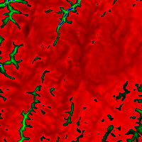</p>
<p>original (column rast_view)</p></td>
<td><p>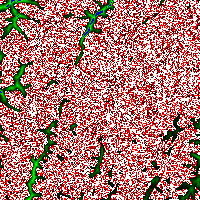</p>
<p>rast_view_ma</p></td>
</tr>
</tbody>
</table>


Create a new 3 band raster same pixel type from our original 3 band raster with first band altered by map algebra and remaining 2 bands unaltered.


```sql

SELECT
    ST_AddBand(
        ST_AddBand(
            ST_AddBand(
                ST_MakeEmptyRaster(rast_view),
                ST_MapAlgebraExpr(rast_view,1,NULL,'tan([rast])*[rast]')
            ),
            ST_Band(rast_view,2)
        ),
        ST_Band(rast_view, 3)
    )  As rast_view_ma
FROM wind
WHERE rid=167;

```


## See Also


 [RT_ST_MapAlgebraExpr2](#RT_ST_MapAlgebraExpr2), [RT_ST_MapAlgebraFct](#RT_ST_MapAlgebraFct), [RT_ST_BandPixelType](raster-band-accessors.md#RT_ST_BandPixelType), [RT_ST_GeoReference](raster-accessors.md#RT_ST_GeoReference), [RT_ST_Value](raster-pixel-accessors-and-setters.md#RT_ST_Value)
  <a id="RT_ST_MapAlgebraExpr2"></a>

# ST_MapAlgebraExpr

2 raster band version: Creates a new one band raster formed by applying a valid PostgreSQL algebraic operation on the two input raster bands and of pixeltype provided. band 1 of each raster is assumed if no band numbers are specified. The resulting raster will be aligned (scale, skew and pixel corners) on the grid defined by the first raster and have its extent defined by the "extenttype" parameter. Values for "extenttype" can be: INTERSECTION, UNION, FIRST, SECOND.

## Synopsis


```sql
raster ST_MapAlgebraExpr(raster  rast1, raster  rast2, text  expression, text  pixeltype=same_as_rast1_band, text  extenttype=INTERSECTION, text  nodata1expr=NULL, text  nodata2expr=NULL, double precision  nodatanodataval=NULL)
raster ST_MapAlgebraExpr(raster  rast1, integer  band1, raster  rast2, integer  band2, text  expression, text  pixeltype=same_as_rast1_band, text  extenttype=INTERSECTION, text  nodata1expr=NULL, text  nodata2expr=NULL, double precision  nodatanodataval=NULL)
```


## Description


!!! warning

    [RT_ST_MapAlgebraExpr2](#RT_ST_MapAlgebraExpr2) is deprecated as of 2.1.0. Use [RT_ST_MapAlgebra_expr](#RT_ST_MapAlgebra_expr) instead.


 Creates a new one band raster formed by applying a valid PostgreSQL algebraic operation to the two bands defined by the `expression` on the two input raster bands `rast1`, (`rast2`). If no `band1`, `band2` is specified band 1 is assumed. The resulting raster will be aligned (scale, skew and pixel corners) on the grid defined by the first raster. The resulting raster will have the extent defined by the `extenttype` parameter.


`expression`
:   A PostgreSQL algebraic expression involving the two rasters and PostgreSQL defined functions/operators that will define the pixel value when pixels intersect. e.g. (([rast1] + [rast2])/2.0)::integer

`pixeltype`
:   The resulting pixel type of the output raster. Must be one listed in [RT_ST_BandPixelType](raster-band-accessors.md#RT_ST_BandPixelType), left out or set to NULL. If not passed in or set to NULL, will default to the pixeltype of the first raster.

`extenttype`
:   Controls the extent of resulting raster


    1.  `INTERSECTION` - The extent of the new raster is the intersection of the two rasters. This is the default.
    2.  `UNION` - The extent of the new raster is the union of the two rasters.
    3.  `FIRST` - The extent of the new raster is the same as the one of the first raster.
    4.  `SECOND` - The extent of the new raster is the same as the one of the second raster.

`nodata1expr`
:   An algebraic expression involving only `rast2` or a constant that defines what to return when pixels of `rast1` are nodata values and spatially corresponding rast2 pixels have values.

`nodata2expr`
:   An algebraic expression involving only `rast1` or a constant that defines what to return when pixels of `rast2` are nodata values and spatially corresponding rast1 pixels have values.

`nodatanodataval`
:   A numeric constant to return when spatially corresponding rast1 and rast2 pixels are both nodata values.


 If `pixeltype` is passed in, then the new raster will have a band of that pixeltype. If pixeltype is passed NULL or no pixel type specified, then the new raster band will have the same pixeltype as the input `rast1` band.


 Use the term `[rast1.val]` `[rast2.val]` to refer to the pixel value of the original raster bands and `[rast1.x]`, `[rast1.y]` etc. to refer to the column / row positions of the pixels.


Availability: 2.0.0


## Example: 2 Band Intersection and Union


Create a new 1 band raster from our original that is a function of modulo 2 of the original raster band.


```

--Create a cool set of rasters --
DROP TABLE IF EXISTS fun_shapes;
CREATE TABLE fun_shapes(rid serial PRIMARY KEY, fun_name text, rast raster);

-- Insert some cool shapes around Boston in Massachusetts state plane meters --
INSERT INTO fun_shapes(fun_name, rast)
VALUES ('ref', ST_AsRaster(ST_MakeEnvelope(235229, 899970, 237229, 901930,26986),200,200,'8BUI',0,0));

INSERT INTO fun_shapes(fun_name,rast)
WITH ref(rast) AS (SELECT rast FROM fun_shapes WHERE fun_name = 'ref' )
SELECT 'area' AS fun_name, ST_AsRaster(ST_Buffer(ST_SetSRID(ST_Point(236229, 900930),26986), 1000),
            ref.rast,'8BUI', 10, 0) As rast
FROM ref
UNION ALL
SELECT 'rand bubbles',
            ST_AsRaster(
            (SELECT ST_Collect(geom)
    FROM (SELECT ST_Buffer(ST_SetSRID(ST_Point(236229 + i*random()*100, 900930 + j*random()*100),26986), random()*20) As geom
            FROM generate_series(1,10) As i, generate_series(1,10) As j
            ) As foo ), ref.rast,'8BUI', 200, 0)
FROM ref;

--map them -
SELECT  ST_MapAlgebraExpr(
        area.rast, bub.rast, '[rast2.val]', '8BUI', 'INTERSECTION', '[rast2.val]', '[rast1.val]') As interrast,
        ST_MapAlgebraExpr(
            area.rast, bub.rast, '[rast2.val]', '8BUI', 'UNION', '[rast2.val]', '[rast1.val]') As unionrast
FROM
  (SELECT rast FROM fun_shapes WHERE
 fun_name = 'area') As area
CROSS JOIN  (SELECT rast
FROM fun_shapes WHERE
 fun_name = 'rand bubbles') As bub

```


<table>
<tbody>
<tr>
<td><p></p>
<p>mapalgebra intersection</p></td>
<td><p>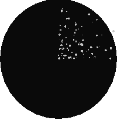</p>
<p>map algebra union</p></td>
</tr>
</tbody>
</table>


## Example: Overlaying rasters on a canvas as separate bands


```

-- we use ST_AsPNG to render the image so all single band ones look grey --
WITH mygeoms
    AS ( SELECT 2 As bnum, ST_Buffer(ST_Point(1,5),10) As geom
            UNION ALL
            SELECT 3 AS bnum,
                ST_Buffer(ST_GeomFromText('LINESTRING(50 50,150 150,150 50)'), 10,'join=bevel') As geom
            UNION ALL
            SELECT 1 As bnum,
                ST_Buffer(ST_GeomFromText('LINESTRING(60 50,150 150,150 50)'), 5,'join=bevel') As geom
            ),
   -- define our canvas to be 1 to 1 pixel to geometry
   canvas
    AS (SELECT ST_AddBand(ST_MakeEmptyRaster(200,
        200,
        ST_XMin(e)::integer, ST_YMax(e)::integer, 1, -1, 0, 0) , '8BUI'::text,0) As rast
        FROM (SELECT ST_Extent(geom) As e,
                    Max(ST_SRID(geom)) As srid
                    from mygeoms
                    ) As foo
            ),
   rbands AS (SELECT ARRAY(SELECT ST_MapAlgebraExpr(canvas.rast, ST_AsRaster(m.geom, canvas.rast, '8BUI', 100),
                 '[rast2.val]', '8BUI', 'FIRST', '[rast2.val]', '[rast1.val]') As rast
                FROM mygeoms AS m CROSS JOIN canvas
                ORDER BY m.bnum) As rasts
                )
          SELECT rasts[1] As rast1 , rasts[2] As rast2, rasts[3] As rast3, ST_AddBand(
                    ST_AddBand(rasts[1],rasts[2]), rasts[3]) As final_rast
            FROM rbands;

```


<table>
<tbody>
<tr>
<td><p></p>
<p>rast1</p></td>
<td><p></p>
<p>rast2</p></td>
</tr>
<tr>
<td><p></p>
<p>rast3</p></td>
<td><p></p>
<p>final_rast</p></td>
</tr>
</tbody>
</table>


## Example: Overlay 2 meter boundary of select parcels over an aerial imagery


```
-- Create new 3 band raster composed of first 2 clipped bands, and overlay of 3rd band with our geometry
-- This query took 3.6 seconds on PostGIS windows 64-bit install
WITH pr AS
-- Note the order of operation: we clip all the rasters to dimensions of our region
(SELECT ST_Clip(rast,ST_Expand(geom,50) ) As rast, g.geom
    FROM aerials.o_2_boston AS r INNER JOIN
-- union our parcels of interest so they form a single geometry we can later intersect with
        (SELECT ST_Union(ST_Transform(geom,26986)) AS geom
          FROM landparcels WHERE pid IN('0303890000', '0303900000')) As g
        ON ST_Intersects(rast::geometry, ST_Expand(g.geom,50))
),
-- we then union the raster shards together
-- ST_Union on raster is kinda of slow but much faster the smaller you can get the rasters
-- therefore we want to clip first and then union
prunion AS
(SELECT ST_AddBand(NULL, ARRAY[ST_Union(rast,1),ST_Union(rast,2),ST_Union(rast,3)] ) As clipped,geom
FROM pr
GROUP BY geom)
-- return our final raster which is the unioned shard with
-- with the overlay of our parcel boundaries
-- add first 2 bands, then mapalgebra of 3rd band + geometry
SELECT ST_AddBand(ST_Band(clipped,ARRAY[1,2])
    , ST_MapAlgebraExpr(ST_Band(clipped,3), ST_AsRaster(ST_Buffer(ST_Boundary(geom),2),clipped, '8BUI',250),
     '[rast2.val]', '8BUI', 'FIRST', '[rast2.val]', '[rast1.val]') ) As rast
FROM prunion;

```


<table>
<tbody>
<tr>
<td><p>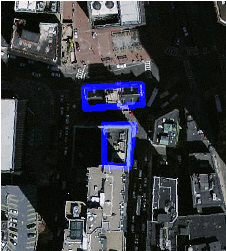</p>
<p>The blue lines are the boundaries of select parcels</p></td>
</tr>
</tbody>
</table>


## See Also


 [RT_ST_MapAlgebraExpr](#RT_ST_MapAlgebraExpr), [RT_ST_AddBand](raster-constructors.md#RT_ST_AddBand), [RT_ST_AsPNG](raster-outputs.md#RT_ST_AsPNG), [RT_ST_AsRaster](raster-constructors.md#RT_ST_AsRaster), [RT_ST_MapAlgebraFct](#RT_ST_MapAlgebraFct), [RT_ST_BandPixelType](raster-band-accessors.md#RT_ST_BandPixelType), [RT_ST_GeoReference](raster-accessors.md#RT_ST_GeoReference), [RT_ST_Value](raster-pixel-accessors-and-setters.md#RT_ST_Value), [RT_ST_Union](#RT_ST_Union), [ST_Union](../postgis-reference/overlay-functions.md#ST_Union)
  <a id="RT_ST_MapAlgebraFct"></a>

# ST_MapAlgebraFct

1 band version - Creates a new one band raster formed by applying a valid PostgreSQL function on the input raster band and of pixeltype prodived. Band 1 is assumed if no band is specified.

## Synopsis


```sql
raster ST_MapAlgebraFct(raster rast, regprocedure onerasteruserfunc)
raster ST_MapAlgebraFct(raster rast, regprocedure onerasteruserfunc, text[] VARIADIC args)
raster ST_MapAlgebraFct(raster rast, text pixeltype, regprocedure onerasteruserfunc)
raster ST_MapAlgebraFct(raster rast, text pixeltype, regprocedure onerasteruserfunc, text[] VARIADIC args)
raster ST_MapAlgebraFct(raster rast, integer band, regprocedure onerasteruserfunc)
raster ST_MapAlgebraFct(raster rast, integer band, regprocedure onerasteruserfunc, text[] VARIADIC args)
raster ST_MapAlgebraFct(raster rast, integer band, text pixeltype, regprocedure onerasteruserfunc)
raster ST_MapAlgebraFct(raster rast, integer band, text pixeltype, regprocedure onerasteruserfunc, text[] VARIADIC args)
```


## Description


!!! warning

    [RT_ST_MapAlgebraFct](#RT_ST_MapAlgebraFct) is deprecated as of 2.1.0. Use [RT_ST_MapAlgebra](#RT_ST_MapAlgebra) instead.


Creates a new one band raster formed by applying a valid PostgreSQL function specified by the `onerasteruserfunc` on the input raster (`rast`). If no `band` is specified, band 1 is assumed. The new raster will have the same georeference, width, and height as the original raster but will only have one band.


If `pixeltype` is passed in, then the new raster will have a band of that pixeltype. If pixeltype is passed NULL, then the new raster band will have the same pixeltype as the input `rast` band.


The `onerasteruserfunc` parameter must be the name and signature of a SQL or PL/pgSQL function, cast to a regprocedure. A very simple and quite useless PL/pgSQL function example is:


```sql
CREATE OR REPLACE FUNCTION simple_function(pixel FLOAT, pos INTEGER[], VARIADIC args TEXT[])
    RETURNS FLOAT
    AS $$ BEGIN
        RETURN 0.0;
    END; $$
    LANGUAGE 'plpgsql' IMMUTABLE;
```


 The `userfunction` may accept two or three arguments: a float value, an optional integer array, and a variadic text array. The first argument is the value of an individual raster cell (regardless of the raster datatype). The second argument is the position of the current processing cell in the form '{x,y}'. The third argument indicates that all remaining parameters to [RT_ST_MapAlgebraFct](#RT_ST_MapAlgebraFct) shall be passed through to the `userfunction`.


 Passing a `regprodedure` argument to a SQL function requires the full function signature to be passed, then cast to a `regprocedure` type. To pass the above example PL/pgSQL function as an argument, the SQL for the argument is:


```
'simple_function(float,integer[],text[])'::regprocedure
```


 Note that the argument contains the name of the function, the types of the function arguments, quotes around the name and argument types, and a cast to a `regprocedure`.


 The third argument to the `userfunction` is a `variadic text` array. All trailing text arguments to any [RT_ST_MapAlgebraFct](#RT_ST_MapAlgebraFct) call are passed through to the specified `userfunction`, and are contained in the `args` argument.


!!! note

    For more information about the VARIADIC keyword, please refer to the PostgreSQL documentation and the "SQL Functions with Variable Numbers of Arguments" section of [Query Language (SQL) Functions](http://www.postgresql.org/docs/current/static/xfunc-sql.html).


!!! note

    The `text[]` argument to the `userfunction` is required, regardless of whether you choose to pass any arguments to your user function for processing or not.


Availability: 2.0.0


## Examples


Create a new 1 band raster from our original that is a function of modulo 2 of the original raster band.


```sql
ALTER TABLE dummy_rast ADD COLUMN map_rast raster;
CREATE FUNCTION mod_fct(pixel float, pos integer[], variadic args text[])
RETURNS float
AS $$
BEGIN
    RETURN pixel::integer % 2;
END;
$$
LANGUAGE 'plpgsql' IMMUTABLE;

UPDATE dummy_rast SET map_rast = ST_MapAlgebraFct(rast,NULL,'mod_fct(float,integer[],text[])'::regprocedure) WHERE rid = 2;

SELECT ST_Value(rast,1,i,j) As origval, ST_Value(map_rast, 1, i, j) As mapval
FROM dummy_rast CROSS JOIN generate_series(1, 3) AS i CROSS JOIN generate_series(1,3) AS j
WHERE rid = 2;

 origval | mapval
---------+--------
     253 |      1
     254 |      0
     253 |      1
     253 |      1
     254 |      0
     254 |      0
     250 |      0
     254 |      0
     254 |      0

```


Create a new 1 band raster of pixel-type 2BUI from our original that is reclassified and set the nodata value to a passed parameter to the user function (0).


```sql

ALTER TABLE dummy_rast ADD COLUMN map_rast2 raster;
CREATE FUNCTION classify_fct(pixel float, pos integer[], variadic args text[])
RETURNS float
AS
$$
DECLARE
    nodata float := 0;
BEGIN
    IF NOT args[1] IS NULL THEN
        nodata := args[1];
    END IF;
    IF pixel < 251 THEN
        RETURN 1;
    ELSIF pixel = 252 THEN
        RETURN 2;
    ELSIF pixel > 252 THEN
        RETURN 3;
    ELSE
        RETURN nodata;
    END IF;
END;
$$
LANGUAGE 'plpgsql';
UPDATE dummy_rast SET map_rast2 = ST_MapAlgebraFct(rast,'2BUI','classify_fct(float,integer[],text[])'::regprocedure, '0') WHERE rid = 2;

SELECT DISTINCT ST_Value(rast,1,i,j) As origval, ST_Value(map_rast2, 1, i, j) As mapval
FROM dummy_rast CROSS JOIN generate_series(1, 5) AS i CROSS JOIN generate_series(1,5) AS j
WHERE rid = 2;

 origval | mapval
---------+--------
     249 |      1
     250 |      1
     251 |
     252 |      2
     253 |      3
     254 |      3

SELECT ST_BandPixelType(map_rast2) As b1pixtyp
FROM dummy_rast WHERE rid = 2;

 b1pixtyp
----------
 2BUI
```


<table>
<tbody>
<tr>
<td><p></p>
<p>original (column rast-view)</p></td>
<td><p></p>
<p>rast_view_ma</p></td>
</tr>
</tbody>
</table>


Create a new 3 band raster same pixel type from our original 3 band raster with first band altered by map algebra and remaining 2 bands unaltered.


```sql
CREATE FUNCTION rast_plus_tan(pixel float, pos integer[], variadic args text[])
RETURNS float
AS
$$
BEGIN
    RETURN tan(pixel) * pixel;
END;
$$
LANGUAGE 'plpgsql';

SELECT ST_AddBand(
    ST_AddBand(
        ST_AddBand(
            ST_MakeEmptyRaster(rast_view),
            ST_MapAlgebraFct(rast_view,1,NULL,'rast_plus_tan(float,integer[],text[])'::regprocedure)
        ),
        ST_Band(rast_view,2)
    ),
    ST_Band(rast_view, 3) As rast_view_ma
)
FROM wind
WHERE rid=167;

```


## See Also


 [RT_ST_MapAlgebraExpr](#RT_ST_MapAlgebraExpr), [RT_ST_BandPixelType](raster-band-accessors.md#RT_ST_BandPixelType), [RT_ST_GeoReference](raster-accessors.md#RT_ST_GeoReference), [RT_ST_SetValue](raster-pixel-accessors-and-setters.md#RT_ST_SetValue)
  <a id="RT_ST_MapAlgebraFct2"></a>

# ST_MapAlgebraFct

2 band version - Creates a new one band raster formed by applying a valid PostgreSQL function on the 2 input raster bands and of pixeltype prodived. Band 1 is assumed if no band is specified. Extent type defaults to INTERSECTION if not specified.

## Synopsis


```sql
raster ST_MapAlgebraFct(raster rast1, raster rast2, regprocedure tworastuserfunc, text pixeltype=same_as_rast1, text extenttype=INTERSECTION, text[] VARIADIC userargs)
raster ST_MapAlgebraFct(raster rast1, integer band1, raster rast2, integer band2, regprocedure tworastuserfunc, text pixeltype=same_as_rast1, text extenttype=INTERSECTION, text[] VARIADIC userargs)
```


## Description


!!! warning

    [RT_ST_MapAlgebraFct2](#RT_ST_MapAlgebraFct2) is deprecated as of 2.1.0. Use [RT_ST_MapAlgebra](#RT_ST_MapAlgebra) instead.


Creates a new one band raster formed by applying a valid PostgreSQL function specified by the `tworastuserfunc` on the input raster `rast1`, `rast2`. If no `band1` or `band2` is specified, band 1 is assumed. The new raster will have the same georeference, width, and height as the original rasters but will only have one band.


If `pixeltype` is passed in, then the new raster will have a band of that pixeltype. If pixeltype is passed NULL or left out, then the new raster band will have the same pixeltype as the input `rast1` band.


The `tworastuserfunc` parameter must be the name and signature of an SQL or PL/pgSQL function, cast to a regprocedure. An example PL/pgSQL function example is:


```sql
CREATE OR REPLACE FUNCTION simple_function_for_two_rasters(pixel1 FLOAT, pixel2 FLOAT, pos INTEGER[], VARIADIC args TEXT[])
    RETURNS FLOAT
    AS $$ BEGIN
        RETURN 0.0;
    END; $$
    LANGUAGE 'plpgsql' IMMUTABLE;
```


 The `tworastuserfunc` may accept three or four arguments: a double precision value, a double precision value, an optional integer array, and a variadic text array. The first argument is the value of an individual raster cell in `rast1` (regardless of the raster datatype). The second argument is an individual raster cell value in `rast2`. The third argument is the position of the current processing cell in the form '{x,y}'. The fourth argument indicates that all remaining parameters to [RT_ST_MapAlgebraFct2](#RT_ST_MapAlgebraFct2) shall be passed through to the `tworastuserfunc`.


Passing a `regprodedure` argument to a SQL function requires the full function signature to be passed, then cast to a `regprocedure` type. To pass the above example PL/pgSQL function as an argument, the SQL for the argument is:


```
'simple_function(double precision, double precision, integer[], text[])'::regprocedure
```


 Note that the argument contains the name of the function, the types of the function arguments, quotes around the name and argument types, and a cast to a `regprocedure`.


The fourth argument to the `tworastuserfunc` is a `variadic text` array. All trailing text arguments to any [RT_ST_MapAlgebraFct2](#RT_ST_MapAlgebraFct2) call are passed through to the specified `tworastuserfunc`, and are contained in the `userargs` argument.


!!! note

    For more information about the VARIADIC keyword, please refer to the PostgreSQL documentation and the "SQL Functions with Variable Numbers of Arguments" section of [Query Language (SQL) Functions](http://www.postgresql.org/docs/current/static/xfunc-sql.html).


!!! note

    The `text[]` argument to the `tworastuserfunc` is required, regardless of whether you choose to pass any arguments to your user function for processing or not.


Availability: 2.0.0


## Example: Overlaying rasters on a canvas as separate bands


```


-- define our user defined function --
CREATE OR REPLACE FUNCTION raster_mapalgebra_union(
    rast1 double precision,
    rast2 double precision,
    pos integer[],
    VARIADIC userargs text[]
)
    RETURNS double precision
    AS $$
    DECLARE
    BEGIN
        CASE
            WHEN rast1 IS NOT NULL AND rast2 IS NOT NULL THEN
                RETURN ((rast1 + rast2)/2.);
            WHEN rast1 IS NULL AND rast2 IS NULL THEN
                RETURN NULL;
            WHEN rast1 IS NULL THEN
                RETURN rast2;
            ELSE
                RETURN rast1;
        END CASE;

        RETURN NULL;
    END;
    $$ LANGUAGE 'plpgsql' IMMUTABLE COST 1000;

-- prep our test table of rasters
DROP TABLE IF EXISTS map_shapes;
CREATE TABLE map_shapes(rid serial PRIMARY KEY, rast raster, bnum integer, descrip text);
INSERT INTO map_shapes(rast,bnum, descrip)
WITH mygeoms
    AS ( SELECT 2 As bnum, ST_Buffer(ST_Point(90,90),30) As geom, 'circle' As descrip
            UNION ALL
            SELECT 3 AS bnum,
                ST_Buffer(ST_GeomFromText('LINESTRING(50 50,150 150,150 50)'), 15) As geom, 'big road' As descrip
            UNION ALL
            SELECT 1 As bnum,
                ST_Translate(ST_Buffer(ST_GeomFromText('LINESTRING(60 50,150 150,150 50)'), 8,'join=bevel'), 10,-6) As geom, 'small road' As descrip
            ),
   -- define our canvas to be 1 to 1 pixel to geometry
   canvas
    AS ( SELECT ST_AddBand(ST_MakeEmptyRaster(250,
        250,
        ST_XMin(e)::integer, ST_YMax(e)::integer, 1, -1, 0, 0 ) , '8BUI'::text,0) As rast
        FROM (SELECT ST_Extent(geom) As e,
                    Max(ST_SRID(geom)) As srid
                    from mygeoms
                    ) As foo
            )
-- return our rasters aligned with our canvas
SELECT ST_AsRaster(m.geom, canvas.rast, '8BUI', 240) As rast, bnum, descrip
                FROM mygeoms AS m CROSS JOIN canvas
UNION ALL
SELECT canvas.rast, 4, 'canvas'
FROM canvas;

-- Map algebra on single band rasters and then collect with ST_AddBand
INSERT INTO map_shapes(rast,bnum,descrip)
SELECT ST_AddBand(ST_AddBand(rasts[1], rasts[2]),rasts[3]), 4, 'map bands overlay fct union (canvas)'
    FROM (SELECT ARRAY(SELECT ST_MapAlgebraFct(m1.rast, m2.rast,
            'raster_mapalgebra_union(double precision, double precision, integer[], text[])'::regprocedure, '8BUI', 'FIRST')
                FROM map_shapes As m1 CROSS JOIN map_shapes As m2
    WHERE m1.descrip = 'canvas' AND m2.descrip <> 'canvas' ORDER BY m2.bnum) As rasts) As foo;
```


<table>
<tbody>
<tr>
<td><p></p>
<p>map bands overlay (canvas) (R: small road, G: circle, B: big road)</p></td>
</tr>
</tbody>
</table>


## User Defined function that takes extra args


```sql

CREATE OR REPLACE FUNCTION raster_mapalgebra_userargs(
    rast1 double precision,
    rast2 double precision,
    pos integer[],
    VARIADIC userargs text[]
)
    RETURNS double precision
    AS $$
    DECLARE
    BEGIN
        CASE
            WHEN rast1 IS NOT NULL AND rast2 IS NOT NULL THEN
                RETURN least(userargs[1]::integer,(rast1 + rast2)/2.);
            WHEN rast1 IS NULL AND rast2 IS NULL THEN
                RETURN userargs[2]::integer;
            WHEN rast1 IS NULL THEN
                RETURN greatest(rast2,random()*userargs[3]::integer)::integer;
            ELSE
                RETURN greatest(rast1, random()*userargs[4]::integer)::integer;
        END CASE;

        RETURN NULL;
    END;
    $$ LANGUAGE 'plpgsql' VOLATILE COST 1000;

SELECT ST_MapAlgebraFct(m1.rast, 1, m1.rast, 3,
            'raster_mapalgebra_userargs(double precision, double precision, integer[], text[])'::regprocedure,
                '8BUI', 'INTERSECT', '100','200','200','0')
                FROM map_shapes As m1
    WHERE m1.descrip = 'map bands overlay fct union (canvas)';

```


user defined with extra args and different bands from same raster


## See Also


 [RT_ST_MapAlgebraExpr2](#RT_ST_MapAlgebraExpr2), [RT_ST_BandPixelType](raster-band-accessors.md#RT_ST_BandPixelType), [RT_ST_GeoReference](raster-accessors.md#RT_ST_GeoReference), [RT_ST_SetValue](raster-pixel-accessors-and-setters.md#RT_ST_SetValue)
  <a id="RT_ST_MapAlgebraFctNgb"></a>

# ST_MapAlgebraFctNgb

1-band version: Map Algebra Nearest Neighbor using user-defined PostgreSQL function. Return a raster which values are the result of a PLPGSQL user function involving a neighborhood of values from the input raster band.

## Synopsis


```sql
raster ST_MapAlgebraFctNgb(raster  rast, integer  band, text  pixeltype, integer  ngbwidth, integer  ngbheight, regprocedure  onerastngbuserfunc, text  nodatamode, text[]  VARIADIC args)
```


## Description


!!! warning

    [RT_ST_MapAlgebraFctNgb](#RT_ST_MapAlgebraFctNgb) is deprecated as of 2.1.0. Use [RT_ST_MapAlgebra](#RT_ST_MapAlgebra) instead.


(one raster version) Return a raster which values are the result of a PLPGSQL user function involving a neighborhood of values from the input raster band. The user function takes the neighborhood of pixel values as an array of numbers, for each pixel, returns the result from the user function, replacing pixel value of currently inspected pixel with the function result.


`rast`
:   Raster on which the user function is evaluated.

`band`
:   Band number of the raster to be evaluated. Default to 1.

`pixeltype`
:   The resulting pixel type of the output raster. Must be one listed in [RT_ST_BandPixelType](raster-band-accessors.md#RT_ST_BandPixelType) or left out or set to NULL. If not passed in or set to NULL, will default to the pixeltype of the `rast`. Results are truncated if they are larger than what is allowed for the pixeltype.

`ngbwidth`
:   The width of the neighborhood, in cells.

`ngbheight`
:   The height of the neighborhood, in cells.

`onerastngbuserfunc`
:   PLPGSQL/psql user function to apply to neighborhood pixels of a single band of a raster. The first element is a 2-dimensional array of numbers representing the rectangular pixel neighborhood

`nodatamode`
:   Defines what value to pass to the function for a neighborhood pixel that is nodata or NULL


    'ignore': any NODATA values encountered in the neighborhood are ignored by the computation -- this flag must be sent to the user callback function, and the user function decides how to ignore it.


    'NULL': any NODATA values encountered in the neighborhood will cause the resulting pixel to be NULL -- the user callback function is skipped in this case.


    'value': any NODATA values encountered in the neighborhood are replaced by the reference pixel (the one in the center of the neighborhood). Note that if this value is NODATA, the behavior is the same as 'NULL' (for the affected neighborhood)

`args`
:   Arguments to pass into the user function.


Availability: 2.0.0


## Examples


Examples utilize the katrina raster loaded as a single tile described in [http://trac.osgeo.org/gdal/wiki/frmts_wtkraster.html](http://trac.osgeo.org/gdal/wiki/frmts_wtkraster.html) and then prepared in the [RT_ST_Rescale](raster-editors.md#RT_ST_Rescale) examples


```

--
-- A simple 'callback' user function that averages up all the values in a neighborhood.
--
CREATE OR REPLACE FUNCTION rast_avg(matrix float[][], nodatamode text, variadic args text[])
    RETURNS float AS
    $$
    DECLARE
        _matrix float[][];
        x1 integer;
        x2 integer;
        y1 integer;
        y2 integer;
        sum float;
    BEGIN
        _matrix := matrix;
        sum := 0;
        FOR x in array_lower(matrix, 1)..array_upper(matrix, 1) LOOP
            FOR y in array_lower(matrix, 2)..array_upper(matrix, 2) LOOP
                sum := sum + _matrix[x][y];
            END LOOP;
        END LOOP;
        RETURN (sum*1.0/(array_upper(matrix,1)*array_upper(matrix,2) ))::integer ;
    END;
    $$
LANGUAGE 'plpgsql' IMMUTABLE COST 1000;

-- now we apply to our raster averaging pixels within 2 pixels of each other in X and Y direction --
SELECT ST_MapAlgebraFctNgb(rast, 1,  '8BUI', 4,4,
        'rast_avg(float[][], text, text[])'::regprocedure, 'NULL', NULL) As nn_with_border
    FROM katrinas_rescaled
    limit 1;

```


<table>
<tbody>
<tr>
<td><p>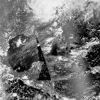</p>
<p>First band of our raster</p></td>
<td><p>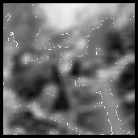</p>
<p>new raster after averaging pixels within 4x4 pixels of each other</p></td>
</tr>
</tbody>
</table>


## See Also


 [RT_ST_MapAlgebraFct](#RT_ST_MapAlgebraFct), [RT_ST_MapAlgebraExpr](#RT_ST_MapAlgebraExpr), [RT_ST_Rescale](raster-editors.md#RT_ST_Rescale)
  <a id="RT_ST_Reclass"></a>

# ST_Reclass

Creates a new raster composed of band types reclassified from original. The nband is the band to be changed. If nband is not specified assumed to be 1. All other bands are returned unchanged. Use case: convert a 16BUI band to a 8BUI and so forth for simpler rendering as viewable formats.

## Synopsis


```sql
raster ST_Reclass(raster  rast, integer  nband, text  reclassexpr, text  pixeltype, double precision  nodataval=NULL)
raster ST_Reclass(raster  rast, reclassarg[]  VARIADIC reclassargset)
raster ST_Reclass(raster  rast, text  reclassexpr, text  pixeltype)
```


## Description


Creates a new raster formed by applying a valid PostgreSQL algebraic operation defined by the `reclassexpr` on the input raster (`rast`). If no `band` is specified band 1 is assumed. The new raster will have the same georeference, width, and height as the original raster. Bands not designated will come back unchanged. Refer to [reclassarg](raster-support-data-types.md#reclassarg) for description of valid reclassification expressions.


The bands of the new raster will have pixel type of `pixeltype`. If `reclassargset` is passed in then each reclassarg defines behavior of each band generated.


Availability: 2.0.0


## Examples Basic


Create a new raster from the original where band 2 is converted from 8BUI to 4BUI and all values from 101-254 are set to nodata value.


```sql

ALTER TABLE dummy_rast ADD COLUMN reclass_rast raster;
UPDATE dummy_rast SET reclass_rast = ST_Reclass(rast,2,'0-87:1-10, 88-100:11-15, 101-254:0-0', '4BUI',0) WHERE rid = 2;

SELECT i as col, j as row, ST_Value(rast,2,i,j) As origval,
    ST_Value(reclass_rast, 2, i, j) As reclassval,
    ST_Value(reclass_rast, 2, i, j, false) As reclassval_include_nodata
FROM dummy_rast CROSS JOIN generate_series(1, 3) AS i CROSS JOIN generate_series(1,3) AS j
WHERE rid = 2;

 col | row | origval | reclassval | reclassval_include_nodata
-----+-----+---------+------------+---------------------------
   1 |   1 |      78 |          9 |                         9
   2 |   1 |      98 |         14 |                        14
   3 |   1 |     122 |            |                         0
   1 |   2 |      96 |         14 |                        14
   2 |   2 |     118 |            |                         0
   3 |   2 |     180 |            |                         0
   1 |   3 |      99 |         15 |                        15
   2 |   3 |     112 |            |                         0
   3 |   3 |     169 |            |                         0

```


## Example: Advanced using multiple reclassargs


Create a new raster from the original where band 1,2,3 is converted to 1BB,4BUI, 4BUI respectively and reclassified. Note this uses the variadic `reclassarg` argument which can take as input an indefinite number of reclassargs (theoretically as many bands as you have)


```sql

UPDATE dummy_rast SET reclass_rast =
    ST_Reclass(rast,
        ROW(2,'0-87]:1-10, (87-100]:11-15, (101-254]:0-0', '4BUI',NULL)::reclassarg,
        ROW(1,'0-253]:1, 254:0', '1BB', NULL)::reclassarg,
        ROW(3,'0-70]:1, (70-86:2, [86-150):3, [150-255:4', '4BUI', NULL)::reclassarg
        ) WHERE rid = 2;

SELECT i as col, j as row,ST_Value(rast,1,i,j) As ov1,  ST_Value(reclass_rast, 1, i, j) As rv1,
    ST_Value(rast,2,i,j) As ov2, ST_Value(reclass_rast, 2, i, j) As rv2,
    ST_Value(rast,3,i,j) As ov3, ST_Value(reclass_rast, 3, i, j) As rv3
FROM dummy_rast CROSS JOIN generate_series(1, 3) AS i CROSS JOIN generate_series(1,3) AS j
WHERE rid = 2;

col | row | ov1 | rv1 | ov2 | rv2 | ov3 | rv3
----+-----+-----+-----+-----+-----+-----+-----
  1 |   1 | 253 |   1 |  78 |   9 |  70 |   1
  2 |   1 | 254 |   0 |  98 |  14 |  86 |   3
  3 |   1 | 253 |   1 | 122 |   0 | 100 |   3
  1 |   2 | 253 |   1 |  96 |  14 |  80 |   2
  2 |   2 | 254 |   0 | 118 |   0 | 108 |   3
  3 |   2 | 254 |   0 | 180 |   0 | 162 |   4
  1 |   3 | 250 |   1 |  99 |  15 |  90 |   3
  2 |   3 | 254 |   0 | 112 |   0 | 108 |   3
  3 |   3 | 254 |   0 | 169 |   0 | 175 |   4

```


## Example: Advanced Map a single band 32BF raster to multiple viewable bands


Create a new 3 band (8BUI,8BUI,8BUI viewable raster) from a raster that has only one 32bf band


```sql

ALTER TABLE wind ADD COLUMN rast_view raster;
UPDATE wind
    set rast_view = ST_AddBand( NULL,
        ARRAY[
    ST_Reclass(rast, 1,'0.1-10]:1-10,9-10]:11,(11-33:0'::text, '8BUI'::text,0),
    ST_Reclass(rast,1, '11-33):0-255,[0-32:0,(34-1000:0'::text, '8BUI'::text,0),
    ST_Reclass(rast,1,'0-32]:0,(32-100:100-255'::text, '8BUI'::text,0)
    ]
    );

```


## See Also


 [RT_ST_AddBand](raster-constructors.md#RT_ST_AddBand), [RT_ST_Band](raster-constructors.md#RT_ST_Band), [RT_ST_BandPixelType](raster-band-accessors.md#RT_ST_BandPixelType), [RT_ST_MakeEmptyRaster](raster-constructors.md#RT_ST_MakeEmptyRaster), [reclassarg](raster-support-data-types.md#reclassarg), [RT_ST_Value](raster-pixel-accessors-and-setters.md#RT_ST_Value)
  <a id="RT_ST_Union"></a>

# ST_Union

Returns the union of a set of raster tiles into a single raster composed of 1 or more bands.

## Synopsis


```sql
raster ST_Union(setof raster  rast)
raster ST_Union(setof raster  rast, unionarg[]  unionargset)
raster ST_Union(setof raster rast, integer nband)
raster ST_Union(setof raster rast, text uniontype)
raster ST_Union(setof raster rast, integer nband, text uniontype)
```


## Description


Returns the union of a set of raster tiles into a single raster composed of at least one band. The resulting raster's extent is the extent of the whole set. In the case of intersection, the resulting value is defined by `uniontype` which is one of the following: LAST (default), FIRST, MIN, MAX, COUNT, SUM, MEAN, RANGE.


!!! note

    In order for rasters to be unioned, they must all have the same alignment. Use [RT_ST_SameAlignment](raster-and-raster-band-spatial-relationships.md#RT_ST_SameAlignment) and [RT_ST_NotSameAlignmentReason](raster-and-raster-band-spatial-relationships.md#RT_ST_NotSameAlignmentReason) for more details and help. One way to fix alignment issues is to use [RT_ST_Resample](raster-editors.md#RT_ST_Resample) and use the same reference raster for alignment.


Availability: 2.0.0


Enhanced: 2.1.0 Improved Speed (fully C-Based).


Availability: 2.1.0 ST_Union(rast, unionarg) variant was introduced.


Enhanced: 2.1.0 ST_Union(rast) (variant 1) unions all bands of all input rasters. Prior versions of PostGIS assumed the first band.


Enhanced: 2.1.0 ST_Union(rast, uniontype) (variant 4) unions all bands of all input rasters.


## Examples: Reconstitute a single band chunked raster tile


```

-- this creates a single band from first band of raster tiles
-- that form the original file system tile
SELECT filename, ST_Union(rast,1) As file_rast
FROM sometable WHERE filename IN('dem01', 'dem02') GROUP BY filename;

```


## Examples: Return a multi-band raster that is the union of tiles intersecting geometry


```

-- this creates a multi band raster collecting all the tiles that intersect a line
-- Note: In 2.0, this would have just returned a single band raster
-- , new union works on all bands by default
-- this is equivalent to unionarg: ARRAY[ROW(1, 'LAST'), ROW(2, 'LAST'), ROW(3, 'LAST')]::unionarg[]
SELECT ST_Union(rast)
FROM aerials.boston
WHERE ST_Intersects(rast,  ST_GeomFromText('LINESTRING(230486 887771, 230500 88772)',26986) );

```


## Examples: Return a multi-band raster that is the union of tiles intersecting geometry


Here we use the longer syntax if we only wanted a subset of bands or we want to change order of bands


```

-- this creates a multi band raster collecting all the tiles that intersect a line
SELECT ST_Union(rast,ARRAY[ROW(2, 'LAST'), ROW(1, 'LAST'), ROW(3, 'LAST')]::unionarg[])
FROM aerials.boston
WHERE ST_Intersects(rast,  ST_GeomFromText('LINESTRING(230486 887771, 230500 88772)',26986) );

```


## See Also


 [unionarg](raster-support-data-types.md#unionarg), [RT_ST_Envelope](raster-processing-raster-to-geometry.md#RT_ST_Envelope), [RT_ST_ConvexHull](raster-processing-raster-to-geometry.md#RT_ST_ConvexHull), [RT_ST_Clip](#RT_ST_Clip), [ST_Union](../postgis-reference/overlay-functions.md#ST_Union)
