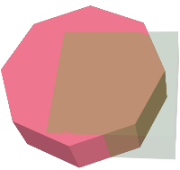
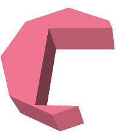
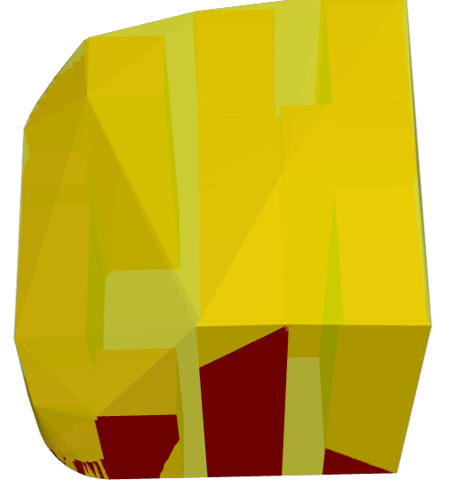
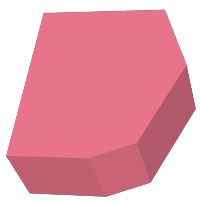
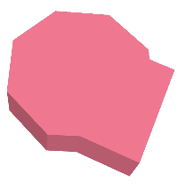
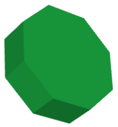
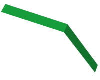
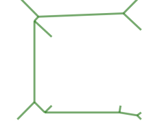

<a id="sfcgal_processing"></a>

## SFCGAL Processing and Relationship Functions
  <a id="CG_Intersection"></a>

# CG_Intersection

Computes the intersection of two geometries

## Synopsis


```sql
geometry CG_Intersection(geometry
                            geomA, geometry
                            geomB)
```


## Description


Computes the intersection of two geometries.


Performed by the SFCGAL module


!!! note

    NOTE: this function returns a geometry representing the intersection.


Availability: 3.5.0


## Geometry Examples


```sql
SELECT ST_AsText(CG_Intersection('LINESTRING(0 0, 5 5)', 'LINESTRING(5 0, 0 5)'));
                cg_intersection
                -----------------
                POINT(2.5 2.5)
                (1 row)
```


## See Also


[ST_3DIntersection](#ST_3DIntersection), [ST_Intersection](../postgis-reference/overlay-functions.md#ST_Intersection)
  <a id="CG_Intersects"></a>

# CG_Intersects

Tests if two geometries intersect (they have at least one point in common)

## Synopsis


```sql
boolean CG_Intersects(geometry
                        geomA, geometry
                        geomB)
```


## Description


Returns `true` if two geometries intersect. Geometries intersect if they have any point in common.


Performed by the SFCGAL module


!!! note

    NOTE: this is the "allowable" version that returns a boolean, not an integer.


Availability: 3.5.0


## Geometry Examples


```sql
SELECT CG_Intersects('POINT(0 0)'::geometry, 'LINESTRING ( 2 0, 0 2 )'::geometry);
    cg_intersects
    ---------------
    f
    (1 row)
    SELECT CG_Intersects('POINT(0 0)'::geometry, 'LINESTRING ( 0 0, 0 2 )'::geometry);
    cg_intersects
    ---------------
    t
    (1 row)
```


## See Also


[CG_3DIntersects](#CG_3DIntersects), [ST_3DIntersects](../postgis-reference/spatial-relationships.md#ST_3DIntersects), [ST_Intersects](../postgis-reference/spatial-relationships.md#ST_Intersects), [ST_Disjoint](../postgis-reference/spatial-relationships.md#ST_Disjoint)
  <a id="CG_3DIntersects"></a>

# CG_3DIntersects

Tests if two 3D geometries intersect

## Synopsis


```sql
boolean CG_3DIntersects(geometry
                    geomA, geometry
                    geomB)
```


## Description


Tests if two 3D geometries intersect. 3D geometries intersect if they have any point in common in the three-dimensional space.


Performed by the SFCGAL module


!!! note

    NOTE: this is the "allowable" version that returns a boolean, not an integer.


Availability: 3.5.0


## Geometry Examples


```sql
SELECT CG_3DIntersects('POINT(1.2 0.1 0)','POLYHEDRALSURFACE(((0 0 0,0.5 0.5 0,1 0 0,1 1 0,0 1 0,0 0 0)),((1 0 0,2 0 0,2 1 0,1 1 0,1 0 0),(1.2 0.2 0,1.2 0.8 0,1.8 0.8 0,1.8 0.2 0,1.2 0.2 0)))');
        cg_3dintersects
        ---------------
        t
        (1 row)

```


## See Also


[CG_Intersects](#CG_Intersects), [ST_3DIntersects](../postgis-reference/spatial-relationships.md#ST_3DIntersects), [ST_Intersects](../postgis-reference/spatial-relationships.md#ST_Intersects), [ST_Disjoint](../postgis-reference/spatial-relationships.md#ST_Disjoint)
  <a id="CG_Difference"></a>

# CG_Difference

Computes the geometric difference between two geometries

## Synopsis


```sql
geometry CG_Difference(geometry
                    geomA, geometry
                    geomB)
```


## Description


Computes the geometric difference between two geometries. The resulting geometry is a set of points that are present in geomA but not in geomB.


Performed by the SFCGAL module


!!! note

    NOTE: this function returns a geometry.


Availability: 3.5.0


## Geometry Examples


```sql
SELECT ST_AsText(CG_Difference('POLYGON((0 0, 0 1, 1 1, 1 0, 0 0))'::geometry, 'LINESTRING(0 0, 2 2)'::geometry));
    cg_difference
    ---------------
    POLYGON((0 0,1 0,1 1,0 1,0 0))
    (1 row)
```


## See Also


[ST_3DDifference](#ST_3DDifference), [ST_Difference](../postgis-reference/overlay-functions.md#ST_Difference)
  <a id="ST_3DDifference"></a>

# ST_3DDifference

Perform 3D difference

## Synopsis


```sql
geometry ST_3DDifference(geometry geom1, geometry geom2)
```


## Description


!!! warning

    [ST_3DDifference](#ST_3DDifference) is deprecated as of 3.5.0. Use [CG_3DDifference](#CG_3DDifference) instead.


Returns that part of geom1 that is not part of geom2.


Availability: 2.2.0


 SQL-MM IEC 13249-3: 5.1


  <a id="CG_3DDifference"></a>

# CG_3DDifference

Perform 3D difference

## Synopsis


```sql
geometry CG_3DDifference(geometry geom1, geometry geom2)
```


## Description


Returns that part of geom1 that is not part of geom2.


Availability: 3.5.0


 SQL-MM IEC 13249-3: 5.1


## Examples


3D images were generated using PostGIS [ST_AsX3D](../postgis-reference/geometry-output.md#ST_AsX3D) and rendering in HTML using [X3Dom HTML Javascript rendering library](http://www.x3dom.org).


| ```sql SELECT CG_Extrude(ST_Buffer(ST_GeomFromText('POINT(100 90)'),                                 50, 'quad_segs=2'),0,0,30) AS geom1,                                 CG_Extrude(ST_Buffer(ST_GeomFromText('POINT(80 80)'),                                 50, 'quad_segs=1'),0,0,30) AS geom2;                              ```        Original 3D geometries overlaid. geom2 is the part that will be removed. | ```sql SELECT CG_3DDifference(geom1,geom2)                             FROM ( SELECT CG_Extrude(ST_Buffer(ST_GeomFromText('POINT(100 90)'),                             50, 'quad_segs=2'),0,0,30) AS geom1,                             CG_Extrude(ST_Buffer(ST_GeomFromText('POINT(80 80)'),                             50, 'quad_segs=1'),0,0,30) AS geom2 ) As t; ```        What's left after removing geom2 |


## See Also


 [CG_Extrude](#CG_Extrude), [ST_AsX3D](../postgis-reference/geometry-output.md#ST_AsX3D), [CG_3DIntersection](#CG_3DIntersection) [CG_3DUnion](#CG_3DUnion)
  <a id="CG_Distance"></a>

# CG_Distance

Computes the minimum distance between two geometries

## Synopsis


```sql
double precision CG_Distance(geometry
                    geomA, geometry
                    geomB)
```


## Description


Computes the minimum distance between two geometries.


Performed by the SFCGAL module


!!! note

    NOTE: this function returns a double precision value representing the distance.


Availability: 3.5.0


## Geometry Examples


```sql
SELECT CG_Distance('LINESTRING(0.0 0.0,-1.0 -1.0)', 'LINESTRING(3.0 4.0,4.0 5.0)');
        cg_distance
        -------------
        2.0
        (1 row)
```


## See Also


[CG_3DDistance](#CG_3DDistance), [CG_Distance](#CG_Distance)
  <a id="CG_3DDistance"></a>

# CG_3DDistance

Computes the minimum 3D distance between two geometries

## Synopsis


```sql
double precision CG_3DDistance(geometry
                    geomA, geometry
                    geomB)
```


## Description


Computes the minimum 3D distance between two geometries.


Performed by the SFCGAL module


!!! note

    NOTE: this function returns a double precision value representing the 3D distance.


Availability: 3.5.0


## Geometry Examples


```sql
SELECT CG_3DDistance('LINESTRING(-1.0 0.0 2.0,1.0 0.0 3.0)', 'TRIANGLE((-4.0 0.0 1.0,4.0 0.0 1.0,0.0 4.0 1.0,-4.0 0.0 1.0))');
        cg_3ddistance
        ----------------
        1
        (1 row)
```


## See Also


[CG_Distance](#CG_Distance), [ST_3DDistance](../postgis-reference/measurement-functions.md#ST_3DDistance)
  <a id="ST_3DConvexHull"></a>

# ST_3DConvexHull

Computes the 3D convex hull of a geometry.

## Synopsis


```sql
geometry ST_3DConvexHull(geometry geom1)
```


## Description


!!! warning

    [ST_3DConvexHull](#ST_3DConvexHull) is deprecated as of 3.5.0. Use [CG_3DConvexHull](#CG_3DConvexHull) instead.


Availability: 3.3.0


  <a id="CG_3DConvexHull"></a>

# CG_3DConvexHull

Computes the 3D convex hull of a geometry.

## Synopsis


```sql
geometry CG_3DConvexHull(geometry geom1)
```


## Description


Availability: 3.5.0


## Examples


```sql
SELECT ST_AsText(CG_3DConvexHull('LINESTRING Z(0 0 5, 1 5 3, 5 7 6, 9 5 3 , 5 7 5, 6 3 5)'::geometry));
```


```
POLYHEDRALSURFACE Z (((1 5 3,9 5 3,0 0 5,1 5 3)),((1 5 3,0 0 5,5 7 6,1 5 3)),((5 7 6,5 7 5,1 5 3,5 7 6)),((0 0 5,6 3 5,5 7 6,0 0 5)),((6 3 5,9 5 3,5 7 6,6 3 5)),((0 0 5,9 5 3,6 3 5,0 0 5)),((9 5 3,5 7 5,5 7 6,9 5 3)),((1 5 3,5 7 5,9 5 3,1 5 3)))
```


```sql
WITH f AS (SELECT i, CG_Extrude(geom, 0,0, i ) AS geom
        FROM ST_Subdivide(ST_Letters('CH'),5) WITH ORDINALITY AS sd(geom,i)
        )
        SELECT CG_3DConvexHull(ST_Collect(f.geom) )
        FROM f;
```





Original geometry overlaid with 3D convex hull


## See Also


[ST_Letters](../postgis-reference/geometry-constructors.md#ST_Letters), [ST_AsX3D](../postgis-reference/geometry-output.md#ST_AsX3D)
  <a id="ST_3DIntersection"></a>

# ST_3DIntersection

Perform 3D intersection

## Synopsis


```sql
geometry ST_3DIntersection(geometry geom1, geometry geom2)
```


## Description


!!! warning

    [ST_3DIntersection](#ST_3DIntersection) is deprecated as of 3.5.0. Use [CG_3DIntersection](#CG_3DIntersection) instead.


Return a geometry that is the shared portion between geom1 and geom2.


Availability: 2.1.0


 SQL-MM IEC 13249-3: 5.1


  <a id="CG_3DIntersection"></a>

# CG_3DIntersection

Perform 3D intersection

## Synopsis


```sql
geometry CG_3DIntersection(geometry geom1, geometry geom2)
```


## Description


Return a geometry that is the shared portion between geom1 and geom2.


Availability: 3.5.0


 SQL-MM IEC 13249-3: 5.1


## Examples


3D images were generated using PostGIS [ST_AsX3D](../postgis-reference/geometry-output.md#ST_AsX3D) and rendering in HTML using [X3Dom HTML Javascript rendering library](http://www.x3dom.org).


| ```sql SELECT CG_Extrude(ST_Buffer(ST_GeomFromText('POINT(100 90)'),                                     50, 'quad_segs=2'),0,0,30) AS geom1,                                     CG_Extrude(ST_Buffer(ST_GeomFromText('POINT(80 80)'),                                     50, 'quad_segs=1'),0,0,30) AS geom2;                                  ```        Original 3D geometries overlaid. geom2 is shown semi-transparent | ```sql SELECT CG_3DIntersection(geom1,geom2)                                 FROM ( SELECT CG_Extrude(ST_Buffer(ST_GeomFromText('POINT(100 90)'),                                 50, 'quad_segs=2'),0,0,30) AS geom1,                                 CG_Extrude(ST_Buffer(ST_GeomFromText('POINT(80 80)'),                                 50, 'quad_segs=1'),0,0,30) AS geom2 ) As t; ```        Intersection of geom1 and geom2 |


3D linestrings and polygons


```sql
	SELECT ST_AsText(CG_3DIntersection(linestring, polygon)) As wkt
    FROM  ST_GeomFromText('LINESTRING Z (2 2 6,1.5 1.5 7,1 1 8,0.5 0.5 8,0 0 10)') AS linestring
    CROSS JOIN ST_GeomFromText('POLYGON((0 0 8, 0 1 8, 1 1 8, 1 0 8, 0 0 8))') AS polygon;

    wkt
    --------------------------------
    LINESTRING Z (1 1 8,0.5 0.5 8)
```


Cube (closed Polyhedral Surface) and Polygon Z


```sql
SELECT ST_AsText(CG_3DIntersection(
ST_GeomFromText('POLYHEDRALSURFACE Z( ((0 0 0, 0 0 1, 0 1 1, 0 1 0, 0 0 0)),
((0 0 0, 0 1 0, 1 1 0, 1 0 0, 0 0 0)), ((0 0 0, 1 0 0, 1 0 1, 0 0 1, 0 0 0)),
((1 1 0, 1 1 1, 1 0 1, 1 0 0, 1 1 0)),
((0 1 0, 0 1 1, 1 1 1, 1 1 0, 0 1 0)), ((0 0 1, 1 0 1, 1 1 1, 0 1 1, 0 0 1)) )'),
'POLYGON Z ((0 0 0, 0 0 0.5, 0 0.5 0.5, 0 0.5 0, 0 0 0))'::geometry))
```


```
TIN Z (((0 0 0,0 0 0.5,0 0.5 0.5,0 0 0)),((0 0.5 0,0 0 0,0 0.5 0.5,0 0.5 0)))
```


Intersection of 2 solids that result in volumetric intersection is also a solid (ST_Dimension returns 3)


```sql
SELECT ST_AsText(CG_3DIntersection( CG_Extrude(ST_Buffer('POINT(10 20)'::geometry,10,1),0,0,30),
            CG_Extrude(ST_Buffer('POINT(10 20)'::geometry,10,1),2,0,10) ));
```


```
POLYHEDRALSURFACE Z (((13.3333333333333 13.3333333333333 10,20 20 0,20 20 10,13.3333333333333 13.3333333333333 10)),
        ((20 20 10,16.6666666666667 23.3333333333333 10,13.3333333333333 13.3333333333333 10,20 20 10)),
        ((20 20 0,16.6666666666667 23.3333333333333 10,20 20 10,20 20 0)),
        ((13.3333333333333 13.3333333333333 10,10 10 0,20 20 0,13.3333333333333 13.3333333333333 10)),
        ((16.6666666666667 23.3333333333333 10,12 28 10,13.3333333333333 13.3333333333333 10,16.6666666666667 23.3333333333333 10)),
        ((20 20 0,9.99999999999995 30 0,16.6666666666667 23.3333333333333 10,20 20 0)),
        ((10 10 0,9.99999999999995 30 0,20 20 0,10 10 0)),((13.3333333333333 13.3333333333333 10,12 12 10,10 10 0,13.3333333333333 13.3333333333333 10)),
        ((12 28 10,12 12 10,13.3333333333333 13.3333333333333 10,12 28 10)),
        ((16.6666666666667 23.3333333333333 10,9.99999999999995 30 0,12 28 10,16.6666666666667 23.3333333333333 10)),
        ((10 10 0,0 20 0,9.99999999999995 30 0,10 10 0)),
        ((12 12 10,11 11 10,10 10 0,12 12 10)),((12 28 10,11 11 10,12 12 10,12 28 10)),
        ((9.99999999999995 30 0,11 29 10,12 28 10,9.99999999999995 30 0)),((0 20 0,2 20 10,9.99999999999995 30 0,0 20 0)),
        ((10 10 0,2 20 10,0 20 0,10 10 0)),((11 11 10,2 20 10,10 10 0,11 11 10)),((12 28 10,11 29 10,11 11 10,12 28 10)),
        ((9.99999999999995 30 0,2 20 10,11 29 10,9.99999999999995 30 0)),((11 11 10,11 29 10,2 20 10,11 11 10)))
```
  <a id="CG_Union"></a>

# CG_Union

Computes the union of two geometries

## Synopsis


```sql
geometry CG_Union(geometry
                            geomA, geometry
                            geomB)
```


## Description


Computes the union of two geometries.


Performed by the SFCGAL module


!!! note

    NOTE: this function returns a geometry representing the union.


Availability: 3.5.0


## Geometry Examples


```sql
SELECT CG_Union('POINT(.5 0)', 'LINESTRING(-1 0,1 0)');
                cg_union
                -----------
                LINESTRING(-1 0,0.5 0,1 0)
                (1 row)
```


## See Also


[ST_3DUnion](#ST_3DUnion), [ST_Union](../postgis-reference/overlay-functions.md#ST_Union)
  <a id="ST_3DUnion"></a>

# ST_3DUnion

Perform 3D union.

## Synopsis


```sql
geometry ST_3DUnion(geometry geom1, geometry geom2)
geometry ST_3DUnion(geometry set g1field)
```


## Description


!!! warning

    [ST_3DUnion](#ST_3DUnion) is deprecated as of 3.5.0. Use [CG_3DUnion](#CG_3DUnion) instead.


Availability: 2.2.0


Availability: 3.3.0 aggregate variant was added


 SQL-MM IEC 13249-3: 5.1


 **Aggregate variant:** returns a geometry that is the 3D union of a rowset of geometries. The ST_3DUnion() function is an "aggregate" function in the terminology of PostgreSQL. That means that it operates on rows of data, in the same way the SUM() and AVG() functions do and like most aggregates, it also ignores NULL geometries.
  <a id="CG_3DUnion"></a>

# CG_3DUnion

Perform 3D union using postgis_sfcgal.

## Synopsis


```sql
geometry CG_3DUnion(geometry geom1, geometry geom2)
geometry CG_3DUnion(geometry set g1field)
```


## Description


Availability: 3.5.0


 SQL-MM IEC 13249-3: 5.1


 **Aggregate variant:** returns a geometry that is the 3D union of a rowset of geometries. The CG_3DUnion() function is an "aggregate" function in the terminology of PostgreSQL. That means that it operates on rows of data, in the same way the SUM() and AVG() functions do and like most aggregates, it also ignores NULL geometries.


## Examples


3D images were generated using PostGIS [ST_AsX3D](../postgis-reference/geometry-output.md#ST_AsX3D) and rendering in HTML using [X3Dom HTML Javascript rendering library](http://www.x3dom.org).


| ```sql SELECT CG_Extrude(ST_Buffer(ST_GeomFromText('POINT(100 90)'),                                     50, 'quad_segs=2'),0,0,30) AS geom1,                                     CG_Extrude(ST_Buffer(ST_GeomFromText('POINT(80 80)'),                                     50, 'quad_segs=1'),0,0,30) AS geom2;                                  ```        Original 3D geometries overlaid. geom2 is the one with transparency. | ```sql SELECT CG_3DUnion(geom1,geom2)                                 FROM ( SELECT CG_Extrude(ST_Buffer(ST_GeomFromText('POINT(100 90)'),                                 50, 'quad_segs=2'),0,0,30) AS geom1,                                 CG_Extrude(ST_Buffer(ST_GeomFromText('POINT(80 80)'),                                 50, 'quad_segs=1'),0,0,30) AS geom2 ) As t; ```        Union of geom1 and geom2 |


## See Also


 [CG_Extrude](#CG_Extrude), [ST_AsX3D](../postgis-reference/geometry-output.md#ST_AsX3D), [CG_3DIntersection](#CG_3DIntersection) [CG_3DDifference](#CG_3DDifference)
  <a id="ST_AlphaShape"></a>

# ST_AlphaShape

Computes an Alpha-shape enclosing a geometry

## Synopsis


```sql
geometry ST_AlphaShape(geometry geom, float  alpha, boolean  allow_holes = false)
```


## Description


!!! warning

    [ST_AlphaShape](#ST_AlphaShape) is deprecated as of 3.5.0. Use [CG_AlphaShape](#CG_AlphaShape) instead.


Computes the [Alpha-Shape](https://en.wikipedia.org/wiki/Alpha_shape) of the points in a geometry. An alpha-shape is a (usually) concave polygonal geometry which contains all the vertices of the input, and whose vertices are a subset of the input vertices. An alpha-shape provides a closer fit to the shape of the input than the shape produced by the [convex hull](../postgis-reference/geometry-processing.md#ST_ConvexHull).
  <a id="CG_AlphaShape"></a>

# CG_AlphaShape

Computes an Alpha-shape enclosing a geometry

## Synopsis


```sql
geometry CG_AlphaShape(geometry geom, float  alpha, boolean  allow_holes = false)
```


## Description


Computes the [Alpha-Shape](https://en.wikipedia.org/wiki/Alpha_shape) of the points in a geometry. An alpha-shape is a (usually) concave polygonal geometry which contains all the vertices of the input, and whose vertices are a subset of the input vertices. An alpha-shape provides a closer fit to the shape of the input than the shape produced by the [convex hull](../postgis-reference/geometry-processing.md#ST_ConvexHull).


 The "closeness of fit" is controlled by the `alpha` parameter, which can have values from 0 to infinity. Smaller alpha values produce more concave results. Alpha values greater than some data-dependent value produce the convex hull of the input.


!!! note

    Following the CGAL implementation, the alpha value is the *square* of the radius of the disc used in the Alpha-Shape algorithm to "erode" the Delaunay Triangulation of the input points. See [CGAL Alpha-Shapes](https://doc.cgal.org/latest/Alpha_shapes_2/index.html#Chapter_2D_Alpha_Shapes) for more information. This is different from the original definition of alpha-shapes, which defines alpha as the radius of the eroding disc.


The computed shape does not contain holes unless the optional `allow_holes` argument is specified as true.


 This function effectively computes a concave hull of a geometry in a similar way to [ST_ConcaveHull](../postgis-reference/geometry-processing.md#ST_ConcaveHull), but uses CGAL and a different algorithm.


Availability: 3.5.0 - requires SFCGAL >= 1.4.1.


## Examples


Alpha-shape of a MultiPoint (same example As [CG_OptimalAlphaShape](#CG_OptimalAlphaShape))


```sql
SELECT ST_AsText(CG_AlphaShape('MULTIPOINT((63 84),(76 88),(68 73),(53 18),(91 50),(81 70),
            (88 29),(24 82),(32 51),(37 23),(27 54),(84 19),(75 87),(44 42),(77 67),(90 30),(36 61),(32 65),
            (81 47),(88 58),(68 73),(49 95),(81 60),(87 50),
            (78 16),(79 21),(30 22),(78 43),(26 85),(48 34),(35 35),(36 40),(31 79),(83 29),(27 84),(52 98),(72 95),(85 71),
            (75 84),(75 77),(81 29),(77 73),(41 42),(83 72),(23 36),(89 53),(27 57),(57 97),(27 77),(39 88),(60 81),
            (80 72),(54 32),(55 26),(62 22),(70 20),(76 27),(84 35),(87 42),(82 54),(83 64),(69 86),(60 90),(50 86),(43 80),(36 73),
            (36 68),(40 75),(24 67),(23 60),(26 44),(28 33),(40 32),(43 19),(65 16),(73 16),(38 46),(31 59),(34 86),(45 90),(64 97))'::geometry,80.2));
```


```
POLYGON((89 53,91 50,87 42,90 30,88 29,84 19,78 16,73 16,65 16,53 18,43 19,
        37 23,30 22,28 33,23 36,26 44,27 54,23 60,24 67,27 77,
        24 82,26 85,34 86,39 88,45 90,49 95,52 98,57 97,
        64 97,72 95,76 88,75 84,83 72,85 71,88 58,89 53))
```


Alpha-shape of a MultiPoint, allowing holes (same example as [CG_OptimalAlphaShape](#CG_OptimalAlphaShape))


```sql
SELECT ST_AsText(CG_AlphaShape('MULTIPOINT((63 84),(76 88),(68 73),(53 18),(91 50),(81 70),(88 29),(24 82),(32 51),(37 23),(27 54),(84 19),(75 87),(44 42),(77 67),(90 30),(36 61),(32 65),(81 47),(88 58),(68 73),(49 95),(81 60),(87 50),
    (78 16),(79 21),(30 22),(78 43),(26 85),(48 34),(35 35),(36 40),(31 79),(83 29),(27 84),(52 98),(72 95),(85 71),
    (75 84),(75 77),(81 29),(77 73),(41 42),(83 72),(23 36),(89 53),(27 57),(57 97),(27 77),(39 88),(60 81),
    (80 72),(54 32),(55 26),(62 22),(70 20),(76 27),(84 35),(87 42),(82 54),(83 64),(69 86),(60 90),(50 86),(43 80),(36 73),
    (36 68),(40 75),(24 67),(23 60),(26 44),(28 33),(40 32),(43 19),(65 16),(73 16),(38 46),(31 59),(34 86),(45 90),(64 97))'::geometry, 100.1,true))
```


```
POLYGON((89 53,91 50,87 42,90 30,84 19,78 16,73 16,65 16,53 18,43 19,30 22,28 33,23 36,
26 44,27 54,23 60,24 67,27 77,24 82,26 85,34 86,39 88,45 90,49 95,52 98,57 97,64 97,72 95,
76 88,75 84,83 72,85 71,88 58,89 53),(36 61,36 68,40 75,43 80,60 81,68 73,77 67,
81 60,82 54,81 47,78 43,76 27,62 22,54 32,44 42,38 46,36 61))
```


Alpha-shape of a MultiPoint, allowing holes (same example as [ST_ConcaveHull](../postgis-reference/geometry-processing.md#ST_ConcaveHull))


```sql
SELECT ST_AsText(CG_AlphaShape(
                'MULTIPOINT ((132 64), (114 64), (99 64), (81 64), (63 64), (57 49), (52 36), (46 20), (37 20), (26 20), (32 36), (39 55), (43 69), (50 84), (57 100), (63 118), (68 133), (74 149), (81 164), (88 180), (101 180), (112 180), (119 164), (126 149), (132 131), (139 113), (143 100), (150 84), (157 69), (163 51), (168 36), (174 20), (163 20), (150 20), (143 36), (139 49), (132 64), (99 151), (92 138), (88 124), (81 109), (74 93), (70 82), (83 82), (99 82), (112 82), (126 82), (121 96), (114 109), (110 122), (103 138), (99 151), (34 27), (43 31), (48 44), (46 58), (52 73), (63 73), (61 84), (72 71), (90 69), (101 76), (123 71), (141 62), (166 27), (150 33), (159 36), (146 44), (154 53), (152 62), (146 73), (134 76), (143 82), (141 91), (130 98), (126 104), (132 113), (128 127), (117 122), (112 133), (119 144), (108 147), (119 153), (110 171), (103 164), (92 171), (86 160), (88 142), (79 140), (72 124), (83 131), (79 118), (68 113), (63 102), (68 93), (35 45))'::geometry,102.2, true));
```


```
POLYGON((26 20,32 36,35 45,39 55,43 69,50 84,57 100,63 118,68 133,74 149,81 164,88 180,
            101 180,112 180,119 164,126 149,132 131,139 113,143 100,150 84,157 69,163 51,168 36,
            174 20,163 20,150 20,143 36,139 49,132 64,114 64,99 64,90 69,81 64,63 64,57 49,52 36,46 20,37 20,26 20),
            (74 93,81 109,88 124,92 138,103 138,110 122,114 109,121 96,112 82,99 82,83 82,74 93))
```


## See Also


[ST_ConcaveHull](../postgis-reference/geometry-processing.md#ST_ConcaveHull), [CG_OptimalAlphaShape](#CG_OptimalAlphaShape)
  <a id="CG_ApproxConvexPartition"></a>

# CG_ApproxConvexPartition

Computes approximal convex partition of the polygon geometry

## Synopsis


```sql
geometry CG_ApproxConvexPartition(geometry geom)
```


## Description


Computes approximal convex partition of the polygon geometry (using a triangulation).


!!! note

    A partition of a polygon P is a set of polygons such that the interiors of the polygons do not intersect and the union of the polygons is equal to the interior of the original polygon P. CG_ApproxConvexPartition and CG_GreeneApproxConvexPartition functions produce approximately optimal convex partitions. Both these functions produce convex decompositions by first decomposing the polygon into simpler polygons; CG_ApproxConvexPartition uses a triangulation and CG_GreeneApproxConvexPartition a monotone partition. These two functions both guarantee that they will produce no more than four times the optimal number of convex pieces but they differ in their runtime complexities. Though the triangulation-based approximation algorithm often results in fewer convex pieces, this is not always the case.


Availability: 3.5.0 - requires SFCGAL >= 1.5.0.


Requires SFCGAL >= 1.5.0


## Examples


Approximal Convex Partition (same example As [CG_YMonotonePartition](#CG_YMonotonePartition), [CG_GreeneApproxConvexPartition](#CG_GreeneApproxConvexPartition) and [CG_OptimalConvexPartition](#CG_OptimalConvexPartition))


```sql
SELECT ST_AsText(CG_ApproxConvexPartition('POLYGON((156 150,83 181,89 131,148 120,107 61,32 159,0 45,41 86,45 1,177 2,67 24,109 31,170 60,180 110,156 150))'::geometry));
```


```
GEOMETRYCOLLECTION(POLYGON((156 150,83 181,89 131,148 120,156 150)),POLYGON((32 159,0 45,41 86,32 159)),POLYGON((107 61,32 159,41 86,107 61)),POLYGON((45 1,177 2,67 24,45 1)),POLYGON((41 86,45 1,67 24,41 86)),POLYGON((107 61,41 86,67 24,109 31,107 61)),POLYGON((148 120,107 61,109 31,170 60,148 120)),POLYGON((156 150,148 120,170 60,180 110,156 150)))
```


## See Also


[CG_YMonotonePartition](#CG_YMonotonePartition), [CG_GreeneApproxConvexPartition](#CG_GreeneApproxConvexPartition), [CG_OptimalConvexPartition](#CG_OptimalConvexPartition)
  <a id="ST_ApproximateMedialAxis"></a>

# ST_ApproximateMedialAxis

Compute the approximate medial axis of an areal geometry.

## Synopsis


```sql
geometry ST_ApproximateMedialAxis(geometry geom)
```


## Description


!!! warning

    [ST_ApproximateMedialAxis](#ST_ApproximateMedialAxis) is deprecated as of 3.5.0. Use [CG_ApproximateMedialAxis](#CG_ApproximateMedialAxis) instead.


 Return an approximate medial axis for the areal input based on its straight skeleton. Uses an SFCGAL specific API when built against a capable version (1.2.0+). Otherwise the function is just a wrapper around CG_StraightSkeleton (slower case).


Availability: 2.2.0


  <a id="CG_ApproximateMedialAxis"></a>

# CG_ApproximateMedialAxis

Compute the approximate medial axis of an areal geometry.

## Synopsis


```sql
geometry CG_ApproximateMedialAxis(geometry geom)
```


## Description


 Return an approximate medial axis for the areal input based on its straight skeleton. Uses an SFCGAL specific API when built against a capable version (1.2.0+). Otherwise the function is just a wrapper around CG_StraightSkeleton (slower case).


Availability: 3.5.0


## Examples


```sql
SELECT CG_ApproximateMedialAxis(ST_GeomFromText('POLYGON (( 190 190, 10 190, 10 10, 190 10, 190 20, 160 30, 60 30, 60 130, 190 140, 190 190 ))'));
```


|    A polygon and its approximate medial axis |


## See Also


[CG_StraightSkeleton](#CG_StraightSkeleton)
  <a id="ST_ConstrainedDelaunayTriangles"></a>

# ST_ConstrainedDelaunayTriangles

Return a constrained Delaunay triangulation around the given input geometry.

## Synopsis


```sql
geometry ST_ConstrainedDelaunayTriangles(geometry  g1)
```


## Description


!!! warning

    [ST_ConstrainedDelaunayTriangles](#ST_ConstrainedDelaunayTriangles) is deprecated as of 3.5.0. Use [CG_ConstrainedDelaunayTriangles](#CG_ConstrainedDelaunayTriangles) instead.


 Return a [Constrained Delaunay triangulation](https://en.wikipedia.org/wiki/Constrained_Delaunay_triangulation) around the vertices of the input geometry. Output is a TIN.


Availability: 3.0.0


  <a id="CG_ConstrainedDelaunayTriangles"></a>

# CG_ConstrainedDelaunayTriangles

Return a constrained Delaunay triangulation around the given input geometry.

## Synopsis


```sql
geometry CG_ConstrainedDelaunayTriangles(geometry  g1)
```


## Description


 Return a [Constrained Delaunay triangulation](https://en.wikipedia.org/wiki/Constrained_Delaunay_triangulation) around the vertices of the input geometry. Output is a TIN.


Availability: 3.0.0


## Examples


|    CG_ConstrainedDelaunayTriangles of 2 polygons    ```                                          select CG_ConstrainedDelaunayTriangles(                                         ST_Union(                                         'POLYGON((175 150, 20 40, 50 60, 125 100, 175 150))'::geometry,                                         ST_Buffer('POINT(110 170)'::geometry, 20)                                         )                                         );                                      ``` |    [ST_DelaunayTriangles](../postgis-reference/geometry-processing.md#ST_DelaunayTriangles) of 2 polygons. Triangle edges cross polygon boundaries.    ```                                          select ST_DelaunayTriangles(                                         ST_Union(                                         'POLYGON((175 150, 20 40, 50 60, 125 100, 175 150))'::geometry,                                         ST_Buffer('POINT(110 170)'::geometry, 20)                                         )                                         );                                      ``` |


## See Also


 [ST_DelaunayTriangles](../postgis-reference/geometry-processing.md#ST_DelaunayTriangles), [ST_TriangulatePolygon](../postgis-reference/geometry-processing.md#ST_TriangulatePolygon), [CG_Tesselate](#CG_Tesselate), [ST_ConcaveHull](../postgis-reference/geometry-processing.md#ST_ConcaveHull), [ST_Dump](../postgis-reference/geometry-accessors.md#ST_Dump)
  <a id="ST_Extrude"></a>

# ST_Extrude

Extrude a surface to a related volume

## Synopsis


```sql
geometry ST_Extrude(geometry geom, float x, float y, float z)
```


## Description


!!! warning

    [ST_Extrude](#ST_Extrude) is deprecated as of 3.5.0. Use [CG_Extrude](#CG_Extrude) instead.


Availability: 2.1.0


  <a id="CG_Extrude"></a>

# CG_Extrude

Extrude a surface to a related volume

## Synopsis


```sql
geometry CG_Extrude(geometry geom, float x, float y, float z)
```


## Description


Availability: 3.5.0


## Examples


3D images were generated using PostGIS [ST_AsX3D](../postgis-reference/geometry-output.md#ST_AsX3D) and rendering in HTML using [X3Dom HTML Javascript rendering library](http://www.x3dom.org).


| ```sql SELECT ST_Buffer(ST_GeomFromText('POINT(100 90)'),                                     50, 'quad_segs=2'),0,0,30); ```        Original octagon formed from buffering point | ``` CG_Extrude(ST_Buffer(ST_GeomFromText('POINT(100 90)'),                                 50, 'quad_segs=2'),0,0,30); ```        Hexagon extruded 30 units along Z produces a PolyhedralSurfaceZ |
| ```sql SELECT ST_GeomFromText('LINESTRING(50 50, 100 90, 95 150)') ```        Original linestring | ```sql SELECT CG_Extrude(                             ST_GeomFromText('LINESTRING(50 50, 100 90, 95 150)'),0,0,10)); ```        LineString Extruded along Z produces a PolyhedralSurfaceZ |


## See Also


[ST_AsX3D](../postgis-reference/geometry-output.md#ST_AsX3D), [CG_ExtrudeStraightSkeleton](#CG_ExtrudeStraightSkeleton)
  <a id="CG_ExtrudeStraightSkeleton"></a>

# CG_ExtrudeStraightSkeleton

Straight Skeleton Extrusion

## Synopsis


```sql
geometry CG_ExtrudeStraightSkeleton(geometry geom, float  roof_height, float  body_height = 0)
```


## Description


Computes an extrusion with a maximal height of the polygon geometry.


!!! note

    Perhaps the first (historically) use-case of straight skeletons: given a polygonal roof, the straight skeleton directly gives the layout of each tent. If each skeleton edge is lifted from the plane a height equal to its offset distance, the resulting roof is "correct" in that water will always fall down to the contour edges (the roof's border), regardless of where it falls on the roof. The function computes this extrusion aka "roof" on a polygon. If the argument body_height > 0, so the polygon is extruded like with CG_Extrude(polygon, 0, 0, body_height). The result is an union of these polyhedralsurfaces.


Availability: 3.5.0 - requires SFCGAL >= 1.5.0.


Requires SFCGAL >= 1.5.0


## Examples


```sql
SELECT ST_AsText(CG_ExtrudeStraightSkeleton('POLYGON (( 0 0, 5 0, 5 5, 4 5, 4 4, 0 4, 0 0 ), (1 1, 1 2,2 2, 2 1, 1 1))', 3.0, 2.0));
```


```
POLYHEDRALSURFACE Z (((0 0 0,0 4 0,4 4 0,4 5 0,5 5 0,5 0 0,0 0 0),(1 1 0,2 1 0,2 2 0,1 2 0,1 1 0)),((0 0 0,0 0 2,0 4 2,0 4 0,0 0 0)),((0 4 0,0 4 2,4 4 2,4 4 0,0 4 0)),((4 4 0,4 4 2,4 5 2,4 5 0,4 4 0)),((4 5 0,4 5 2,5 5 2,5 5 0,4 5 0)),((5 5 0,5 5 2,5 0 2,5 0 0,5 5 0)),((5 0 0,5 0 2,0 0 2,0 0 0,5 0 0)),((1 1 0,1 1 2,2 1 2,2 1 0,1 1 0)),((2 1 0,2 1 2,2 2 2,2 2 0,2 1 0)),((2 2 0,2 2 2,1 2 2,1 2 0,2 2 0)),((1 2 0,1 2 2,1 1 2,1 1 0,1 2 0)),((4 5 2,5 5 2,4 4 2,4 5 2)),((2 1 2,5 0 2,0 0 2,2 1 2)),((5 5 2,5 0 2,4 4 2,5 5 2)),((2 1 2,0 0 2,1 1 2,2 1 2)),((1 2 2,1 1 2,0 0 2,1 2 2)),((0 4 2,2 2 2,1 2 2,0 4 2)),((0 4 2,1 2 2,0 0 2,0 4 2)),((4 4 2,5 0 2,2 2 2,4 4 2)),((4 4 2,2 2 2,0 4 2,4 4 2)),((2 2 2,5 0 2,2 1 2,2 2 2)),((0.5 2.5 2.5,0 0 2,0.5 0.5 2.5,0.5 2.5 2.5)),((1 3 3,0 4 2,0.5 2.5 2.5,1 3 3)),((0.5 2.5 2.5,0 4 2,0 0 2,0.5 2.5 2.5)),((2.5 0.5 2.5,5 0 2,3.5 1.5 3.5,2.5 0.5 2.5)),((0 0 2,5 0 2,2.5 0.5 2.5,0 0 2)),((0.5 0.5 2.5,0 0 2,2.5 0.5 2.5,0.5 0.5 2.5)),((4.5 3.5 2.5,5 5 2,4.5 4.5 2.5,4.5 3.5 2.5)),((3.5 2.5 3.5,3.5 1.5 3.5,4.5 3.5 2.5,3.5 2.5 3.5)),((4.5 3.5 2.5,5 0 2,5 5 2,4.5 3.5 2.5)),((3.5 1.5 3.5,5 0 2,4.5 3.5 2.5,3.5 1.5 3.5)),((5 5 2,4 5 2,4.5 4.5 2.5,5 5 2)),((4.5 4.5 2.5,4 4 2,4.5 3.5 2.5,4.5 4.5 2.5)),((4.5 4.5 2.5,4 5 2,4 4 2,4.5 4.5 2.5)),((3 3 3,0 4 2,1 3 3,3 3 3)),((3.5 2.5 3.5,4.5 3.5 2.5,3 3 3,3.5 2.5 3.5)),((3 3 3,4 4 2,0 4 2,3 3 3)),((4.5 3.5 2.5,4 4 2,3 3 3,4.5 3.5 2.5)),((2 1 2,1 1 2,0.5 0.5 2.5,2 1 2)),((2.5 0.5 2.5,2 1 2,0.5 0.5 2.5,2.5 0.5 2.5)),((1 1 2,1 2 2,0.5 2.5 2.5,1 1 2)),((0.5 0.5 2.5,1 1 2,0.5 2.5 2.5,0.5 0.5 2.5)),((1 3 3,2 2 2,3 3 3,1 3 3)),((0.5 2.5 2.5,1 2 2,1 3 3,0.5 2.5 2.5)),((1 3 3,1 2 2,2 2 2,1 3 3)),((2 2 2,2 1 2,2.5 0.5 2.5,2 2 2)),((3.5 2.5 3.5,3 3 3,3.5 1.5 3.5,3.5 2.5 3.5)),((3.5 1.5 3.5,2 2 2,2.5 0.5 2.5,3.5 1.5 3.5)),((3 3 3,2 2 2,3.5 1.5 3.5,3 3 3)))
```


## See Also


[ST_Extrude](#ST_Extrude), [CG_StraightSkeleton](#CG_StraightSkeleton)
  <a id="CG_GreeneApproxConvexPartition"></a>

# CG_GreeneApproxConvexPartition

Computes approximal convex partition of the polygon geometry

## Synopsis


```sql
geometry CG_GreeneApproxConvexPartition(geometry geom)
```


## Description


Computes approximal monotone convex partition of the polygon geometry.


!!! note

    A partition of a polygon P is a set of polygons such that the interiors of the polygons do not intersect and the union of the polygons is equal to the interior of the original polygon P. CG_ApproxConvexPartition and CG_GreeneApproxConvexPartition functions produce approximately optimal convex partitions. Both these functions produce convex decompositions by first decomposing the polygon into simpler polygons; CG_ApproxConvexPartition uses a triangulation and CG_GreeneApproxConvexPartition a monotone partition. These two functions both guarantee that they will produce no more than four times the optimal number of convex pieces but they differ in their runtime complexities. Though the triangulation-based approximation algorithm often results in fewer convex pieces, this is not always the case.


Availability: 3.5.0 - requires SFCGAL >= 1.5.0.


Requires SFCGAL >= 1.5.0


## Examples


Greene Approximal Convex Partition (same example As [CG_YMonotonePartition](#CG_YMonotonePartition), [CG_ApproxConvexPartition](#CG_ApproxConvexPartition) and [CG_OptimalConvexPartition](#CG_OptimalConvexPartition))


```sql
SELECT ST_AsText(CG_GreeneApproxConvexPartition('POLYGON((156 150,83 181,89 131,148 120,107 61,32 159,0 45,41 86,45 1,177 2,67 24,109 31,170 60,180 110,156 150))'::geometry));
```


```
GEOMETRYCOLLECTION(POLYGON((32 159,0 45,41 86,32 159)),POLYGON((45 1,177 2,67 24,45 1)),POLYGON((67 24,109 31,170 60,107 61,67 24)),POLYGON((41 86,45 1,67 24,41 86)),POLYGON((107 61,32 159,41 86,67 24,107 61)),POLYGON((148 120,107 61,170 60,148 120)),POLYGON((148 120,170 60,180 110,156 150,148 120)),POLYGON((156 150,83 181,89 131,148 120,156 150)))
```


## See Also


[CG_YMonotonePartition](#CG_YMonotonePartition), [CG_ApproxConvexPartition](#CG_ApproxConvexPartition), [CG_OptimalConvexPartition](#CG_OptimalConvexPartition)
  <a id="ST_MinkowskiSum"></a>

# ST_MinkowskiSum

Performs Minkowski sum

## Synopsis


```sql
geometry ST_MinkowskiSum(geometry geom1, geometry geom2)
```


## Description


!!! warning

    [ST_MinkowskiSum](#ST_MinkowskiSum) is deprecated as of 3.5.0. Use [CG_MinkowskiSum](#CG_MinkowskiSum) instead.


This function performs a 2D minkowski sum of a point, line or polygon with a polygon.


A minkowski sum of two geometries A and B is the set of all points that are the sum of any point in A and B. Minkowski sums are often used in motion planning and computer-aided design. More details on [Wikipedia Minkowski addition](https://en.wikipedia.org/wiki/Minkowski_addition).


The first parameter can be any 2D geometry (point, linestring, polygon). If a 3D geometry is passed, it will be converted to 2D by forcing Z to 0, leading to possible cases of invalidity. The second parameter must be a 2D polygon.


Implementation utilizes [CGAL 2D Minkowskisum](http://doc.cgal.org/latest/Minkowski_sum_2/).


Availability: 2.1.0


  <a id="CG_MinkowskiSum"></a>

# CG_MinkowskiSum

Performs Minkowski sum

## Synopsis


```sql
geometry CG_MinkowskiSum(geometry geom1, geometry geom2)
```


## Description


This function performs a 2D minkowski sum of a point, line or polygon with a polygon.


A minkowski sum of two geometries A and B is the set of all points that are the sum of any point in A and B. Minkowski sums are often used in motion planning and computer-aided design. More details on [Wikipedia Minkowski addition](https://en.wikipedia.org/wiki/Minkowski_addition).


The first parameter can be any 2D geometry (point, linestring, polygon). If a 3D geometry is passed, it will be converted to 2D by forcing Z to 0, leading to possible cases of invalidity. The second parameter must be a 2D polygon.


Implementation utilizes [CGAL 2D Minkowskisum](http://doc.cgal.org/latest/Minkowski_sum_2/).


Availability: 3.5.0


## Examples


Minkowski Sum of Linestring and circle polygon where Linestring cuts thru the circle


|    Before Summing |    After summing |


```sql

            SELECT CG_MinkowskiSum(line, circle))
            FROM (SELECT
            ST_MakeLine(ST_Point(10, 10),ST_Point(100, 100)) As line,
            ST_Buffer(ST_GeomFromText('POINT(50 50)'), 30) As circle) As foo;

            -- wkt --
            MULTIPOLYGON(((30 59.9999999999999,30.5764415879031 54.1472903395161,32.2836140246614 48.5194970290472,35.0559116309237 43.3328930094119,38.7867965644036 38.7867965644035,43.332893009412 35.0559116309236,48.5194970290474 32.2836140246614,54.1472903395162 30.5764415879031,60.0000000000001 30,65.8527096604839 30.5764415879031,71.4805029709527 32.2836140246614,76.6671069905881 35.0559116309237,81.2132034355964 38.7867965644036,171.213203435596 128.786796564404,174.944088369076 133.332893009412,177.716385975339 138.519497029047,179.423558412097 144.147290339516,180 150,179.423558412097 155.852709660484,177.716385975339 161.480502970953,174.944088369076 166.667106990588,171.213203435596 171.213203435596,166.667106990588 174.944088369076,
            161.480502970953 177.716385975339,155.852709660484 179.423558412097,150 180,144.147290339516 179.423558412097,138.519497029047 177.716385975339,133.332893009412 174.944088369076,128.786796564403 171.213203435596,38.7867965644035 81.2132034355963,35.0559116309236 76.667106990588,32.2836140246614 71.4805029709526,30.5764415879031 65.8527096604838,30 59.9999999999999)))

```


Minkowski Sum of a polygon and multipoint


|    Before Summing |    After summing: polygon is duplicated and translated to position of points |


```sql
SELECT CG_MinkowskiSum(mp, poly)
        FROM (SELECT 'MULTIPOINT(25 50,70 25)'::geometry As mp,
        'POLYGON((130 150, 20 40, 50 60, 125 100, 130 150))'::geometry As poly
        ) As foo


        -- wkt --
        MULTIPOLYGON(
        ((70 115,100 135,175 175,225 225,70 115)),
        ((120 65,150 85,225 125,275 175,120 65))
        )

```
  <a id="ST_OptimalAlphaShape"></a>

# ST_OptimalAlphaShape

Computes an Alpha-shape enclosing a geometry using an "optimal" alpha value.

## Synopsis


```sql
geometry ST_OptimalAlphaShape(geometry geom, boolean  allow_holes = false, integer  nb_components = 1)
```


## Description


!!! warning

    [ST_OptimalAlphaShape](#ST_OptimalAlphaShape) is deprecated as of 3.5.0. Use [CG_OptimalAlphaShape](#CG_OptimalAlphaShape) instead.


Computes the "optimal" alpha-shape of the points in a geometry. The alpha-shape is computed using a value of α chosen so that:


1. the number of polygon elements is equal to or smaller than `nb_components` (which defaults to 1)
2. all input points are contained in the shape


 The result will not contain holes unless the optional `allow_holes` argument is specified as true.


Availability: 3.3.0 - requires SFCGAL >= 1.4.1.


  <a id="CG_OptimalAlphaShape"></a>

# CG_OptimalAlphaShape

Computes an Alpha-shape enclosing a geometry using an "optimal" alpha value.

## Synopsis


```sql
geometry CG_OptimalAlphaShape(geometry geom, boolean  allow_holes = false, integer  nb_components = 1)
```


## Description


Computes the "optimal" alpha-shape of the points in a geometry. The alpha-shape is computed using a value of α chosen so that:


1. the number of polygon elements is equal to or smaller than `nb_components` (which defaults to 1)
2. all input points are contained in the shape


 The result will not contain holes unless the optional `allow_holes` argument is specified as true.


Availability: 3.5.0 - requires SFCGAL >= 1.4.1.


## Examples


Optimal alpha-shape of a MultiPoint (same example as [CG_AlphaShape](#CG_AlphaShape))


```sql
SELECT ST_AsText(CG_OptimalAlphaShape('MULTIPOINT((63 84),(76 88),(68 73),(53 18),(91 50),(81 70),
                (88 29),(24 82),(32 51),(37 23),(27 54),(84 19),(75 87),(44 42),(77 67),(90 30),(36 61),(32 65),
                (81 47),(88 58),(68 73),(49 95),(81 60),(87 50),
                (78 16),(79 21),(30 22),(78 43),(26 85),(48 34),(35 35),(36 40),(31 79),(83 29),(27 84),(52 98),(72 95),(85 71),
                (75 84),(75 77),(81 29),(77 73),(41 42),(83 72),(23 36),(89 53),(27 57),(57 97),(27 77),(39 88),(60 81),
                (80 72),(54 32),(55 26),(62 22),(70 20),(76 27),(84 35),(87 42),(82 54),(83 64),(69 86),(60 90),(50 86),(43 80),(36 73),
                (36 68),(40 75),(24 67),(23 60),(26 44),(28 33),(40 32),(43 19),(65 16),(73 16),(38 46),(31 59),(34 86),(45 90),(64 97))'::geometry));
```


```
POLYGON((89 53,91 50,87 42,90 30,88 29,84 19,78 16,73 16,65 16,53 18,43 19,37 23,30 22,28 33,23 36,
            26 44,27 54,23 60,24 67,27 77,24 82,26 85,34 86,39 88,45 90,49 95,52 98,57 97,64 97,72 95,76 88,75 84,75 77,83 72,85 71,83 64,88 58,89 53))
```


Optimal alpha-shape of a MultiPoint, allowing holes (same example as [CG_AlphaShape](#CG_AlphaShape))


```sql
SELECT ST_AsText(CG_OptimalAlphaShape('MULTIPOINT((63 84),(76 88),(68 73),(53 18),(91 50),(81 70),(88 29),(24 82),(32 51),(37 23),(27 54),(84 19),(75 87),(44 42),(77 67),(90 30),(36 61),(32 65),(81 47),(88 58),(68 73),(49 95),(81 60),(87 50),
        (78 16),(79 21),(30 22),(78 43),(26 85),(48 34),(35 35),(36 40),(31 79),(83 29),(27 84),(52 98),(72 95),(85 71),
        (75 84),(75 77),(81 29),(77 73),(41 42),(83 72),(23 36),(89 53),(27 57),(57 97),(27 77),(39 88),(60 81),
        (80 72),(54 32),(55 26),(62 22),(70 20),(76 27),(84 35),(87 42),(82 54),(83 64),(69 86),(60 90),(50 86),(43 80),(36 73),
        (36 68),(40 75),(24 67),(23 60),(26 44),(28 33),(40 32),(43 19),(65 16),(73 16),(38 46),(31 59),(34 86),(45 90),(64 97))'::geometry, allow_holes => true));
```


```
POLYGON((89 53,91 50,87 42,90 30,88 29,84 19,78 16,73 16,65 16,53 18,43 19,37 23,30 22,28 33,23 36,26 44,27 54,23 60,24 67,27 77,24 82,26 85,34 86,39 88,45 90,49 95,52 98,57 97,64 97,72 95,76 88,75 84,75 77,83 72,85 71,83 64,88 58,89 53),(36 61,36 68,40 75,43 80,50 86,60 81,68 73,77 67,81 60,82 54,81 47,78 43,81 29,76 27,70 20,62 22,55 26,54 32,48 34,44 42,38 46,36 61))
```


## See Also


[ST_ConcaveHull](../postgis-reference/geometry-processing.md#ST_ConcaveHull), [CG_AlphaShape](#CG_AlphaShape)
  <a id="CG_OptimalConvexPartition"></a>

# CG_OptimalConvexPartition

Computes an optimal convex partition of the polygon geometry

## Synopsis


```sql
geometry CG_OptimalConvexPartition(geometry geom)
```


## Description


Computes an optimal convex partition of the polygon geometry.


!!! note

    A partition of a polygon P is a set of polygons such that the interiors of the polygons do not intersect and the union of the polygons is equal to the interior of the original polygon P. CG_OptimalConvexPartition produces a partition that is optimal in the number of pieces.


Availability: 3.5.0 - requires SFCGAL >= 1.5.0.


Requires SFCGAL >= 1.5.0


## Examples


Optimal Convex Partition (same example As [CG_YMonotonePartition](#CG_YMonotonePartition), [CG_ApproxConvexPartition](#CG_ApproxConvexPartition) and [CG_GreeneApproxConvexPartition](#CG_GreeneApproxConvexPartition))


```sql
SELECT ST_AsText(CG_OptimalConvexPartition('POLYGON((156 150,83 181,89 131,148 120,107 61,32 159,0 45,41 86,45 1,177 2,67 24,109 31,170 60,180 110,156 150))'::geometry));
```


```
GEOMETRYCOLLECTION(POLYGON((156 150,83 181,89 131,148 120,156 150)),POLYGON((32 159,0 45,41 86,32 159)),POLYGON((45 1,177 2,67 24,45 1)),POLYGON((41 86,45 1,67 24,41 86)),POLYGON((107 61,32 159,41 86,67 24,109 31,107 61)),POLYGON((148 120,107 61,109 31,170 60,180 110,148 120)),POLYGON((156 150,148 120,180 110,156 150)))
```


## See Also


[CG_YMonotonePartition](#CG_YMonotonePartition), [CG_ApproxConvexPartition](#CG_ApproxConvexPartition), [CG_GreeneApproxConvexPartition](#CG_GreeneApproxConvexPartition)
  <a id="CG_StraightSkeleton"></a>

# CG_StraightSkeleton

Compute a straight skeleton from a geometry

## Synopsis


```sql
geometry CG_StraightSkeleton(geometry geom, boolean  use_distance_as_m = false)
```


## Description


Availability: 3.5.0


Requires SFCGAL >= 1.3.8 for option use_distance_as_m


## Examples


```sql
SELECT CG_StraightSkeleton(ST_GeomFromText('POLYGON (( 190 190, 10 190, 10 10, 190 10, 190 20, 160 30, 60 30, 60 130, 190 140, 190 190 ))'));
```


```
ST_AsText(CG_StraightSkeleton('POLYGON((0 0,1 0,1 1,0 1,0 0))', true);
```


```
MULTILINESTRING M ((0 0 0,0.5 0.5 0.5),(1 0 0,0.5 0.5 0.5),(1 1 0,0.5 0.5 0.5),(0 1 0,0.5 0.5 0.5))
```


|    Original polygon |    Straight Skeleton of polygon |


## See Also


[CG_ExtrudeStraightSkeleton](#CG_ExtrudeStraightSkeleton)
  <a id="ST_StraightSkeleton"></a>

# ST_StraightSkeleton

Compute a straight skeleton from a geometry

## Synopsis


```sql
geometry ST_StraightSkeleton(geometry geom)
```


## Description


!!! warning

    [ST_StraightSkeleton](#ST_StraightSkeleton) is deprecated as of 3.5.0. Use [CG_StraightSkeleton](#CG_StraightSkeleton) instead.


Availability: 2.1.0


## Examples


```sql
SELECT ST_StraightSkeleton(ST_GeomFromText('POLYGON (( 190 190, 10 190, 10 10, 190 10, 190 20, 160 30, 60 30, 60 130, 190 140, 190 190 ))'));
```


|    Original polygon |    Straight Skeleton of polygon |


## See Also


[CG_ExtrudeStraightSkeleton](#CG_ExtrudeStraightSkeleton)
  <a id="ST_Tesselate"></a>

# ST_Tesselate

Perform surface Tessellation of a polygon or polyhedralsurface and returns as a TIN or collection of TINS

## Synopsis


```sql
geometry ST_Tesselate(geometry geom)
```


## Description


!!! warning

    [ST_Tesselate](#ST_Tesselate) is deprecated as of 3.5.0. Use [CG_Tesselate](#CG_Tesselate) instead.


Takes as input a surface such a MULTI(POLYGON) or POLYHEDRALSURFACE and returns a TIN representation via the process of tessellation using triangles.


!!! note

    [ST_TriangulatePolygon](../postgis-reference/geometry-processing.md#ST_TriangulatePolygon) does similar to this function except that it returns a geometry collection of polygons instead of a TIN and also only works with 2D geometries.


Availability: 2.1.0


  <a id="CG_Tesselate"></a>

# CG_Tesselate

Perform surface Tessellation of a polygon or polyhedralsurface and returns as a TIN or collection of TINS

## Synopsis


```sql
geometry CG_Tesselate(geometry geom)
```


## Description


Takes as input a surface such a MULTI(POLYGON) or POLYHEDRALSURFACE and returns a TIN representation via the process of tessellation using triangles.


!!! note

    [ST_TriangulatePolygon](../postgis-reference/geometry-processing.md#ST_TriangulatePolygon) does similar to this function except that it returns a geometry collection of polygons instead of a TIN and also only works with 2D geometries.


Availability: 3.5.0


## Examples


<table>
<tbody>
<tr>
<td><pre><code class="language-sql">SELECT ST_GeomFromText('POLYHEDRALSURFACE Z( ((0 0 0, 0 0 1, 0 1 1, 0 1 0, 0 0 0)),
                                    ((0 0 0, 0 1 0, 1 1 0, 1 0 0, 0 0 0)), ((0 0 0, 1 0 0, 1 0 1, 0 0 1, 0 0 0)),
                                    ((1 1 0, 1 1 1, 1 0 1, 1 0 0, 1 1 0)),
                                    ((0 1 0, 0 1 1, 1 1 1, 1 1 0, 0 1 0)), ((0 0 1, 1 0 1, 1 1 1, 0 1 1, 0 0 1)) )');</code></pre>
<p>!<a href="images/st_tesselate01.png">image</a></p>
<p>Original Cube</p></td>
<td><pre><code class="language-sql">SELECT CG_Tesselate(ST_GeomFromText('POLYHEDRALSURFACE Z( ((0 0 0, 0 0 1, 0 1 1, 0 1 0, 0 0 0)),
                                ((0 0 0, 0 1 0, 1 1 0, 1 0 0, 0 0 0)), ((0 0 0, 1 0 0, 1 0 1, 0 0 1, 0 0 0)),
                                ((1 1 0, 1 1 1, 1 0 1, 1 0 0, 1 1 0)),
                                ((0 1 0, 0 1 1, 1 1 1, 1 1 0, 0 1 0)), ((0 0 1, 1 0 1, 1 1 1, 0 1 1, 0 0 1)) )'));</code></pre>
<p>ST_AsText output:</p>
<pre><code>TIN Z (((0 0 0,0 0 1,0 1 1,0 0 0)),((0 1 0,0 0 0,0 1 1,0 1 0)),
                        ((0 0 0,0 1 0,1 1 0,0 0 0)),
                        ((1 0 0,0 0 0,1 1 0,1 0 0)),((0 0 1,1 0 0,1 0 1,0 0 1)),
                        ((0 0 1,0 0 0,1 0 0,0 0 1)),
                        ((1 1 0,1 1 1,1 0 1,1 1 0)),((1 0 0,1 1 0,1 0 1,1 0 0)),
                        ((0 1 0,0 1 1,1 1 1,0 1 0)),((1 1 0,0 1 0,1 1 1,1 1 0)),
                        ((0 1 1,1 0 1,1 1 1,0 1 1)),((0 1 1,0 0 1,1 0 1,0 1 1)))</code></pre>
<p>!<a href="images/st_tesselate02.png">image</a></p>
<p>Tessellated Cube with triangles colored</p></td>
</tr>
<tr>
<td><pre><code class="language-sql">SELECT 'POLYGON (( 10 190, 10 70, 80 70, 80 130, 50 160, 120 160, 120 190, 10 190 ))'::geometry;</code></pre>
<p>!<a href="images/st_tesselate03.png">image</a></p>
<p>Original polygon</p></td>
<td><pre><code class="language-sql">SELECT
                        CG_Tesselate('POLYGON (( 10 190, 10 70, 80 70, 80 130, 50 160, 120 160, 120 190, 10 190 ))'::geometry);</code></pre>
<p>ST_AsText output</p>
<pre><code>TIN(((80 130,50 160,80 70,80 130)),((50 160,10 190,10 70,50 160)),
                ((80 70,50 160,10 70,80 70)),((120 160,120 190,50 160,120 160)),
                ((120 190,10 190,50 160,120 190)))</code></pre>
<p>!<a href="images/st_tesselate04.png">image</a></p>
<p>Tessellated Polygon</p></td>
</tr>
</tbody>
</table>


## See Also


[CG_ConstrainedDelaunayTriangles](#CG_ConstrainedDelaunayTriangles), [ST_DelaunayTriangles](../postgis-reference/geometry-processing.md#ST_DelaunayTriangles), [ST_TriangulatePolygon](../postgis-reference/geometry-processing.md#ST_TriangulatePolygon)
  <a id="CG_Triangulate"></a>

# CG_Triangulate

Triangulates a polygonal geometry

## Synopsis


```sql
geometry CG_Triangulate(geometry
                            geom)
```


## Description


Triangulates a polygonal geometry.


Performed by the SFCGAL module


!!! note

    NOTE: this function returns a geometry representing the triangulated result.


Availability: 3.5.0


## Geometry Examples


```sql
SELECT CG_Triangulate('POLYGON((0.0 0.0,1.0 0.0,1.0 1.0,0.0 1.0,0.0 0.0),(0.2 0.2,0.2 0.8,0.8 0.8,0.8 0.2,0.2 0.2))');
                cg_triangulate
                ----------------
                TIN(((0.8 0.2,0.2 0.2,1 0,0.8 0.2)),((0.2 0.2,0 0,1 0,0.2 0.2)),((1 1,0.8 0.8,0.8 0.2,1 1)),((0 1,0 0,0.2 0.2,0 1)),((0 1,0.2 0.8,1 1,0 1)),((0 1,0.2 0.2,0.2 0.8,0 1)),((0.2 0.8,0.8 0.8,1 1,0.2 0.8)),((0.2 0.8,0.2 0.2,0.8 0.2,0.2 0.8)),((1 1,0.8 0.2,1 0,1 1)),((0.8 0.8,0.2 0.8,0.8 0.2,0.8 0.8)))

                (1 row)
```


## See Also


[CG_ConstrainedDelaunayTriangles](#CG_ConstrainedDelaunayTriangles), [ST_DelaunayTriangles](../postgis-reference/geometry-processing.md#ST_DelaunayTriangles), [ST_TriangulatePolygon](../postgis-reference/geometry-processing.md#ST_TriangulatePolygon)
  <a id="CG_Visibility"></a>

# CG_Visibility

Compute a visibility polygon from a point or a segment in a polygon geometry

## Synopsis


```sql
geometry CG_Visibility(geometry polygon, geometry point)
geometry CG_Visibility(geometry polygon, geometry pointA, geometry pointB)
```


## Description


Availability: 3.5.0 - requires SFCGAL >= 1.5.0.


Requires SFCGAL >= 1.5.0


## Examples


```sql
SELECT CG_Visibility('POLYGON((23.5 23.5,23.5 173.5,173.5 173.5,173.5 23.5,23.5 23.5),(108 98,108 36,156 37,155 99,108 98),(107 157.5,107 106.5,135 107.5,133 127.5,143.5 127.5,143.5 108.5,153.5 109.5,151.5 166,107 157.5),(41 95.5,41 35,100.5 36,98.5 68,78.5 68,77.5 96.5,41 95.5),(39 150,40 104,97.5 106.5,95.5 152,39 150))'::geometry, 'POINT(91 87)'::geometry);
```


```sql
SELECT CG_Visibility('POLYGON((23.5 23.5,23.5 173.5,173.5 173.5,173.5 23.5,23.5 23.5),(108 98,108 36,156 37,155 99,108 98),(107 157.5,107 106.5,135 107.5,133 127.5,143.5 127.5,143.5 108.5,153.5 109.5,151.5 166,107 157.5),(41 95.5,41 35,100.5 36,98.5 68,78.5 68,77.5 96.5,41 95.5),(39 150,40 104,97.5 106.5,95.5 152,39 150))'::geometry,'POINT(78.5 68)'::geometry, 'POINT(98.5 68)'::geometry);
```


|    Original polygon |    Visibility from the point |    Visibility from the segment |
  <a id="CG_YMonotonePartition"></a>

# CG_YMonotonePartition

Computes y-monotone partition of the polygon geometry

## Synopsis


```sql
geometry CG_YMonotonePartition(geometry geom)
```


## Description


Computes y-monotone partition of the polygon geometry.


!!! note

    A partition of a polygon P is a set of polygons such that the interiors of the polygons do not intersect and the union of the polygons is equal to the interior of the original polygon P. A y-monotone polygon is a polygon whose vertices v1,…,vn can be divided into two chains v1,…,vk and vk,…,vn,v1, such that any horizontal line intersects either chain at most once. This algorithm does not guarantee a bound on the number of polygons produced with respect to the optimal number.


Availability: 3.5.0 - requires SFCGAL >= 1.5.0.


Requires SFCGAL >= 1.5.0


## Examples


|    Original polygon |    Y-Monotone Partition (same example As [CG_ApproxConvexPartition](#CG_ApproxConvexPartition), [CG_GreeneApproxConvexPartition](#CG_GreeneApproxConvexPartition) and [CG_OptimalConvexPartition](#CG_OptimalConvexPartition)) |


```sql
SELECT ST_AsText(CG_YMonotonePartition('POLYGON((156 150,83 181,89 131,148 120,107 61,32 159,0 45,41 86,45 1,177 2,67 24,109 31,170 60,180 110,156 150))'::geometry));
```


```
GEOMETRYCOLLECTION(POLYGON((32 159,0 45,41 86,32 159)),POLYGON((107 61,32 159,41 86,45 1,177 2,67 24,109 31,170 60,107 61)),POLYGON((156 150,83 181,89 131,148 120,107 61,170 60,180 110,156 150)))
```


## See Also


[CG_ApproxConvexPartition](#CG_ApproxConvexPartition), [CG_GreeneApproxConvexPartition](#CG_GreeneApproxConvexPartition), [CG_OptimalConvexPartition](#CG_OptimalConvexPartition)
