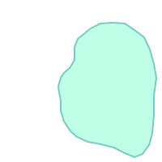
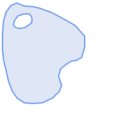
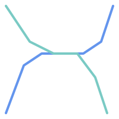
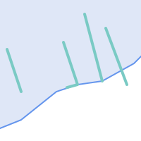

<a id="eval_spatial_rel"></a>

## Determining Spatial Relationships


Spatial relationships indicate how two geometries interact with one another. They are a fundamental capability for querying geometry.
 <a id="DE-9IM"></a>

## Dimensionally Extended 9-Intersection Model


According to the [OpenGIS Simple Features Implementation Specification for SQL](http://www.opengeospatial.org/standards/sfs), "the basic approach to comparing two geometries is to make pair-wise tests of the intersections between the Interiors, Boundaries and Exteriors of the two geometries and to classify the relationship between the two geometries based on the entries in the resulting 'intersection' matrix."


In the theory of point-set topology, the points in a geometry embedded in 2-dimensional space are categorized into three sets:


**Boundary**
:   The boundary of a geometry is the set of geometries of the next lower dimension. For `POINT`s, which have a dimension of 0, the boundary is the empty set. The boundary of a `LINESTRING` is the two endpoints. For `POLYGON`s, the boundary is the linework of the exterior and interior rings.


**Interior**
:   The interior of a geometry are those points of a geometry that are not in the boundary. For `POINT`s, the interior is the point itself. The interior of a `LINESTRING` is the set of points between the endpoints. For `POLYGON`s, the interior is the areal surface inside the polygon.


**Exterior**
:   The exterior of a geometry is the rest of the space in which the geometry is embedded; in other words, all points not in the interior or on the boundary of the geometry. It is a 2-dimensional non-closed surface.


The [Dimensionally Extended 9-Intersection Model](http://en.wikipedia.org/wiki/DE-9IM) (DE-9IM) describes the spatial relationship between two geometries by specifying the dimensions of the 9 intersections between the above sets for each geometry. The intersection dimensions can be formally represented in a 3x3 **intersection matrix**.


For a geometry *g* the *Interior*, *Boundary*, and *Exterior* are denoted using the notation *I(g)*, *B(g)*, and *E(g)*. Also, *dim(s)* denotes the dimension of a set *s* with the domain of `{0,1,2,F}`:


- `0` => point
- `1` => line
- `2` => area
- `F` => empty set


 Using this notation, the intersection matrix for two geometries *a* and *b* is:


|  | **Interior** | **Boundary** | **Exterior** |
| --- | --- | --- | --- |
| **Interior** | *dim( I(a) ∩ I(b) )* | *dim( I(a) ∩ B(b) )* | *dim( I(a) ∩ E(b) )* |
| **Boundary** | *dim( B(a) ∩ I(b) )* | *dim( B(a) ∩ B(b) )* | *dim( B(a) ∩ E(b) )* |
| **Exterior** | *dim( E(a) ∩ I(b) )* | *dim( E(a) ∩ B(b) )* | *dim( E(a) ∩ E(b) )* |


Visually, for two overlapping polygonal geometries, this looks like:


<table>
<tbody>
<tr>
<td></td>
<td markdown="block">

</td>
</tr>
<tr>
<td markdown="block">

</td>
</tr>
</tbody>
</table>


Reading from left to right and top to bottom, the intersection matrix is represented as the text string '**212101212**'.


For more information, refer to:


- [OpenGIS Simple Features Implementation Specification for SQL](http://www.opengeospatial.org/standards/sfs) (version 1.1, section 2.1.13.2)
- [Wikipedia: Dimensionally Extended Nine-Intersection Model (DE-9IM)](https://en.wikipedia.org/wiki/DE-9IM)
- [GeoTools: Point Set Theory and the DE-9IM Matrix](http://docs.geotools.org/latest/userguide/library/jts/dim9.html)
  <a id="named-spatial-rel"></a>

## Named Spatial Relationships


To make it easy to determine common spatial relationships, the OGC SFS defines a set of *named spatial relationship predicates*. PostGIS provides these as the functions [ST_Contains](../postgis-reference/spatial-relationships.md#ST_Contains), [ST_Crosses](../postgis-reference/spatial-relationships.md#ST_Crosses), [ST_Disjoint](../postgis-reference/spatial-relationships.md#ST_Disjoint), [ST_Equals](../postgis-reference/spatial-relationships.md#ST_Equals), [ST_Intersects](../postgis-reference/spatial-relationships.md#ST_Intersects), [ST_Overlaps](../postgis-reference/spatial-relationships.md#ST_Overlaps), [ST_Touches](../postgis-reference/spatial-relationships.md#ST_Touches), [ST_Within](../postgis-reference/spatial-relationships.md#ST_Within). It also defines the non-standard relationship predicates [ST_Covers](../postgis-reference/spatial-relationships.md#ST_Covers), [ST_CoveredBy](../postgis-reference/spatial-relationships.md#ST_CoveredBy), and [ST_ContainsProperly](../postgis-reference/spatial-relationships.md#ST_ContainsProperly).


Spatial predicates are usually used as conditions in SQL <code>WHERE</code> or <code>JOIN</code> clauses. The named spatial predicates automatically use a spatial index if one is available, so there is no need to use the bounding box operator <code>&&</code> as well. For example:


```sql

SELECT city.name, state.name, city.geom
FROM city JOIN state ON ST_Intersects(city.geom, state.geom);
```


For more details and illustrations, see the [PostGIS Workshop.](https://postgis.net/workshops/postgis-intro/spatial_relationships.html)
  <a id="general-spatial-rel"></a>

## General Spatial Relationships


In some cases the named spatial relationships are insufficient to provide a desired spatial filter condition.


<table>
<tbody>
<tr>
<td markdown="block">



For example, consider a linear dataset representing a road network. It may be required to identify all road segments that cross each other, not at a point, but in a line (perhaps to validate some business rule). In this case [ST_Crosses](../postgis-reference/spatial-relationships.md#ST_Crosses) does not provide the necessary spatial filter, since for linear features it returns `true` only where they cross at a point.


A two-step solution would be to first compute the actual intersection ([ST_Intersection](../postgis-reference/overlay-functions.md#ST_Intersection)) of pairs of road lines that spatially intersect ([ST_Intersects](../postgis-reference/spatial-relationships.md#ST_Intersects)), and then check if the intersection's [ST_GeometryType](../postgis-reference/geometry-accessors.md#ST_GeometryType) is '`LINESTRING`' (properly dealing with cases that return `GEOMETRYCOLLECTION`s of `[MULTI]POINT`s, `[MULTI]LINESTRING`s, etc.).


Clearly, a simpler and faster solution is desirable.
</td>
</tr>
</tbody>
</table>


<table>
<tbody>
<tr>
<td markdown="block">



A second example is locating wharves that intersect a lake's boundary on a line and where one end of the wharf is up on shore. In other words, where a wharf is within but not completely contained by a lake, intersects the boundary of a lake on a line, and where exactly one of the wharf's endpoints is within or on the boundary of the lake. It is possible to use a combination of spatial predicates to find the required features:


- [ST_Contains](../postgis-reference/spatial-relationships.md#ST_Contains)(lake, wharf) = TRUE
- [ST_ContainsProperly](../postgis-reference/spatial-relationships.md#ST_ContainsProperly)(lake, wharf) = FALSE
- [ST_GeometryType](../postgis-reference/geometry-accessors.md#ST_GeometryType)([ST_Intersection](../postgis-reference/overlay-functions.md#ST_Intersection)(wharf, lake)) = 'LINESTRING'
- [ST_NumGeometries](../postgis-reference/geometry-accessors.md#ST_NumGeometries)([ST_Multi](../postgis-reference/geometry-editors.md#ST_Multi)([ST_Intersection](../postgis-reference/overlay-functions.md#ST_Intersection)([ST_Boundary](../postgis-reference/geometry-accessors.md#ST_Boundary)(wharf), [ST_Boundary](../postgis-reference/geometry-accessors.md#ST_Boundary)(lake)))) = 1

  ... but needless to say, this is quite complicated.
</td>
</tr>
</tbody>
</table>


These requirements can be met by computing the full DE-9IM intersection matrix. PostGIS provides the [ST_Relate](../postgis-reference/spatial-relationships.md#ST_Relate) function to do this:


```sql

SELECT ST_Relate( 'LINESTRING (1 1, 5 5)',
                  'POLYGON ((3 3, 3 7, 7 7, 7 3, 3 3))' );
st_relate
-----------
1010F0212
```


To test a particular spatial relationship, an **intersection matrix pattern** is used. This is the matrix representation augmented with the additional symbols `{T,*}`:


- `T` => intersection dimension is non-empty; i.e. is in `{0,1,2}`
- `*` => don't care


Using intersection matrix patterns, specific spatial relationships can be evaluated in a more succinct way. The [ST_Relate](../postgis-reference/spatial-relationships.md#ST_Relate) and the [ST_RelateMatch](../postgis-reference/spatial-relationships.md#ST_RelateMatch) functions can be used to test intersection matrix patterns. For the first example above, the intersection matrix pattern specifying two lines intersecting in a line is '**1*1***1****':


```
-- Find road segments that intersect in a line
SELECT a.id
FROM roads a, roads b
WHERE a.id != b.id
      AND a.geom && b.geom
      AND ST_Relate(a.geom, b.geom, '1*1***1**');
```


For the second example, the intersection matrix pattern specifying a line partly inside and partly outside a polygon is '**102101FF2**':


```

-- Find wharves partly on a lake's shoreline
SELECT a.lake_id, b.wharf_id
FROM lakes a, wharfs b
WHERE a.geom && b.geom
      AND ST_Relate(a.geom, b.geom, '102101FF2');
```
